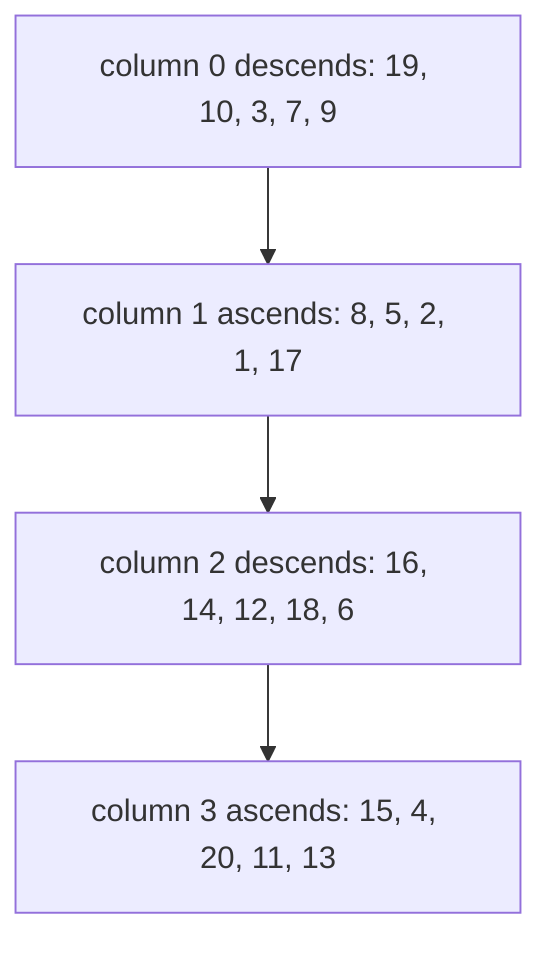

# Guided Example: Snail Traversal

## 1. The Instance and the Shape It Must Produce

The input is a flat array of integers plus two dimensions, and the required output is a matrix with exactly those dimensions whose cells are filled in *snail traversal order*: the first column is written from top to bottom, the next column from bottom to top, the following one from top to bottom again, and so on, alternating direction with every column until the flat array is exhausted. The bundled statement makes invalidity part of the contract: when the product of the two dimensions does not equal the number of values available, the required answer is an empty array rather than an error. The limits are $0 \le \text{nums.length} \le 250$, $1 \le \text{nums}[i] \le 1000$, $1 \le rowsCount \le 250$ and $1 \le colsCount \le 250$.

The representative instance is the five-by-four matrix, because it exercises both directions, and it ends on a column that travels upward:

$$
\texttt{nums} = [19, 10, 3, 7, 9, 8, 5, 2, 1, 17, 16, 14, 12, 18, 6, 15, 4, 20, 11, 13],
$$

with $rowsCount = 5$, $colsCount = 4$, and the required matrix

$$
\begin{bmatrix}
19 & 17 & 16 & 13 \\
10 & 1 & 14 & 11 \\
3 & 2 & 12 & 20 \\
7 & 5 & 18 & 4 \\
9 & 8 & 6 & 15
\end{bmatrix}.
$$

Reading the columns of that matrix in order confirms the pattern: column $0$ top to bottom is `19, 10, 3, 7, 9`, the first five values exactly as they appear in the input; column $1$ bottom to top is `8, 5, 2, 1, 17`, the next five values in input order; column $2$ top to bottom is `16, 14, 12, 18, 6`; and column $3$ bottom to top is `15, 4, 20, 11, 13`. Walking the matrix along that path therefore reproduces the input array verbatim, which is the property the whole method has to establish.

The validity rule is a separate, purely arithmetic gate, and the package's cases delimit it sharply.

| Instance | Dimensions | Product | Values available | Verdict |
|---|---|---|---|---|
| `sample-five-by-four` | $5 \times 4$ | 20 | 20 | Valid matrix |
| `sample-single-row` | $1 \times 4$ | 4 | 4 | Valid matrix |
| `trial-single-value` | $1 \times 1$ | 1 | 1 | Valid matrix |
| `sample-invalid-dimensions` | $2 \times 2$ | 4 | 2 | Empty array |
| `trial-empty-source` | $1 \times 1$ | 1 | 0 | Empty array |
| `trial-extra-value` | $2 \times 2$ | 4 | 5 | Empty array |
| `trial-two-by-three` | $2 \times 3$ | 6 | 6 | Valid matrix |
| `trial-three-by-two` | $3 \times 2$ | 6 | 6 | Valid matrix |

The gate is symmetric in the two failure directions: too few values fails, and so does a surplus. It is a check on the *product*, not on either dimension separately, because only the product determines whether the snake path can be completed without running out of values or stopping short of a cell.

## 2. The Snake Path as an Index Mapping

The decisive observation is that the flat array is already in snail order. Position $i$ in the input is the $i$-th cell along the snake, so the task reduces to a bijection: given $i$, compute which row and column that $i$-th cell occupies.

With $R = rowsCount$ and $C = colsCount$, the snake consumes exactly $R$ values per column, so

$$
\text{column}(i) = \left\lfloor \frac{i}{R} \right\rfloor, \qquad \text{offset}(i) = i \bmod R .
$$

The offset counts how far along the column the value sits, measured from wherever that column's traversal begins. The remaining question is direction, and it depends only on the parity of the column: an even column descends, so the offset is the row directly; an odd column ascends, so the offset has to be reflected through the middle of the column.

| Column parity | Direction | Row for offset $j$ | Example cells from the traced instance |
|---|---|---|---|
| Even ($0, 2, \dots$) | Top to bottom | $row = j$ | Column $0$: offsets $0$ to $4$ give rows $0$ to $4$, holding `19, 10, 3, 7, 9` |
| Odd ($1, 3, \dots$) | Bottom to top | $row = R - 1 - j$ | Column $1$: offsets $0$ to $4$ give rows $4$ down to $0$, holding `8, 5, 2, 1, 17` |

So for every valid index the destination is

$$
row(i) = \begin{cases} i \bmod R, & \text{if } \left\lfloor i / R \right\rfloor \text{ is even},\\[4pt] R - 1 - (i \bmod R), & \text{otherwise},\end{cases}
\qquad
col(i) = \left\lfloor \frac{i}{R} \right\rfloor .
$$

Two structural facts follow, and both matter for correctness. The map is a bijection: distinct indices differ either in their column or in their offset, and each pair (column, offset) names exactly one cell. And the reflection formula never leaves the grid, because the offset is always in $\{0, 1, \dots, R-1\}$, so $R - 1 - \text{offset}$ is also in that set — the reversed range is the same range.

## 3. Step-by-Step Placement Trace

The trace gives the destination of every value, computed with $R = 5$. The column is $\lfloor i / 5 \rfloor$, the offset is $i \bmod 5$, and the row is the offset itself in an even column and $4 - \text{offset}$ in an odd one.

| Index $i$ | Value | Column $\lfloor i/5 \rfloor$ | Offset $i \bmod 5$ | Column parity | Row | Cell written |
|---|---|---|---|---|---|---|
| 0 | 19 | 0 | 0 | even | 0 | row 0, column 0 |
| 1 | 10 | 0 | 1 | even | 1 | row 1, column 0 |
| 2 | 3 | 0 | 2 | even | 2 | row 2, column 0 |
| 3 | 7 | 0 | 3 | even | 3 | row 3, column 0 |
| 4 | 9 | 0 | 4 | even | 4 | row 4, column 0 |
| 5 | 8 | 1 | 0 | odd | 4 | row 4, column 1 |
| 6 | 5 | 1 | 1 | odd | 3 | row 3, column 1 |
| 7 | 2 | 1 | 2 | odd | 2 | row 2, column 1 |
| 8 | 1 | 1 | 3 | odd | 1 | row 1, column 1 |
| 9 | 17 | 1 | 4 | odd | 0 | row 0, column 1 |
| 10 | 16 | 2 | 0 | even | 0 | row 0, column 2 |
| 11 | 14 | 2 | 1 | even | 1 | row 1, column 2 |
| 12 | 12 | 2 | 2 | even | 2 | row 2, column 2 |
| 13 | 18 | 2 | 3 | even | 3 | row 3, column 2 |
| 14 | 6 | 2 | 4 | even | 4 | row 4, column 2 |
| 15 | 15 | 3 | 0 | odd | 4 | row 4, column 3 |
| 16 | 4 | 3 | 1 | odd | 3 | row 3, column 3 |
| 17 | 20 | 3 | 2 | odd | 2 | row 2, column 3 |
| 18 | 11 | 3 | 3 | odd | 1 | row 1, column 3 |
| 19 | 13 | 3 | 4 | odd | 0 | row 0, column 3 |

Assembling the cells by row gives exactly the required matrix.

| Row | Column 0 (descending) | Column 1 (ascending) | Column 2 (descending) | Column 3 (ascending) |
|---|---|---|---|---|
| row 0 | 19 | 17 | 16 | 13 |
| row 1 | 10 | 1 | 14 | 11 |
| row 2 | 3 | 2 | 12 | 20 |
| row 3 | 7 | 5 | 18 | 4 |
| row 4 | 9 | 8 | 6 | 15 |

Every index in the trace was used exactly once, every cell is filled exactly once, and no value was dropped or duplicated — which is the property the next section proves in general.

## 4. The Placement Invariant and Why the Result Is Correct

**Invariant.** After the first $m$ values have been placed, the filled cells are precisely the first $m$ cells of the snake path, and each of them holds the value that stood at the corresponding input index.

The proof is an induction on $m$. For $m = 0$ nothing is filled. For the step, suppose the invariant holds for $m$ and consider index $m$. Its column is $\lfloor m / R \rfloor$ and its offset is $m \bmod R$. Within a column the offsets run from $0$ to $R - 1$ in increasing order, and because the column index changes only after $R$ consecutive indices, all indices with the same column form one contiguous run of offsets $0, 1, \dots, R-1$ in that order. Mapping that offset to a row by identity in an even column and by reflection in an odd column therefore places index $m$ at the next cell along that column's traversal, in the correct direction, immediately after the cell occupied by index $m - 1$. So the invariant extends to $m + 1$.

Two consequences complete the argument. **Faithfulness:** the matrix read back along the snake path is the original array, because the induction shows the value at the $k$-th cell of the path is the $k$-th input value for every $k$. **Well-formedness:** the reflection used in odd columns is a permutation of the row range, so no cell is written twice and none is left unwritten; combined with the validity gate $R \cdot C = \text{nums.length}$, which guarantees that the number of indices equals the number of cells, every cell of the $R \times C$ matrix receives exactly one value.

The validity gate is not a special case bolted on top of the traversal; it is the hypothesis the well-formedness argument needs. The package's invalid instances make the two directions concrete: with $R \cdot C = 4$ and only two values, indices $2$ and $3$ would have no value to place and two cells would stay empty; with $R \cdot C = 4$ and five values, index $4$ would have no cell to go to, since the snake has already consumed the whole grid. In both situations the contract asks for an empty array, so the gate is checked before any placement happens rather than repaired during it.

## 5. Boundary Conditions and Domain Analysis

| Situation | What it probes | Required behavior | Reasoning |
|---|---|---|---|
| $R = 1$ | A single-row matrix | The values appear in input order | With one cell per column, reflecting an offset of $0$ leaves it at row $0$, so the alternation becomes invisible |
| $C = 1$ | A single-column matrix | One descending column | Only column $0$ exists, and it is even, so every value descends |
| $1 \times 1$ | The smallest valid instance | A single cell holding the single value | One index, one cell |
| Even `colsCount`, as in $5 \times 4$ | Where the last column ends | The final column ascends | Column $3$ is odd, so its last value sits at the top |
| Odd `colsCount`, as in $2 \times 3$ | Where the last column ends | The final column descends | Column $2$ is even; with $R = 2$ and values `1` to `6` the result is rows `[1, 4, 5]` and `[2, 3, 6]` |
| `rowsCount * colsCount` short of the values | Surplus values | Empty array | The package's extra-value trial has five values for a $2 \times 2$ grid |
| `rowsCount * colsCount` beyond the values | Missing values | Empty array | The package's invalid-dimensions trial has two values for a $2 \times 2$ grid |
| Empty source array | No values at all | Empty array for any positive dimensions | Any product of positive dimensions exceeds $0$; the empty-source trial uses $1 \times 1$ |
| Values up to `1000`, up to `250` values | Data range and size | Ordinary placement, one pass | Nothing in the method depends on the magnitude of the values |
| An odd `rowsCount` with an ascending column | Reflection around the middle row | The middle cell of that column keeps its offset | For $R = 5$ the offset $2$ reflects to row $2$ |

## 6. Traps and Rejected Alternatives

| Tempting shortcut | Why it fails |
|---|---|
| Alternate direction by *row* instead of by column | The statement's pattern is column-wise: with only the first column descending and the rest ascending, a row-wise alternation produces a transposed-looking matrix in which column $1$ reads `8, 5, 2, 1, 17` from the top |
| Restart every column at the top | The second column would read `8, 5, 2, 1, 17` downward, placing `8` at row $0$ instead of `17` |
| Reflect the first column and leave the rest ascending | Parity is off by one; even columns must descend, so column $0$ would be filled bottom to top and `19` would land in row $4$ |
| Compute the row as $R - \text{offset}$ instead of $R - 1 - \text{offset}$ | For offset $0$ this yields row $R$, which is outside the grid |
| Compare only one dimension against the value count | `nums.length % rowsCount` can hold while the column count is wrong; the contract compares the product |
| Return the input on invalid dimensions, or raise an error | The contract requires an empty array, and all three invalid samples expect `[]` |
| Write into the input array while reading it | The value at a later index may already have been overwritten by an earlier placement, so the input stops being a reliable source |
| Treat the column as a real-valued quotient rather than a floor | A fractional column index cannot address a column; the division must be the integer quotient |
| Assume the last column always ascends | It ascends only when `colsCount` is even; the $2 \times 3$ and $3 \times 2$ trials give one instance of each parity |
| Handle the $R = 1$ case with a separate branch | With $R = 1$ both branches of the row formula agree, so the branch is redundant and only adds a place for an error |

**Rejected alternatives.** Two equivalent strategies are worth naming. Consuming the input in chunks of $R$ values per column and reversing the odd chunks produces the same matrix, but it materializes a reversed copy per odd column, so it needs $O(R)$ extra space and an explicit reversal step, against the index arithmetic's single pass and constant extra state. Walking the grid with an explicit cursor and a direction flag is equally correct and uses constant extra state, but its termination conditions must be handled per column — the boundary between "still in this column" and "flip direction" is exactly where off-by-one errors appear. The index mapping avoids both the extra buffer and the moving cursor by making the destination of each input index a closed-form function of that index.

## 7. Time and Auxiliary Space Complexity

Let $V = \text{nums.length}$ and let the dimensions be valid, so $V = R \cdot C$ with $R = rowsCount$ and $C = colsCount$.

| Aspect | Cost | Derivation |
|---|---|---|
| Validity check | $O(1)$ | One multiplication and one comparison |
| Allocating the matrix | $O(V)$ | $R \cdot C = V$ cells must exist before any value is placed |
| Placement of one value | $O(1)$ | One integer division, one remainder, one parity test, one reflection, one write |
| Total placement work | $O(V)$ | Each input index is visited exactly once |
| Returning a rejected instance | $O(1)$ | The empty array is returned before any allocation of a matrix |
| Auxiliary space beyond the result | $O(1)$ | Only loop indices and the current row and column are held |

**Time.** Every value is placed by a constant number of arithmetic operations and one write, and every index is processed once, so the total work is $O(V)$ — linear in the number of values, equivalently linear in the number of cells. No value is examined twice, no column is scanned to find its direction (parity decides it), and no searching or sorting occurs: the input order already *is* the traversal order, which is the insight that turns a simulation into a direct mapping. Invalid instances cost $O(1)$, since the product test rejects them before any matrix is built.

**Auxiliary space.** The result matrix itself is $O(R \cdot C) = O(V)$ cells and is required by the contract, so it is not avoidable. Beyond it the method keeps only a fixed number of scalars — the current index, its column, its offset, and its row — so the auxiliary space is $O(1)$, independent of both the dimensions and the number of values. That is the advantage of the closed-form mapping over the chunking strategy, which needs to hold and reverse a column's worth of values.
