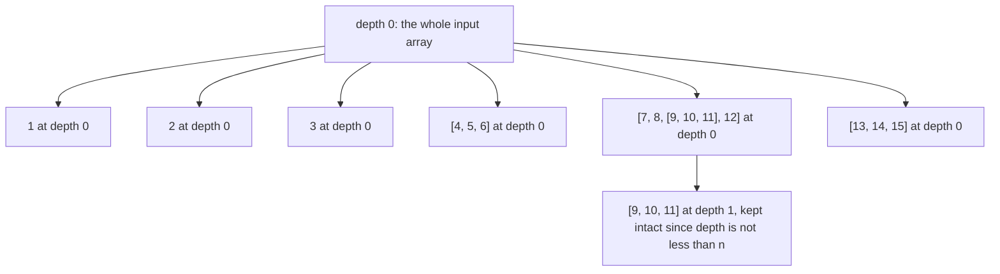

# Guided Example: Flatten Deeply Nested Array

## 1. The Instance and the Depth Rule It Tests

The input is a multi-dimensional array: a recursive structure whose slots hold either integers or further multi-dimensional arrays. Flattening replaces a sub-array with the elements it contains, but only where the *current depth of nesting is less than* `n`, and the elements of the first array are defined to sit at depth $0$. The bundled statement also forbids using the language's own array-flattening method, so the traversal must be built by hand. The contract bounds the total number of numbers at $10^{5}$, the total number of sub-arrays at $10^{5}$, the maximum nesting depth at $1000$, each number to $-1000 \le x \le 1000$, and the depth argument to $0 \le n \le 1000$.

The representative instance is the depth-one sample, because it contains groups that must be expanded, one group that must be *kept intact*, and three ordinary integers in front of both:

$$
\texttt{arr} = [1, 2, 3, [4, 5, 6], [7, 8, [9, 10, 11], 12], [13, 14, 15]], \qquad n = 1.
$$

The required result is `[1, 2, 3, 4, 5, 6, 7, 8, [9, 10, 11], 12, 13, 14, 15]`. Everything is spilled out except the group `[9, 10, 11]`, which survives as a nested unit.

The instance is chosen for that survivor. The groups `[4, 5, 6]`, `[7, 8, [9, 10, 11], 12]` and `[13, 14, 15]` all sit at depth $0$, which is less than $n = 1$, so their boundaries dissolve. The group `[9, 10, 11]` sits at depth $1$, which is *not* less than $n = 1$, so its boundary stays.

| Slot in `arr` | Content | Depth of the slot | Is the depth less than $n = 1$? | Disposition |
|---|---|---|---|---|
| index 0 | `1` | 0 | not an array | Emitted as an atom |
| index 1 | `2` | 0 | not an array | Emitted as an atom |
| index 2 | `3` | 0 | not an array | Emitted as an atom |
| index 3 | `[4, 5, 6]` | 0 | yes | Expanded into its three integers |
| index 4 | `[7, 8, [9, 10, 11], 12]` | 0 | yes | Expanded, revealing a deeper group |
| index 4, position 2 | `[9, 10, 11]` | 1 | no | Kept intact as one entry of the result |
| index 5 | `[13, 14, 15]` | 0 | yes | Expanded into its three integers |

## 2. The Depth Ledger and the Single Decision Rule

The traversal carries exactly one piece of state: the depth of the container currently being scanned. Every slot is then handled by one rule, applied identically everywhere.

| Slot holds | Comparison at the slot's depth | Action |
|---|---|---|
| An integer | irrelevant: integers are atoms at every depth | Append the integer to the output |
| A sub-array | depth is less than `n` | Descend into it; the scan depth becomes depth $+ 1$ |
| A sub-array | depth is not less than `n` | Append the whole sub-array to the output and do not look inside |

Two consequences follow immediately, and both are exercised by the package's cases. Any sub-array that the traversal is allowed to see has depth at most `n`, because the traversal only descends while the depth is below `n`; therefore an emitted sub-array always sits at depth exactly `n`, never deeper. And integers are never subject to the comparison at all, so no numeric value can be mistaken for a directive: the trial `trial-limit-exceeds-depth` contains the values `-1`, `0` and `1`, and each of them must be emitted as data.

## 3. Step-by-Step Trace of the Chosen Instance

The trace walks the structure in original left-to-right order. "Position" identifies where the scan is, and "output so far" shows the result array after the step.

| Step | Position | Slot content | Depth | Decision | Output so far |
|---|---|---|---|---|---|
| 1 | index 0 | `1` | 0 | atom, emit | `[1]` |
| 2 | index 1 | `2` | 0 | atom, emit | `[1, 2]` |
| 3 | index 2 | `3` | 0 | atom, emit | `[1, 2, 3]` |
| 4 | index 3 | `[4, 5, 6]` | 0 | $0 < 1$, descend | `[1, 2, 3]` |
| 5 | index 3, position 0 | `4` | 1 | atom, emit | `[1, 2, 3, 4]` |
| 6 | index 3, position 1 | `5` | 1 | atom, emit | `[1, 2, 3, 4, 5]` |
| 7 | index 3, position 2 | `6` | 1 | atom, emit | `[1, 2, 3, 4, 5, 6]` |
| 8 | index 3 exhausted | — | 0 | return to the outer scan | `[1, 2, 3, 4, 5, 6]` |
| 9 | index 4 | `[7, 8, [9, 10, 11], 12]` | 0 | $0 < 1$, descend | `[1, 2, 3, 4, 5, 6]` |
| 10 | index 4, position 0 | `7` | 1 | atom, emit | `[1, 2, 3, 4, 5, 6, 7]` |
| 11 | index 4, position 1 | `8` | 1 | atom, emit | `[1, 2, 3, 4, 5, 6, 7, 8]` |
| 12 | index 4, position 2 | `[9, 10, 11]` | 1 | $1 < 1$ is false, emit whole | `[1, 2, 3, 4, 5, 6, 7, 8, [9, 10, 11]]` |
| 13 | index 4, position 3 | `12` | 1 | atom, emit | `[1, 2, 3, 4, 5, 6, 7, 8, [9, 10, 11], 12]` |
| 14 | index 4 exhausted | — | 0 | return to the outer scan | unchanged |
| 15 | index 5 | `[13, 14, 15]` | 0 | $0 < 1$, descend | unchanged |
| 16 | index 5, positions 0 to 2 | `13`, `14`, `15` | 1 | atoms, emit | `[1, 2, 3, 4, 5, 6, 7, 8, [9, 10, 11], 12, 13, 14, 15]` |
| 17 | input exhausted | — | 0 | traversal ends | final result, thirteen entries |

The final output is exactly the required `[1, 2, 3, 4, 5, 6, 7, 8, [9, 10, 11], 12, 13, 14, 15]`, with thirteen entries where the input had six.

Step 12 is the step that separates a correct rule from a nearly correct one. The group `[9, 10, 11]` is reached while the scan depth is $1$, the comparison fails, and the group is appended as a single entry. An implementation that compared one level too late — expanding while the depth is at most `n` instead of below it — would spill `9`, `10` and `11` into the output and produce a fifteen-entry result, contradicting both the sample and the statement's own explanation that this group must remain unflattened.

## 4. Invariants and Why the Reasoning Is Correct

**Invariant 1 (depth accuracy).** Whenever the traversal is scanning a container, its maintained depth equals the number of array boundaries crossed from the top-level array down to that container. The top-level scan runs at depth $0$; descending into a sub-array found during a scan at depth $d$ runs the inner scan at $d + 1$; returning from that inner scan restores depth $d$. The depth is a property of the current *path*, not of the traversal as a whole — a counter that is incremented but never restored drifts upward and starts keeping later groups intact for no reason.

**Invariant 2 (order preservation).** After any prefix of the traversal, the output equals the flattening of exactly the slots already visited, in original left-to-right order. The traversal visits each container's slots in index order and finishes a container completely before returning to the container that holds it. That is a pre-order depth-first order, and for a nested array it coincides with the order in which a reader moving left to right and descending at each opening bracket encounters the data. Completeness follows because a slot is either emitted directly or descended into, never skipped, so every original value appears exactly once, and no value is duplicated because no container is ever visited twice.

**Invariant 3 (the stopping rule is exact).** A sub-array is emitted as a unit exactly when its depth equals `n`. It cannot be at a greater depth, since the traversal refuses to descend past that point; and it cannot be at a lesser depth and be emitted, since every sub-array shallower than `n` is descended into. Together the three invariants give the required output: the values whose enclosing boundaries lie no deeper than `n` appear inline, and every remaining sub-array appears as one entry.

The same rule explains the two extremes of the depth domain without any special case. With $n = 0$, no slot satisfies "depth is less than $0$", so nothing is ever expanded and the result reproduces the original nesting — the package's `sample-depth-zero` case. With $n$ at or above the maximum nesting depth, every sub-array is expanded and the result is completely flat — the package's `trial-limit-exceeds-depth` case, whose input nests to depth $3$ and whose expected output is the four flat values. A separate branch for either extreme is redundant; both fall out of the single comparison.

## 5. Boundary Conditions and Domain Analysis

| Situation | What it probes | Required behavior | Reasoning |
|---|---|---|---|
| `n = 0` | The lower bound of the depth argument | The original nesting is reproduced, not flattened | No depth is below $0$, so the expansion rule never fires |
| A sub-array at depth exactly `n` | The stopping boundary | Emitted as one entry | `trial-exact-cutoff` with $n = 2$ turns `[[[1]], 2], 3]` into `[[1], 2, 3]`; the group `[1]` is at depth $2$ and stays whole |
| `n = 1000`, larger than the data's depth | The upper bound of the depth argument | Everything is flattened | Every sub-array satisfies the comparison, so the traversal reaches every integer |
| Empty top-level array | Degenerate input | An empty result | The traversal has no slots to visit |
| Empty sub-arrays | Empty containers | They contribute nothing when expanded, and one entry when kept | `trial-empty-subarrays` with $n = 2$ yields `[1, 2]` from `[[], 1, [[], 2], []]` |
| Several branches at the same depth | Order across containers | Global left-to-right order | `trial-order-through-branches` with $n = 1$ yields `[1, [2, 3], 4, [5], 6]` from `[[1, [2, 3]], 4, [[5], 6]]` |
| Values `-1000` to `1000`, including `0` and `-1` | Falsy and negative data | Emitted as ordinary integers | `-1`, `0` and `1` in the oversized-limit trial are data, not status values |
| Maximum depth `1000` | Deep structures | Visited without loss | Depth is bounded by the contract, which is what keeps a recursive descent safe |
| Up to $10^{5}$ numbers and $10^{5}$ sub-arrays | Scale | Each slot handled once | A multiplicative or repeated pass would exceed the intended work |

## 6. Traps and Rejected Alternatives

| Tempting shortcut | Why it fails |
|---|---|
| Expand while the depth is at most `n` | Off by one level: the traced group `[9, 10, 11]` would be poured into the output, giving thirteen entries instead of the required eleven plain values plus one group |
| Expand while depth plus one is less than `n` | Off by one in the other direction: groups that must dissolve, such as `[4, 5, 6]`, would be kept intact |
| Special-case `n = 0` by returning the input reference | The rule already reproduces the original nesting, so the branch is dead weight; worse, if it returns the *same* array, later mutation aliases the input |
| Build a general flattening pass and repeat it `n` times | Correct in principle, but each pass rewrites the whole structure, so the work becomes $O(n \cdot N)$ — up to about $2 \cdot 10^{8}$ slot visits at the contract's limits, against a single pass that visits each slot once |
| Descend into empty sub-arrays but also drop empty sub-arrays at the stopping depth | The two cases differ: expanding an empty container contributes no entry, while keeping one contributes the empty array itself, so a blanket "ignore empties" rule changes the output whenever an empty group sits at depth `n` |
| Treat the values as directives, for example stopping when a `0` or `-1` is met | Integers are atoms at every depth; the stopping condition is purely structural |
| Track depth in one variable that is incremented on descent but never restored on return | Depth drifts upward, so deeper groups encountered later are wrongly kept intact |
| Process the structure breadth-first, level by level | Levels interleave containers, so the result is ordered by depth rather than by position and no longer matches the required left-to-right sequence |
| Use the language's built-in flattening method | The statement explicitly forbids it, and the method does not accept an arbitrary stopping depth in the same sense |
| Serialize the array to text and rebuild it after stripping brackets | Loses the distinction between a number and a container and cannot express a depth cutoff |

**Material edge cases.** The stopping depth is inclusive of nothing — a group exactly at depth `n` survives, which the exact-cutoff trial pins down. An expanded empty container adds no entries, but a preserved empty container is itself an entry. The result is always a new array whose length is at least the number of integers, since every integer is emitted, and at most the number of integers plus the number of sub-arrays at depth `n`.

## 7. Time and Auxiliary Space Complexity

Let $N$ be the total number of slots in the input, that is, the number of integers plus the number of sub-arrays.

| Aspect | Cost | Derivation |
|---|---|---|
| Slot visits | $O(N)$ | Each slot is examined once: integers are emitted, containers are either descended into or emitted whole |
| Appending an entry | $O(1)$ amortized | Each emitted integer or preserved sub-array costs one append |
| Depth maintenance | $O(1)$ per slot | The depth is advanced and restored as the traversal descends and returns |
| Auxiliary space, traversal | $O(D)$ | $D = \min(\text{maxDepth}, n) \le 1000$ frames on the descent path, or an explicit stack holding the same number of frames |
| Auxiliary space, output | $O(N)$ | The result holds every integer plus every preserved sub-array |

**Time.** Every slot is processed by a constant amount of work — one comparison for containers, one append for emitted values — so the running time is linear in the total size of the input, $O(N)$. Nothing is re-read and no container is revisited: an integer inside a group that is expanded is touched exactly once, and a group that is preserved is touched only as a single value, which is also why preserving a deep group can make the traversal *cheaper* than flattening it fully.

**Auxiliary space.** Excluding the output, the only extra storage is the current descent path. Its length is the depth at which the traversal stops, so it is bounded by both the data's maximum depth and the cutoff: $D = \min(\text{maxDepth}, n) \le 1000$. That is a small constant in practice, but it is a real bound rather than zero, which is why the depth limit matters — an unbounded depth would make the stack usage proportional to the nesting rather than to the number of slots. The output itself requires $O(N)$ space in the worst case and is unavoidable, since every integer in the input must appear in the result.
