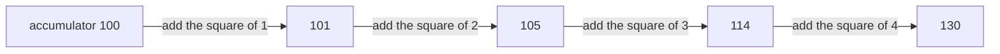

# Guided Example: Array Reduce Transformation

## 1. The Instance: A Left Fold That Has No Identity to Fall Back On

The task takes an integer array, a reducer function with two parameters, and an initial value, and returns the single value obtained by feeding the array through the reducer one element at a time, in order, always passing the result of the previous step as the reducer's first argument. The bundled statement gives the recurrence explicitly — $v = f(\text{init}, \text{nums}[0])$, then $v = f(v, \text{nums}[1])$, then $v = f(v, \text{nums}[2])$, and so on until every element has been consumed — and it states that an empty array must yield `init`. It also forbids the language's built-in reduction method, so the fold must be written as an explicit loop. The contract bounds the array length to $0 \le \text{nums.length} \le 1000$, each element to $0 \le \text{nums}[i] \le 1000$, and the initial value to $0 \le init \le 1000$.

The representative instance is the second authored sample, because its initial value of `100` is *not* the reducer's identity. That single choice is what separates a real fold from a fold that quietly ignores where it started:

$$
\texttt{nums} = [1, 2, 3, 4], \qquad f(a, x) = a + x^{2}, \qquad init = 100,
$$

whose required result is `130`. The package's cases also drive the same machinery through `sum`, `sumSquares`, `zero`, `product`, `subtract`, and `maximum`, so the fold has to work for reducers that are neither commutative nor associative.

| Stage | Accumulator before | Element folded in | Reducer applied | Accumulator after |
|---|---|---|---|---|
| start | — | — | seeded with `init` | `100` |
| 1 | `100` | `nums[0] = 1` | $100 + 1^{2}$ | `101` |
| 2 | `101` | `nums[1] = 2` | $101 + 2^{2}$ | `105` |
| 3 | `105` | `nums[2] = 3` | $105 + 3^{2}$ | `114` |
| 4 | `114` | `nums[3] = 4` | $114 + 4^{2}$ | `130` |

## 2. The State: One Accumulator, Seeded Before the Loop

The whole state of the computation is a single value, and its initial contents are supplied by the caller rather than computed.

| Question about the state | Answer | Evidence |
|---|---|---|
| How many values must be remembered at once? | Exactly one, the accumulator | Each step consumes the previous accumulator and the next element and produces the next accumulator |
| What does the accumulator hold before the loop? | The initial value `init`, untouched | The statement's recurrence begins with $f(\text{init}, \text{nums}[0])$ |
| What is the first reducer call? | $f(\text{init}, \text{nums}[0])$, with the initial value as the first argument | Same recurrence |
| What does an empty array return? | `init`, with the reducer never called | The package's empty sample pairs `nums = []` with `init = 25` and expects `25` |
| What does a one-element array return? | $f(\text{init}, \text{nums}[0])$, so the reducer is called exactly once | The package's single-element trial pairs `nums = [6]`, the squaring reducer and `init = 4`, and expects `40` |
| What is returned at the end? | The accumulator after the last element | No post-processing step exists in the contract |

The initial value is a genuine operand, never a neutral placeholder. The contract lets it be any integer from `0` to `1000`, and the authored cases deliberately include non-identity values: `100` for a squaring reducer, `20` for a subtraction reducer, `9` for a sum, and `8` for a maximum. Two of those cases would still pass if the initial value were dropped, which is exactly why the samples are chosen the way they are.

## 3. Step-by-Step Execution

Let $v_0 = \text{init}$ and $v_{k+1} = f(v_k, \text{nums}[k])$; the answer is $v_n$ for an array of length $n$. The trace below records the argument pair handed to the reducer at each step and the resulting accumulator.

| Step $k$ | Element $\text{nums}[k]$ | Reducer call | Value returned by the reducer | Accumulator $v_{k+1}$ | Elements remaining |
|---|---|---|---|---|---|
| 0 | — | none; seed with `init` | — | $v_0 = 100$ | 4 |
| 1 | 1 | $f(100, 1)$ | $100 + 1 = 101$ | $v_1 = 101$ | 3 |
| 2 | 2 | $f(101, 2)$ | $101 + 4 = 105$ | $v_2 = 105$ | 2 |
| 3 | 3 | $f(105, 3)$ | $105 + 9 = 114$ | $v_3 = 114$ | 1 |
| 4 | 4 | $f(114, 4)$ | $114 + 16 = 130$ | $v_4 = 130$ | 0 |
| end | — | none; return the accumulator | — | `130` | — |

The reducer is invoked exactly four times, once per element, and the accumulator is reassigned exactly four times. Nothing else in the computation changes: there is no second state variable, no index bookkeeping beyond the loop position, and no intermediate collection. Note also that the elements are read in ascending index order and that the accumulator is always the reducer's *first* argument — section 4 shows why that order is not a cosmetic detail.

## 4. Why the Order and the Seed Are Both Load-Bearing

The fold is a left fold, which means the accumulator is threaded on the left. Reversing which argument receives the accumulator produces the same answer for a commutative reducer and a different answer for a non-commutative one; dropping the seed produces a different answer whenever `init` is not the reducer's identity. The package's subtraction trial isolates the first hazard. With `nums = [3, 5, 2]`, `init = 20`, and the reducer $f(a, x) = a - x$, the required result is `10`.

| Evaluation strategy | First step | Second step | Third step | Result | Required? |
|---|---|---|---|---|---|
| Left fold from the seed (correct) | $20 - 3 = 17$ | $17 - 5 = 12$ | $12 - 2 = 10$ | `10` | Yes |
| Same seed, accumulator passed second | $3 - 20 = -17$ | $5 - (-17) = 22$ | $2 - 22 = -20$ | `-20` | No |
| Traverse the array right to left from the seed | $20 - 2 = 18$ | $18 - 5 = 13$ | $13 - 3 = 10$ | `10` | No |

The first and third rows agree here only by coincidence of the numbers chosen, which is worth noticing: subtraction is not commutative, so a right-to-left traversal is a different computation in general even though this instance happens to hide it. What the table does show decisively is the middle row — passing the element first and the accumulator second reverses each subtraction and lands on `-20`.

The correctness argument is an induction on the number of elements consumed. **Claim:** after the loop has consumed the first $k$ elements, the accumulator equals the $k$-fold left fold of those elements starting from `init`. The base case $k = 0$ is the seeding step, where the accumulator is `init`. The inductive step feeds the $k$-th element through the reducer as its second argument with the previous accumulator as its first, producing exactly the $(k+1)$-fold fold. When the loop terminates after $n$ elements, the accumulator is therefore the required final value, and for $n = 0$ the claim reduces to the base case, which is precisely the rule that an empty array returns `init`. Soundness and completeness come together here: the number of reducer calls equals the number of elements, so no element is skipped and none is folded twice.

The initial value's role is the only subtle part of the argument, and the authored cases pin it down from both sides. For the traced instance, folding the array without the seed gives $1 + 4 + 9 + 16 = 30$, not `130`. For the package's single-element trial with the squaring reducer, `init = 4` and `nums = [6]`, the answer is $4 + 36 = 40$, which proves the reducer runs once rather than being skipped when the array has one element.

## 5. Which Cases Expose Which Mistake

A useful property of this package's cases is that several of them are *masked* for a given mistake, so passing a couple of samples proves very little. The table marks each shortcut against the authored cases, showing the value the shortcut would produce where it differs from the expected one.

| Shortcut | `sum`, `init = 0`, `[1,2,3,4]` | `sumSquares`, `init = 100`, `[1,2,3,4]` | `product`, `init = 1`, `[2,3,4]` | `subtract`, `init = 20`, `[3,5,2]` | `sum`, `init = 9`, `[0,1000,7]` | `maximum`, `init = 8`, `[4,12,3,12]` | `[]`, `init = 25` |
|---|---|---|---|---|---|---|---|
| Expected value | `10` | `130` | `24` | `10` | `1016` | `12` | `25` |
| Ignore the seed and fold the array alone | `10`, masked | `30`, fails | `24`, masked | `-10`, fails | `1007`, fails | `12`, masked | no value, fails |
| Pass the element as the first argument | `10`, masked | `10001`, fails | `24`, masked | `-20`, fails | `1016`, masked | `12`, masked | `25`, masked |
| Stop before the final element | `6`, fails | `114`, fails | `6`, fails | `12`, fails | `1009`, fails | `12`, masked | `25`, masked |

Three conclusions follow. Commutative reducers (`sum`, `product`, `maximum`) cannot detect argument-order mistakes. Identity-valued seeds (`0` for addition, `1` for multiplication) cannot detect a dropped seed. And an array whose final element does not change the accumulator — as in the maximum trial, where `12` is already the maximum and appears twice — cannot detect an early stop. Only the full set of cases pins the semantics down, which is why the semantics should be derived from the recurrence rather than guessed from the first sample.

## 6. Boundary Conditions and Material Traps

| Situation | What it probes | Required behavior | Reasoning |
|---|---|---|---|
| Empty array | The degenerate case | Return `init` unchanged, reducer never called | The fold of zero elements is the seed |
| One element | The smallest non-empty case | One reducer call, with `init` and that element | The package's single-element trial expects $4 + 36 = 40$ |
| `init = 0` with a sum reducer | An identity-valued seed | Works, but proves nothing about the seed | $0$ is the additive identity, so a dropped seed is invisible |
| `init = 100` with a squaring reducer | A non-identity seed | `130`, not `30` | The seed is a first operand, not an offset applied at the end |
| `init` from `0` to `1000` | The full legal seed range | Every value in the range must be honoured | The contract allows any seed in that interval |
| Elements from `0` to `1000`, including `0` | Zero-valued data | `0` is folded like any other element | The nonzero-seed sum trial contains `0` and still expects the accumulator to advance by the later elements |
| A reducer that returns its first argument unchanged | A step that does not move the accumulator | The fold continues | The maximum trial applies the reducer to `12` and `12`, and to `12` and `3`, each leaving the accumulator at `12` |
| A non-commutative reducer | Argument order | Accumulator first, element second | The subtraction trial distinguishes the two orders |
| Up to `1000` elements | Scale | One reducer call per element, no extra passes | The fold is a single traversal |

| Tempting shortcut | Why it fails |
|---|---|
| Seed the accumulator with `nums[0]` and loop from index one | Discards the caller's seed entirely, and has no answer at all for an empty array |
| Start from the reducer's identity (`0` or `1`) and apply `init` afterwards | The seed must be folded *first*; for a non-commutative reducer, applying it later gives a different value |
| Call the reducer with the element first and the accumulator second | Correct only for commutative reducers; the subtraction trial lands on `-20` instead of `10` |
| Iterate one element too few, or one too many | An early stop loses the last element's contribution; an extra iteration reads past the end |
| Reduce right to left | A left fold is defined by index order; the two agree only when the reducer is commutative and associative |
| Keep an index or a running count instead of the reducer's return value | The accumulator *is* the reducer's return value at every step; anything else is a different computation |
| Use the language's built-in reduction method | The statement explicitly forbids it, and the point of the exercise is the explicit fold |
| Special-case `init = 0` to mean "no seed" | Zero is a legal seed; treating it as absent breaks any reducer whose identity is not zero |
| Collect per-step results in an array to combine them later | Unnecessary state: the fold needs one value, and keeping all intermediates costs linear extra memory for no benefit |

## 7. Time and Auxiliary Space Complexity

Let $n = \text{nums.length}$, so $0 \le n \le 1000$.

| Aspect | Cost | Derivation |
|---|---|---|
| Traversal | $\Theta(n)$ reducer calls | Exactly one call per element, and none for the empty array |
| Work per step | $O(1)$ plus the reducer's own cost | One read of the element, one reducer invocation, one reassignment of the accumulator |
| Total time | $O(n)$ reducer invocations | The loop performs a constant amount of work around each call |
| Auxiliary space | $O(1)$ | A single accumulator value is live at any moment |
| Seed handling | $O(1)$ | The accumulator is initialised from `init` once, before the loop |

**Time.** Each element is read exactly once and each step performs a constant amount of bookkeeping around a single reducer call, so the number of reducer invocations is exactly $n$ and the running time is $O(n)$ in the cost of the reducer itself. The work is linear because the fold is a single pass: no element is revisited, no prefix is recomputed, and there is no nested iteration over the array. With the contract's bound of $1000$ elements, the number of calls is at most one thousand for every case, including the largest the domain permits.

**Auxiliary space.** Only one accumulator is live at a time, so the extra storage beyond the input is $O(1)$: the accumulator holds the result of the prefix processed so far and is overwritten in place at each step. No intermediate array of partial results is needed, and no recursion is involved, so there is no stack growth in $n$. This is the structural reason the fold is the right shape for a streaming reduction — an implementation that stored every intermediate value would use $O(n)$ extra space while producing exactly the same answer.

Two numeric remarks complete the analysis. First, the contract's bounds keep the natural reducers' accumulators small: a sum-like reducer over at most $1000$ elements, each at most $1000$, plus a seed of at most $1000$, stays below $1{,}001{,}000$, comfortably inside exact integer arithmetic. Second, that bound is a property of the *cases*, not of the method: the reducer is supplied by the caller, so the fold's cost and memory guarantees hold for any reducer, while the magnitude of the accumulator is whatever that reducer produces.
