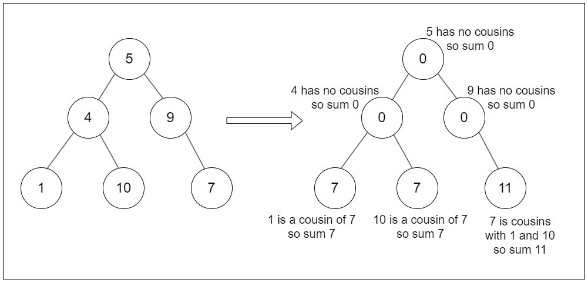

## Solution

---

### Approach 1: Two Pass BFS

#### Intuition

Cousins are nodes that share the same depth but have different parents. This means that to find the sum of a node’s cousins, we first need to know the total sum of all nodes at the same depth. If we subtract the sum of a node and its siblings from this total, we’re left with the sum of its cousins.



With this thought in mind, we break down the solution into two parts. First, we perform a BFS traversal to calculate the sum of all nodes at each level. In BFS, we explore each level independently, which lets us sum the node values for each level as we go. We store these sums in an array, `levelSums`, so each level’s total is recorded and ready for the next part.

In the second part, we go through the tree again with another BFS traversal. Now, as we visit each node, we use the `levelSums` array recorded earlier. For each node, we subtract the value of itself and its sibling from the corresponding `levelSums` entry. The remaining sum is the cousin sum, which we then assign to the current node.

#### Algorithm

- If the `root` is null, return `root`.

- Initialize a queue `nodeQueue` and push `root` into it.
- Create an array `levelSums` to store the sum of node values at each level.

- First BFS traversal to calculate the sum of nodes at each level:
  - While the queue is not empty:
- Initialize `levelSum` to `0` for the current level.
- Get the number of nodes at the current level (`levelSize`).
- For each node at this level:
      - Pop the front node from the queue and add its value to `levelSum`.
      - If the node has a left child, push it to the queue.
      - If the node has a right child, push it to the queue.
- After processing all nodes at the level, append `levelSum` to `levelSums`.

- Second BFS traversal to update each node's value to the sum of its cousins:
  - Push `root` back into the queue.
  - Set `root.val` to `0` since it has no cousins.
  - Initialize `levelIndex` to `1`.

  - While the queue is not empty:
- Get the number of nodes at the current level (`levelSize`).
- For each node at this level:
      - Pop the front node from the queue.
      - Calculate `siblingSum` by adding the values of the left and right children (if they exist).
      - If the left child exists, update its value to $\text{levelSums}[levelIndex] - siblingSum$ and push it to the queue.
      - If the right child exists, update its value similarly and push it to the queue.
- Increment `levelIndex` after processing the current level.

- Return the modified `root` of the tree.

#### Implementation

```python
class Solution:
    def replaceValueInTree(self, root):
        if not root:
            return root
        node_queue = deque([root])
        level_sums = []

        # First BFS: Calculate sum of nodes at each level
        while node_queue:
            level_sum = 0
            level_size = len(node_queue)
            for _ in range(level_size):
                current_node = node_queue.popleft()
                level_sum += current_node.val
                if current_node.left:
                    node_queue.append(current_node.left)
                if current_node.right:
                    node_queue.append(current_node.right)
            level_sums.append(level_sum)

        # Second BFS: Update each node's value to sum of its cousins
        node_queue.append(root)
        level_index = 1
        root.val = 0  # Root has no cousins
        while node_queue:
            level_size = len(node_queue)
            for _ in range(level_size):
                current_node = node_queue.popleft()

                sibling_sum = (
                    current_node.left.val if current_node.left else 0
                ) + (current_node.right.val if current_node.right else 0)

                if current_node.left:
                    current_node.left.val = (
                        level_sums[level_index] - sibling_sum
                    )
                    node_queue.append(current_node.left)
                if current_node.right:
                    current_node.right.val = (
                        level_sums[level_index] - sibling_sum
                    )
                    node_queue.append(current_node.right)
            level_index += 1

        return root
```

#### Complexity Analysis

Let $n$ be the number of nodes in the tree.

- Time complexity: $O(n)$

    In the first BFS, we traverse each node in the tree once to calculate the sum of values at each level. This requires visiting each of the $n$ nodes, leading to a time complexity of $O(n)$. Similarly, the second BFS traverses each node to update its value based on the sums of its cousins, which also takes $O(n)$ time. Thus, the overall time complexity is $O(n) +$\mathcal{O}(n)$= O(n)$.

- Space complexity: $O(n)$

    The space complexity primarily comes from the queue used in the BFS and the array that stores the level sums. The maximum size of the queue will be the maximum width of the tree, which in the worst case (for a complete binary tree) can be $O(n)$. Additionally, the `levelSums` array will store one integer for each level of the tree. In a balanced binary tree, the height is $O(\log n)$, leading to $O(\log n)$ levels. However, in the worst case, we can have $O(n)$ elements in `levelSums` when considering unbalanced trees (e.g., all nodes have only one child). Thus, the overall space complexity can be represented as $O(n)$.

---

### Approach 2: Two Pass DFS

#### Intuition

We can apply the same approach in DFS as we did in BFS. We begin with a DFS traversal to calculate the sum of the values of all nodes at each depth level. We define an array called `levelSums`, where each index corresponds to a specific level in the tree. As we traverse, we add each node's value to the appropriate index in `levelSums`.

Next, we proceed with the second DFS traversal to update each node's values. In this traversal, we calculate each node's left and right children’s values, defaulting to zero if they are absent. If the node is at the root level or the first level, we set its value to zero since these nodes do not have cousins.

For deeper nodes, we compute their new value as the sum from `levelSums` at their level, subtracting their current value and the sum of their siblings.

#### Algorithm

- Declare an array `levelSums` to store the sum of values at each level of the tree.

- Define the `replaceValueInTree` function:
  - Call `calculateLevelSum(root, 0)` to perform a depth-first search (DFS) and calculate the sum of values at each level.
  - Call `replaceValueInTreeInternal(root, 0, 0)` to replace each node's value with the sum of its cousins.
  - Return the modified tree root.

- Define the `calculateLevelSum` function:
  - If `node` is `null`, return (base case).
  - Add the value of `node` to $\text{levelSums}[level]$ (accumulate the sum at the current level).
  - Recursively call `calculateLevelSum` for the left child, increasing the level by 1.
  - Recursively call `calculateLevelSum` for the right child, increasing the level by 1.

- Define the `replaceValueInTreeInternal` function:
  - If `node` is `null`, return (base case).

  - Determine the values of the left and right children:
- If `node.left` is `null`, set `leftChildVal` to 0; otherwise, set it to `node.left.val`.
- If `node.right` is `null`, set `rightChildVal` to 0; otherwise, set it to `node.right.val`.

  - For the root and its children (level 0 and level 1):
- Set `node.val` to 0.

  - For other levels:
- Set `node.val` to $\text{levelSums}[level] - \text{node.val} - siblingSum$ (sum of cousins).

  - Recursively call `replaceValueInTreeInternal` for the left child, passing the right child's value as the sibling sum and increasing the level by 1.
  - Recursively call `replaceValueInTreeInternal` for the right child, passing the left child's value as the sibling sum and increasing the level by 1.

#### Implementation

```python
class Solution:
    def __init__(self):
        self.level_sums = [0] * 100000

    def replaceValueInTree(self, root):
        self._calculate_level_sum(root, 0)
        self.replace_value_in_tree_internal(root, 0, 0)
        return root

    def _calculate_level_sum(self, node, level):
        if node is None:
            return
        self.level_sums[level] += node.val
        self._calculate_level_sum(node.left, level + 1)
        self._calculate_level_sum(node.right, level + 1)

    def replace_value_in_tree_internal(self, node, sibling_sum, level):
        if node is None:
            return
        left_child_val = 0 if node.left is None else node.left.val
        right_child_val = 0 if node.right is None else node.right.val

        if level == 0 or level == 1:
            node.val = 0
        else:
            node.val = self.level_sums[level] - node.val - sibling_sum
        self.replace_value_in_tree_internal(
            node.left, right_child_val, level + 1
        )
        self.replace_value_in_tree_internal(
            node.right, left_child_val, level + 1
        )
```

#### Complexity Analysis

Let $n$ be the number of nodes in the tree.

- Time complexity: $O(n)$

    In the first DFS traversal, we visit each node exactly once to compute the sum of values at each level. Thus, this part has a time complexity of $O(n)$. In the second DFS, we again traverse each node exactly once to update the values based on the previously computed sums. Therefore, this part also has a time complexity of $O(n)$.

    Thus, the overall time complexity is $O(n) +$\mathcal{O}(n)$= O(n)$.

- Space complexity: $O(n)$

    The maximum depth of the recursion stack will be equal to the height of the tree, which is $O(h)$. In a balanced binary tree, $h$ is $O(\log n)$, while in the worst case (for a skewed tree), $h$ can be $O(n)$.

    The `levelSums` array is determined by the maximum number of levels in the tree, which can be at most $n$. Thus, the overall space complexity can be represented as $O(n)$.

---

### Approach 3: Single BFS with Running Sum

#### Intuition

We can aim to reduce our two-step process into a single traversal. So the question is: can we calculate the level sums and update the nodes’ values simultaneously? With some adjustments, it’s possible. Instead of storing each level’s sum first and revisiting it later, we calculate the cousin sum as we traverse each level and apply it immediately.

We begin by initializing a variable called `currentLevelSum`. This variable holds the total value of all nodes at the current level. We set `currentLevelSum` to the root value value since it is the only node at level zero.

We traverse the tree level-by-level to visit each node and apply a formula to determine its new value. The formula is:

$\text{currentNode.val} = \text{currentLevelSum} - \text{siblingSum}$

The formula subtracts the sum of each node's siblings from `currentLevelSum` to give us the sum of all other nodes at that level, which is effectively the sum of its cousins.

While processing each node, we also need to prepare for the next level. For each child of the current node, we calculate their contribution to the sibling sum of their level. This ensures that when we update the children's values in the next iteration, we have the correct sibling sum to use. We then add these children to a queue to process them in the next level and continue till we process the entire tree.

#### Algorithm

- If `root` is null, return `root` (base case).

- Initialize a queue `nodeQueue` and add the `root` node to it.
- Set `currentLevelSum` to the value of `root`.

- While the queue is not empty:
  - Determine the number of nodes at the current level with $levelSize = \text{nodeQueue.size}()$.
  - Initialize `nextLevelSum` to `0` for accumulating the sum of the next level.

  - For each node in the current level (loop `levelSize` times):
- Remove the front node from the queue and assign it to `currentNode`.
- Update `currentNode.val` to $currentLevelSum - \text{currentNode.val}$ (replace its value with the cousin sum).

- Calculate the `siblingSum` as the sum of the values of `currentNode`'s left and right children (if they exist):
      - If `currentNode.left` is not null, add its value to `nextLevelSum` and update `currentNode.left.val` to `siblingSum`, then enqueue `currentNode.left`.
      - If `currentNode.right` is not null, add its value to `nextLevelSum` and update `currentNode.right.val` to `siblingSum`, then enqueue `currentNode.right`.

  - Update `currentLevelSum` to `nextLevelSum` for the next iteration.

- After processing all levels, return the modified `root`.

#### Implementation

```python
class Solution:
    def replaceValueInTree(self, root):
        if root is None:
            return root
        node_queue = deque()
        node_queue.append(root)
        current_level_sum = root.val

        while node_queue:
            level_size = len(node_queue)
            next_level_sum = 0

            for _ in range(level_size):
                current_node = node_queue.popleft()
                # Update node value to cousin sum
                current_node.val = current_level_sum - current_node.val

                # Calculate sibling sum
                sibling_sum = (
                    0 if current_node.left is None else current_node.left.val
                ) + (
                    0 if current_node.right is None else current_node.right.val
                )

                if current_node.left is not None:
                    next_level_sum += (
                        current_node.left.val
                    )  # Accumulate next level sum
                    current_node.left.val = (
                        sibling_sum  # Update left child's value
                    )
                    node_queue.append(
                        current_node.left
                    )  # Add to queue for next level
                if current_node.right is not None:
                    next_level_sum += (
                        current_node.right.val
                    )  # Accumulate next level sum
                    current_node.right.val = (
                        sibling_sum  # Update right child's value
                    )
                    node_queue.append(
                        current_node.right
                    )  # Add to queue for next level

            # Update current level sum for next iteration
            current_level_sum = next_level_sum
        return root
```

#### Complexity Analysis

Let $n$ be the number of nodes in the tree.

- Time complexity: $O(n)$

    We traverse each node in the binary tree exactly once. During the traversal, we perform constant-time operations to update the node values and calculate sibling sums. Since there are $n$ nodes in total, the time complexity is $O(n)$.

- Space complexity: $O(n)$

    The space complexity is primarily determined by the queue used in the BFS. In the worst case, when the tree is completely unbalanced (like a linked list), the queue can grow to hold all $n$ nodes at once, leading to a space complexity of $O(n)$. While there are no additional data structures like arrays that grow with the number of nodes, the queue remains the primary contributor to space complexity.

---