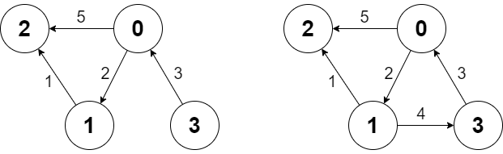

### 1. Description

There is a **directed weighted** graph that consists of `n` nodes numbered from `0` to $n - 1$. The edges of the graph are initially represented by the given array `edges` where $\text{edges}[i] = [\text{from}_{i}, \text{to}_{i}, \text{edgeCost}_{i}]$ meaning that there is an edge from $\text{from}_{i}$ to $\text{to}_{i}$ with the cost $\text{edgeCost}_{i}$.

Implement the `Graph` class:

- `Graph(int n, int[][] edges)` initializes the object with `n` nodes and the given edges.

- `addEdge(int[] edge)` adds an edge to the list of edges where $edge = [from, to, edgeCost]$. It is guaranteed that there is no edge between the two nodes before adding this one.

- `int shortestPath(int node1, int node2)` returns the **minimum** cost of a path from `node1` to `node2`. If no path exists, return `-1`. The cost of a path is the sum of the costs of the edges in the path.

### 2. Function Contract

**Methods**

- `Graph(n: int, edges: List[List[int]])`: Initializes the data structure.
- `addEdge(edge: List[int])`: Executes operation.
- `shortestPath(node1: int, node2: int) -> `int``: Executes operation.

### 3. Examples

#### Example 1



```
**Input**
["Graph", "shortestPath", "shortestPath", "addEdge", "shortestPath"]
[[4, [[0, 2, 5], [0, 1, 2], [1, 2, 1], [3, 0, 3]]], [3, 2], [0, 3], [[1, 3, 4]], [0, 3]]
**Output**
[null, 6, -1, null, 6]

**Explanation**
Graph g = new Graph(4, [[0, 2, 5], [0, 1, 2], [1, 2, 1], [3, 0, 3]]);
g.shortestPath(3, 2); // return 6. The shortest path from 3 to 2 in the first diagram above is 3 -> 0 -> 1 -> 2 with a total cost of 3 + 2 + 1 = 6.
g.shortestPath(0, 3); // return -1. There is no path from 0 to 3.
g.addEdge([1, 3, 4]); // We add an edge from node 1 to node 3, and we get the second diagram above.
g.shortestPath(0, 3); // return 6. The shortest path from 0 to 3 now is 0 -> 1 -> 3 with a total cost of 2 + 4 = 6.
```

### 4. Constraints

- $1 \le n \le 100$

- $0 \le \text{edges.length} \le n * (n - 1)$

- $\text{edges}[i].length = \text{edge.length} = 3$

- $0 \le \text{from}_{i}, \text{to}_{i}, from, to, node1, node2 \le n - 1$

- $1 \le \text{edgeCost}_{i}, edgeCost \le 10^{6}$

- There are no repeated edges and no self-loops in the graph at any point.

- At most `100` calls will be made for `addEdge`.

- At most `100` calls will be made for `shortestPath`.
