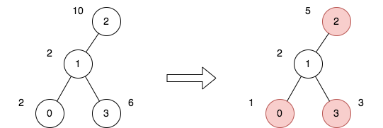
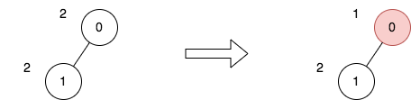

## Description

There exists an undirected and unrooted tree with `n` nodes indexed from `0` to $n - 1$. You are given the integer `n` and a 2D integer array `edges` of length $n - 1$, where $\text{edges}[i] = [a_{i}, b_{i}]$ indicates that there is an edge between nodes $a_{i}$ and $b_{i}$ in the tree.

Each node has an associated price. You are given an integer array `price`, where $\text{price}[i]$ is the price of the $$i^{\text{th}}$$ node.

The **price sum** of a given path is the sum of the prices of all nodes lying on that path.

Additionally, you are given a 2D integer array `trips`, where $\text{trips}[i] = [\text{start}_{i}, \text{end}_{i}]$ indicates that you start the $$i^{\text{th}}$$ trip from the node $\text{start}_{i}$ and travel to the node $\text{end}_{i}$ by any path you like.

Before performing your first trip, you can choose some **non-adjacent** nodes and halve the prices.

Return *the minimum total price sum to perform all the given trips*.
### Function Contract

- `n`: Input parameter.
- Returns expected result.

### Examples

#### Example 1

- **Input:** $n = 4, edges = [[0,1],[1,2],[1,3]], price = [2,2,10,6], trips = [[0,3],[2,1],[2,3]]$
- **Output:** `23`
- **Explanation:** The diagram above denotes the tree after rooting it at node 2. The first part shows the initial tree and the second part shows the tree after choosing nodes 0, 2, and 3, and making their price half.
For the 1^st trip, we choose path [0,1,3]. The price sum of that path is 1 + 2 + 3 = 6.
For the 2^nd trip, we choose path [2,1]. The price sum of that path is 2 + 5 = 7.
For the 3^rd trip, we choose path [2,1,3]. The price sum of that path is 5 + 2 + 3 = 10.
The total price sum of all trips is 6 + 7 + 10 = 23.
It can be proven, that 23 is the minimum answer that we can achieve.
#### Example 2

- **Input:** $n = 2, edges = [[0,1]], price = [2,2], trips = [[0,0]]$
- **Output:** `1`
- **Explanation:** The diagram above denotes the tree after rooting it at node 0. The first part shows the initial tree and the second part shows the tree after choosing node 0, and making its price half.
For the 1^st trip, we choose path [0]. The price sum of that path is 1.
The total price sum of all trips is 1. It can be proven, that 1 is the minimum answer that we can achieve.
### Constraints

- $1 \le n \le 50$

- $\text{edges.length} = n - 1$

- $0 \le a_{i}, b_{i} \le n - 1$

- `edges` represents a valid tree.

- $\text{price.length} = n$

- $\text{price}[i]$ is an even integer.

- $1 \le \text{price}[i] \le 1000$

- $1 \le \text{trips.length} \le 100$

- $0 \le \text{start}_{i}, \text{end}_{i} \le n - 1$