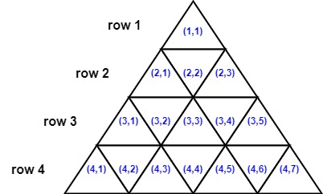
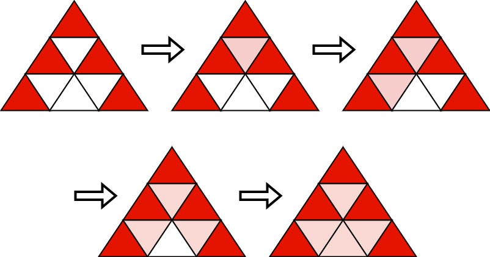
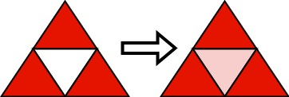

## Description

You are given an integer `n`. Consider an equilateral triangle of side length `n`, broken up into $n^{2}$ unit equilateral triangles. The triangle has `n` **1-indexed** rows where the $$i^{\text{th}}$$ row has $2i - 1$ unit equilateral triangles.

The triangles in the $$i^{\text{th}}$$ row are also **1-indexed** with coordinates from `(i, 1)` to $(i, 2i - 1)$. The following image shows a triangle of side length `4` with the indexing of its triangle.

Two triangles are **neighbors** if they **share a side**. For example:

- Triangles `(1,1)` and `(2,2)` are neighbors

- Triangles `(3,2)` and `(3,3)` are neighbors.

- Triangles `(2,2)` and `(3,3)` are not neighbors because they do not share any side.

Initially, all the unit triangles are **white**. You want to choose `k` triangles and color them **red**. We will then run the following algorithm:

- Choose a white triangle that has **at least two** red neighbors.

		<li>If there is no such triangle, stop the algorithm.

	</li>
- Color that triangle **red**.

- Go to step 1.

Choose the minimum `k` possible and set `k` triangles red before running this algorithm such that after the algorithm stops, all unit triangles are colored red.

Return *a 2D list of the coordinates of the triangles that you will color red initially*. The answer has to be of the smallest size possible. If there are multiple valid solutions, return any.
### Function Contract

- Refer to method signature.

### Examples

#### Example 1

- **Input:** $n = 3$
- **Output:** `[[1,1],[2,1],[2,3],[3,1],[3,5]]`
- **Explanation:** Initially, we choose the shown 5 triangles to be red. Then, we run the algorithm:
- Choose (2,2) that has three red neighbors and color it red.
- Choose (3,2) that has two red neighbors and color it red.
- Choose (3,4) that has three red neighbors and color it red.
- Choose (3,3) that has three red neighbors and color it red.
It can be shown that choosing any 4 triangles and running the algorithm will not make all triangles red.
#### Example 2

- **Input:** $n = 2$
- **Output:** `[[1,1],[2,1],[2,3]]`
- **Explanation:** Initially, we choose the shown 3 triangles to be red. Then, we run the algorithm:
- Choose (2,2) that has three red neighbors and color it red.
It can be shown that choosing any 2 triangles and running the algorithm will not make all triangles red.
### Constraints

- $1 \le n \le 1000$