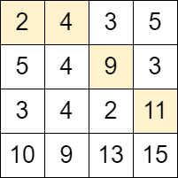
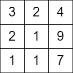

### 1. Description

You are given a **0-indexed** `m x n` matrix `grid` consisting of **positive** integers.

You can start at **any** cell in the first column of the matrix, and traverse the grid in the following way:

- From a cell `(row, col)`, you can move to any of the cells: $(row - 1, col + 1)$, $(row, col + 1)$ and $(row + 1, col + 1)$ such that the value of the cell you move to, should be **strictly** bigger than the value of the current cell.

Return *the **maximum** number of **moves** that you can perform.*

### 2. Function Contract

- `n`: Input parameter.
- Returns expected result.

### 3. Examples

#### Example 1

- **Input:** `grid = [[2,4,3,5],[5,4,9,3],[3,4,2,11],[10,9,13,15]]`
- **Output:** `3`
- **Explanation:** We can start at the cell (0, 0) and make the following moves:
- (0, 0) -> (0, 1).
- (0, 1) -> (1, 2).
- (1, 2) -> (2, 3).
It can be shown that it is the maximum number of moves that can be made.
#### Example 2

- **Input:** `grid = [[3,2,4],[2,1,9],[1,1,7]]`
- **Output:** `0`
- **Explanation:** Starting from any cell in the first column we cannot perform any moves.

### 4. Constraints

- $m = \text{grid.length}$

- $n = \text{grid}[i].length$

- $2 \le m, n \le 1000$

- $4 \le m * n \le 10^{5}$

- $1 \le \text{grid}[i][j] \le 10^{6}$