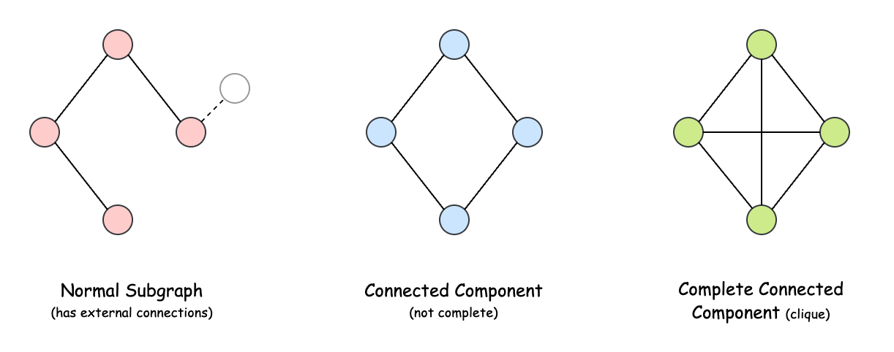

## Solution

---

### Overview

Before diving into the solution, let’s clarify what a **complete connected component** is. A complete connected component is a set of nodes and edges in a graph (also known as a subgraph) that satisfies the following conditions:

- It is **connected**, meaning every pair of vertices in the subgraph is reachable through some path, and no vertex connects to another component.
- It is **complete**, meaning every vertex in the component has a direct edge to every other vertex. Notice that every complete subgraph is also a connected subgraph, but the reverse is not always true.

In simpler terms, we are looking for connected subgraphs that form perfect [cliques](https://en.wikipedia.org/wiki/Clique_(graph_theory)) - where each vertex is directly connected to all others within the component.



> A strong grasp of fundamental graph algorithms like Depth-First Search, Breadth-First Search, and Disjoint Set Union is essential for understanding the solutions ahead. If you need a refresher or want to explore these concepts further, check out the [Graph Explore Card](https://leetcode.com/explore/learn/card/graph/). This resource provides an in-depth look at key graph algorithms, their applications, and a variety of problems to reinforce the underlying patterns.

---

### Approach 1: Adjacency List

#### Intuition

The most common way to represent a graph is through an adjacency list, where each node points to a list of all the nodes it is directly connected to.

For example, consider a graph where vertices `0`, `1`, and `2` form a complete component. Their adjacency lists would look like this:

- Vertex `0`’s neighbors: `[1, 2]`
- Vertex `1`’s neighbors: `[0, 2]`
- Vertex `2`’s neighbors: `[0, 1]`

Now, let’s take a moment to include each vertex as its own neighbor. This does not violate any constraints since every node is naturally reachable from itself. After this adjustment, the adjacency lists would look like:

- Vertex `0`’s neighbors: `[0, 1, 2]`
- Vertex `1`’s neighbors: `[0, 1, 2]`
- Vertex `2`’s neighbors: `[0, 1, 2]`

This leads to a key insight: in a complete connected component, every vertex must have the exact same set of neighbors (including itself). This forms a unique "adjacency pattern" that is shared by all vertices in the same component.

Let us create the adjacency list for the graph and include each vertex as a neighbor in its own list. Now, we need to identify all vertices that share the same neighbor pattern.

To do this, we can use a hash map where the key represents a unique neighbor pattern, and the value keeps track of how many times this pattern appears in the graph. However, there may be cases where two neighbor patterns are the same but appear differently in the adjacency list (for example, $0: [0, 1, 2]$ and $2: [2, 1, 0]$). To ensure they are grouped together, we first sort each neighbor list before adding it to the map.

Next, we go through each entry in the map to count how many unique patterns were collected. But one final check is needed: the size of the adjacency list must match the number of vertices that share this pattern. In other words, the size of the list should be equal to its frequency of occurrence in the map.

Why? Because in a complete component with `k` vertices, each vertex must have exactly `k` neighbors (including itself). And exactly `k` vertices must share this pattern - one for each member of the component.

Finally, we count the number of entries in the map that pass this validation and return this count as our answer.

#### Algorithm

- Initialize:
  - an array of adjacency lists called `graph` with size `n`.
  - a hash map `componentFreq` to track frequencies of unique adjacency lists.
- Loop through each `vertex` from `0` to $n - 1$:
  - Initialize the adjacency list for the current vertex and add the vertex itself (self-loop).
- Build the graph by looping through each $edge = [u, v]$ in the `edges` array:
  - Push `v` into `u`'s adjacency list ($\text{graph}[u]$).
  - Push `u` into `v`'s adjacency list ($\text{graph}[v]$).
- For each vertex from `0` to $n - 1$:
  - Get and sort its list of neighbors.
  - Increment the frequency count for this specific adjacency pattern in the `componentFreq` map.
- Initialize a counter variable `completeCount` to zero.
- Iterate through each entry in the `componentFreq` map:
  - If the size of the adjacency list equals its frequency count, increment `completeCount`.
- Return the final value of `completeCount`.

#### Implementation

```python
class Solution:
    def countCompleteComponents(self, n: int, edges: List[List[int]]) -> int:
        # Adjacency lists for each vertex
        graph = [[] for _ in range(n)]
        # Map to store frequency of each unique adjacency list
        component_freq = defaultdict(int)

        # Initialize adjacency lists with self-loops
        for vertex in range(n):
            graph[vertex] = [vertex]

        # Build adjacency lists from edges
        for v1, v2 in edges:
            graph[v1].append(v2)
            graph[v2].append(v1)

        # Count frequency of each unique adjacency pattern
        for vertex in range(n):
            neighbors = tuple(sorted(graph[vertex]))
            component_freq[neighbors] += 1

        # Count complete components where size equals frequency
        return sum(
            1
            for neighbors, freq in component_freq.items()
            if len(neighbors) == freq
        )
```

#### Complexity Analysis

Let $n$ be the number of vertices and $m$ be the number of edges in the given graph.

- Time complexity: $O(n + m \log n)$

    The solution's time complexity stems from several operations. Initializing the adjacency lists requires $O(n)$ time as we create a list for each vertex. When building the adjacency lists from the edges, we spend $O(m)$ time adding each edge to the lists of both vertices it connects.

    The most expensive operation comes when we sort each vertex's adjacency list, which costs $O(d_i \log d_i)$ for a vertex with degree $d_i$. Across all vertices, this sorting accounts for $O(\sum_{i=0}^{n-1} d_i \log d_i)$ time. Since $\sum d_i = 2m$ and the maximum degree is bounded by $n$, this simplifies to $O(m \log n)$ in the worst case. The final operations of processing vertices and counting complete components take $O(n)$ time.

    Therefore, the overall time complexity is dominated by the sorting step, giving us $O(n + m \log n)$.

- Space complexity: $O(n + m + S)$

    For space complexity, we use memory for the adjacency list array itself, which requires $O(n)$ space. The contents of all adjacency lists collectively require space proportional to the number of edges, contributing $O(m)$ to our space usage.

    The space taken by the sorting algorithm ($S$) depends on the language of implementation:
- In Java, `Arrays.sort()` is implemented using a variant of the Quick Sort algorithm which has a space complexity of $O( \log n)$.
- In C++, the `sort()` function is implemented as a hybrid of Quick Sort, Heap Sort, and Insertion Sort, with a worst-case space complexity of $O(\log n)$.
- In Python, the `sort()` method sorts a list using the Timsort algorithm which is a combination of Merge Sort and Insertion Sort and has a space complexity of $O(n)$ .

    While the hash map stores references to these same adjacency lists, it doesn't significantly increase the asymptotic space complexity. Each unique component pattern may be stored once in the hash map, but the total size of all stored patterns remains bounded by the total size of all adjacency lists, which is $O(n + m)$.

    Therefore, the overall space complexity is $O(n + m + S)$.

---

### Approach 2: Depth-First Search (DFS)

#### Intuition

Let's now return to traditional graph traversal techniques to solve this problem. Depth-first search (DFS) is particularly well-suited for this task. Starting from an unvisited vertex, DFS explores as far as possible along a branch before backtracking, ensuring that every vertex reachable from the starting point is visited.

But how do we determine if a component is complete? One approach is to check every pair of vertices in the component to see if they share an edge, but this would be inefficient.

Instead, we can take advantage of a key property of complete graphs: in a complete graph with $n$ vertices, there must be exactly $\frac{n \cdot (n-1)}{2}$ unique edges - equal to the number of pairs of nodes in the graph. Since our graph is undirected but our adjacency list counts each edge twice (once from each endpoint), the total edge count from the adjacency lists should be $n \cdot (n-1)$.

During our DFS traversal, we will track two crucial pieces of information for each component:
1. The number of vertices in the component.
2. The total number of edges connected to vertices in the component.

For each new vertex we visit, we increment the vertex count and add all its edges to the total edge count. Once the traversal is complete, we check if the gathered values match the expected count. We keep track of all components that meet this condition, and after visiting all vertices, we return this count as our final answer.

#### Algorithm

- Initialize an array of adjacency lists called `graph` with size `n` to represent the undirected graph.
- Build the graph by looping through each edge in the `edges` array:
  - Add each vertex to the other's adjacency list.
- Initialize a counter variable `completeCount` to zero.
- Create a hash set `visited` to keep track of visited vertices.
- Loop through each `vertex` from `0` to $n - 1$:
  - Skip if the `vertex` has already been visited.
  - Initialize an array `componentInfo` with two elements to track: `[0]`: number of vertices and `[1]`: total edges.
  - Call the `dfs` function starting from the current `vertex`.
  - Check if the component is complete by comparing the number of edges to $vertices * (vertices - 1)$.
  - Increment `completeCount` if the condition is met.
- Return the final value of `completeCount`.

Helper method `dfs(curr, graph, visited, componentInfo)`:
- Mark the current vertex as visited.
- Increment the vertex count in $\text{componentInfo}[0]$.
- Add the number of edges from the current vertex to $\text{componentInfo}[1]$.
- Recursively explore all unvisited neighbors of the current vertex.

#### Implementation

```python
class Solution:
    def countCompleteComponents(self, n: int, edges: List[List[int]]) -> int:
        # Adjacency lists for each vertex
        graph = defaultdict(list)

        # Build adjacency lists from edges
        for v1, v2 in edges:
            graph[v1].append(v2)
            graph[v2].append(v1)

        complete_count = 0
        visited = set()

        def _dfs(curr: int, info: list) -> None:
            visited.add(curr)
            info[0] += 1  # Increment vertex count
            info[1] += len(graph[curr])  # Add edges from current vertex

            # Explore unvisited neighbors
            for next_vertex in graph[curr]:
                if next_vertex not in visited:
                    _dfs(next_vertex, info)

        # Process each unvisited vertex
        for vertex in range(n):
            if vertex in visited:
                continue

            # info[0] = vertices count, info[1] = total edges count
            component_info = [0, 0]
            _dfs(vertex, component_info)

            # Check if component is complete - edges should be vertices * (vertices-1)
            if component_info[0] * (component_info[0] - 1) == component_info[1]:
                complete_count += 1

        return complete_count
```

#### Complexity Analysis

Let $n$ be the number of vertices and $m$ be the number of edges in the given graph.

- Time complexity: $O(n + m)$

    The algorithm begins with graph initialization, where populating the adjacency list by processing $m$ edges requires $O(m)$, since each edge is added to two lists.

    The core of the solution is a DFS traversal, which visits each vertex once and explores all edges connected to it. Since each edge is considered at most twice (once from each endpoint), DFS runs in $O(n + m)$.

    Summing these components, the overall time complexity remains $O(n + m)$.

- Space complexity: $O(n + m)$

    The adjacency list representation requires $O(n)$ for the array and $O(m)$ for the edge storage. The `visited` set stores at most $O(n)$ vertices, while the recursive DFS calls can create a call stack of size $O(n)$ in the worst case. The `componentInfo` array uses constant space.

    Combining these, the overall space complexity is $O(n + m)$, dominated by the graph representation and recursion stack.

---

### Approach 3: Breadth-First Search (BFS)

#### Intuition

The other quintessential graph traversal algorithm is the Breadth-First Search (BFS), which can also be used to solve this problem.

BFS explores each component using a queue. We maintain a `visited` array to track which vertices have been visited. When we encounter an unvisited vertex, we add it to the queue and begin exploring its connected component.

Along with the queue, we maintain a list called `component` to store all vertices belonging to the current component. Once the exploration is complete, we need to verify whether the component is fully connected. For a component with `k` vertices to be complete, every vertex must have exactly $k - 1$ edges connecting it to the other vertices within the component.

After finishing the BFS traversal for a component, we iterate through the gathered vertices in `component`. If the size of the component is `k` and each vertex has exactly $k - 1$ edges, we confirm that it is a complete component and increment our count.

Once all vertices in the graph have been explored, we return this count as our final answer.

#### Algorithm

- Initialize an array of adjacency lists called `graph` with size `n` to represent the undirected graph.
- Build the graph by looping through each edge in the `edges` array:
  - Add each vertex to the other's adjacency list.
- Create a boolean array `visited` of size `n` to track visited vertices.
- Initialize a counter variable `completeComponents` to zero.
- Loop through each `vertex` from `0` to $n - 1$:
  - Skip if the `vertex` has already been visited.
  - Create a list called `component` to store vertices in the current component.
  - Initialize a `queue` and add the current vertex to it.
  - Mark the current `vertex` as visited.
  - Perform BFS:
- Poll the next vertex from the queue.
- Add it to the component list.
- Process all unvisited neighbors by adding them to the queue and marking them as visited.
  - After BFS completes, check if the component is complete:
- Initialize `isComplete` as `true`.
- For each `node` in the component:
      - Check if the number of its neighbors equals $\text{component.size} - 1$.
      - If not, set `isComplete` to `false` and break.
  - If the component is complete, increment `completeComponents`.
- Return the final value of `completeComponents`.

#### Implementation

```python
class Solution:
    def countCompleteComponents(self, n: int, edges: list[list[int]]) -> int:
        # Create adjacency list representation of the graph
        graph = [[] for _ in range(n)]

        # Build graph from edges
        for u, v in edges:
            graph[u].append(v)
            graph[v].append(u)

        visited = [False] * n
        complete_components = 0

        # Process each unvisited vertex
        for vertex in range(n):
            if not visited[vertex]:
                # BFS to find all vertices in the current component
                component = []
                queue = [vertex]
                visited[vertex] = True

                while queue:
                    current = queue.pop(0)
                    component.append(current)

                    # Process neighbors
                    for neighbor in graph[current]:
                        if not visited[neighbor]:
                            queue.append(neighbor)
                            visited[neighbor] = True

                # Check if component is complete (all vertices have the right number of edges)
                is_complete = True
                for node in component:
                    if len(graph[node]) != len(component) - 1:
                        is_complete = False
                        break

                if is_complete:
                    complete_components += 1

        return complete_components
```

#### Complexity Analysis

Let $n$ be the number of vertices and $m$ be the number of edges in the given graph.

- Time complexity: $O(n + m)$

    The solution first builds an adjacency list representation, which takes $O(n)$ time for initialization and $O(m)$ time to add all edges. Then, for each unvisited vertex, we perform a BFS traversal that visits each vertex and edge exactly once across all components, taking $O(n + m)$ time in total.

    For each component found, we check if it's complete by examining the degree of each vertex in the component, which cumulatively takes $O(n)$ time.

    Therefore, the overall time complexity is $O(n + m)$.

- Space complexity: $O(n + m)$

    The adjacency list requires $O(n + m)$ space: $O(n)$ for the array of lists and $O(m)$ for storing all edges. The visited array requires $O(n)$ space. The queue used in BFS and the list to store component vertices can each contain at most $O(n)$ vertices.

    Therefore, the overall space complexity is $O(n + m)$.

---

### Approach 4: Disjoint Set Union (Union-Find)

#### Intuition

A complete connected component has a distinct property: it is a disjoint unit of the graph, meaning it does not share any connections with other parts of the graph. Our task is to identify these disjoint units and check whether their vertices and edges meet the criteria for completeness and connectivity.

One of the most effective ways to find separate groups in a graph is by using the Union-Find algorithm (also known as Disjoint Set Union). This method helps group vertices that belong together. Each group has a representative vertex, known as the leader, which serves as the group's identifier. To determine whether two vertices belong to the same group, we simply check if they share the same leader.

In our Union-Find implementation, we also track the size of each component. Maintaining size is not only useful for optimizing the merging of components - since attaching a smaller component to a larger one is more efficient - but also plays a crucial role in this problem: it tells us exactly how many vertices exist in each component. To verify whether a component is a valid complete connected component, we check if its edge count matches $\frac{k \cdot (k - 1)}{2}$, where $k$ is the number of vertices in the component.

Now, let’s implement our solution. First, we initialize a Union-Find structure and perform the "union" operation for each edge in our input. Since an edge signifies that two vertices belong to the same component, applying "union" to all edges ensures that all vertices are grouped correctly.

Next, we count the number of edges in each component. To do this, we use a hash map that associates each component with its edge count. Since Union-Find assigns each component a unique representative (the root of its tree), we use these representatives as keys in the map.

Finally, we iterate through each group leader and check if the group forms a complete component. A group is complete if its edge count equals $\frac{k \cdot (k - 1)}{2}$. If it does, we increment our final count. Once all components have been processed, we return the total number of complete components as our answer.

#### Algorithm

- Create a `UnionFind` data structure `dsu` to track connected components in the graph.
- Initialize a hash map `edgeCount` to track the number of edges in each component.
- Loop through each edge in the `edges` array:
  - Join the two vertices using the `union` operation.
- Loop through the `edges` again:
  - Find the root of the component containing the first vertex of each edge.
  - Increment the edge count for that component in the `edgeCount` map.
- Initialize a counter variable `completeCount` to zero.
- Loop through each `vertex` from `0` to $n - 1$:
  - If the `vertex` is a root (representative) of its component:
- Calculate the expected number of edges for a complete component with that many vertices: $(\text{size}[vertex] * (\text{size}[vertex] - 1)) / 2$.
  - Compare the actual edge count with the expected edge count.
- If they match, increment `completeCount`.
- Return the final value of `completeCount`.

Helper class `UnionFind`:
- Initialize a `UnionFind` class with two instance variables:
  - An array `parent` to track the parent of each node.
  - An array `size` to track the size of each component.
- In the constructor `dsu(n)`:
  - Initialize both arrays with size `n`.
  - Fill the `parent` array with `-1` to indicate each node is its own parent initially.
  - Fill the `size` array with `1` as each node starts in its own single-node component.

- In the `find(node)` method:
  - Check if the node's parent is `-1` (indicating it's a root).
  - If it is a root, return the `node` itself.
  - Otherwise, recursively find the root and update the `node`'s parent (path compression).

- In the `union(node1, node2)` method:
  - Find the roots of nodes `node1` and `node2` using the `find` method.
  - If both nodes already belong to the same component (same root), return early.
  - Apply union-by-size strategy:
- If the component containing `node1` is larger:
      - Make `root1` the parent of `root2`.
      - Add the size of `root2`'s component to `root1`'s component size.
- Otherwise, make `root2` the parent of `root1` and alter size accordingly.

#### Implementation

```python
class UnionFind:
    def __init__(self, n):
        self.parent = [-1] * n
        self.size = [1] * n

    def _find(self, node):
        # Find root of component with path compression
        if self.parent[node] == -1:
            return node
        self.parent[node] = self._find(self.parent[node])
        return self.parent[node]

    def _union(self, node_1, node_2):
        # Union by size
        root_1 = self._find(node_1)
        root_2 = self._find(node_2)

        if root_1 == root_2:
            return

        # Merge smaller component into larger one
        if self.size[root_1] > self.size[root_2]:
            self.parent[root_2] = root_1
            self.size[root_1] += self.size[root_2]
        else:
            self.parent[root_1] = root_2
            self.size[root_2] += self.size[root_1]

class Solution:
    def countCompleteComponents(self, n: int, edges: List[List[int]]) -> int:
        # Initialize Union Find and edge counter
        dsu = UnionFind(n)
        edge_count = {}

        # Connect components using edges
        for edge in edges:
            dsu._union(edge[0], edge[1])

        # Count edges in each component
        for edge in edges:
            root = dsu._find(edge[0])
            edge_count[root] = edge_count.get(root, 0) + 1

        # Check if each component is complete
        complete_count = 0
        for vertex in range(n):
            if dsu._find(vertex) == vertex:  # If vertex is root
                node_count = dsu.size[vertex]
                expected_edges = (node_count * (node_count - 1)) // 2
                if edge_count.get(vertex, 0) == expected_edges:
                    complete_count += 1

        return complete_count
```

#### Complexity Analysis

Let $n$ be the number of vertices and $m$ be the number of edges in the given graph.

- Time complexity: $O(n + m\alpha(n))$

    The solution uses a Union-Find data structure with path compression and union by size. Building the Union-Find structure takes $O(n)$ time for initialization. Processing all edges through union operations takes $O(m\alpha(n))$ time, where $\alpha(n)$ is the inverse Ackermann function, which grows extremely slowly and is practically constant.

    Counting edges in each component requires iterating through all edges again, taking $O(m)$ time. Finally, checking if each component is complete involves iterating through all vertices once, taking $O(n)$ time.

    Therefore, the overall time complexity is $O(n + m\alpha(n))$, which is essentially linear in practice.

- Space complexity: $O(n)$

    The Union-Find data structure uses two arrays of size $n$ for parent pointers and component sizes, requiring $O(n)$ space. The edge count map stores at most $n$ entries (one for each potential component root), requiring $O(n)$ space. Therefore, the overall space complexity is $O(n)$.

---