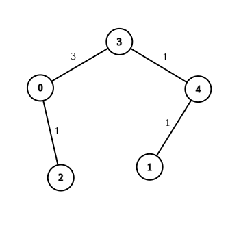
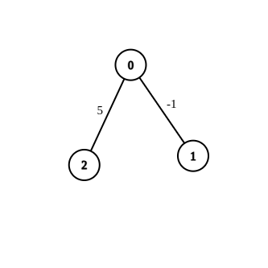
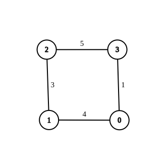

### 1. Description

You are given an **undirected weighted** **connected** graph containing `n` nodes labeled from `0` to $n - 1$, and an integer array `edges` where $\text{edges}[i] = [a_{i}, b_{i}, w_{i}]$ indicates that there is an edge between nodes $a_{i}$ and $b_{i}$ with weight $w_{i}$.

Some edges have a weight of `-1` ($w_{i} = -1$), while others have a **positive** weight ($w_{i} > 0$).

Your task is to modify **all edges** with a weight of `-1` by assigning them **positive integer values **in the range $[1, 2 * 10^{9}]$ so that the **shortest distance** between the nodes `source` and `destination` becomes equal to an integer `target`. If there are **multiple** **modifications** that make the shortest distance between `source` and `destination` equal to `target`, any of them will be considered correct.

Return *an array containing all edges (even unmodified ones) in any order if it is possible to make the shortest distance from *`source`* to *`destination`* equal to *`target`*, or an **empty array** if it's impossible.*

### 2. Function Contract

**Inputs**

- `n`: Input parameter (`int`).
- `edges`: Input parameter (`List[List[int]]`).
- `source`: Input parameter (`int`).
- `destination`: Input parameter (`int`).
- `target`: Input parameter (`int`).

**Return value**

- Returns `List[List[int]]`.

### 3. Note

You are not allowed to modify the weights of edges with initial positive weights.

### 4. Examples

#### Example 1

**

**

- **Input:** $n = 5, edges = [[4,1,-1],[2,0,-1],[0,3,-1],[4,3,-1]], source = 0, destination = 1, target = 5$
- **Output:** `[[4,1,1],[2,0,1],[0,3,3],[4,3,1]]`
- **Explanation:** The graph above shows a possible modification to the edges, making the distance from 0 to 1 equal to 5.

#### Example 2

**

**

- **Input:** $n = 3, edges = [[0,1,-1],[0,2,5]], source = 0, destination = 2, target = 6$
- **Output:** `[]`
- **Explanation:** The graph above contains the initial edges. It is not possible to make the distance from 0 to 2 equal to 6 by modifying the edge with weight -1. So, an empty array is returned.

#### Example 3

**

**

- **Input:** $n = 4, edges = [[1,0,4],[1,2,3],[2,3,5],[0,3,-1]], source = 0, destination = 2, target = 6$
- **Output:** `[[1,0,4],[1,2,3],[2,3,5],[0,3,1]]`
- **Explanation:** The graph above shows a modified graph having the shortest distance from 0 to 2 as 6.

### 5. Constraints

- $1 \le n \le 100$

- $1 \le \text{edges.length} \le n * (n - 1) / 2$

- $\text{edges}[i].length = 3$

- $0 \le a_{i}, b_{i} < n$

- $w_{i} = -1$or $1 \le w_{i} \le 10^{7}$

- $a_{i} \neq b_{i}$

- $0 \le source, destination < n$

- $source \neq destination$

- $1 \le target \le 10^{9}$

- The graph is connected, and there are no self-loops or repeated edges
