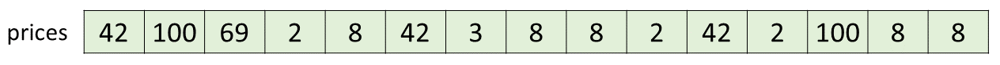
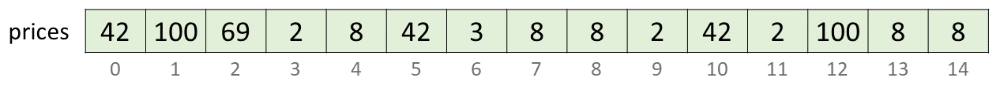
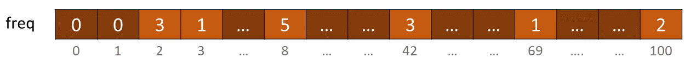
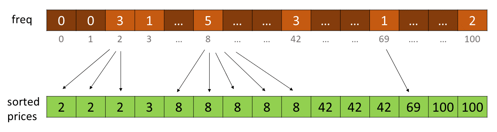
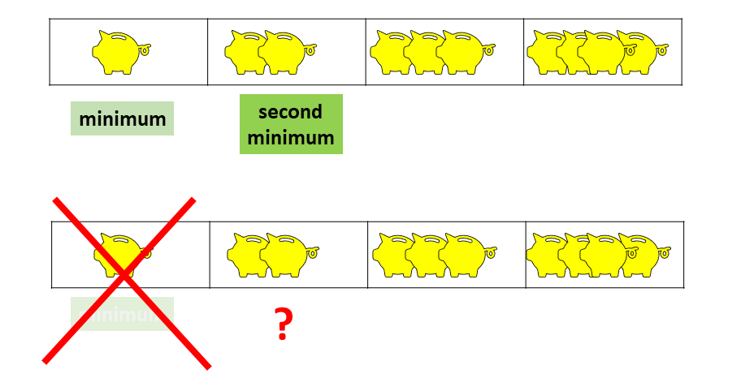
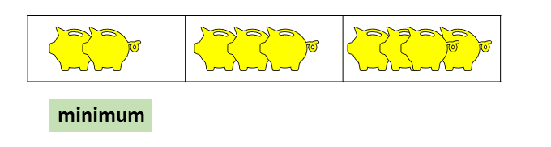
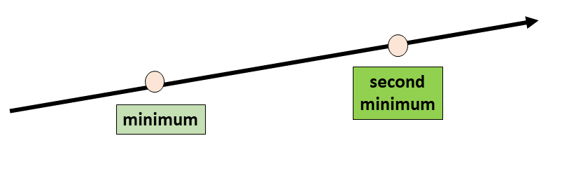
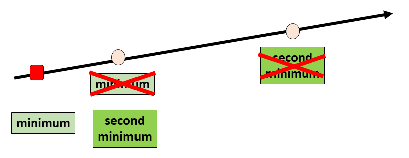
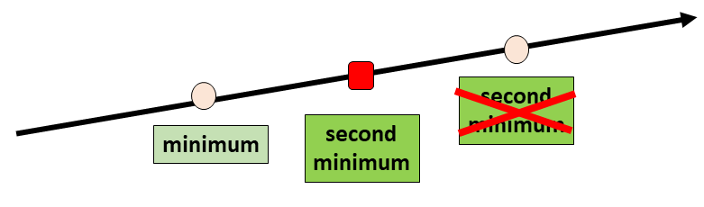
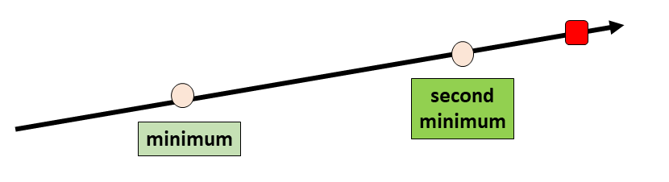

## Solution

---

### Overview

We have been given `prices` of chocolates. Initially, we have a `money` amount of money. We need to buy **exactly** two chocolates such that we spend the minimum on them, leaving us with the maximum amount of leftover money.

If we don't have enough money to buy two chocolates, we are supposed to return the initial amount of `money`. Otherwise, we should return the (maximum) amount of money left after buying two chocolates.

---

### Approach 1: Check Every Pair of Chocolate

#### Intuition

We need to buy **exactly** two chocolates. A collection of two is a pair.

Hence, we can check every pair of chocolates and select the pair with minimum cost.

> We need to minimize the sum of the prices of the two chocolates we buy.
>
> Initially, we will assume the minimum cost to be some very large integer, say infinity.
>
> Then for every pair of chocolates, we will check if the sum of their prices is less than the minimum cost. If it is, then we will update the minimum cost to be the sum of their prices.

Note that pairs are commutative. That is, the order of chocolates in a pair does not matter. If we have two chocolates, `a` and `b`, then the pair `(a, b)` is the same as the pair `(b, a)`, because the money spent on both pairs is the same, that is, $a + b$. The addition of two integers is commutative.

#### Algorithm

1. Initialize the minimum cost variable $\text{min}_{cost}$ to be infinity or some very large integer, that is at least greater than the sum of the prices of any two chocolates.

    > On observing constraint $1 \le \text{prices}[i] \le 100$, we can see that the sum of the prices of any two chocolates will be at most `200`. Hence, `201` is also a good choice for initializing $\text{min}_{cost}$.

2. Save the number of chocolates in a variable `n`. It is equal to the length of the array `prices`. It is often a good practice to save the length of an array in a variable if it is used multiple times in the code.

3. Check every pair of chocolates using two nested loops.

- Using the iterator variable $\text{first}_{choco}$, we will iterate over the array `prices` from `0` to $n - 1$.

- Using the nested iterator variable $\text{second}_{choco}$, we will iterate over the array `prices` from $\text{first}_{choco} + 1$ to $n - 1$.

        For every possible value of $\text{first}_{choco}$, we will check every possible value of $\text{second}_{choco}$.

- For every pair of chocolates, we will calculate the sum of their prices and save it in a variable `cost`. It will be equal to $prices[\text{first}_{choco}] + prices[\text{second}_{choco}]$.

- If the sum of the prices of the two chocolates is less than the minimum cost, then we will update the minimum cost to be the sum of the prices of the two chocolates. The condition for this is $cost < \text{min}_{cost}$. On being true, we will assign $\text{min}_{cost}$ to be `cost`, that is, $\text{min}_{cost} = cost$.

4. If the minimum cost is less than or equal to the amount of money we have, then we can buy two chocolates. In this case, we will return the amount of money left after buying two chocolates. It will be equal to $money - \text{min}_{cost}$. This we will return if $\text{min}_{cost} \le money$.

    Otherwise, we cannot buy two chocolates. In this case, we will return the initial amount of money, that is, `money`.

#### Implementation

```python
class Solution:
    def buyChoco(self, prices: List[int], money: int) -> int:
        # Assume the Minimum Cost to be Infinity
        min_cost = float('inf')

        # Number of Chocolates
        n = len(prices)

        # Check Every Pair of Chocolates
        for first_choco in range(n):
            for second_choco in range(first_choco + 1, n):
                # Sum of Prices of the Two Chocolates
                cost = prices[first_choco] + prices[second_choco]

                # If the Sum of Prices is Less than the Minimum Cost
                if cost < min_cost:
                    # Update the Minimum Cost
                    min_cost = cost

        # We can buy chocolates only if we have enough money
        if min_cost <= money:
            # Return the Amount of Money Left
            return money - min_cost
        else:
            # We cannot buy chocolates. Return the initial amount of money
            return money
```

**Implementation Note:** It is often a good practice to use relevant variable names.

#### Complexity Analysis

Let $n$ be the number of chocolates, computed as the length of the array `prices`.

* Time complexity: $O(n^2)$

- Initializing the $\text{min}_{cost}$ variable, and saving the length of the array `prices` in a variable `n` takes constant time, that is, $O(1)$.

- Now, we are checking every pair of chocolates. There will be [${}^{n}C_{2}$](https://en.wikipedia.org/wiki/Combination) such pairs. This is equal to $\frac{n(n - 1)}{2}$.

        For every pair, we are computing `cost`, comparing it with $\text{min}_{cost}$, and updating $\text{min}_{cost}$ if necessary. This takes constant time, that is, $O(1)$.

        This we are doing for $\frac{n(n - 1)}{2}$ pairs. Hence, the time complexity is $O(\frac{n(n - 1)}{2})$, which is equal to $O(n^2)$.

- Finally, we are checking if $\text{min}_{cost}$ is less than or equal to `money`, and returning the appropriate value. This takes constant time, that is, $O(1)$.

    Thus, the total time complexity is $O(1) +$\mathcal{O}(n^2)$+ O(1)$, which is equal to $O(n^2)$.

* Space complexity: $O(1)$

    We are using a handful of variables, and none of them is a function of the size of the input.

- the $\text{min}_{cost}$ variable, which is an integer, hence takes constant space, that is, $O(1)$.

- the `n` variable, which is an integer, hence takes constant space, that is, $O(1)$. Whatever may be the size of the array `prices`, the size of `n` will remain constant, although its value may change.

- the iterator variables $\text{first}_{choco}$ and $\text{second}_{choco}$ are integers, hence taking constant space, that is, $O(1)$.

- the `cost` variable, which is an integer, hence takes constant space, that is, $O(1)$.

    Hence, the total space complexity is $O(1) +$\mathcal{O}(1)$+$\mathcal{O}(1)$+$\mathcal{O}(1)$+ O(1)$, which is equal to $O(1)$.

---

### Approach 2: Greedy

#### Intuition

As given in the problem statement

> minimize the sum of the *prices of the* two *chocolates* you buy

Now, the *prices of the chocolates* are integers. In other words, we need to **minimize the sum of two integers**.

To minimize the sum of two integers, we need to minimize each of the two integers to the extent possible.

- to minimize the price of the first chocolate, we can choose the most inexpensive chocolate, the one with the minimum price. The price of this chocolate will be the minimum of the `prices` array.

- to minimize the price of the second chocolate, we can't choose the most inexpensive chocolate, because we have already chosen it for the first chocolate. Hence, we can choose the second most inexpensive chocolate, the one with the second minimum price. The price of this chocolate will be the second minimum of the `prices` array.

Hence, in the entire array of `prices`, we need to find the minimum and the second minimum prices. We can then buy the chocolates at these prices if we have enough money.

> Notice that while selecting our chocolates, we were being greedy. Isn't it?
>
> It is worth noting that **Greedy** is an algorithmic paradigm as well. It is a way of solving problems by making the locally optimal choice at every step, hoping that it will lead to a globally optimal solution. It is used for optimization problems. Although, it may not always lead to the optimal solution.
>
> Readers can find problems with Greedy Tag **[here](https://leetcode.com/tag/greedy/)**

How we can find the minimum and the second minimum prices in the array `prices`? What if we were given `prices` of chocolates in increasing order? The first two elements of the array `prices` would be the minimum and the second minimum prices.

However, we aren't given `prices` in increasing order. Nevertheless, we can sort the array `prices` in increasing order and then compute the minimum possible cost.

> Sorting is a common operation in programming. It is used to arrange the elements of a collection in a particular order. There are various sorting algorithms with different time and space complexities. Readers can deep dive into the topic using **[Sorting Explore Card](https://leetcode.com/explore/learn/card/sorting/)**.

> At this stage, it would be appreciated if readers observe that there are two broad categories of sorting algorithms, namely,
> - comparison based sorting algorithms, and
> - non-comparison based sorting algorithms.

Readers are encouraged to implement this approach. For sorting, they should find the inbuilt sorting function in their language of choice, and use it to sort the array `prices` in increasing order.

#### Algorithm

1. Sort the array `prices` in increasing order. This can be done using the inbuilt sorting function in the language of choice. Make sure that the sorted array is assigned the variable name `prices` itself.

2. In a variable $\text{min}_{cost}$, save the sum of the first two elements of the array `prices`. These are the minimum and the second minimum prices in the array `prices`.

    In code, this can be done as $\text{min}_{cost} = \text{prices}[0] + \text{prices}[1]$.

3. If the minimum cost is less than or equal to the amount of money we have, then we can buy two chocolates. In this case, we will return the amount of money left after buying two chocolates. It will be equal to $money - \text{min}_{cost}$. This we will return if $\text{min}_{cost} \le money$.

    Otherwise, we cannot buy two chocolates. In this case, we will return the initial amount of money, that is, `money`.

#### Implementation

```python
class Solution:
    def buyChoco(self, prices: List[int], money: int) -> int:
        # Sort the Array in Increasing Order
        prices.sort()

        # Minimum Cost
        min_cost = prices[0] + prices[1]

        # We can buy chocolates only if we have enough money
        if min_cost <= money:
            # Return the Amount of Money Left
            return money - min_cost
        else:
            # We cannot buy chocolates. Return the initial amount of money
            return money
```

**Implementation Note:** We would like to point out that the `else` is not required. The falsification of `if` itself is enough to return the initial amount of money. Hence following piece of (no comment) code is also correct.

```python
class Solution:
    def buyChoco(self, prices: List[int], money: int) -> int:
        prices.sort()
        min_cost = prices[0] + prices[1]

        if min_cost <= money:
            return money - min_cost
        return money
```

#### Complexity Analysis

Let $n$ be the number of chocolates, computed as the length of the array `prices`.

* Time complexity: $O(n \log n)$

- Sorting the array `prices` in increasing order takes $O(n \log n)$ time. This may vary depending on the implementation of the sorting algorithm in the programming language.

       - In Python, the `sort` method sorts a list using the Timsort algorithm, which is a combination of Merge Sort and Insertion Sort and takes $O(n \log n)$ time.

       - In C++, the `sort()` function is implemented as a hybrid of Quick Sort, Heap Sort, and Insertion Sort, with worst-case time complexity of $O(n \log n)$.

- Computing the $\text{min}_{cost}$ takes constant time, that is, $O(1)$. It is equal to $\text{prices}[0] + \text{prices}[1]$.

- Finally, we are checking if $\text{min}_{cost}$ is less than or equal to `money`, and returning the appropriate value. This takes constant time, that is, $O(1)$.

    Hence, the total time complexity is $O(n \log n) +$\mathcal{O}(1)$+ O(1)$, which is equal to $O(n \log n)$.

* Space complexity: $O(n)$ or $O(\log n)$

- We are sorting the `prices` array in place. When we sort an array in place, some extra space is used. The space complexity depends on the implementation of the sorting algorithm in the programming language.

      - In Python, the `sort` method sorts a list using the Timsort algorithm, which is a combination of Merge Sort and Insertion Sort and uses $O(n)$ additional space.

      - In C++, the `sort()` function is implemented as a hybrid of Quick Sort, Heap Sort, and Insertion Sort, with worst-case space complexity of $O(\log n)$.

      - In Java, `Arrays.sort()` is implemented using a variant of the Quick Sort algorithm which has a space complexity of $O(\log n)$.

- Apart from these space complexities, we are using the constant size variable $\text{min}_{cost}$.

    Hence, the worst-case space complexity is $O(n) + O(1)$, which is equal to $O(n)$.

---

### Approach 3: Counting Sort

#### Intuition

As pointed out in [previous approach](#approach-2-greedy), we need to find the minimum and the second minimum value in the array `prices`.

For finding, the minimum and the second minimum, we take the help of [sorting](https://leetcode.com/explore/learn/card/sorting/). As also mentioned in [complexity analysis](#complexity-analysis-1), sorting an array of size $n$ using comparison based sorting algorithms takes $O(n \log n)$ time. This is also the best possible time complexity for [comparison based sorting algorithms](https://leetcode.com/explore/learn/card/sorting/694/comparison-based-sorts/4432/).

> There are fundamental limits on the **[performance of comparison sorts](https://en.wikipedia.org/wiki/Comparison_sort)**. A comparison sort must have an average-case lower bound of $\Omega(n \log n)$ comparisons. This is because there are $n!$ possible orderings of the input, and a comparison sort must be able to distinguish between each one in the worst case. This means that any comparison sort must have a worst-case lower bound of $\Omega(n \log n)$ comparisons.

However, there exists another class of sorting algorithms, called [non-comparison based sorting algorithms](https://leetcode.com/explore/learn/card/sorting/695/non-comparison-based-sorts/)

Before drawing intuition of this, readers should note the following constraint, given in the problem statement.

> $1 \le \text{prices}[i] \le 100$

Now let us observe the following fact

> Consider following the `prices` array
>
> 
>
> What is already sorted in this array?
>
> .
> .
> .
>
> If unable to figure it out, see the following image.
>
> 
>
> What do these numbers below the array represent? Indices of the array. Isn't it? Moreover, they are already sorted! Let's save this as a fact.

Now for sorting, we usually compare the elements. What if someone provided us with the following information about the `prices` array?

- 42 occurs *three* times
- 100 occurs *two* times
- 69 occurs *one* time
- 2 occurs *three* times
- 8 occurs *five* times
- 3 occurs *one* time
- All other integers from 1 to 100 which aren't listed above, occur *zero* times.

We then can construct the sorted array as follows.

- Take 2 and give it the first *three* positions in the array. We have taken 2 first because it is the smallest of all the numbers which is present in the array. Thus, it will be the first element of the sorted array.
- Take 3 and give it the next *one* position in the array.
- Take 8 and give it the next *five* positions in the array.
- Take 42 and give it the next *three* positions in the array.
- Take 69 and give it the next *one* position in the array.
- Take 100 and give it the next *two* positions in the array.

There is a catch. How will we get to know that we have to process 2 first? Then 3? Then 8, and so on.

Instead of sorting the entire array, sorting unique elements and then replicating them as per their frequency may sound like a good idea. What if every element occurs exactly once? Then it will be the same as sorting the entire array.

Can we do better? Yes, we can. The hint lies in the fact that the indices of the array are already sorted. Hence, we can use them to our advantage.

We can store the frequency of integer `i` at index `i` of an array `freq`. This can be summarised as $\text{freq}[i] = \text{prices.count}(i)$. It is the brief idea of [counting sort](https://leetcode.com/explore/learn/card/sorting/695/non-comparison-based-sorts/4437/)



Now to construct the sorted array, we can iterate over the `freq` array. For every index `i` of `freq`, we can replicate `i` exactly $\text{freq}[i]$ times in the sorted array.



> **Word of Caution:** What we are doing here isn't the standard Counting Sort.
>
> In standard counting sort, we use another array $\text{starting}_{indices}$ to make the counting sort **stable**. More about this can be read **[here](https://leetcode.com/explore/learn/card/sorting/695/non-comparison-based-sorts/4437/)**
>
> A **stable** sort is one that preserves the relative order of elements with equal keys. More precisely, a sorting algorithm is stable if whenever there are two records $R$ and $S$ with the same key and with $R$ appearing before $S$ in the original list, $R$ will appear before $S$ in the sorted list.
>
> We haven't used the $\text{starting}_{indices}$ array here, and hence our sort is not stable. However, it is not required to be stable for our problem because we just need to find the minimum and the second minimum prices. We don't need to preserve the relative order of elements with equal keys.

For `freq`, we need a new array. The indices of the new array represent the $\text{prices}[i]$. Since $1 \le \text{prices}[i] \le 100$, the index `100` should be valid. Hence, we need an array of size `101`.

> In general, if $a \leq \text{arr}[i] \leq b$, then we need an array of size $b - a + 1$.
>
> We need to scale down the indices of the frequency array by $a$ units.
>
> Here, $\text{freq}[i]$ represent frequency of $i + a$ in the array. Particularly, index 0 will represent frequency of `a` in the array.

However, we need not to create a new array for sorted order reconstruction. We can overwrite the same array `prices` to construct the sorted array.

Therefore, after sorting (*differently*), we can proceed in the *same* manner as we did in [previous approach](#approach-2-greedy), to minimize the sum of the prices of two chocolates.

However, there is a catch. After creating the `freq` array do we need to create/overwrite the sorted array? Turns out no. We can just iterate over the `freq` array and find the minimum and the second minimum prices?

- the index `i` with the first non-zero frequency will be the minimum price.
- if the $\text{freq}[i] > 1$, then there are at least two chocolates with price `i`. Hence, `i` will be the second minimum price as well. Otherwise, we need to find the index `j` with the first non-zero frequency, such that `j > i`. This will be the second minimum price.

Although it is not required to complete the entire process of counting sort, readers are strongly encouraged to implement it to sharpen their skills. Make sure to go through the [complexity analysis](#complexity-analysis-2) as well to avoid making wrong conclusions about non-comparison based sorting algorithms.

#### Algorithm

1. Initialize an array `freq` of size `101` with all elements as `0`. This array will store the frequency of prices.

    > In general, the size of `freq` should be $max(prices) - min(prices) + 1$. However, since $1 \le \text{prices}[i] \le 100$, we can take `freq` of size `101`.

2. For every price `p` in the array `prices`, increment the value at index `p` in the array `freq`. This can be done as $\text{freq}[p] += 1$.

3. Initialize two integer variables `minimum` and $\text{second}_{minimum}$ to `0`. They represent the chocolates with minimum and second minimum prices respectively.

    > Since prices cannot be `0`, the value `0` implies that they haven't been computed yet.

4. For every value of `price` ranging from `1` to `100`, check its frequency in the array `freq`.

- If the frequency of `price` is greater than `1`, then `price` is the minimum and the second minimum price. Hence, assign `price` to `minimum` and $\text{second}_{minimum}$. Break out of the loop.

- If the frequency of `price` is equal to `1`, then `price` is the minimum price. Hence, assign `price` to `minimum`. Break out of the loop. We will find the second minimum price in the next step.

5. If the second minimum price is not found, that is, if $\text{second}_{minimum}$ is still `0`, then find it. For every value of `price` ranging from $minimum + 1$ to `100`, check its frequency in the array `freq`.

    If the frequency of `price` is greater than `0`, then `price` is the second minimum price. Hence, assign `price` to $\text{second}_{minimum}$. Break out of the loop.

6. Compute the minimum cost $\text{min}_{cost}$ as $minimum + \text{second}_{minimum}$.

7. If the minimum cost is less than or equal to the amount of money we have, then we can buy two chocolates. In this case, we will return the amount of money left after buying two chocolates. It will be equal to $money - \text{min}_{cost}$. This we will return if $\text{min}_{cost} \le money$.

    Otherwise, we cannot buy two chocolates. In this case, we will return the initial amount of money, that is, `money`.

#### Implementation

```python
class Solution:
    def buyChoco(self, prices: List[int], money: int) -> int:
        # Array to store the frequency of prices
        freq = [0] * 101
        for p in prices:
            freq[p] += 1

        # Assume minimum and second minimum to be zero.
        # Since prices[i] cannot be 0, the 0 value implies
        # They haven't been computed yet.
        minimum = 0
        second_minimum = 0
        for price in range(1, 101):
            if freq[price] > 1:
                minimum = price
                second_minimum = price
                break
            elif freq[price] == 1:
                minimum = price
                break

        # If the second minimum is not found, then find it
        if second_minimum == 0:
            for price in range(minimum + 1, 101):
                if freq[price] > 0:
                    second_minimum = price
                    break

        # Minimum Cost
        min_cost = minimum + second_minimum

        # We can buy chocolates only if we have enough money
        if min_cost <= money:
            # Return the Amount of Money Left
            return money - min_cost

        # We cannot buy chocolates. Return the initial amount of money
        return money
```

#### Complexity Analysis

Let $n$ be the number of chocolates, computed as the length of the array `prices`.
Let $k$ be the range of the `prices`. In the worst case, due to constraint, it will be $100$. However, in general, it will be $\max(prices) - \min(prices) + 1$.

* Time complexity: $O(n + k)$

- We are traversing the array `prices` once to compute the frequency of prices. This takes $O(n)$ time.

- then we are traversing the `freq` array once to find the minimum and the second minimum prices. This takes $O(k)$ time.

    Hence, the total time complexity is $O(n) + O(k)$, which is equal to $O(n + k)$.

**Note:** We are given constraints as
- $2 \le n \le 50$

- $1 \le \text{prices}[i] \le 100$

    Because of this constraint, $O(n \log n)$ is better than $O(n + k)$. However, if $n$ was as high as $10^6$, then $O(n + k)$ would be better than $O(n \log n)$.

* Space complexity: $O(k)$

    We are using an array `freq` of size $k$ to store the frequency of prices. All other variables are of constant size.

    Hence, the space complexity is $O(k)$

---

### Approach 4: Two Passes

#### Intuition

How can we find **minimum** in an array?

- If we have only one element in the array, then that element is the minimum.

- If we have two elements in the array, then again we can assume the first element to be the minimum.

    Then we can compare the second element with the assumed minimum. If the second element is less than the assumed minimum, then the second element is the minimum.

- What if we have $n$ elements? Then again we can assume the first element to be the minimum.

    After that, we can compare all the elements with the assumed minimum so far. If any element is less than the assumed minimum, then that element is the minimum.

Thus, finding the minimum is not a difficult task. However, we need to find the **second minimum**.

What if we remove the **first minimum** from the array? What will happen to the *previous second minimum*?



It will become the **new first minimum**.



Hence, we can find that element again using our algorithm to find the minimum.

Once both the original minimum and the second minimum are found, we can compute the minimum cost and proceed as in [previous approaches](#approach-2-greedy).

#### Algorithm

1. Define a function `indexMinimum`. It takes as an argument an array `arr` and returns the index of the minimum element in the array `arr`.

- Assume the first element of the array `arr` to be the minimum. Save its index in a variable $\text{min}_{index}$. Thus, $\text{min}_{index} = 0$.

- Compare the *assumed minimum* with the remaining elements of the array `arr`. If any element is less than the *assumed minimum*, then update the *assumed minimum* to be that element. Make sure to update the index of the *assumed minimum* to be the index of that element.

- Return the index of the minimum element.

2. Find the index of the minimum price in the array `prices`. Save it in a variable $\text{min}_{index}$.

3. Remove the minimum price from the array `prices`. Save the minimum price in a variable $\text{min}_{cost}$.

    > We are removing the minimum price from the array `prices` because we don't want to consider it while finding the second minimum price.

    If the programming language of choice doesn't have a function to remove an element from an array, then we can assign the minimum price to be some very large integer, say infinity. This will ensure that the minimum price is not considered while finding the second minimum price.

4. Again find the index of the minimum price in the array `prices`. It is indeed the second minimum from the original array. Hence, save it in a variable `second_min_index`.

5. Add the price at index `second_min_index` to $\text{min}_{cost}$. This will give us the minimum cost.

6. If the minimum cost is less than or equal to the amount of money we have, then we can buy two chocolates. In this case, we will return the amount of money left after buying two chocolates. It will be equal to $money - \text{min}_{cost}$. This we will return if $\text{min}_{cost} \le money$.

    Otherwise, we cannot buy two chocolates. In this case, we will return the initial amount of money, that is, `money`.

#### Implementation

```python
class Solution:
    def indexMinimum(self, arr: List[int]) -> int:
        # Assume the First Element to be the Minimum
        min_index = 0

        # Compare the Assumed Minimum with the Remaining Elements
        # and update assumed minimum if necessary
        for i in range(1, len(arr)):
            if arr[i] < arr[min_index]:
                min_index = i

        # Return the Index of the Minimum Element
        return min_index

    def buyChoco(self, prices: List[int], money: int) -> int:
        # Find the index of the minimum price
        min_index = self.indexMinimum(prices)

        # Remove the minimum price from the array.
        # Save the minimum price in a variable min_cost
        min_cost = prices.pop(min_index)

        # Find the index of the second minimum price
        # which is the minimum of the remaining array
        second_min_index = self.indexMinimum(prices)

        # Add the second minimum price to min_cost
        min_cost += prices[second_min_index]

        # We can buy chocolates only if we have enough money
        if min_cost <= money:
            # Return the Amount of Money Left
            return money - min_cost

        # We cannot buy chocolates. Return the initial amount of money
        return money
```

**Implementation Note:** We have modified the input array `prices` in the code, the number of elements in the array `prices` is reduced by one. Readers should note that this is not a good practice.

Moreover, there are many built-in functions to find the minimum in an array. Readers are encouraged to find out more about them in their language of choice.

#### Complexity Analysis

Let $n$ be the number of chocolates, computed as the length of the array `prices`.

* Time complexity: $O(n)$

- Finding the index of the minimum price in the array `prices` takes $O(n)$ time. This is because we are traversing the array `prices` once to find the minimum price.

- Removing the minimum price from the array `prices` takes $O(n)$ time because we need to shift the elements of the array `prices` to the left by one position.

- Finding the index of the second minimum price in the array `prices` takes $O(n)$ time. This is because we are traversing the modified array to find the minimum price, which was originally the second minimum price.

    Hence, the total time complexity is $O(n) +$\mathcal{O}(n)$+ O(n)$, which is equal to $O(n)$.

* Space complexity: $O(1)$

    We are using a handful of variables, and none of them is a function of the size of the input.

    Hence, the space complexity is $O(1)$.

---

### Approach 5: One Pass

#### Intuition

In [previous approach](#approach-4-two-passes), we assumed the first element to be the minimum, then we updated the assumed minimum by comparing it with all remaining elements. Thus finding the minimum in one pass was possible. Similarly, we don't need to traverse twice to get the two smallest numbers, it can be achieved with a single traversal.

In this approach, let's assume the
- smaller of $\text{prices}[0]$ and $\text{prices}[1]$ to be the *minimum*, and
- larger of $\text{prices}[0]$ and $\text{prices}[1]$ to be the *second minimum*.

We can safely assume because there will be at least two elements in the array `prices`. Hence, $\text{prices}[0]$ and $\text{prices}[1]$ will be valid.



Now let us see what happens when we encounter a new element represented by the red square.

1. If the new element is less than the *minimum*, then it will also be less than the *second minimum*. In this case,
   - the previous minimum will become the *second minimum*, and
   - the new element will become the *minimum*.

    

2. If the new element is less than the *second minimum*, but greater than the *minimum*, then
   - the *minimum* will remain unchanged, and
   - the new element will become the *second minimum*.

    

3. If the new element is greater than the *second minimum*, then it will also be greater than the *minimum*. In this case, the *minimum* and the *second minimum* will remain unchanged.

    

Hence by first assuming the *minimum* and the *second minimum*, and then updating them as we encounter new elements, we can find the minimum and the second minimum in one pass.

After finding the minimum and the second minimum, we can compute the minimum cost and proceed as in [previous approaches](#approach-2-greedy).

#### Algorithm

1. Assume the smaller of $\text{prices}[0]$ and $\text{prices}[1]$ to be the *minimum*, and the larger of $\text{prices}[0]$ and $\text{prices}[1]$ to be the *second minimum*.

2. For every **remaining** element `price` in the array `prices`, do the following.

- If `price` is less than the *minimum*, then it will also be less than the *second minimum*. In this case,
- the previous minimum will become the *second minimum*, and
- `price` will become the *minimum*.

- If `price` is less than the *second minimum*, but greater than the *minimum*, then
- the *minimum* will remain unchanged, and
- `price` will become the *second minimum*.

- If `price` is greater than the *second minimum*, then it will also be greater than the *minimum*. In this case, the *minimum* and the *second minimum* will remain unchanged.

3. Compute the minimum cost $\text{min}_{cost}$ as $minimum + \text{second}_{minimum}$.

4. If the minimum cost is less than or equal to the amount of money we have, then we can buy two chocolates. In this case, we will return the amount of money left after buying two chocolates. It will be equal to $money - \text{min}_{cost}$. This we will return if $\text{min}_{cost} \le money$.

    Otherwise, we cannot buy two chocolates. In this case, we will return the initial amount of money, that is, `money`.

#### Implementation

```python
class Solution:
    def buyChoco(self, prices: List[int], money: int) -> int:
        # Assume minimum and second minimum
        minimum = min(prices[0], prices[1])
        second_minimum = max(prices[0], prices[1])

        # Iterate over the remaining elements
        for i in range(2, len(prices)):
            if prices[i] < minimum:
                second_minimum = minimum
                minimum = prices[i]
            elif prices[i] < second_minimum:
                second_minimum = prices[i]

        # Minimum Cost
        min_cost = minimum + second_minimum

        # We can buy chocolates only if we have enough money
        if min_cost <= money:
            # Return the Amount of Money Left
            return money - min_cost

        # We cannot buy chocolates. Return the initial amount of money
        return money
```

#### Complexity Analysis

Let $n$ be the number of chocolates, computed as the length of the array `prices`.

* Time complexity: $O(n)$

    We are traversing the array `prices` once to find the minimum and the second minimum prices. This takes $O(n)$ time.

    All other assignment and comparison operations take constant time, that is, $O(1)$.

    Hence, the total time complexity is $O(n) +$\mathcal{O}(1)$+ O(1)$, which is equal to $O(n)$.

* Space complexity: $O(1)$

    We are using a handful of variables, and none of them is a function of the size of the input.

    Hence, the space complexity is $O(1)$.

---