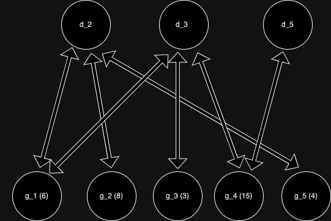

[TOC]

## Solution

---

### Overview

The problem provides an array of integers `nums` of length `n`, with $1 \le \text{nums}[i] \le \text{MAX}_{VAL} = 100000$. You can jump between two indices `i` and `j` if the gcd (greatest common divisor) between the two values at indices `i` and `j` is strictly greater than 1. Determine if every pair of indices can reach each other using any sequence of jumps.
MagentaCobra marked this conversation as resolved.

---

### Approach 1: Creating a graph with dummy nodes and edges

#### Intuition

First, we should notice that this is a graph problem. The ability to jump between indices `i` and `j` is analogous to an edge between nodes `i` and `j`. With this in mind, we can restate the problem as a graph problem formally with the following:

Given a graph of `n` nodes with undirected edges `(i, j)` if and only if $gcd(\text{nums}[i], \text{nums}[j]) > 1$, determine if all nodes are reachable from each other. Note that edges are undirected because $gcd(\text{nums}[i], \text{nums}[j]) = gcd(\text{nums}[j], \text{nums}[i])$.

If all nodes can reach each other, this means that all nodes must be in one connected component. Rather than checking every pair of nodes to see if they can reach each other, it suffices to check if all nodes belong in the same connected component. This is because if more than one component exists in this graph, then two nodes from two different components cannot reach each other.

Unfortunately, this graph can have $n(n-1)/2 = O(n^{2})$ edges in the worst case. Imagine if all numbers in the array were even. Then the gcd between any two indices is at least 2, so the graph would be complete and have too many edges. With the goal of creating a graph that is efficient enough to construct in the time limit, let's consider adding some dummy nodes to reduce the number of edges.

In addition to the original `n` nodes, add a dummy node for each prime number not exceeding $\text{MAX}_{VAL}$ (the max value of $\text{nums}[i]$). Let’s define $g_{i}$ as a node corresponding to the `i`th index of `nums`, and $d_{p}$ as the dummy node corresponding to prime number `p`. If $\text{nums}[i]$ is divisible by prime factor `p`, build an edge between $g_{i}$ and $d_{p}$.

Any two original nodes connected in the naive graph will stay connected in this new graph. Likewise, nodes that initially were in different components stay in different components. As a result, we can check if this new graph is connected. This works because $gcd(\text{nums}[i], \text{nums}[j]) > 1$ is another way of saying that $\text{nums}[i]$ and $\text{nums}[j]$ share a prime factor, so nodes $g_{i}$ and $g_{j}$ will be connected via dummy node $d_{p}$, where $d_{p}$ is any prime factor of $gcd(\text{nums}[i], \text{nums}[j])$.

Here is the graph for `nums = [6, 8, 3, 15, 4]`. For simplicity, only dummy nodes for prime factors 2, 3, and 5 are shown.



Note that in implementation, you can construct the graph slightly differently by creating non-dummy nodes for each value that appears in `nums`.

#### Algorithm

1. Handle the edge cases, if $n = 1$, return `true`, if $\text{nums}[i] = 1$, return `false`.
2. Create an array of length $\text{MAX}_{VAL}$, with all elements initialized to `false`, and use the sieve of Eratosthenes to compute prime factors for all integers 1 to $\text{MAX}_{VAL}$.
3. For each element $\text{nums}[i]$, iterate over all its prime factors, and for each prime factor $d_{i}$ and add an edge between nodes $g_{i}$ and $d_{p}$.
4. Once constructing the graph, count the number of components.
5. Return `true` if the graph has one component, and `false` otherwise.

#### Implementation

```python
class Solution:

    def canTraverseAllPairs(self, nums):
        MAX = max(nums)
        N = len(nums)
        has = [False] * (MAX + 1)
        for x in nums:
            has[x] = True

        # edge cases
        if N == 1:
            return True
        if has[1]:
            return False

        # the general solution
        sieve = [0] * (MAX + 1)
        for d in range(2, MAX + 1):
            if sieve[d] == 0:
                for v in range(d, MAX + 1, d):
                    sieve[v] = d

        union = DSU(2 * MAX + 1)
        for x in nums:
            val = x
            while val > 1:
                prime = sieve[val]
                root = prime + MAX
                if union.find(root) != union.find(x):
                    union.merge(root, x)
                while val % prime == 0:
                    val //= prime

        cnt = 0
        for i in range(2, MAX + 1):
            if has[i] and union.find(i) == i:
                cnt += 1
        return cnt == 1

class DSU:

    def __init__(self, N):
        self.dsu = list(range(N + 1))
        self.size = [1] * (N + 1)

    def find(self, x):
        return x if self.dsu[x] == x else self.find(self.dsu[x])

    def merge(self, x, y):
        fx = self.find(x)
        fy = self.find(y)
        if fx == fy:
            return
        if self.size[fx] > self.size[fy]:
            fx, fy = fy, fx
        self.dsu[fx] = fy
        self.size[fy] += self.size[fx]
```

#### Complexity Analysis

There are less than $\text{MAX}_{VAL}$ additional dummy nodes, and because any integer at most $\text{MAX}_{VAL}$ will have at most 6 distinct prime factors, the graph will have at most 6`n` edges. To iterate over all prime factors efficiently, we can consider the harmonic series, or use the sieve of Eratosthenes algorithm to build this graph in $O(n log(\text{MAX}_{VAL}))$ with `O(n)` memory. Checking the connectivity of this graph can be done with either BFS/DFS or union find, which can be done in `O(n)`.

* Time complexity: $O(n*log(MAX\_VAL))$.

* Space complexity: $O(n)$.

The time complexity of union find (DSU) can be treated as `O(n)` only when both path-compression and rank-by-size are applied, which is used in the above solution code.
The time complexity of the Union-Find with path compression and union can be described using Ackermann's function, $A(m, n)$, in practice, it can be approximated as $O(n)$.

---