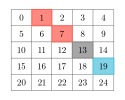

### 1. Description

Given a 2D `grid` of size `m x n`, you should find the matrix `answer` of size `m x n`.

The cell $\text{answer}[r][c]$ is calculated by looking at the diagonal values of the cell $\text{grid}[r][c]$:

- Let $\text{leftAbove}[r][c]$ be the number of **distinct** values on the diagonal to the left and above the cell $\text{grid}[r][c]$ not including the cell $\text{grid}[r][c]$ itself.

- Let $\text{rightBelow}[r][c]$ be the number of **distinct** values on the diagonal to the right and below the cell $\text{grid}[r][c]$, not including the cell $\text{grid}[r][c]$ itself.

- Then $\text{answer}[r][c] = |\text{leftAbove}[r][c] - \text{rightBelow}[r][c]|$.

A **matrix diagonal** is a diagonal line of cells starting from some cell in either the topmost row or leftmost column and going in the bottom-right direction until the end of the matrix is reached.

- For example, in the below diagram the diagonal is highlighted using the cell with indices `(2, 3)` colored gray:

		- Red-colored cells are left and above the cell.

- Blue-colored cells are right and below the cell.

Return the matrix `answer`.

### 2. Function Contract

**Inputs**

- `grid`: Input parameter (`List[List[int]]`).

**Return value**

- Returns `List[List[int]]`.

### 3. Examples

#### Example 1

- **Input:** grid = [[1,2,3],[3,1,5],[3,2,1]]

- **Output:** Output: [[1,1,0],[1,0,1],[0,1,1]]

- **Explanation:** To calculate the `answer` cells:

<table>
	<thead>
		<tr>
			<th>answer</th>
			<th>left-above elements</th>
			<th>leftAbove</th>
			<th>right-below elements</th>
			<th>rightBelow</th>
			<th>|leftAbove - rightBelow|</th>
		</tr>
	</thead>
	<tbody>
		<tr>
			<td>[0][0]</td>
			<td>[]</td>
			<td>0</td>
			<td>[grid[1][1], grid[2][2]]</td>
			<td>|{1, 1}| = 1</td>
			<td>1</td>
		</tr>
		<tr>
			<td>[0][1]</td>
			<td>[]</td>
			<td>0</td>
			<td>[grid[1][2]]</td>
			<td>|{5}| = 1</td>
			<td>1</td>
		</tr>
		<tr>
			<td>[0][2]</td>
			<td>[]</td>
			<td>0</td>
			<td>[]</td>
			<td>0</td>
			<td>0</td>
		</tr>
		<tr>
			<td>[1][0]</td>
			<td>[]</td>
			<td>0</td>
			<td>[grid[2][1]]</td>
			<td>|{2}| = 1</td>
			<td>1</td>
		</tr>
		<tr>
			<td>[1][1]</td>
			<td>[grid[0][0]]</td>
			<td>|{1}| = 1</td>
			<td>[grid[2][2]]</td>
			<td>|{1}| = 1</td>
			<td>0</td>
		</tr>
		<tr>
			<td>[1][2]</td>
			<td>[grid[0][1]]</td>
			<td>|{2}| = 1</td>
			<td>[]</td>
			<td>0</td>
			<td>1</td>
		</tr>
		<tr>
			<td>[2][0]</td>
			<td>[]</td>
			<td>0</td>
			<td>[]</td>
			<td>0</td>
			<td>0</td>
		</tr>
		<tr>
			<td>[2][1]</td>
			<td>[grid[1][0]]</td>
			<td>|{3}| = 1</td>
			<td>[]</td>
			<td>0</td>
			<td>1</td>
		</tr>
		<tr>
			<td>[2][2]</td>
			<td>[grid[0][0], grid[1][1]]</td>
			<td>|{1, 1}| = 1</td>
			<td>[]</td>
			<td>0</td>
			<td>1</td>
		</tr>
	</tbody>
</table>

#### Example 2

- **Input:** grid = [[1]]

- **Output:** Output: [[0]]

### 4. Constraints

- $m = \text{grid.length}$

- $n = \text{grid}[i].length$

- $1 \le m, n, \text{grid}[i][j] \le 50$
