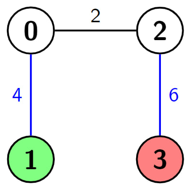
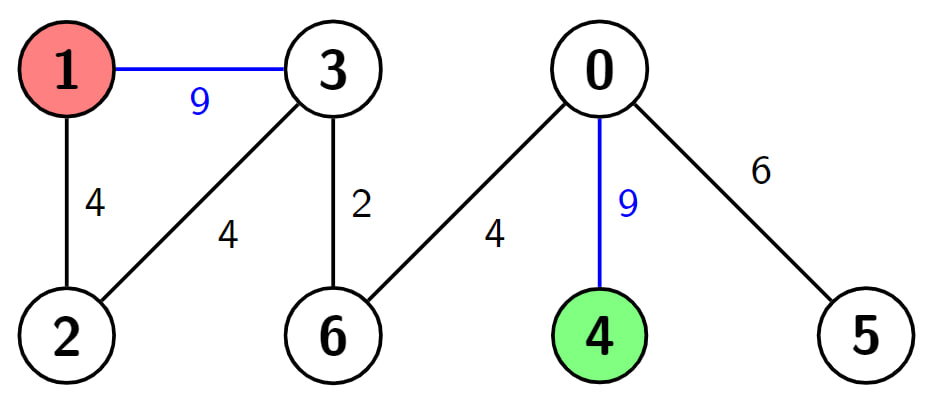
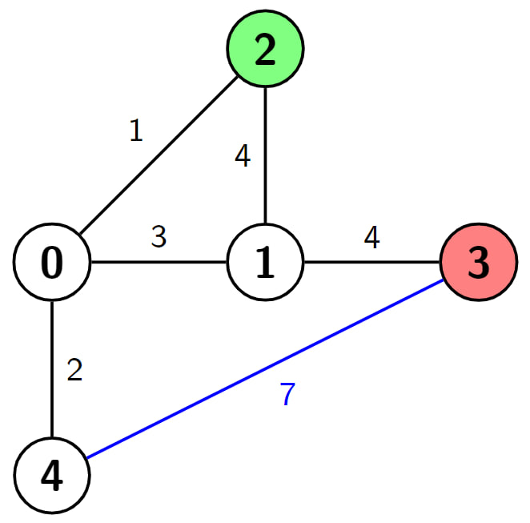

## Description

You are given a positive integer `n` which is the number of nodes of a **0-indexed undirected weighted connected** graph and a **0-indexed** **2D array** `edges` where $\text{edges}[i] = [u_{i}, v_{i}, w_{i}]$ indicates that there is an edge between nodes $u_{i}$ and $v_{i}$ with weight $w_{i}$.

You are also given two nodes `s` and `d`, and a positive integer `k`, your task is to find the **shortest** path from `s` to `d`, but you can hop over **at most** `k` edges. In other words, make the weight of **at most** `k` edges `0` and then find the **shortest** path from `s` to `d`.

Return *the length of the **shortest** path from *`s`* to *`d`* with the given condition*.
### Function Contract

- Refer to method signature.

### Examples

#### Example 1

- **Input:** $n = 4, edges = [[0,1,4],[0,2,2],[2,3,6]], s = 1, d = 3, k = 2$
- **Output:** `2`
- **Explanation:** In this example there is only one path from node 1 (the green node) to node 3 (the red node), which is (1->0->2->3) and the length of it is 4 + 2 + 6 = 12. Now we can make weight of two edges 0, we make weight of the blue edges 0, then we have 0 + 2 + 0 = 2. It can be shown that 2 is the minimum length of a path we can achieve with the given condition.

#### Example 2

- **Input:** $n = 7, edges = [[3,1,9],[3,2,4],[4,0,9],[0,5,6],[3,6,2],[6,0,4],[1,2,4]], s = 4, d = 1, k = 2$
- **Output:** `6`
- **Explanation:** In this example there are 2 paths from node 4 (the green node) to node 1 (the red node), which are (4->0->6->3->2->1) and (4->0->6->3->1). The first one has the length 9 + 4 + 2 + 4 + 4 = 23, and the second one has the length 9 + 4 + 2 + 9 = 24. Now if we make weight of the blue edges 0, we get the shortest path with the length 0 + 4 + 2 + 0 = 6. It can be shown that 6 is the minimum length of a path we can achieve with the given condition.

#### Example 3

- **Input:** $n = 5, edges = [[0,4,2],[0,1,3],[0,2,1],[2,1,4],[1,3,4],[3,4,7]], s = 2, d = 3, k = 1$
- **Output:** `3`
- **Explanation:** In this example there are 4 paths from node 2 (the green node) to node 3 (the red node), which are (2->1->3), (2->0->1->3), (2->1->0->4->3) and (2->0->4->3). The first two have the length 4 + 4 = 1 + 3 + 4 = 8, the third one has the length 4 + 3 + 2 + 7 = 16 and the last one has the length 1 + 2 + 7 = 10. Now if we make weight of the blue edge 0, we get the shortest path with the length 1 + 2 + 0 = 3. It can be shown that 3 is the minimum length of a path we can achieve with the given condition.

### Constraints

- $2 \le n \le 500$

- $n - 1 \le \text{edges.length} \le min(10^{4}, n * (n - 1) / 2)$

- $\text{edges}[i].length = 3$

- $0 \le \text{edges}[i][0], \text{edges}[i][1] \le n - 1$

- $1 \le \text{edges}[i][2] \le 10^{6}$

- $0 \le s, d, k \le n - 1$

- $s \neq d$

- The input is generated such that the graph is **connected** and has **no** **repeated edges** or **self-loops**