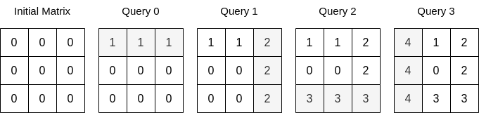
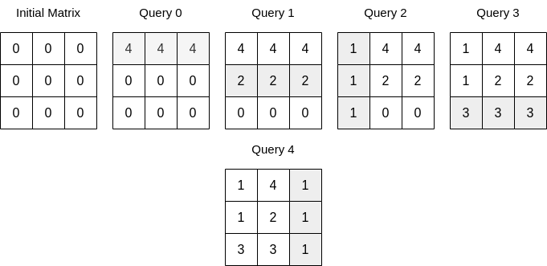

## Description

You are given an integer `n` and a **0-indexed** **2D array** `queries` where $\text{queries}[i] = [\text{type}_{i}, \text{index}_{i}, \text{val}_{i}]$.

Initially, there is a **0-indexed** `n x n` matrix filled with `0`'s. For each query, you must apply one of the following changes:

- if $\text{type}_{i} = 0$, set the values in the row with $\text{index}_{i}$ to $\text{val}_{i}$, overwriting any previous values.

- if $\text{type}_{i} = 1$, set the values in the column with $\text{index}_{i}$ to $\text{val}_{i}$, overwriting any previous values.

Return *the sum of integers in the matrix after all queries are applied*.
### Function Contract

- `n`: Input parameter.
- Returns expected result.

### Examples

#### Example 1

- **Input:** $n = 3, queries = [[0,0,1],[1,2,2],[0,2,3],[1,0,4]]$
- **Output:** `23`
- **Explanation:** The image above describes the matrix after each query. The sum of the matrix after all queries are applied is 23.
#### Example 2

- **Input:** $n = 3, queries = [[0,0,4],[0,1,2],[1,0,1],[0,2,3],[1,2,1]]$
- **Output:** `17`
- **Explanation:** The image above describes the matrix after each query. The sum of the matrix after all queries are applied is 17.
### Constraints

- $1 \le n \le 10^{4}$

- $1 \le \text{queries.length} \le 5 * 10^{4}$

- $\text{queries}[i].length = 3$

- $0 \le \text{type}_{i} \le 1$

- $0 \le \text{index}_{i} < n$

- $0 \le \text{val}_{i} \le 10^{5}$