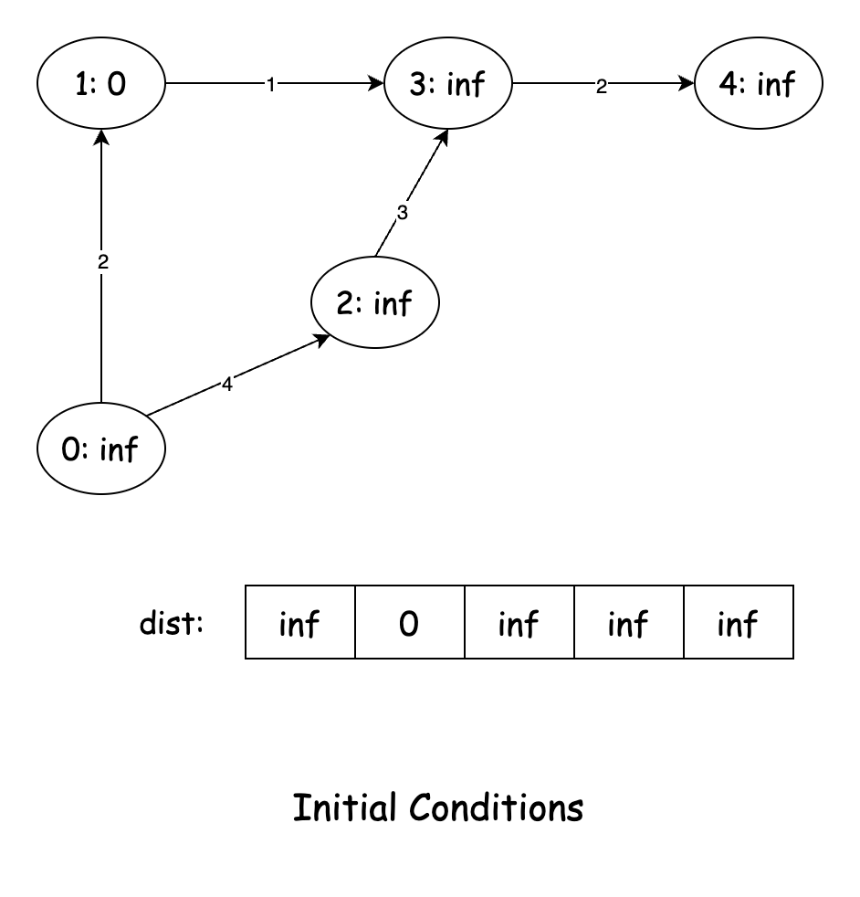
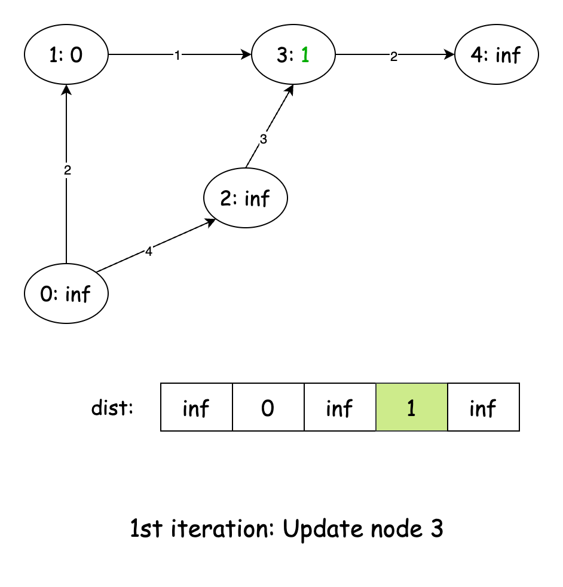
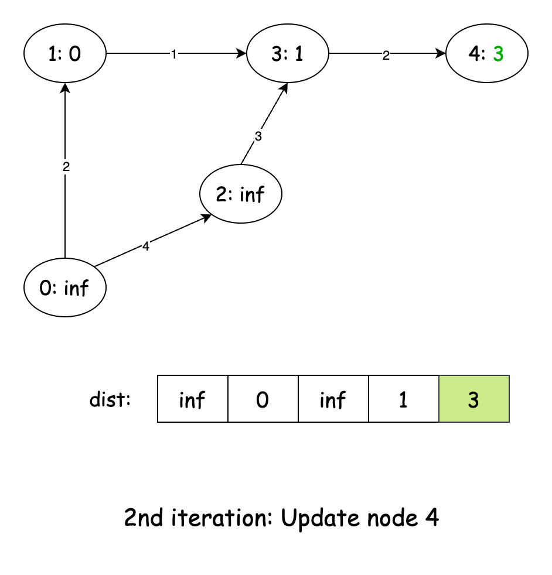
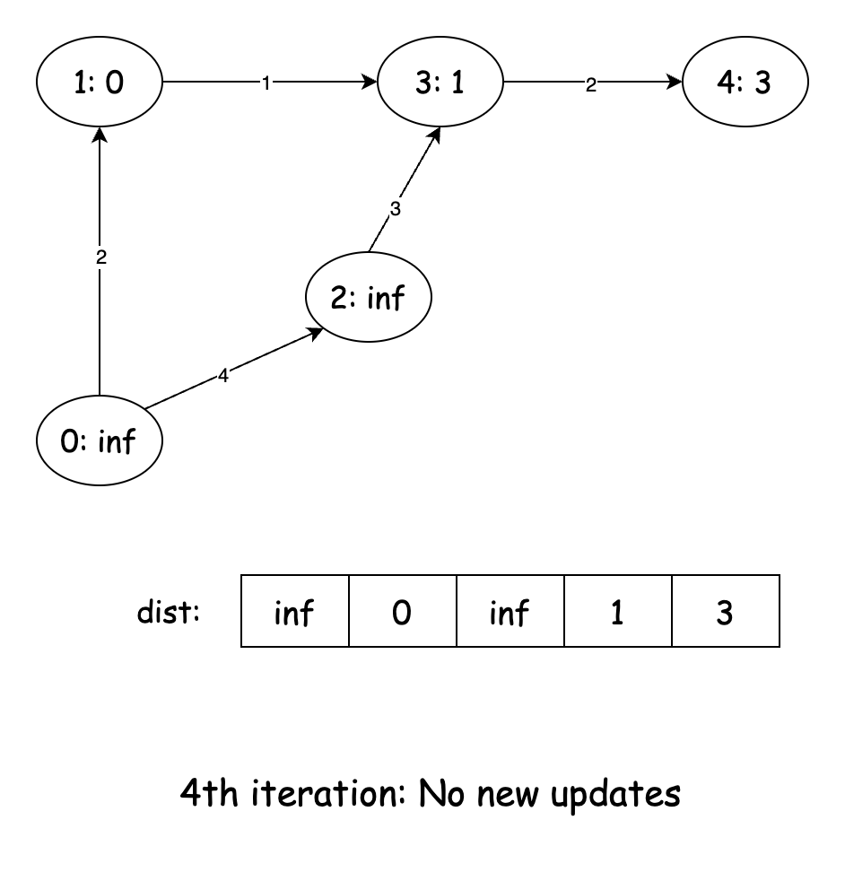

## Solution

---

### Approach 1: Dijkstra's Algorithm

#### Intuition

We are given a directed weighted graph and a starting node `s`. Our task is to find the node closest to `s` from the nodes given in another array `marked`.

When solving shortest-path problems in graphs, the first algorithm that comes to mind is Dijkstra’s Algorithm. This well-known approach is especially effective for finding the shortest distance from a source node to other nodes in a weighted graph, as long as all edge weights are non-negative.

The core idea behind Dijkstra’s Algorithm is to explore the graph outward from the source node, always moving in order of increasing distance. This greedy strategy ensures that once we reach a node, we have found the shortest possible path to it.

Consider how we might approach this problem intuitively. Starting at node `s`, we want to explore paths that are most promising first - those with the smallest total distance so far. For each step of our journey, we'd want to know: "Of all the nodes I could visit next, which one can I reach with the minimum distance?" After visiting that node, we'd update our knowledge about its neighbors and repeat the process.

Dijkstra’s Algorithm achieves this by maintaining two key data structures:
- An array `dist`, which stores the shortest known distance from `s` to each node. Initially, all values in `dist` are set to infinity, except for `s`, which is set to 0.
- A priority queue (min-heap) that helps efficiently select the next node to visit. Each entry in the queue consists of two values: `[current_distance, current_node]`, with nodes always processed in order of increasing distance.

We begin by inserting the source node into the priority queue. At each step, we extract the node with the smallest distance and check its neighbors. If the path through this node offers a shorter distance to a neighbor than what is currently recorded in `dist`, we update `dist` and add the neighbor to the queue for further exploration.

One micro optimization for our specific problem is that we don't actually need to find the shortest paths to all nodes. Since we're only interested in finding the minimum distance to any marked node, we can terminate our search as soon as we encounter the first marked node during our exploration. This is because Dijkstra always processes nodes in order of increasing distance from the source. So if the first marked node we encounter has a distance of 10, no other marked node that we haven't processed yet can have a shorter distance.

#### Algorithm

- Initialize a set `markSet` to store the marked nodes.
- Add each node in the marked array to `markSet`.
- Initialize an adjacency list representation `adj` as a list of lists containing integer arrays.
- For each `edge` in the `edges` list:
  - Get the source node ($\text{edge}[0]$) and add an array containing the destination node ($\text{edge}[1]$) and weight ($\text{edge}[2]$) to its adjacency list.
- Initialize an integer array `dist` of size `n`.
  - Fill the `dist` array with infinity.
- Set the distance to the starting node `s` as `0`.
- Initialize a priority queue `minHeap` that prioritizes elements based on the first value of the array.
- Add the starting node `s` to the `minHeap` as an array `[0, s]`.
- While `minHeap` is not empty:
  - Poll the `node` with the minimum `distance` from the `minHeap`.
  - If the current `node` is in the `markSet`:
- Return the distance to this node as we've found a marked node.
  - For each `edge` connected to the current node:
- Extract the `nextNode` and the `weight` of the `edge`.
- Calculate the new distance as the sum of the current `distance` and the edge `weight`.
- If this new distance is less than the previously recorded distance to the next node:
      - Update the distance array with the new distance.
      - Add `nextNode` with its new distance to the `minHeap`.
- If the algorithm completes without finding any marked node:
  - Return `-1` indicating no path exists from `s` to any marked node.

#### Implementation

```python
class Solution:
    def minimumDistance(
        self, n: int, edges: list[list[int]], s: int, marked: list[int]
    ) -> int:
        # Convert marked array to set for O(1) lookups
        mark_set = set(marked)

        # Build adjacency list representation of the graph
        adj = defaultdict(list)
        for u, v, w in edges:
            adj[u].append((v, w))

        # Distance dictionary initialized only for `s`
        dist = {s: 0}

        # Min heap prioritized by distance
        min_heap = [(0, s)]

        # Dijkstra's algorithm
        while min_heap:
            distance, node = heapq.heappop(min_heap)

            # Found a marked node, return its distance
            if node in mark_set:
                return dist[node]

            # Explore neighbors
            for next_node, weight in adj[node]:
                new_dist = distance + weight

                # If we found a shorter path, update and add to the priority queue
                if new_dist < dist.get(next_node, float("inf")):
                    dist[next_node] = new_dist
                    heapq.heappush(min_heap, (new_dist, next_node))

        # No path found to any marked node
        return -1
```

#### Complexity Analysis

Let $n$ be the number of nodes and $m$ be the number of edges in the graph.

- Time complexity: $O(n + m \log m)$

    The algorithm begins by converting the `marked` array into a set, which takes $O(n)$ time. Then, it constructs the adjacency list representation of the graph, which takes $O(m)$ time, as each edge is added once.

    The main part of the algorithm is Dijkstra’s shortest path computation using a min-heap (priority queue). Unlike the standard Dijkstra's implementation that uses a visited set or decrease-key operation to prevent pushing multiple entries for the same node, this version may push the same node multiple times when shorter paths are found.

    Since each edge can potentially lead to a new entry in the heap, the number of heap operations is $O(m)$, and each operation (push or pop) costs $O(\log m)$. Therefore, the total time spent on heap operations is $O(m \log m)$. Adding the initial setup, the overall time complexity is: $O(n + m \log m)$

- Space complexity: $O(n + m)$

    The adjacency list representation of the graph requires $O(n + m)$ space, where each node stores a list of its edges. The distance array takes $O(n)$ space, and the priority queue stores at most $O(n)$ elements, leading to an additional $O(n)$ space usage. The marked set also requires $O(n)$ space in the worst case. Thus, the total space complexity is $O(n + m)$.

---

### Approach 2: Bellman–Ford Algorithm

#### Intuition

Dijkstra’s Algorithm is a great choice for finding shortest paths in graphs with non-negative edge weights, but it fails when negative weights are involved. The Bellman-Ford Algorithm, on the other hand, is designed to handle graphs with negative weights, making it more general. While we don't have negative weights in this problem, understanding Bellman-Ford helps us see an alternative approach that works under broader conditions.

The core idea behind Bellman-Ford is straightforward: in a graph with `n` nodes, the shortest path between any two nodes can have at most $n - 1$ edges. If a path has `n` or more edges, it must contain a cycle. Since we're only interested in simple paths (paths without cycles), we never need more than $n - 1$ edges to reach any node optimally.

Now, let’s apply this to our problem. We start at node `s` and want to determine the shortest path to any node in the `marked` array. Instead of immediately finding the best path, Bellman-Ford gradually refines our understanding of distances by repeatedly considering all edges in the graph.

To implement this approach, we first initialize an array `dist`, where $\text{dist}[i]$ represents the shortest known distance from `s` to node `i`. Initially, all values are set to infinity (or a very large number), except for `s`, which starts at `0` since it takes no cost to reach itself. This setup reflects our initial knowledge: we know how to reach `s` but have no information about the shortest paths to other nodes.

The algorithm’s core operation is **edge relaxation**. This means checking every edge `(u, v, weight)` in the graph and updating $\text{dist}[v]$ if we find a shorter path to `v` through `u`. If $\text{dist}[u] + weight < \text{dist}[v]$, we update $\text{dist}[v]$. This process is repeated exactly $n - 1$ times because, in the worst case, the shortest path to any node may require $n - 1$ edges.

Why $n - 1$ iterations? The first pass ensures that we find the shortest one-edge paths. The second pass builds on that, discovering the shortest two-edge paths, and so on. By the time we've repeated this process $n - 1$ times, all shortest paths have been fully propagated throughout the graph.

Here's a slideshow to demonstrate how the `dist` array is filled between each relaxation loop:










At this point, `dist` contains the shortest distance from `s` to every other node. But our goal is not to find all shortest paths, only the shortest distance to a `marked` node. To get our final answer, we simply look at all nodes in the `marked` array and find the smallest distance among them. If all marked nodes still have infinite distance, it means they are unreachable from `s`, so we return `-1`.

#### Algorithm

- Initialize an integer array `dist` of size `n` to track the shortest distance from the source to each node.
  - Fill the `dist` array with infinity to represent unreachable nodes initially.
- Set the distance to the starting node `s` as `0`.
- Iterate over all the edges in the graph $n - 1$ times:
  - For each iteration, loop through all the edges in the graph:
- For each edge, extract the source node (`from`), the destination node (`to`), and the `weight`.
- If the current node is reachable ($\text{dist}[from] \neq infinity$) and we can improve the path to the destination node through the current node:
      - Update the distance to the destination node with the new path.
- Initialize a variable `minDist` to infinity to track the minimum distance to any marked node.
- For each `node` in the `marked` array:
  - If the distance to this marked `node` is less than the current minimum distance, update `minDist`.
- Return `-1` if no path exists (`minDist` is still infinity), otherwise return the minimum distance.

#### Implementation

```python
class Solution:
    def minimumDistance(
        self, n: int, edges: list[list[int]], s: int, marked: list[int]
    ) -> int:
        # Initialize distances array with maximum values
        dist = [float("inf")] * n
        dist[s] = 0

        # Bellman-Ford algorithm: relax edges n-1 times
        for _ in range(n - 1):
            for from_node, to_node, weight in edges:
                # Relaxation step: if we can improve the path to 'to_node' via 'from_node'
                if (
                    dist[from_node] != float("inf")
                    and dist[from_node] + weight < dist[to_node]
                ):
                    dist[to_node] = dist[from_node] + weight

        # Find minimum distance to any marked node
        min_dist = min((dist[node] for node in marked), default=float("inf"))

        # Return -1 if no path exists, otherwise return the minimum distance
        return -1 if min_dist == float("inf") else min_dist
```

#### Complexity Analysis

Let $n$ be the number of nodes and $m$ be the number of edges in the graph.

- Time complexity: $O(n \cdot m)$

    The Bellman-Ford algorithm performs $n - 1$ iterations, and in each iteration, it examines all $m$ edges in the graph. This results in a time complexity of $O(n \cdot m)$. After the Bellman-Ford algorithm completes, the code iterates through the marked array once to find the minimum distance, which takes $O(|marked|)$ time. Since $\text{|marked|} \leq n$, the overall time complexity is dominated by the Bellman-Ford algorithm, resulting in $O(n \cdot m)$.

- Space complexity: $O(n)$

    The space complexity is determined by the storage requirements for the distance array, which has size $n$. No additional data structures with significant space requirements are used in this implementation. Therefore, the overall space complexity is $O(n)$.

---

### Approach 3: Shortest Path Faster Algorithm (SPFA)

#### Intuition

Now, let's explore a lesser-known but powerful algorithm called the Shortest Path Faster Algorithm (SPFA). This algorithm is an optimization of Bellman-Ford and combines ideas from both Bellman-Ford and Breadth-First Search (BFS) to achieve better performance in many cases.

To understand SPFA, let’s consider why Bellman-Ford can be inefficient. When relaxing edges in the Bellman-Ford algorithm, many iterations might not lead to any improvements in the distance values. SPFA addresses this inefficiency by only considering nodes whose distances have been updated recently, as only these nodes have the potential to update their neighbors.

Think of it like a road network: if the estimated travel time to a city changes, it might affect nearby cities but not those farther away. SPFA follows this natural flow of information by recalculating routes only through cities whose travel times have changed.

The key idea behind SPFA is that a node’s outgoing edges need to be checked only if its shortest known distance has been updated. To achieve this, SPFA maintains a queue of "active" nodes i.e., nodes that have recently had their shortest distances improved. When we improve the distance to a node, we add it to the queue (if it's not already there). Then, we process the queue by repeatedly:
1. Removing a node from the queue.
2. Exploring all its outgoing edges, potentially updating distances to neighbors.
3. Adding any neighbor whose distance was improved to the queue.

Along with the queue and the distance array used in the Bellman-Ford Algorithm, SPFA also maintains a boolean array to track which nodes are currently in the queue. During relaxation, we only add nodes that are not currently enqueued to prevent duplicate entries.

Once the queue is empty, the shortest paths from the source to all reachable nodes have been found. The final step is to check the distances of all `marked` nodes and return the smallest among them.

What makes SPFA particularly useful is that it adapts to the structure of the graph. In sparse graphs or graphs where the shortest paths are discovered quickly, SPFA can be significantly faster than the standard Bellman-Ford algorithm. However, it's worth noting that SPFA doesn't improve the worst-case time complexity – in worst-case scenarios, a node might enter the queue multiple times, potentially up to the number of edges in the graph.

> For a more comprehensive understanding of various graph algorithms like Dijkstra's, Bellman-Ford, and SPFA, check out the [Graph Explore Card](https://leetcode.com/explore/learn/card/graph/622/single-source-shortest-path-algorithm/). This resource provides an in-depth look at popular graph algorithms, explaining their key concepts and applications with a variety of problems to solidify understanding of the pattern.

#### Algorithm

- Initialize a list of lists of pairs called `graph` to represent the adjacency list.
- Build the graph by iterating through each edge in the edges list:
  - Extract the source node (`from`), the destination node (`to`), and the weight.
  - Add an array containing the destination node and weight to the source node's adjacency list.
- Initialize an integer array `dist` of size `n` to track distances from the source.
- Fill the `dist` array with infinity.
- Set the distance to the starting node `s` as `0`.
- Initialize a `queue` to implement the SPFA algorithm.
- Add the source node `s` to the `queue`.
- Initialize a boolean array `inQueue` of size `n` to track which nodes are currently in the `queue`.
- Mark the source node as being in the `queue`.
- While the `queue` is not empty:
  - Remove the front node from the `queue` and store it in `current`.
  - Mark the `current` node as no longer in the `queue`.
  - For each neighbor of `current`:
- Extract the `nextNode` and the `weight` of the edge.
- Perform the relaxation step: if we can improve the path to the neighbor via the current node, update the distance.
- If the neighbor is not already in the `queue`, add it and mark it as being in the `queue`.
- Initialize a variable `minDist` to infinity to track the minimum distance to any marked node.
- For each node in the `marked` array:
  - Update `minDist` to be the minimum of its current value and the distance to this marked node.
- Return `-1` if no path exists (`minDist` is still infinity), otherwise return the minimum distance.

#### Implementation

```python
class Solution:
    def minimumDistance(
        self, n: int, edges: list[list[int]], s: int, marked: list[int]
    ) -> int:
        # Adjacency list representation
        graph = defaultdict(list)

        # Build the graph
        for from_node, to_node, weight in edges:
            graph[from_node].append((to_node, weight))

        # Distance array
        dist = [float("inf")] * n
        dist[s] = 0

        queue = deque([s])

        # Track nodes in queue
        in_queue = [False] * n
        in_queue[s] = True

        while queue:
            current = queue.popleft()
            in_queue[current] = False

            # Explore neighbors
            for next_node, weight in graph[current]:
                # Relaxation step
                if dist[next_node] > dist[current] + weight:
                    dist[next_node] = dist[current] + weight

                    # Add to queue if not already in queue
                    if not in_queue[next_node]:
                        queue.append(next_node)
                        in_queue[next_node] = True

        # Find minimum distance to any marked node
        min_dist = min((dist[node] for node in marked), default=float("inf"))

        return -1 if min_dist == float("inf") else min_dist
```

#### Complexity Analysis

Let $n$ be the number of nodes and $m$ be the number of edges in the graph.

- Time complexity: $O(n \cdot m)$

    In the worst case, each node could be enqueued and dequeued up to $O(n)$ times, and for each dequeue operation, we examine all adjacent edges. Building the adjacency list takes $O(n + m)$ time. The queue operations in the main algorithm could result in up to $O(n \cdot m)$ operations in the worst case, as each edge might cause a node to be added to the queue multiple times. Finally, iterating through the marked array to find the minimum distance takes $O(\text{|marked|})$ time, which is bounded by $O(n)$.

    Therefore, the overall time complexity is dominated by the SPFA implementation, resulting in $O(n \cdot m)$.

- Space complexity: $O(n + m)$

    The space complexity includes several components. The adjacency list representation of the graph requires $O(n + m)$ space to store all nodes and their edges. The distance array and the `inQueue` boolean array each require $O(n)$ space. The queue can contain at most $n$ nodes at any time, requiring $O(n)$ space. Therefore, the overall space complexity is $O(n + m)$.

---