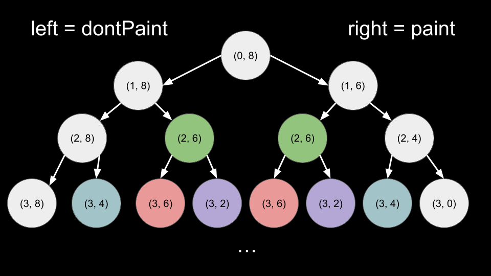

[TOC]

## Solution

---

### Approach 1: Top-Down Dynamic Programming

**Intuition**

> **Note.** For this approach, we assume that you already know the fundamentals of dynamic programming and are figuring out how to apply it to a wide range of problems, such as this one. If you are not yet at this stage, we recommend checking out our relevant [Explore Card content on dynamic programming](https://leetcode.com/explore/featured/card/dynamic-programming/) before coming back to this problem.

Intuitively, we want to put the paid painter on walls that cost less and take longer to paint. The longer the paid painter paints, the more we can make use of the free painter. It seems extremely difficult to formulate a greedy approach since decisions will cascade on top of each other. Which walls do we pay for? Which walls do we have the free painter paint?

Given the constraints $n \leq 500$, we should try a dynamic programming approach, which will consider all possible decisions.

Let's say that we have the paid painter paint the $i^{th}$ wall. It costs us $\text{cost}[i]$ money. The paid painter will paint `1` wall and be occupied for $\text{time}[i]$ time. While the paid painter is occupied, the free painter can paint $\text{time}[i]$ walls (since the free painter paints one wall per unit of time). Overall, we spent $\text{cost}[i]$ money to paint $1 + \text{time}[i]$ walls.

This is a variation of the classic knapsack problem. The $i^{th}$ item costs $\text{\text{cost}[i]}$ and paints $1 + \text{\text{time}[i]}$ walls. We need to paint $n$ walls while minimizing the total cost.

Let `dp(i, remain)` be a function that returns the minimum cost to paint `remain` walls when considering index `i` and beyond. We have two base cases here.

1. If $remain \le 0$, we have painted all the walls. We can `return 0`.
2. If $i = n$, we have run out of walls to put the paid painter on and the task is impossible. We return a large value like infinity.

Now, how do we calculate a given state `(i, remain)`? For the $i^{th}$ wall, we have two options. We can either hire the paid painter for this wall or not hire them.

1. If we hire them, as mentioned above, we spend $\text{cost}[i]$ and paint $1 + \text{time}[i]$ walls. Then, we move to the next index. Thus, the cost of this option is $\text{cost}[i] + dp(i + 1, remain - 1 - \text{time}[i])$.
2. If we don't hire them, we simply move to the next index. The cost of this option is $dp(i + 1, remain)$.

Let's call the first option `paint` and the second option `dontPaint`. Then, $dp(i, remain) = min(paint, dontPaint)$.

This recursive approach is correct, but has an exponential time complexity because each `dp` call creates two more `dp` calls, some of which may have already been calculated. We must memoize our function to avoid repeated computation:


<br>

In the above image, states in color are calculated multiple times. In Java/C++, we will use a `memo` table to cache results. In Python, we will use [@functools.cache](https://docs.python.org/3/library/functools.html#functools.cache) to memoize our function.

The solution to the original problem will be `dp(0, n)`. We consider all walls starting from index `0` and beyond, and we need to paint a total of `n` walls.

**Algorithm**

1. Let $n = \text{cost.length}$.
2. Define a memoized function `dp(i, remain)`:
- If $remain \le 0$, then `return 0`.
- If $i = n$, then return a very large value.
- Set $paint = \text{cost}[i] + dp(i + 1, remain - 1 - \text{time}[i])$.
- Set $dontPaint = dp(i + 1, remain)$.
- Return `min(paint, dontPaint)`.
3. Return `dp(0, n)`.

**Implementation**

```python
class Solution:
    def paintWalls(self, cost: List[int], time: List[int]) -> int:
        @cache
        def dp(i, remain):
            if remain <= 0:
                return 0
            if i == n:
                return inf

            paint = cost[i] + dp(i + 1, remain - 1 - time[i])
            dont_paint = dp(i + 1, remain)
            return min(paint, dont_paint)

        n = len(cost)
        return dp(0, n)
```

**Complexity Analysis**

Given $n$ as the length of `cost` and `time`,

* Time complexity: $O(n^2)$

    `i` ranges from `0` to `n` and `remain` ranges from `n` to `0`. Thus, there are $O(n^2)$ states. Each state is calculated only once due to memoization. To calculate a state, we simply check two options `paint` and `dontPaint`, which costs $O(1)$.

* Space complexity: $O(n^2)$

    We use some space for the recursion call stack, but it is dominated by the space used to memoize our function, which is equal to the number of states. There are $O(n^2)$ states.

<br/>

---

### Approach 2: Bottom-Up Dynamic Programming

**Intuition**

We can implement the same algorithm iteratively. In top-down, we start at the answer $(i = 0, remain = n)$ and work our way down to the base cases:

1. $remain \le 0$
2. $i = n$

In bottom-up, we will start from these base cases and iterate toward the answer. We will use a table `dp` which is equivalent to the function from the previous approach. Here, $\text{dp}[i][remain]$ is equal to `dp(i, remain)` from the previous approach.

We have a for loop for `i` starting from $n - 1$ and iterating to `0`. Then we have a nested for loop for `remain` starting from `1` and iterating to `n`. At each inner loop iteration, we have a state `i, remain`. We can calculate this state the same way we did in the previous approach - by calculating `paint` and `dontPaint`.

Note that when we calculate `paint`, $remain - 1 - \text{time}[i]$ may be less than `0`, which would cause an index out-of-bound error. We can solve this by using $max(0, remain - 1 - \text{time}[i])$ as an index, so any negative value is converted to `0`. Because the base case is $remain \le 0$, this will not affect the calculations.

**Algorithm**

1. Let $n = \text{cost.length}$.
2. Create a `dp` table of size $(n + 1) * (n + 1)$ with values initialized to `0`.
3. Set the base cases:
- Set all values inside $\text{dp}[n]$ to large values.
- The other base case is implicitly set since we initialized `dp` with `0`.
4. Iterate `i` from $n - 1$ until `0`:
- Iterate `remain` from `1` until `n`:
- Set $paint = \text{cost}[i] + dp[i + 1][max(0, remain - 1 - \text{time}[i])]$.
- Set $dontPaint = dp[i + 1][remain]$.
- Set $\text{dp}[i][remain] = min(paint, dontPaint)$.
5. Return $\text{dp}[0][n]$.

**Implementation**

```python
class Solution:
    def paintWalls(self, cost: List[int], time: List[int]) -> int:
        n = len(cost)
        dp = [[0] * (n + 1) for _ in range(n + 1)]

        for i in range(1, n + 1):
            dp[n][i] = inf

        for i in range(n - 1, -1, -1):
            for remain in range(1, n + 1):
                paint = cost[i] + dp[i + 1][max(0, remain - 1 - time[i])]
                dont_paint = dp[i + 1][remain]
                dp[i][remain] = min(paint, dont_paint)

        return dp[0][n]
```

**Complexity Analysis**

Given $n$ as the length of `cost` and `time`,

* Time complexity: $O(n^2)$

    `i` ranges from `0` to `n` and `remain` ranges from `n` to `0`. Thus, there are $O(n^2)$ states. Each state is calculated only once. To calculate a state, we simply check two options `paint` and `dontPaint`, which costs $O(1)$.

* Space complexity: $O(n^2)$

    The `dp` table takes $O(n^2)$ space.

<br/>

---

### Approach 3: Space-Optimized Dynamic Programming

**Intuition**

Notice that the recurrence relation to calculate $\text{dp}[i][remain]$ only depends on $dp[i + 1]$. For example, when calculating $\text{dp}[7][remain]$, we only need the value from $\text{dp}[8]$ and no longer care about values in $\text{dp}[9], \text{dp}[10], \text{dp}[11]$ etc.

We only need extra space to track the `remain` dimension. We can replace our $O(n^2)$ table with two arrays of length $O(n)$. One array will represent $\text{dp}[i]$ and the other one will represent $dp[i + 1]$.

Let's call the table that represents $dp[i + 1]$ `prevDp`. When we finish calculating $\text{dp}[i]$, we can set $prevDp = dp$. Then when we move to the next value of `i`, `prevDp` will correctly represent $dp[i + 1]$ for the new value of `i`. For example:

- When $i = 10$, `prevDp` is analogous to $\text{dp}[11]$ from the previous approach, and `dp` is analogous to $\text{dp}[10]$. We calculate `dp`, then update $prevDp = dp$.
- When $i = 9$, `prevDp` is analogous to $\text{dp}[10]$ from the previous approach. Notice that we made this happen by updating `prevDp` in the last step. We calculate `dp`, analogous to $\text{dp}[9]$, and update `prevDp` again when finished.
- When $i = 8$, `prevDp` is analogous to $\text{dp}[9]$, and so on...

The first value of `i` we iterate on is $n - 1$. Thus, `prevDp` initially represents $\text{dp}[n]$, which is one of our base cases - all values should be a large value like infinity, except $\text{prevDp}[0] = 0$, which is our other base case ($remain = 0$).

**Algorithm**

1. Let $n = \text{cost.length}$.
2. Initialize arrays:
- `dp` of length $n + 1$ with values set to `0`.
- `prevDp` of length $n + 1$. Set $\text{prevDp}[0] = 0$ and all other values to a large value.
3. Iterate `i` from $n - 1$ until `0`:
- Reset the values of `dp`.
- Iterate `remain` from `1` until `n`:
- Set $paint = \text{cost}[i] + prevDp[max(0, remain - 1 - \text{time}[i])]$.
- Set $dontPaint = \text{prevDp}[remain]$.
- Set $\text{dp}[remain] = min(paint, dontPaint)$.
- Set $prevDp = dp$.
4. Return $\text{dp}[n]$.

**Implementation**

> Implementation tip: compared to the previous approach, you can make the following replacements in code:
>
> $\text{dp}[i] -> dp$
>
> $dp[i + 1] -> prevDp$

```python
class Solution:
    def paintWalls(self, cost: List[int], time: List[int]) -> int:
        n = len(cost)
        dp = [0] * (n + 1)
        prev_dp = [inf] * (n + 1)
        prev_dp[0] = 0

        for i in range(n - 1, -1, -1):
            dp = [0] * (n + 1)
            for remain in range(1, n + 1):
                paint = cost[i] + prev_dp[max(0, remain - 1 - time[i])]
                dont_paint = prev_dp[remain]
                dp[remain] = min(paint, dont_paint)

            prev_dp = dp

        return dp[n]
```

**Complexity Analysis**

Given $n$ as the length of `cost` and `time`,

* Time complexity: $O(n^2)$

    `i` ranges from `0` to `n` and `remain` ranges from `n` to `0`. Thus, there are $O(n^2)$ states. Each state is calculated only once. To calculate a state, we simply check two options `paint` and `dontPaint`, which costs $O(1)$.

* Space complexity: $O(n)$

    We have improved on space by making `dp` a 1d array of length $O(n)$.

<br/>

---