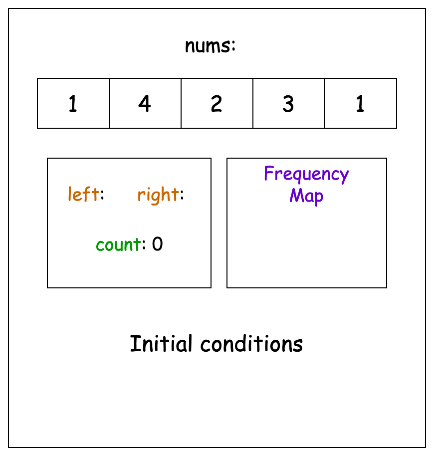
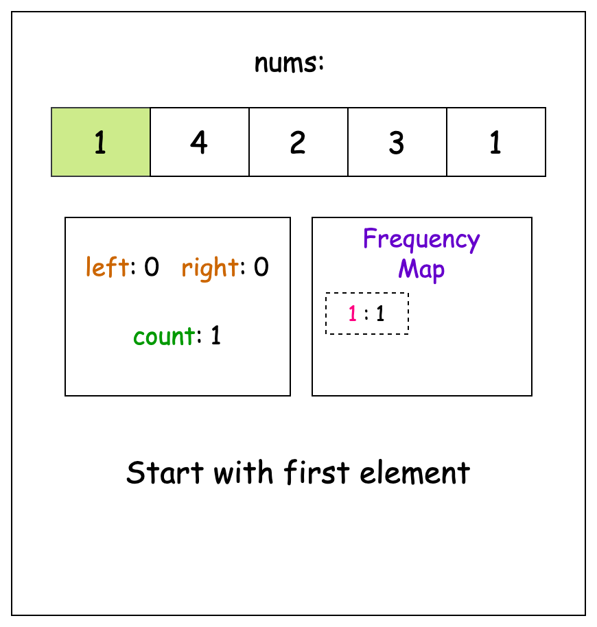
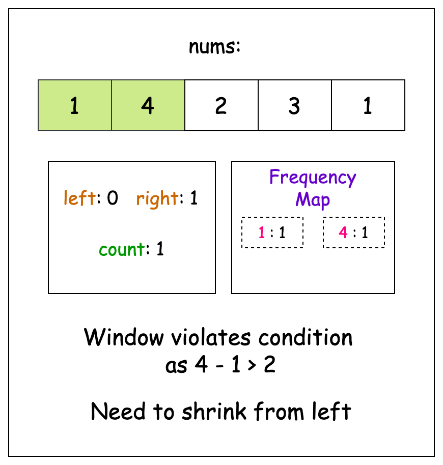
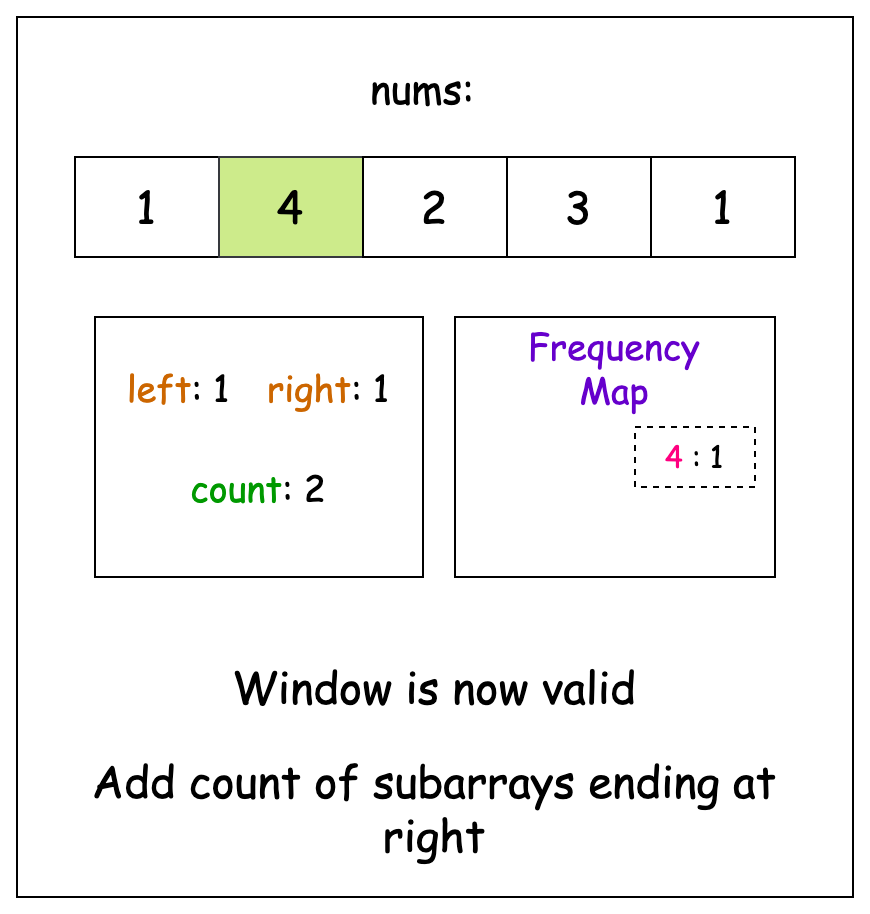
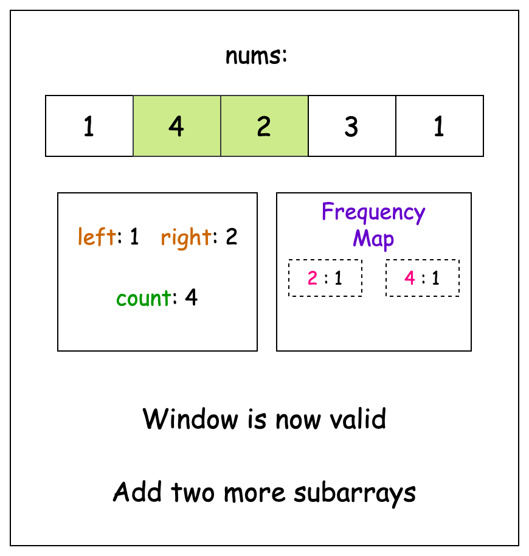
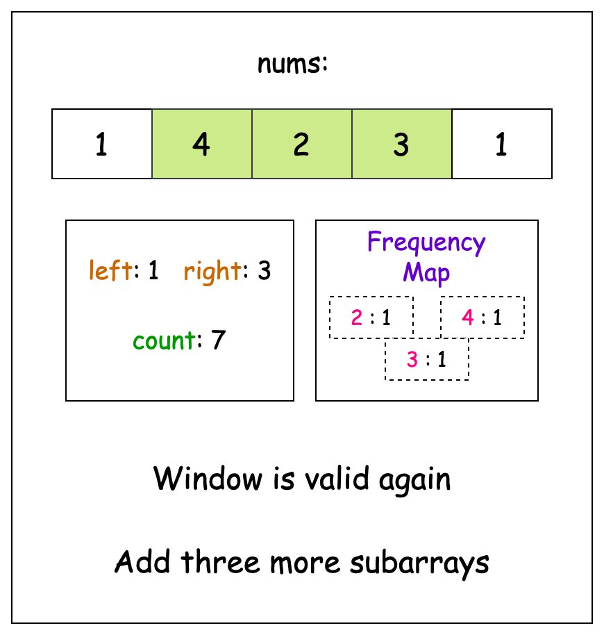
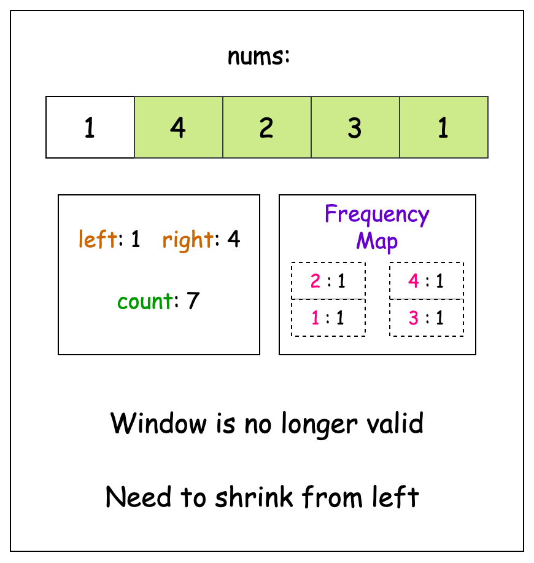
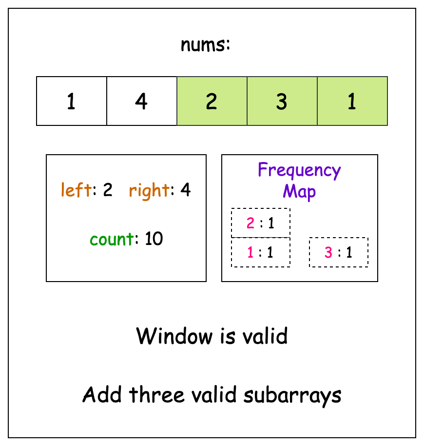
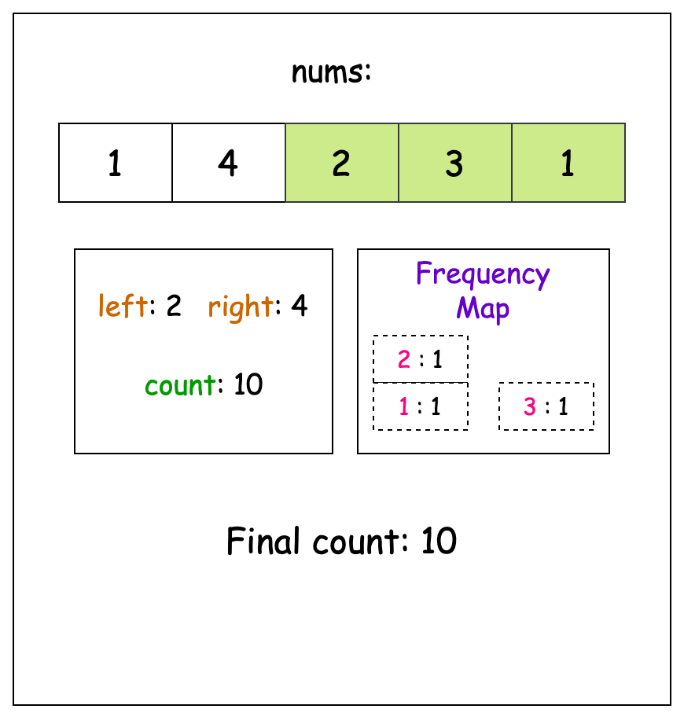

## Solution

---

### Approach 1: Sorted Map

#### Intuition

The main challenge in this problem is to understand what makes a subarray 'continuous'. A subarray is considered continuous if the difference between any two elements within it is no more than 2. Understanding this simplifies the task and allows us to focus on the largest and smallest values, rather than checking every pair of elements.

Consider the subarray [4, 5, 3] from the array [4, 5, 3, 2, 6]. This subarray is valid because the difference between the largest element (5) and the smallest (3) is 2 or less. We don't need to evaluate any other pairs of elements in the array, since they can't possibly lead to a higher difference.

To solve this problem, we need a mechanism to evaluate all possible subarrays efficiently. A sliding window approach, with a variable-sized window, is well-suited for this purpose. We'll start with an empty window and expand it by adding elements from the array, as long as the difference between the maximum and minimum elements in the window is 2 or less. If this condition is violated, we shrink the window from the left until it becomes valid again.

Tracking the maximum and minimum values efficiently in each window is essential for performance. It is possible to repeatedly iterate over each window to find the values, but that method is too slow for larger arrays.

A more efficient method is to use a sorted map, which maintains elements in sorted order and allows quick retrieval of the maximum and minimum values in logarithmic time. The addition and removal of elements from a sorted map are similarly efficient, also taking logarithmic time.

As we expand the window, we add each new element to the sorted map. To check if the window remains valid, we compare the smallest and largest elements in the map. If their difference exceeds 2, we remove elements from the left until the condition is satisfied.

Finally, we need to count the valid subarrays. For a valid window that spans from pointer `left` to `right`, the number of valid subarrays ending at `right` is calculated as $right - left + 1$. This is because every subarray that starts at any pointer between `left` and `right` and ends at `right` is considered valid. We sum up this count for all valid windows across the entire array and return the total as our final answer.

The slideshow below demonstrates the algorithm in action:



















#### Algorithm

- Initialize a sorted map `freq` to maintain a sorted frequency map of elements in the current window.
- Initialize variables:
  - `left` and `right` to `0` to mark the boundaries of the sliding window.
  - `n` to store the length of the input array.
  - `count` to 0 to store the total count of valid subarrays.
- While the `right` pointer is less than the length of `nums`:
  - Add the current element at index `right` to the frequency map. If the element exists, increment its count, else set the count to `1`.
  - While the difference between the maximum and minimum elements in the window exceeds 2:
- Decrement frequency of the element at index `left` in the map
- If the frequency becomes `0`, remove the element from the map.
- Increment the `left` pointer to shrink the window.
  - Add the count of all valid subarrays ending at the current `right` pointer (calculated as $right - left + 1$).
  - Increment the `right` pointer to expand the window.
- Return the final count of all valid subarrays.

#### Implementation

```python
class Solution:
    def continuousSubarrays(self, nums: List[int]) -> int:
        # Map to maintain sorted frequency map of current window
        freq = {}
        left = right = 0
        count = 0  # Total count of valid subarrays

        while right < len(nums):
            # Add current element to frequency map
            freq[nums[right]] = freq.get(nums[right], 0) + 1

            # While window violates the condition |nums[i] - nums[j]| ≤ 2
            # Shrink window from left
            while max(freq) - min(freq) > 2:
                # Remove leftmost element from frequency map
                freq[nums[left]] -= 1
                if freq[nums[left]] == 0:
                    del freq[nums[left]]
                left += 1

            # Add count of all valid subarrays ending at right
            count += right - left + 1
            right += 1

        return count
```

#### Complexity Analysis

Let $n$ be the length of the input array `nums`.

- Time complexity: $O(n \log k) \approx O(n)$

    The outer loop iterates through the array once with the `right` pointer, taking $O(n)$ operations. For each element, we perform map operations (insertion, deletion, finding min/max) which take $O(\log k)$ time, where $k$ is the size of the map. Since we maintain a window where the $max - min \leq 2$, the size of the sorted map $k$ is bounded by $3$ (as elements can only differ by $0$, $1$, or $2$). Therefore, $\log k$ is effectively constant, making the overall time complexity $O(n)$.

    In the Python3 implementation, finding min/max keys in a dictionary takes $O(k)$ time where $k$ is the window size, making each iteration potentially slower than a sorted map's $O(\log k)$ operations. However, this has a negligible effect in this problem since $k$ is bounded by $3$.

- Space complexity: $O(k) \approx O(1)$

    The sorted map stores elements within the current window. Since the difference between any two elements in a valid window cannot exceed $2$, the maximum number of unique elements ($k$) possible in the map at any time is $3$. Therefore, the space complexity is constant, $O(1)$.

---

### Approach 2: Priority Queue

#### Intuition

The main focus of our previous approach was to efficiently find the maximum and minimum values within a given window. Another data structure that excels at this task is a heap, or a priority queue.

Since a heap can only remove either the maximum or the minimum value, not both, we'll need two heaps: a max-heap and a min-heap. We'll store the indices of the elements in the array `nums`, and the heaps will be organized based on the corresponding values in the array. The basic idea remains the same: we expand the window and add the new element to both heaps. This process continues as long as the difference between the maximum element (at the top of the max-heap) and the minimum element (at the top of the min-heap) is no greater than 2.

If the condition is violated, we need to move the start of the window forward until the condition is satisfied again. For each step we move the `left` pointer, we must clean up our heaps to discard any elements that are before the start of the window (this is where storing the indices becomes useful).

Just like with our previous solution, once we have a valid window, counting the number of valid subarrays ending at the current `right` pointer is straightforward: it's simply $right - left + 1$. Each valid window contributes this many continuous subarrays to our final answer.

> For a more comprehensive understanding of heaps, check out the [Heap Explore Card 🔗](https://leetcode.com/explore/featured/card/heap/). This resource provides an in-depth look at the heap data structure, explaining its key concepts and applications with a variety of problems to solidify understanding of the pattern.

#### Algorithm

Initialize variables:
  - `left` and `right` to 0 to mark the boundaries of the sliding window.
  - `count` to 0 to store the total count of valid subarrays.
- Initialize:
  -  a min-heap `minHeap` that stores indices, sorted by their corresponding values in `nums` in ascending order.
  -  a max-heap `maxHeap` that stores indices, sorted by their corresponding values in the input array in descending order.
- While the `right` pointer is less than the array length:
  - Add the current index `right` to both the min-heap and the max-heap.
  - While the `left` pointer is less than the `right` pointer and the difference between the maximum and minimum elements in the window exceeds 2:
- Increment the `left` pointer to shrink the window.
- Remove all indices from the max-heap and the min-heap that are less than the `left` pointer (outdated indices).
  - Add the count of all valid subarrays ending at the current `right` pointer (calculated as $right - left + 1$)
  - Increment the `right` pointer to expand the window.
- Return the final `count` of all valid subarrays.

#### Implementation

```python
class Solution:
    def continuousSubarrays(self, nums: List[int]) -> int:
        # Two heaps to track min/max indices, sorted by nums[index]
        min_heap = []  # (nums[i], i) tuples for min tracking
        max_heap = []  # (-nums[i], i) tuples for max tracking
        left = right = 0
        count = 0

        while right < len(nums):
            # Add current index to both heaps
            # For max heap, negate value to convert min heap to max heap
            heapq.heappush(min_heap, (nums[right], right))
            heapq.heappush(max_heap, (-nums[right], right))

            # While window violates |nums[i] - nums[j]| ≤ 2
            # Shrink window from left and remove outdated indices
            while left < right and -max_heap[0][0] - min_heap[0][0] > 2:
                left += 1

                # Remove indices outside window from both heaps
                while min_heap and min_heap[0][1] < left:
                    heapq.heappop(min_heap)
                while max_heap and max_heap[0][1] < left:
                    heapq.heappop(max_heap)

            count += right - left + 1
            right += 1

        return count
```

#### Complexity Analysis

Let $n$ be the length of the input array `nums`.

- Time complexity: $O(n \log n)$

    The outer loop iterates through the array once with the `right` pointer, taking $O(n)$ operations. For each element, we perform heap operations (insertion and deletion) which take $O(\log n)$ time. Additionally, in the worst case, for each `right` pointer position, we might need to remove multiple outdated indices from both heaps, each removal taking $O(\log n)$ time. Therefore, the overall time complexity is $O(n \log n)$.

- Space complexity: $O(n)$

    The min heap and max heap both store indices of the array elements. In the worst case (when all elements in the array differ by at most $2$), both heaps might store all indices from the array simultaneously, making the space complexity $O(n)$.

---

### Approach 3: Monotonic Deque

#### Intuition

Each addition and deletion operation in a sorted map or a heap takes $O(\log n)$ time. While this is quite efficient, we can still do better.

Consider Example 1 from the problem description, where $nums: [5, 4, 2, 4]$. When the window expands to include `2` at index `2`, it becomes the minimum value in the window. Notice that the previous minimum (`4` at index `1`) is no longer relevant for the minimum calculation since it can never be the minimum value in the window again. Similarly, if we're tracking maximums and we encounter a value larger than some previous values, those smaller values can never be the maximum in any window containing our new value. They become irrelevant for our maximum tracking purposes.

To find the minimum value in the window, we need a data structure that only keeps track of the minimum value encountered most recently and discards any larger values found previously. Also, if a new element comes that is larger than the current minimum, the data structure needs to hold on to it in case the current minimum goes out of the window scope and this new element becomes the new minimum. The data structure perfectly suited for these needs is a monotonic queue.

We'll be using a deque (doubly ended queue) in our implementation to make the removal of irrelevant indices easier. A doubly ended queue allows pushing and popping elements from both sides of the queue. We maintain two deques:
1. A min deque to track the minimum values in the current window. It will always store indices of elements in increasing order of their values.
2. A max deque to track the maximum values in the current window. It will store indices in decreasing order of their values.

As with our previous approaches, we'll start our window from the first element and introduce values one by one. For each element, we first need to check whether adding the element maintains the monotonicity of the queue. The max deque needs to be monotonically decreasing so that the biggest element is at the top, and vice versa for the min deque. For each deque, we'll pop elements from the back until the monotonicity is satisfied, and then add the current index.

Now, we need to check whether adding the new element breaks our condition or not. If it does, we need to move the `left` pointer forward. We place the `left` pointer past the smaller index among the tops of the queues, so we can jump directly past whichever of these appears first in our array. This lets us shrink our window optimally, removing the exact elements causing our property violation.

Finally, once the window is satisfied, we count the number of subarrays that can be formed by the current window. The total count over all the windows is our answer.

#### Algorithm

- Initialize a deque:
  - `maxQ` to maintain a monotonically decreasing sequence of indices for tracking the maximum elements.
  - `minQ` to maintain a monotonically increasing sequence of indices for tracking the minimum elements.
- Initialize variables:
  - `left` to 0 to mark the start of the sliding window.
  - `count` to 0 to store the total count of valid subarrays.
- For each position `right` in the array:
  - While the `maxQ` is not empty and the element at the last index in `maxQ` is less than the current element:
- Remove the last element from the `maxQ`.
  - Add the current index to the `maxQ`.
  - While the `minQ` is not empty and the element at the last index in `minQ` is greater than the current element:
- Remove the last element from the `minQ`.
  - Add the current index to the `minQ`.
  - While both queues are not empty and the difference between the maximum and minimum elements exceeds `2`:
- If the index at the front of `maxQ` is less than the index at the front of `minQ`:
      - Update the `left` pointer to be one position after the front of `maxQ`.
      - Remove the front element from `maxQ`.
- Else:
      - Update the `left` pointer to be one position after the front of `minQ`.
      - Remove the front element from `minQ`.
  - Add the count of all valid subarrays ending at the current right pointer (calculated as $right - left + 1$)
- Return the final count of all valid subarrays.

#### Implementation

```python
class Solution:
    def continuousSubarrays(self, nums: List[int]) -> int:
        # Monotonic deque to track maximum and minimum elements
        max_q = deque()
        min_q = deque()
        left = 0
        count = 0

        for right, num in enumerate(nums):
            # Maintain decreasing monotonic deque for maximum values
            while max_q and nums[max_q[-1]] < num:
                max_q.pop()
            max_q.append(right)

            # Maintain increasing monotonic deque for minimum values
            while min_q and nums[min_q[-1]] > num:
                min_q.pop()
            min_q.append(right)

            # Shrink window if max-min difference exceeds 2
            while max_q and min_q and nums[max_q[0]] - nums[min_q[0]] > 2:
                # Move left pointer past the element that breaks the condition
                if max_q[0] < min_q[0]:
                    left = max_q[0] + 1
                    max_q.popleft()
                else:
                    left = min_q[0] + 1
                    min_q.popleft()

            # Add count of all valid subarrays ending at current right pointer
            count += right - left + 1

        return count
```

#### Complexity Analysis

Let $n$ be the length of the input array `nums`.

- Time complexity: $O(n)$

    The outer loop iterates through the array once, taking $O(n)$ operations. For each element, we perform operations on the monotonic deques. Although we have nested while loops, each element can be added and removed from each deque exactly once throughout the entire process. The amortized cost of all deque operations over the entire execution is $O(n)$.

    Thus, the overall time complexity is $O(n)$.

- Space complexity: $O(n)$

    The monotonic deques store indices of the array elements. In the worst case (when all elements in the array are in decreasing order for `maxQ` or increasing order for `minQ`), both deques might store all indices from the array simultaneously, making the space complexity $O(n)$.

    However, in practice, due to the constraint that the max-min difference must be $\leq 2$, the deques will typically store far fewer elements.

---

### Approach 4: Optimized Two Pointer

#### Intuition

Instead of maintaining complex data structures to track our window's properties, in this approach, we will directly calculate the number of valid subarrays in each window using a mathematical formula.

Consider how a valid window evolves as we move through the array. Each time we add a new element, we have two possibilities: either it maintains the condition that the $max - min \leq 2$, or it breaks this condition. When the condition breaks, we know that all previous subarrays up to that point form a complete, valid window. This gives us our first key insight: we can count all the subarrays before that point and add them to our result. To count all subarrays in a window of length $n$, we can use the formula $n \cdot (n + 1) / 2$.

However, there's an important observation to make here: when the condition breaks, instead of starting completely fresh, we can expand backward from our current position to include some previous elements. Consider the array `[1, 4, 3, 5]`. Let's say we encounter the value `5` after seeing values `3` and `4`. While `5` might break our current window, we can still include both `3` and `4` in our new window since they are within 2 of `5`.

This leads to our second key insight: after a window breaks, we can greedily expand leftward as long as elements remain within 2 of our current value. This backward expansion is crucial because it captures valid subarrays that we would miss if we simply started fresh at each breakpoint.

However, this backward expansion introduces a counting challenge. When we expand backward, we've already counted some subarrays in our previous window that we'll count again in our new window. The solution is simple: we subtract the overcounted subarrays using the same $n \cdot (n + 1) / 2$ formula for the overlapping portion.

Let's take the example array `[1, 3, 4, 5]` to clarify this. Initially, we build a window `[1, 3]`, which breaks when we reach `4`. At this point, we count all subarrays in `[1, 3]`. Then, starting at `4`, we can actually expand backward to include `3` (but not `1`), forming a new window `[3, 4]`. We subtract the overcounted subarrays for the portion containing just `[3]`, then continue our process.

We continue this process until the `right` end of the window reaches the end of the array and we exit the loop. However, remember that the final subarray hasn't broken yet, so it hasn't been added to our total count. We use the $n \cdot (n + 1) / 2$ formula one last time to account for this subarray and return the total count as our answer.

#### Algorithm

- Initialize:
  - `left` and `right` to `0` to mark the boundaries of the sliding window.
  - `curMin` and `curMax` to track the minimum and maximum elements in the current window.
  - `windowLen` to `0` to store the length of the current valid window.
  - `total` to `0` to store the total count of valid subarrays.
- Set the initial window minimum and maximum to the first element of the array.
- For each position `right` in the array:
  - Update the current window minimum and maximum with the current element.
  - If the difference between maximum and minimum exceeds `2`:
- Calculate the length of the previous valid window.
- Add all possible subarrays from the previous valid window using the formula $(n \cdot (n+1))/2$.
- Start a new window at the current position.
- Reset the minimum and maximum to the current element.
- While the `left` pointer can be expanded (not at `0` and difference $\leq$ 2):
      - Decrement the left pointer.
      - Update the window minimum and maximum with the new `left` element.
- If the `left` pointer was expanded:
      - Calculate the new window length.
      - Subtract the overcounted subarrays using the same formula $(n \cdot (n+1))/2$.
- Calculate the length of the final window.
- Add all possible subarrays from the final window using the formula $(n \cdot (n+1))/2$.
- Return the `total` count of valid subarrays.

#### Implementation

```python
class Solution:
    def continuousSubarrays(self, nums: List[int]) -> int:
        right = left = 0
        window_len = total = 0

        # Initialize window with first element
        cur_min = cur_max = nums[right]

        for right in range(len(nums)):
            # Update min and max for current window
            cur_min = min(cur_min, nums[right])
            cur_max = max(cur_max, nums[right])

            # If window condition breaks (diff > 2)
            if cur_max - cur_min > 2:
                # Add subarrays from previous valid window
                window_len = right - left
                total += window_len * (window_len + 1) // 2

                # Start new window at current position
                left = right
                cur_min = cur_max = nums[right]

                # Expand left boundary while maintaining condition
                while left > 0 and abs(nums[right] - nums[left - 1]) <= 2:
                    left -= 1
                    cur_min = min(cur_min, nums[left])
                    cur_max = max(cur_max, nums[left])

                # Remove overcounted subarrays if left boundary expanded
                if left < right:
                    window_len = right - left
                    total -= window_len * (window_len + 1) // 2

        # Add subarrays from final window
        window_len = right - left + 1
        total += window_len * (window_len + 1) // 2

        return total
```

#### Complexity Analysis

Let $n$ be the length of the input array `nums`.

- Time complexity: $O(n)$

    The algorithm iterates through the array once with the `right` pointer, taking $O(n)$ operations. For each element, when the window condition breaks, we may need to expand the `left` pointer backward. Although this involves a while loop, across the entire execution, the `left` pointer can only visit each position at most twice. Therefore, the amortized time complexity remains $O(n)$.

- Space complexity: $O(1)$

    The algorithm only uses a constant number of variables regardless of the input size. No additional data structures are used that grow with the input size. Thus, the space complexity is constant, $O(1)$.

---