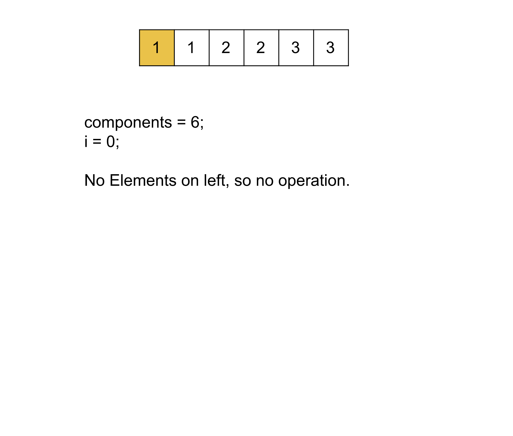
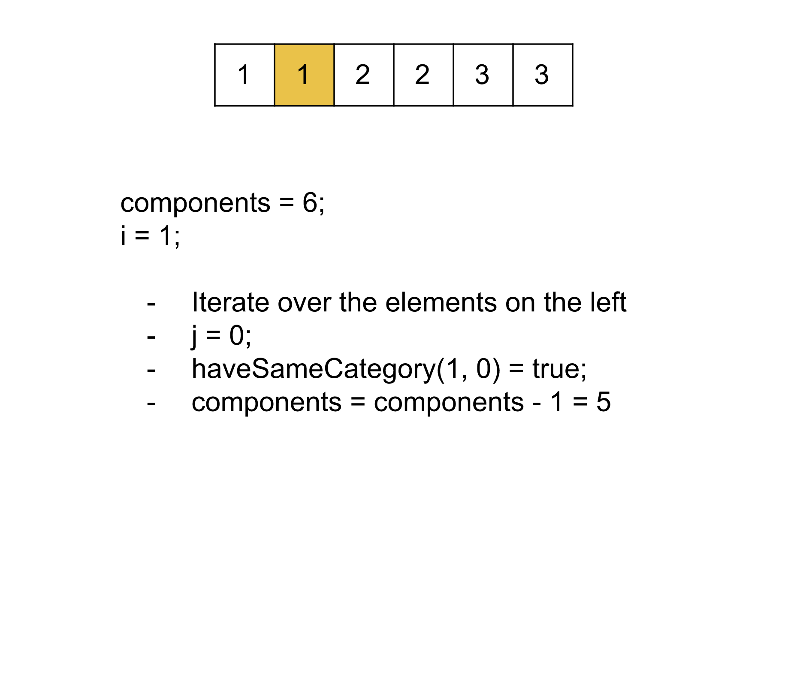
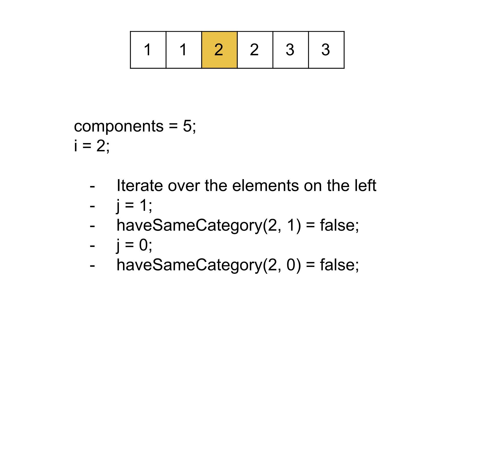
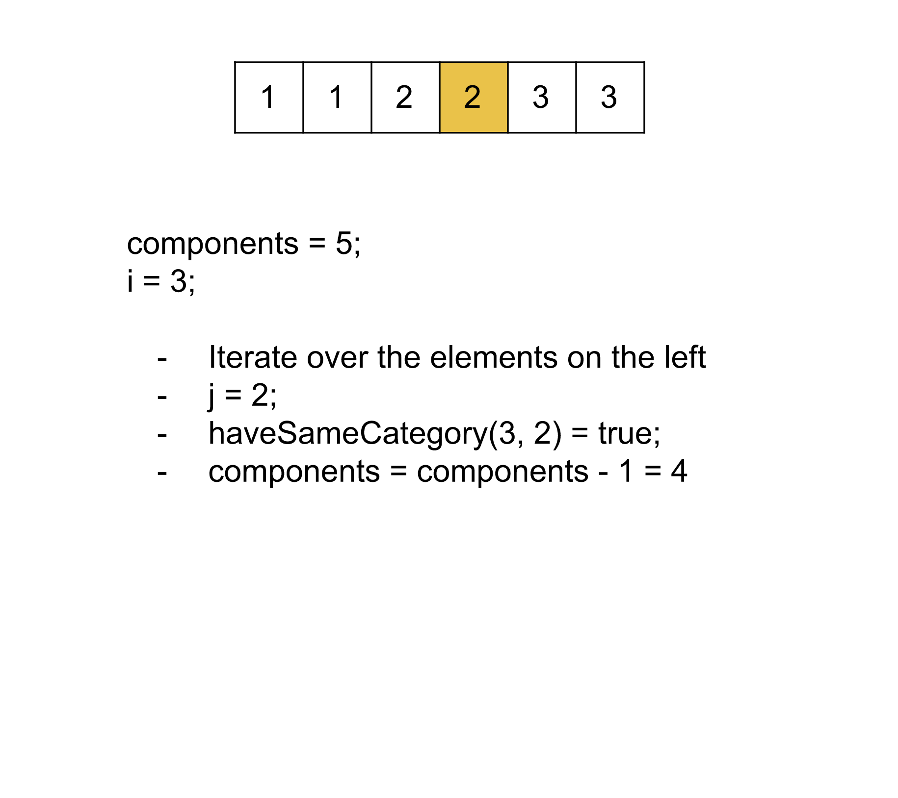
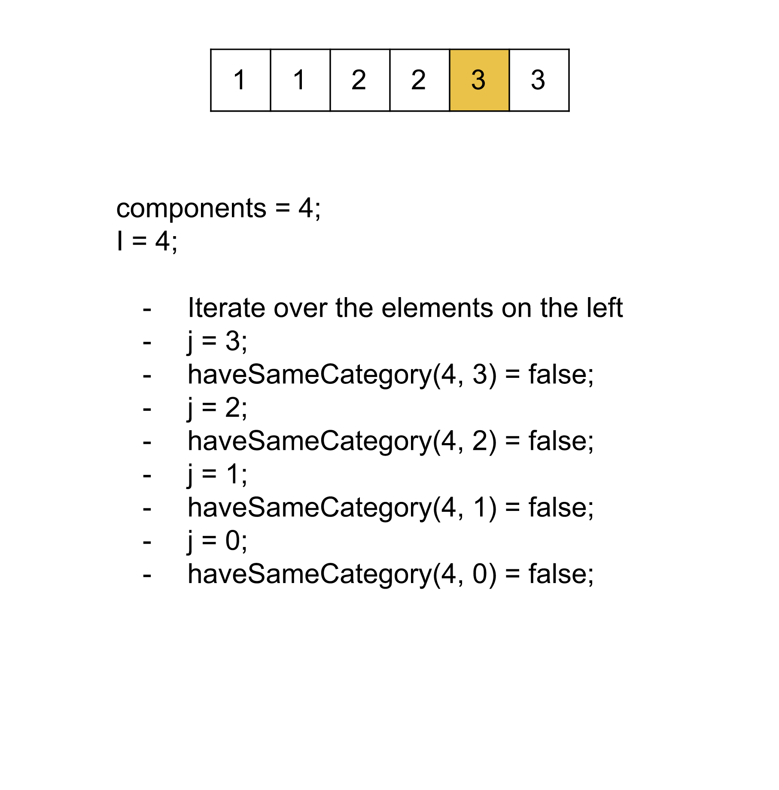
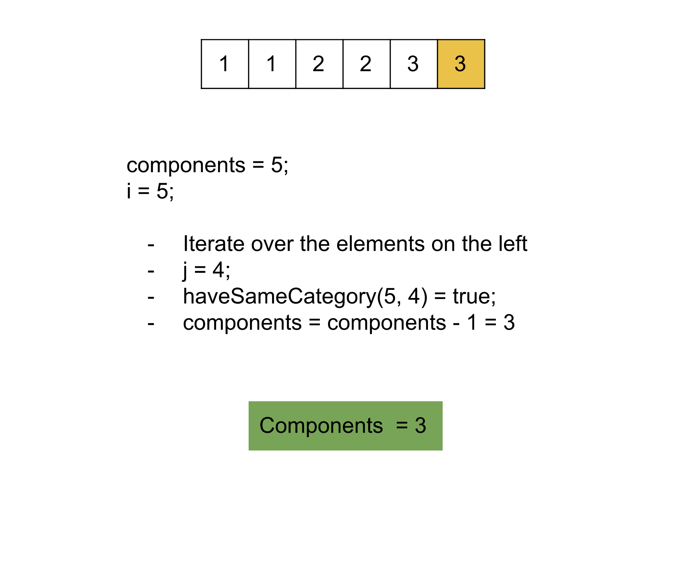

## Solution

---

### Approach 1: Depth-First Search (DFS)

**Intuition**

There are $N$ elements, each associated with a category represented by a number from $0$ to $N - 1$. We don't know the category of each element. Still, we can find if two elements have the same category or not using the functional call `haveSameCategory(i, j)`, where the two integer arguments are the elements. This function returns `true` if they have the same category and return `false` otherwise. We need to return the number of unique categories.

If we assume each element to be a node and an edge between the nodes if they belong to the same category, then the number of components will equal the number of unique categories. This is because each component will represent the set of nodes with the same category and hence contribute `1` to the number of unique categories. Hence, this problem is similar to the [323 Number of Connected Components in an Undirected Graph](https://leetcode.com/problems/number-of-connected-components-in-an-undirected-graph/solution/).

In this approach, we will use the Depth-First search to find the number of connected components. To use DFS, we first have to build up the adjacency list for the graph. We will iterate over every pair of the element, and for every pair `(i, j)` if the function call `haveSameCategory(i, j)` returns `true`, then we add an undirected edge between `i` and `j`. Then we will perform DFS on each node, and in each DFS traversal, when we iterated over the nodes, we mark them as visited in a boolean array `vis`. We skip the DFS if the node is already visited and increment the counter variable `components` each time we have to perform DFS.

**Algorithm**

1. Initialize an empty adjacency list for each $N$ node `adj`.  This list stores the undirected edges between the nodes.
2. Iterate over each pair of nodes `(i, j)`, and for each pair, check the value of `haveSameCategory(i, j)`: if it's `true`, then add an undirected edge between `i` and `j`.
3. Initialize a boolean list `vis` with all `false` and a variable `components` as `0`.
4. Iterate over each node `i` and for each `i`:
1. If the node is not visited, i.e., $\text{vis}[i] = false$, perform DFS on the node and increment the variable `components`.
2. In each DFS call, mark the node as visited and iterate over the adjacent nodes in a recursive way.
5. Return `components`.

**Implementation**

```cpp
class Solution {
public:
    void dfs(vector<int> adjList[], vector<bool>& vis, int src) {
        vis[src] = true;

        for (int i = 0; i < adjList[src].size(); i++) {
            if (!vis[adjList[src][i]]) {
                dfs(adjList, vis, adjList[src][i]);
            }
        }
    }

    int numberOfCategories(int n, CategoryHandler* categoryHandler) {
        vector<int> adjList[n];

        // Iterate over every pair and add an undirected edge if both belong to the same category.
        for (int i = 0; i < n; i++) {
            for (int j = i + 1; j < n; j++) {
                if (categoryHandler->haveSameCategory(i, j)) {
                    adjList[i].push_back(j);
                    adjList[j].push_back(i);
                }
            }
        }

        vector<bool> vis(n, false);
        int components = 0;
        // Each DFS means that a new category is being accessed.
        for (int i = 0; i < n; i++) {
            if (!vis[i]) {
                components++;
                dfs(adjList, vis, i);
            }
        }

        return components;
    }
};
```

**Complexity Analysis**

Here, $N$ is the number of elements.

* Time complexity: $O(N^2)$

  We iterate over each pair of the elements, which will take $O(N^2)$ time. Then we perform DFS on the graph; the time complexity of DFS is $O(V + E)$, where the number of vertices $V = N$, and the number of edges $E$ can be at-max $N^2$ when all nodes belong to the same category. The time complexity of the function call `haveSameCategory()` can be assumed as $O(1)$ as it's not given in the problem statement. Therefore, the total time complexity equals $O(N^2)$.

* Space complexity: $O(N^2)$

  The adjacency list can take up to $O(N^2)$ space when an edge exists between each vertex. The size of the visited array `vis` is $N$. Hence, the total space complexity is equal to $O(N^2)$.
  <br/>

---

### Approach 2: Disjoint-Set Union (DSU)

**Intuition**

We can also use the Disjoint-Set Union data structure to find the number of components in the undirected graph. We will initialize the variable `components` to $N$, then call the function `haveSameCategory` for each pair of nodes. If the function returns `true`, then we perform the union of the nodes and decrement the variable `components`.

In the DSU structure, we will have the `root`  and `componentSize` for each node. Initially, the value of `componentSize` for each node will be `1`, denoting it as a separate component, and the value of `root` will be equal to the node itself, denoting each node as the root of itself. When we perform union, we check the `root` of the two nodes is the same or not; if not, we make the node with greater `componentSize`  as the root of the other node. This will make the root of all the nodes under the two nodes the same and hence denotes the nodes to be in the same component.

**Algorithm**

1. Create a class `UnionFind`; this will have the relevant data members and member functions to perform DSU operations:

1. Data member `root` stores the immediate parent of nodes in the union-find structure. Initially, each node will be its own representative.
2. Data member `componentSize` stores the number of nodes in the components with the node as the root node, initially the size of the component for each node is `1`
3. Data member `componentsCount` store the number of components in the graph. Initially, it will equal $N$ as each node is considered a separate component.
4. Method `findRoot()` returns the root node in the representative hierarchy.
5. Method `performUnion()`, returns $1$ after performing the union between the components of the two nodes that were not connected before; otherwise returns $0$.
6. Method `getComponentsCount()` returns `components`.

2. Iterate over each pair of nodes `(i, j)`, and for each pair, call the method `haveSameCategory(i, j)`, and if it returns true, then perform union using the `performUnion` method.
3. Return the number of components as `getComponentsCount()`.

**Implementation**

```cpp
class UnionFind {
    vector<int> root;
    vector<int> componentSize;
    // Number of distinct components in the graph.
    int componentsCount;

public:
    // Initialize the list root and componentSize
    // Each node is root of itself with size 1.
    UnionFind(int n) {
        componentsCount = n;
        for (int i = 0; i <= n; i++) {
            root.push_back(i);
            componentSize.push_back(1);
        }
    }

    // Get the root of a node.
    int findRoot(int x) {
        if (root[x] == x) {
            return x;
        }

        // Path compression.
        return root[x] = findRoot(root[x]);
    }

    // Perform the union of two components that belongs to node x and node y.
    void performUnion(int x, int y) {
        x = findRoot(x); y = findRoot(y);

        if (x == y) {
            return;
        }

        if (componentSize[x] > componentSize[y]) {
            componentSize[x] += componentSize[y];
            root[y] = x;
        } else {
            componentSize[y] += componentSize[x];
            root[x] = y;
        }

        componentsCount--;
    }

    // Return the number of components.
    int getComponentsCount() {
        return componentsCount;
    }
};

class Solution {
public:
    int numberOfCategories(int n, CategoryHandler* categoryHandler) {
        UnionFind uF(n);

        // Iterate over every pair and perform union if both belong to the same category.
        for (int i = 0; i < n; i++) {
            for (int j = i + 1; j < n; j++) {
                if (categoryHandler->haveSameCategory(i, j)) {
                    uF.performUnion(i, j);
                }
            }
        }

        return uF.getComponentsCount();
    }
};
```

**Complexity Analysis**

Here, $N$ is the number of elements.

* Time complexity: $O(N^2 \cdot \alpha (N))$.

  We iterate over each pair of the elements, which consists of $O(N^2)$ steps. At each step, we call `performUnion` on the current pair, the time complexity of this call is $O(\alpha (N))$ as we have included union by size as well as path compression; Note that $\alpha (N)$ is the [Inverse Ackermann function](https://en.wikipedia.org/wiki/Ackermann_function#Inverse) which grows so slowly that it can be considered as $O(1)$. Therefore, the total time complexity equals $O(N^2 \cdot \alpha (N))$.

* Space complexity: $O(N)$

  The size of the `representative` and `componentSize` lists is $O(N)$. Hence the total space complexity equals $O(N)$.
  <br/>

---
### Approach 3: Greedy

**Intuition**

In the previous approach, we started with the number of components as $N$ considering each node as a separate component. Each time we found the two nodes to be under the same category, we decremented the number of components. Instead of using the union operation in the Disjoint-Set Union data structure, what we can do is simply check if a node has the same category as any previously found nodes. If it has the same category as any previously found nodes, then we will not consider this node as a separate component and can decrement the number of components.

In this approach, we will iterate over each node, and for each one, we iterate over the nodes on its left (nodes we've visited). If any of them has the same category as this node, we decrement the total number of components by 1. Note that we will have to break once we have found out that a node has the same category as another one since we only care if that node should be counted as a separate component.













 <br>

**Algorithm**

1. Initialize the variable `components` to $N$.
2. Iterate over the elements `i` from `0` to $N - 1$, and for each element, iterate over the elements `j` on the left of `i` from $i - 1$ to `0`. If the value of `haveSameCategory(i, j)` is `true`, then we decrement the value of `components` and break the inner loop.
3. Return `components`.

**Implementation**

```cpp
class Solution {
public:
    int numberOfCategories(int n, CategoryHandler* categoryHandler) {
        int components = n;

        // Iterate over every pair, and if both belong to the same category,
        //Remove the element from separate components.
        for (int i = 0; i < n; i++) {
            for (int j = i - 1; j >= 0; j--) {
                if (categoryHandler->haveSameCategory(i, j)) {
                    components--;
                    break;
                }
            }
        }

        return components;
    }
};
```

**Complexity Analysis**

Here, $N$ is the number of elements.

* Time complexity: $O(N^2)$.

  We iterate over each pair of the elements, which consists of $O(N^2)$ function calls. The time complexity of the function call `haveSameCategory()` can be assumed as $O(1)$ as it's not given in the problem statement. Therefore, the total time complexity equals $O(N^2)$.

* Space complexity: $O(1)$

  No extra space is required apart from the variable `components`. Hence the total space complexity is constant.
  <br/>

---