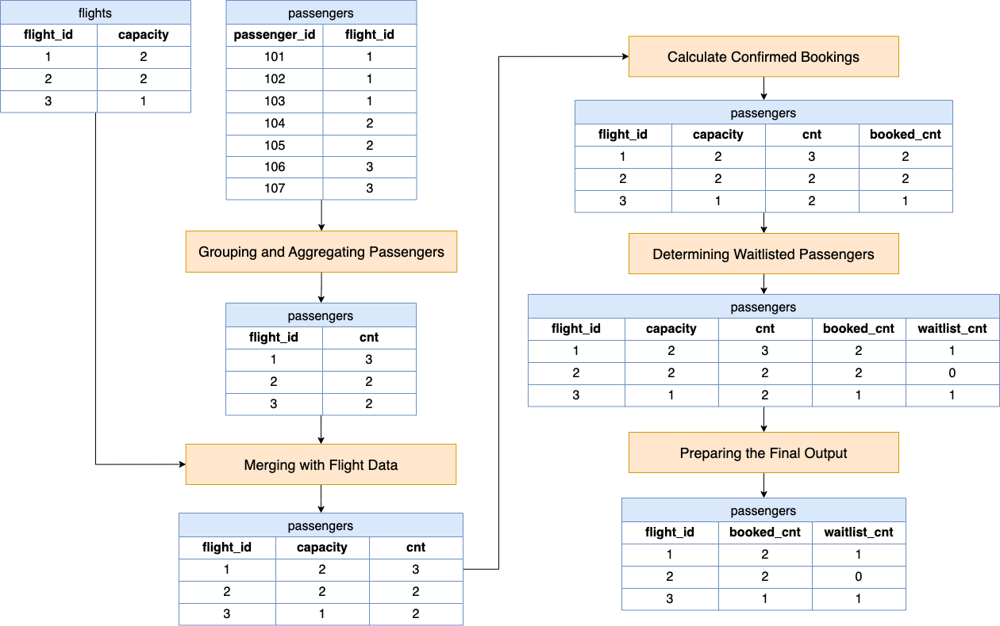

# Solution

---

## pandas

### Approach: `apply` and `groupby`

**Visualization of Approach**



#### Intuition

Determining the number of confirmed bookings and waitlist status for each flight involves aggregating passenger data to count the number of bookings per flight, merging this count with flight capacity data, and then calculating the number of confirmed bookings by taking the minimum of passenger count and flight capacity. The number of waitlisted passengers is then derived by subtracting the confirmed bookings from the total passenger count for each flight. The final step is to clean and sort the data to present a concise report that lists each flight along with the number of passengers with confirmed seats and those on the waitlist, in ascending order of flight IDs. This process utilizes pandas' data manipulation strengths to efficiently handle and analyze the data, allowing for a clear understanding of flight booking statuses.

Let's break down the python function to understand the logic and intuition behind each step by walking through an example given the following two input DataFrames:

`flights`:
<table border="1">
<tr><th>flight_id</th><th>capacity</th></tr>
<tr><td>1</td><td>2</td></tr>
<tr><td>2</td><td>2</td></tr>
<tr><td>3</td><td>1</td></tr>
</table>
<br>

`passengers`:
<table border="1">
<tr><th>passenger_id</th><th>flight_id</th></tr>
<tr><td>101</td><td>1</td></tr>
<tr><td>102</td><td>1</td></tr>
<tr><td>103</td><td>1</td></tr>
<tr><td>104</td><td>2</td></tr>
<tr><td>105</td><td>2</td></tr>
<tr><td>106</td><td>3</td></tr>
<tr><td>107</td><td>3</td></tr>
</table>
<br>

1. **Grouping and Aggregating Passengers:**

   The goal here is to determine the total demand for seats on each flight. We group the passengers by $\text{flight}_{id}$ because we want to analyze the bookings on a per-flight basis. The aggregation using `nunique` on $\text{passenger}_{id}$ ensures that each passenger is counted only once per flight, even if there's any duplication in the data. This step sets the foundation for understanding the capacity demand of each flight.

   ```python
   passengers.groupby(by="flight_id").agg(cnt=("passenger_id", "nunique")).reset_index()
   ```

<table border="1">
<tr><th>flight_id</th><th>cnt</th></tr>
<tr><td>1</td><td>3</td></tr>
<tr><td>2</td><td>2</td></tr>
<tr><td>3</td><td>2</td></tr>
</table>
<br>

2. **Merging with Flight Data:**

   We need to compare the demand for seats with the supply (i.e., the capacity of each flight). Merging the aggregated passenger counts with the `flights` dataframe brings the capacity information and passenger demand together. By using a left join, we include all flights in our analysis, which is crucial because we want to account for flights that might not have any bookings yet. Filling missing values with zero ensures that our subsequent calculations are not affected by `NaN` values which could occur if there are flights without any passengers.

   ```python
   passengers = flights.merge(passengers, on="flight_id", how="left").fillna(0)
   ```

<table border="1">
<tr><th>flight_id</th><th>capacity</th><th>cnt</th></tr>
<tr><td>1</td><td>2</td><td>3</td></tr>
<tr><td>2</td><td>2</td><td>2</td></tr>
<tr><td>3</td><td>1</td><td>2</td></tr>
</table>
<br>

3. **Calculating Confirmed Bookings ($\text{booked}_{cnt}$):**

   If the number of people attempting to book `row["cnt"]` is greater than the flight capacity `row["capacity"]`, then the number of booked seats is determined by the latter. However, if `row["cnt"]` is less than or equal to `row["capacity"]`, it means that each person attempting to book can indeed book a seat. In summary, the actual number of booked seats is determined by the minimum of `row["cnt"]` and `row["capacity"]`.

   ```python
   passengers["booked_cnt"] = passengers.apply(lambda row: min(row["cnt"], row["capacity"]), axis=1)
   ```
<table border="1">
<tr><th>flight_id</th><th>capacity</th><th>cnt</th><th>booked_cnt</th></tr>
<tr><td>1</td><td>2</td><td>3</td><td>2</td></tr>
<tr><td>2</td><td>2</td><td>2</td><td>2</td></tr>
<tr><td>3</td><td>1</td><td>2</td><td>1</td></tr>
</table>
<br>

4. **Determining Waitlisted Passengers ($\text{waitlist}_{cnt}$):**

   After knowing how many passengers have confirmed seats, the next logical step is to figure out who didn't make it onto the flight due to capacity constraints. By subtracting the number of confirmed bookings $passengers["\text{booked}_{cnt}"]$ from the total number of bookings `passengers["cnt"]`, we identify the excess $passengers["\text{waitlist}_{cnt}"]$. This difference represents passengers who have attempted to book a seat but are unable to be accommodated on the plane and therefore are waitlisted.

   ```python
   passengers["waitlist_cnt"] = passengers["cnt"] - passengers["booked_cnt"]
   ```

<table border="1">
<tr><th>flight_id</th><th>capacity</th><th>cnt</th><th>booked_cnt</th><th>waitlist_cnt</th></tr>
<tr><td>1</td><td>2</td><td>3</td><td>2</td><td>1</td></tr>
<tr><td>2</td><td>2</td><td>2</td><td>2</td><td>0</td></tr>
<tr><td>3</td><td>1</td><td>2</td><td>1</td><td>1</td></tr>
</table>
<br>

5. **Preparing the Final Output:**

   Finally, we need to prepare our results in accordance with the problem statement. The intermediate calculations (total passenger count and flight capacity) are no longer needed once we have our confirmed and waitlisted passenger counts. We drop these intermediate columns and sort by $\text{flight}_{id}$.

   ```python
   return passengers.drop(["cnt", "capacity"], axis=1).sort_values(by="flight_id")
   ```

<table border="1">
<tr><th>flight_id</th><th>booked_cnt</th><th>waitlist_cnt</th></tr>
<tr><td>1</td><td>2</td><td>1</td></tr>
<tr><td>2</td><td>2</td><td>0</td></tr>
<tr><td>3</td><td>1</td><td>1</td></tr>
</table>
<br>

#### Implementation

```python
import pandas as pd

def waitlist_analysis(flights: pd.DataFrame, passengers: pd.DataFrame) -> pd.DataFrame:
    passengers = (
        passengers.groupby(by="flight_id")
        .agg(cnt=("passenger_id", "nunique"))
        .reset_index()
    )
    passengers = flights.merge(passengers, on="flight_id", how="left").fillna(0)
    passengers["booked_cnt"] = passengers.apply(lambda row: min(row["cnt"], row["capacity"]), axis=1)
    passengers["waitlist_cnt"] = passengers["cnt"] - passengers["booked_cnt"]
    return passengers.drop(["cnt", "capacity"], axis=1).sort_values(by="flight_id")

```

---

## Database

### Approach: `LEFT JOIN`

#### Intuition

To generate a report detailing the number of passengers who have successfully booked seats and those who are waitlisted for each flight, we use an SQL query that merges the Flights and Passengers tables. By performing a `LEFT JOIN` on these tables, we align each passenger booking with the corresponding flight's capacity. We then group the results by flight and use aggregation to count the total bookings. To respect each flight's seating limit, we employ the `LEAST` function to cap the confirmed bookings at the flight's capacity and the `GREATEST` function to ensure the waitlist count does not fall below zero, accounting for cases where bookings exceed capacity. The final result is ordered by flight ID, providing a clear and organized report of the booking status per flight.

Let's break down the SQL query to understand the logic and intuition behind each step:

1. **Joining the Tables:**

   The `Flights` table contains information about each flight and its capacity, while the `Passengers` table contains information about passenger bookings for each flight. To understand the booking situation for each flight, we need to combine this information. We achieve this by performing a `LEFT JOIN` operation between `Flights` and `Passengers` on the $\text{flight}_{id}$ column. This join operation allows us to line up each passenger booking alongside the corresponding flight and its capacity.

   ```sql
   FROM
     Flights f
     LEFT JOIN Passengers p ON f.flight_id = p.flight_id
   ```

2. **Counting Passengers per Flight:**

   With the joined data, we then group the results by $\text{flight}_{id}$ and count the number of passengers associated with each flight. This is done using the `COUNT()` aggregation function on $\text{passenger}_{id}$, which gives us the total number of bookings (confirmed seats and waitlisted) for each flight.

3. **Determining Booked Seats (booked_cnt):**

   To find out how many passengers have successfully booked a seat (i.e., they are not waitlisted), we need to compare the number of passengers who have booked to the capacity of the flight. Since a flight can't have more passengers booked than its capacity, we use the `LEAST()` function. This function takes two arguments: the flight's capacity and the count of passengers. It returns the smaller of the two, which represents the number of passengers who can be confirmed based on the flight's capacity. If the number of bookings is greater than the flight's capacity, the excess passengers are considered waitlisted.

   ```sql
   LEAST(
     f.capacity,
     COUNT(p.passenger_id)
   ) AS booked_cnt
   ```

4. **Calculating Waitlisted Passengers (waitlist_cnt):**

   For the waitlist count, we want to determine how many passengers cannot be accommodated on the flight due to capacity constraints. This is done by subtracting the flight's capacity from the total number of passengers. If this number is negative (meaning the flight is not overbooked), we don't want to report negative waitlisted passengers. Hence, we use the `GREATEST()` function with arguments `0` and the difference calculated. This ensures that the waitlist count is set to zero when the flight is not full, or to the appropriate positive number when there are more bookings than available seats.

   ```sql
   GREATEST(
     0,
     COUNT(p.passenger_id) - f.capacity
   ) AS waitlist_cnt
   ```

5. **Ordering the Results:**

   Finally, we want to present the results in accordance to the problem statement, which is why the query includes an `ORDER BY` clause that sorts the output by $\text{flight}_{id}$ in ascending order.

   ```sql
   ORDER BY
     f.flight_id
   ```

#### Implementation

**MySQL**

```mysql []
SELECT
  f.flight_id,
  LEAST(
    f.capacity,
    COUNT(p.passenger_id)
  ) AS booked_cnt,
  GREATEST(
    0,
    COUNT(p.passenger_id) - f.capacity
  ) AS waitlist_cnt
FROM
  Flights f
  LEFT JOIN Passengers p ON f.flight_id = p.flight_id
GROUP BY
  f.flight_id
ORDER BY
  f.flight_id;
```