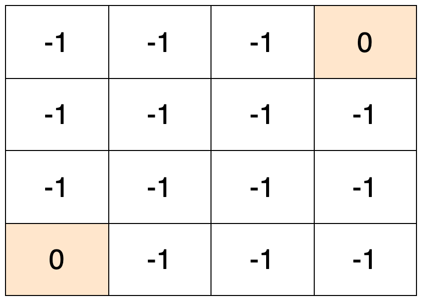
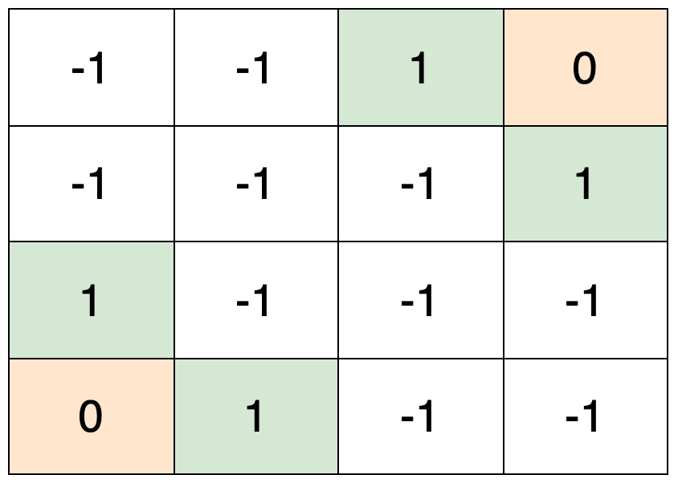
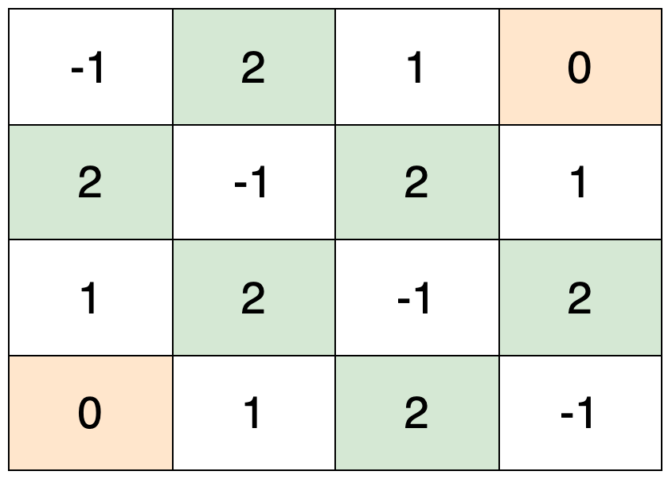
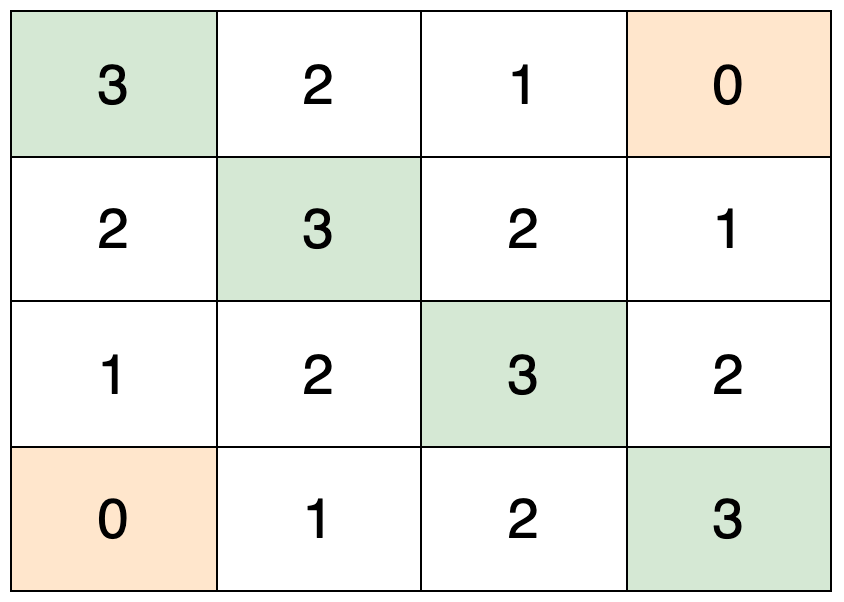
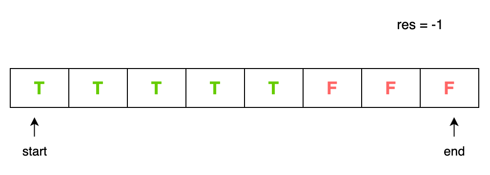
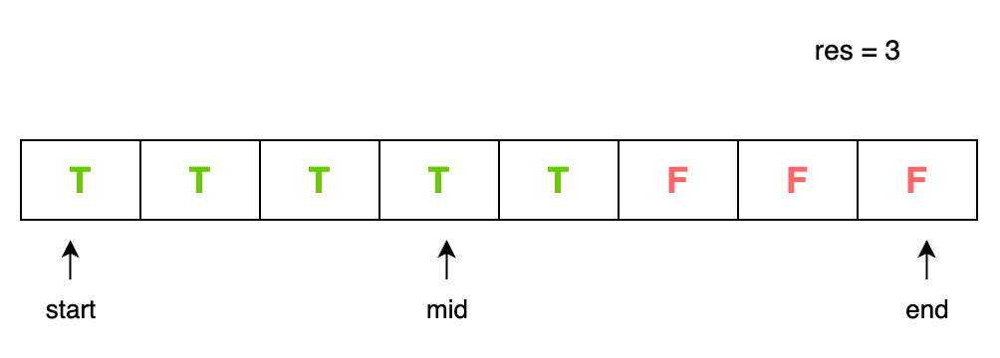
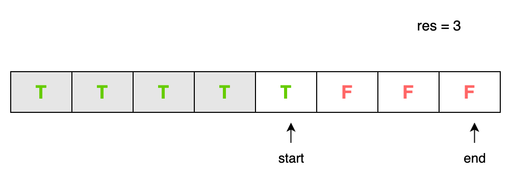
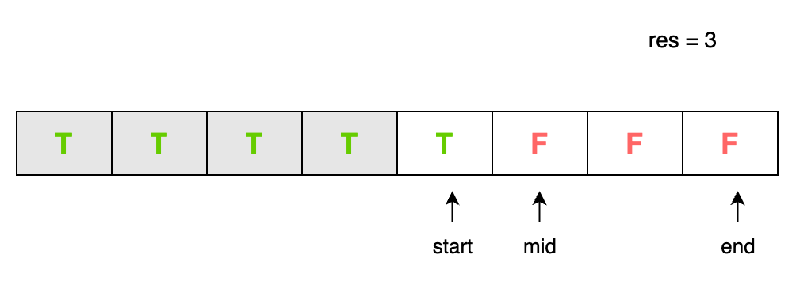
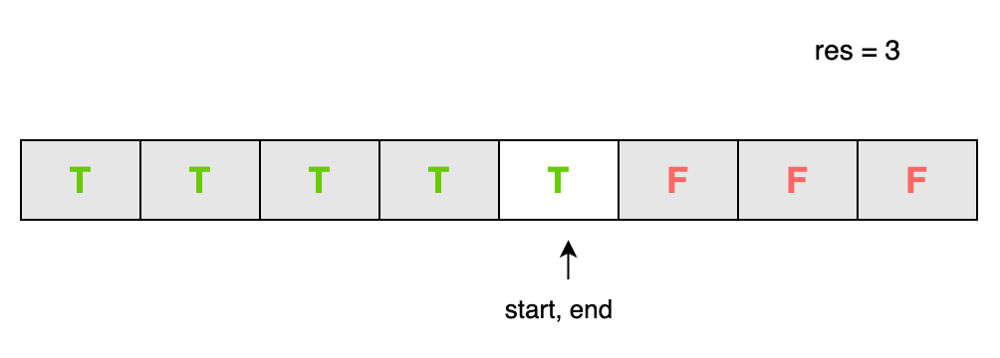
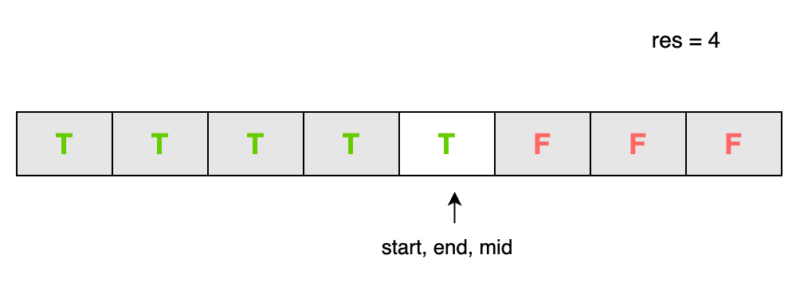

## Solution

---

### Overview

We are given a `grid` representing a city layout where some cells contain thieves and others are empty, and we need to find the maximum safeness factor of all paths from the top-left corner to the bottom-right corner. The safeness factor of a path is defined as the minimum Manhattan distance from any cell in the path to any thief in the `grid`.

**Key Observations:**
1. Manhattan distance between two cells is the sum of the absolute differences of their row and column indices.
2. All the cells in the `grid` contain either 0 or 1, representing empty cells and cells containing thieves respectively.
3. You start from the top-left corner `(0, 0)` and can move to adjacent cells in any of the four directions.
4. The maximum level of safety one can achieve while traversing from the starting point to the destination is by ensuring the least proximity to any cell containing a thief.

### Approach 1: Breadth-First Search + Binary Search

#### Intuition

Since we need to find the safeness factor of a path from the source to the destination, the initial intuition to solve this problem is that we should first find the safeness factors of the cells in the path. The path can span across the entire `grid`, so we need to find the safeness factors for all the cells in the `grid`.

One approach to find the safeness factors of the cells would be to iterate over each cell in the `grid` and find its distance from all the thieves in the `grid`. We can then pick the smallest distance as the safeness factor for that cell.

However, this brute force approach would have a time complexity of $O(n^4)$, which would not satisfy the constraints of the problem. Therefore, a more optimized approach is needed.

To optimize the solution, we can leverage the properties of a multi-source breadth-first Search (BFS). Instead of finding the distance of each cell from all the thieves, we can do the opposite: find the distance of all the thieves from each cell.

> Note: A multi-source breadth-first search is a BFS where multiple starting nodes are explored simultaneously. This is an efficient method to find the shortest distances from any of the starting nodes to all reachable nodes in the graph. You can refer to this excellent **[problem](https://leetcode.com/problems/rotting-oranges/)** to gain some practice on multi-source BFS.

The intuition for this can be,
- We start by adding all the thief coordinates to a queue as the initial points of exploration.
- We then explore the neighboring cells (up, down, left, and right) from all the thieves in one iteration, like ripples spreading outwards from each thief.
- As we visit each cell, we mark it with the minimum distance from the nearest thief. This is because the first time a cell is visited, it means that the current thief is the closest one to that cell.
- We continue the BFS traversal until all the cells in the `grid` are marked with their corresponding safeness values.

The following slideshow demonstrates how the BFS gradually populates the `grid` with its minimum distances from a thief.









Now that we have the safeness factor of each cell, we need to find the maximum safeness factor for which a path exists from the source cell to the destination cell. This implies that for all safeness values greater than it, no path exists, and at least one path exists for all values less than it. We can visualize these safeness factors as a monotonic sequence on a number line. The values that satisfy the constraints of the problem will be a contiguous series. These will be followed by a series of values that do not satisfy the constraints. We will name this breakpoint the inflection point.

The following slideshow visualizes how we iteratively converge to the location of the inflection point using binary search.













During the binary search, to determine if a safeness value meets the problem constraints, we employ another breadth-first search (BFS) traversal on the `grid`. The traversal attempts to find a path where every cell in the path satisfies this minimum safeness value. If such a path is found, it indicates that the given safeness value is a valid solution to the problem.

Thus, to find the maximum safeness factor, we can use binary search to efficiently locate the inflection point in this monotonic sequence. The last "True" value at the inflection point will be the maximum safeness factor for which a path exists.

In summary, the final solution involves two key steps:
1. Perform a breadth-first search to compute the safeness factor for each cell, leveraging the fact that the first time a cell is visited, it represents the minimum distance from the nearest thief.
2. Apply binary search to find the maximum safeness factor for which a path exists from the source to the destination cell.

This approach is more efficient than the initial brute-force solution, as it avoids the need to calculate the distance of each cell from all the thieves. Instead, it focuses on finding the distance of each cell from all the thieves, which can be done more optimally manner using BFS.

#### Algorithm

- Initialize `dir` to store directions for moving to neighboring cells: right, left, down, up.
- Define `isValidCell` method to check if a given cell is valid within the `grid`.
- Define `isValidSafeness` method to check if a path exists with a minimum safeness value.

##### `isValidCell` Method

1. Take the `grid`, row `i`, and column `j` as input.
2. Get the size of the `grid`, denoted by `n`.
3. Check if the cell at (`i`, `j`) is within the `grid` boundaries.
4. Return `true` if the cell is valid, `false` otherwise.

##### `isValidSafeness` Method

1. Take the `grid` and the minimum safeness value as input.

2. Initialize variables:
   - `n` as the size of the `grid`.
   - `q` as a queue of coordinates to perform the breadth-first search (BFS).
   - `visited` as a 2-D array to mark visited cells.

3. Check if the source and destination cells satisfy the minimum safeness.

4. Perform a breadth-first search (BFS) to find a valid path:
   - Initialize a queue `q` to contain the coordinates.
   - Add the source cell (`0`, `0`) to the queue.
   - While the queue is not empty:
     - Retrieve the front element `curr` from the queue.
     - Explore neighboring cells in all directions:
       - If the neighboring cell is valid, unvisited and has a safeness value greater than or equal to the minimum safeness value:
         - Mark the cell as visited and push it to the queue.
   - If a valid path is found, return `true`.

5. Return `false` if no valid path is found.

##### Signature function `maximumSafenessFactor`

1. Initialize a queue `q` to store the positions of thieves.
2. Mark thieves as `0` and empty cells as `-1`, and push thieves to the queue.

3. Perform BFS to calculate the safeness factor for each cell:
   - While the queue is not empty:
     - Retrieve the front element `curr` from the queue.
     - Explore neighboring cells:
       - If the neighboring cell is valid and unvisited (safeness factor = -1):
         - Update its safeness factor and push it to the queue.

4. Perform a binary search for the maximum safeness factor:
   - Initialize `start` and `end` variables.
   - Initialize `res` to store the maximum safeness value.
   - Loop through the `grid` to find the maximum safeness factor and assign it to `end`.
   - While `start` is less than or equal to `end`:
     - Calculate `mid`.
     - Check if a valid safeness exists for `mid` using `isValidSafeness` method.
     - Update `res` if valid safeness is found.
     - Update `start` or `end` based on the result of `isValidSafeness`.

5. Return the maximum safeness factor `res`.

#### Implementation

```python
class Solution:

    # Directions for moving to neighboring cells: right, left, down, up
    dir = [(0, 1), (0, -1), (1, 0), (-1, 0)]

    def maximumSafenessFactor(self, grid: List[List[int]]) -> int:
        n = len(grid)

        multi_source_queue = deque()
        # Mark thieves as 0 and empty cells as -1, and push thieves to the queue
        for i in range(n):
            for j in range(n):
                if grid[i][j] == 1:
                    # Push thief coordinates to the queue
                    multi_source_queue.append((i, j))
                    # Mark thief cell with 0
                    grid[i][j] = 0
                else:
                    # Mark empty cell with -1
                    grid[i][j] = -1

        # Calculate safeness factor for each cell using BFS
        while multi_source_queue:
            size = len(multi_source_queue)
            while size > 0:
                curr = multi_source_queue.popleft()
                # Check neighboring cells
                for d in self.dir:
                    di, dj = curr[0] + d[0], curr[1] + d[1]
                    val = grid[curr[0]][curr[1]]
                    # Check if the cell is valid and unvisited
                    if self.isValidCell(grid, di, dj) and grid[di][dj] == -1:
                        # Update safeness factor and push to the queue
                        grid[di][dj] = val + 1
                        multi_source_queue.append((di, dj))
                size -= 1

        # Binary search for maximum safeness factor
        start, end, res = 0, 0, -1
        for i in range(n):
            for j in range(n):
                # Set end as the maximum safeness factor possible
                end = max(end, grid[i][j])

        while start <= end:
            mid = start + (end - start) // 2
            if self.isValidSafeness(grid, mid):
                # Store valid safeness and search for larger ones
                res = mid
                start = mid + 1
            else:
                end = mid - 1

        return res

    # Check if a given cell lies within the grid
    def isValidCell(self, grid, i, j) -> bool:
        n = len(grid)
        return 0 <= i < n and 0 <= j < n

    # Check if a path exists with given minimum safeness value
    def isValidSafeness(self, grid, min_safeness) -> bool:
        n = len(grid)

        # Check if the source and destination cells satisfy minimum safeness
        if grid[0][0] < min_safeness or grid[n - 1][n - 1] < min_safeness:
            return False

        traversal_queue = deque([(0, 0)])
        visited = [[False] * n for _ in range(n)]
        visited[0][0] = True

        # Breadth-first search to find a valid path
        while traversal_queue:
            curr = traversal_queue.popleft()
            if curr[0] == n - 1 and curr[1] == n - 1:
                return True  # Valid path found

            # Check neighboring cells
            for d in self.dir:
                di, dj = curr[0] + d[0], curr[1] + d[1]
                # Check if the neighboring cell is valid and unvisited
                if self.isValidCell(grid, di, dj) and not visited[di][dj] and grid[di][dj] >= min_safeness:
                    visited[di][dj] = True
                    traversal_queue.append((di, dj))

        return False  # No valid path found
```

#### Complexity Analysis

Let $n \cdot n$ be the size of the matrix.

* Time complexity: $O(n^2 \cdot \log n)$.

  The time complexity for the initial BFS is $O(n^2)$, as each cell in the $n \cdot n$ `grid` is visited once during the traversal.

  The binary search occurs in the range [0, maximum safeness factor possible], where the maximum safeness factor possible is $2 \cdot n$. The time complexity of the binary search is $O(\log (2 \cdot n))$, which is equivalent to $O(\log n)$.

  For each iteration of the binary search, a breadth-first Search is conducted to verify validity, which has a time complexity of $O(n^2)$. Thus, the total time complexity of the binary search portion is $O(n^2 \cdot \log n)$.

  The total time complexity is the sum of the time complexities of the two parts: $O(n^2) + O(n^2 \cdot \log n)$. This can be simplified to $O(n^2 \cdot \log n)$.

* Space complexity: $O(n^2)$.

  The data structure used in the algorithm is a queue, which takes linear space. Since the total number of cells in the `grid` is $n^2$, the space complexity is $O(n^2)$.

### Approach 2: BFS + Greedy

#### Intuition

In the previous approach, we used a binary search strategy to find the maximum safeness factor for which a path exists from the source to the destination. While this was an efficient solution, the intuition behind this approach is to directly find the optimal path from the source to the destination by leveraging Dijkstra's algorithm.

Similar to the previous approach, we first need to populate the `grid` with the safeness values for each cell. The algorithm to achieve this is the same as before, using the breadth-first Search (BFS) technique to compute the distance of each cell from the nearest thief.

The key idea here is to use Dijkstra's single source shortest path algorithm to find the optimal path from the source cell `[0, 0]` to the destination cell `[n-1, n-1]`. However, since each cell in the `grid` already contains its safeness factor, we need to modify Dijkstra's algorithm to find the path with the maximum safeness factor. In our modified Dijkstra's algorithm, we can greedily prioritize cells with a higher safeness factor to append to our path. The safeness factor of the path would be the minimum of the safeness values encountered in that path so far. Once we reach the destination cell, the safeness factor of the path would represent the required maximum safeness factor.

The modified Dijkstra's algorithm works as follows:
- We start with the source cell `[0, 0]` in a priority queue, where the priority is based on the highest safeness factor encountered in the path so far.
- For efficiency, cells we've explored are marked as -1 in the `grid` itself.
- If the current cell is the destination `[n-1, n-1]`, the traversal is over, and we return the maximum safeness factor encountered so far.
- If the current cell is not the destination, we explore the valid adjacent cells. A cell is considered valid if it is within the `grid` boundaries and not visited yet (not -1).
- For each valid neighbor, we calculate the potential safeness factor considering the current path's safeness and the new cell's distance to thieves. The minimum of these two values becomes the new safeness for the path with the addition of the neighbor.
- We add the valid neighbors to the priority queue, prioritizing them based on their safeness factor.
- We continue the exploration until we reach the destination cell.

The key advantage of this approach is that it directly finds the optimal path from the source to the destination instead of relying on a binary search to find the maximum safeness factor. By using Dijkstra's algorithm, we can ensure that we find the path with the maximum safeness factor, without the need to perform a separate binary search.

Additionally, this approach may be more intuitive for some users, as it closely resembles the problem of finding the shortest path with the maximum weight (safeness factor) on a weighted graph.

#### Algorithm

- Initialize `dir` to store directions for moving to neighboring cells: right, left, down, up.
- Define the `isValidCell` method to check if a given cell is valid within the `grid`.

1. Initialize variables:
   - `n` as the size of the `grid`.
   - `q` as a queue of coordinates to perform the breadth-first search (BFS).

2. Mark thieves as 0 and empty cells as -1 in the `grid`. Push thieves' coordinates to the queue.

3. Perform BFS to calculate the safeness factor for each cell:
   - While the queue is not empty:
     - Retrieve the front element `curr` from the queue.
     - Explore neighboring cells:
       - If the neighboring cell is valid and unvisited (safeness factor = -1):
         - Update its safeness factor and push it to the queue.

4. Initialize a priority queue `pq` to prioritize cells with a higher safeness factor. Push the starting cell to `pq`.

5. Perform BFS to find the path with the maximum safeness factor:
   - While the priority queue `pq` is not empty:
     - Retrieve the top element `curr` from `pq`.
     - If the destination is reached, return the safeness factor of the path.
     - Explore neighboring cells:
       - If the neighboring cell is valid and not marked as visited:
         - Update the safeness factor for the path and mark the cell as visited.

6. If no path is found, return -1.

> Note: In the C++ implementation, the elements in the priority queue are stored as `[safeness, row, col]` to leverage C++'s default comparison capabilities.

#### Implementation

```python
class Solution:

    # Directions for moving to neighboring cells: right, left, down, up
    dir = [(0, 1), (0, -1), (1, 0), (-1, 0)]

    def maximumSafenessFactor(self, grid: List[List[int]]) -> int:
        n = len(grid)

        multi_source_queue = deque()
        # Mark thieves as 0 and empty cells as -1, and push thieves to the queue
        for i in range(n):
            for j in range(n):
                if grid[i][j] == 1:
                    # Push thief coordinates to the queue
                    multi_source_queue.append((i, j))
                    # Mark thief cell with 0
                    grid[i][j] = 0
                else:
                    # Mark empty cell with -1
                    grid[i][j] = -1

        # Calculate safeness factor for each cell using BFS
        while multi_source_queue:
            size = len(multi_source_queue)
            while size > 0:
                curr = multi_source_queue.popleft()
                # Check neighboring cells
                for d in self.dir:
                    di, dj = curr[0] + d[0], curr[1] + d[1]
                    val = grid[curr[0]][curr[1]]
                    # Check if the cell is valid and unvisited
                    if self.isValidCell(grid, di, dj) and grid[di][dj] == -1:
                        # Update safeness factor and push to the queue
                        grid[di][dj] = val + 1
                        multi_source_queue.append((di, dj))
                size -= 1

        # Priority queue to prioritize cells with higher safeness factor
        pq = [[-grid[0][0], 0, 0]] # [maximum_safeness_till_now, x-coordinate, y-coordinate]
        grid[0][0] = -1 # Mark the source cell as visited

        # BFS to find the path with maximum safeness factor
        while pq:
            safeness, i, j = heapq.heappop(pq)

            # If reached the destination, return safeness factor
            if i == n - 1 and j == n - 1:
                return -safeness

            # Check neighboring cells
            for d in self.dir:
                di, dj = i + d[0], j + d[1]
                # Check if the neighboring cell is valid and unvisited
                if self.isValidCell(grid, di, dj) and grid[di][dj] != -1:
                    heapq.heappush(pq, [-min(-safeness, grid[di][dj]), di, dj])
                    grid[di][dj] = -1

        return -1

    # Check if a given cell lies within the grid
    def isValidCell(self, grid, i, j) -> bool:
        n = len(grid)
        return 0 <= i < n and 0 <= j < n
```

#### Complexity Analysis

Let $n \cdot n$ be the size of the matrix.

* Time Complexity: $O(n^2 \cdot \log (n))$

  Similar to Approach 1, the time complexity of the initial BFS is $O(n^2)$.

  To find the optimal path, we use Dijkstra's single source shortest path algorithm, which has a time complexity of $O(n^2 \cdot \log (n))$ when implemented in a `grid` of size $n \cdot n$.

  The total time complexity is the sum of the time complexities of the two parts: $O(n^2) +$\mathcal{O}(n^2 \cdot \\log (n)$)$. This can be simplified to $O(n^2 \cdot \log (n))$.

* Space Complexity: $O(n^2)$

  The two data structures used in this approach are the queue and the priority queue, both of which have a linear space complexity. Since the maximum number of elements that can be present in the queues is $n \cdot n$, the space complexity is $O(n^2)$.