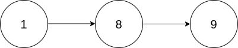
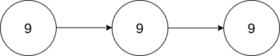

## Description

You are given the `head` of a **non-empty** linked list representing a non-negative integer without leading zeroes.

Return *the *`head`* of the linked list after **doubling** it*.
### Function Contract

- `n`: Input parameter.
- Returns expected result.

### Examples
#### Example 1

- **Input:** $head = [1,8,9]$
- **Output:** `[3,7,8]`
- **Explanation:** The figure above corresponds to the given linked list which represents the number 189. Hence, the returned linked list represents the number 189 * 2 = 378.
#### Example 2

- **Input:** $head = [9,9,9]$
- **Output:** `[1,9,9,8]`
- **Explanation:** The figure above corresponds to the given linked list which represents the number 999. Hence, the returned linked list reprersents the number 999 * 2 = 1998.
### Constraints

- The number of nodes in the list is in the range $[1, 10^{4}]$

- $0 \le \text{Node.val} \le 9$

- The input is generated such that the list represents a number that does not have leading zeros, except the number `0` itself.