## Solution

---

### Overview

We are given a singly linked list representing a non-negative integer and we need to return a linked list that represents the result of doubling the original number.

**Key Observations:**
1. The linked list does not contain any negative integers nor any leading zeros.
2. The result of doubling a digit can be greater than 9. In such cases, we need to carry over the extra digit to the next node and accommodate it in the answer.

---

### Approach 1: Reversing the List

#### Intuition

Doubling a number can be performed by adding a number to itself. We can develop a solution by following the steps of addition, which are performed from the least significant to the most significant digit. Reversing the order of the nodes in the list would allow us to traverse the list starting with the least significant digit. Then, we double each digit and perform the carry to double the number.

The idea of reversing the list seems promising, as it would allow us to process the nodes in the opposite order, starting from the least significant digit. This could make the logic for handling the carry much easier to implement.

Why would this make the logic for handling the carry much easier?

Let's consider the example from the problem statement:
```
Input: head = [1,8,9]
Output: [3,7,8]
```

Now, let's think about how we would typically process this number to double each digit and handle the carry.

If we were to process the digits from the most significant to the least significant, it would look like this:

- Double the most significant digit (1): 2
- Handle the carry (2): The carry is 0, so we don't need to do anything.
- Double the next digit (8): 16
- Handle the carry (16): The carry is 1, which needs to be added to the previous digit.
- Double the least significant digit (9): 18
- Handle the carry (18): The carry is 1, which needs to be added to the previous digit.

As we can see, handling the carry becomes more complicated as we move from the most significant digit to the least significant digit. We need to keep track of the carry and propagate it to the previous digit, which can become cumbersome, especially for longer numbers.

However, if we reverse the list, the problem becomes much simpler:

- Reverse the list: [9, 8, 1]
- Double the least significant digit (9): 18
- Handle the carry (18): The carry is 1, which can be easily added to the next digit.
- Double the next digit (8): 16
- Handle the carry (16): The carry is 1, which can be easily added to the next digit.
- Double the most significant digit (1): 2
- Handle the carry (2): The carry is 0, so we don't need to do anything.

By reversing the list, we're effectively processing the digits from the least significant to the most significant. This simplifies the carry handling logic because the carry only depends on the current digit and the previous carry, rather than having to consider the entire number.

Once the list is reversed, we can iterate through the nodes and perform the following steps for each node:
- Double the value of the current node.
- Add the carry (if any) from the previous operation.
- Replace the data of the current node with the result modulo 10 (to handle values greater than 9).
- Compute the new carry by integer division (to handle values greater than 9).

After processing all the nodes, if there is any remaining carry, we create a new node with the carry value and append it to the list.

Finally, we reverse the list one more time to restore the original order of the nodes.

The following is an illustration demonstrating the reversing the list approach:

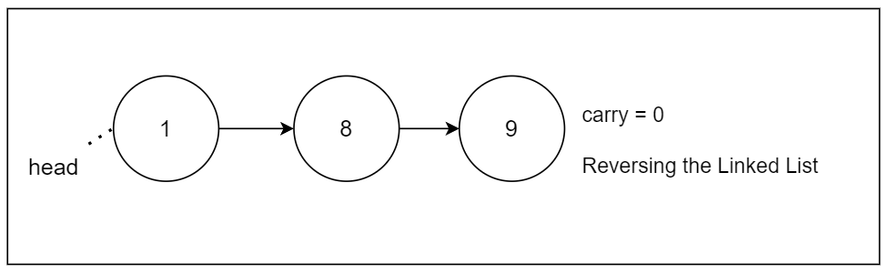

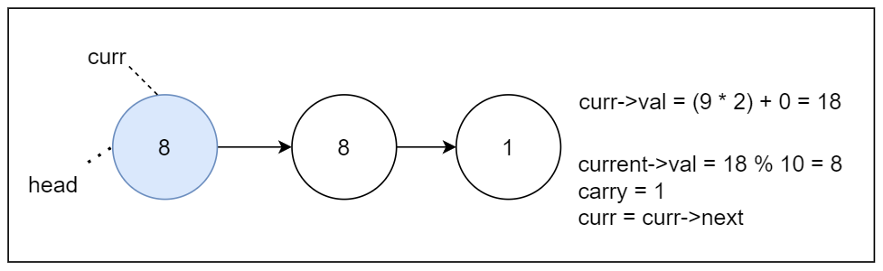

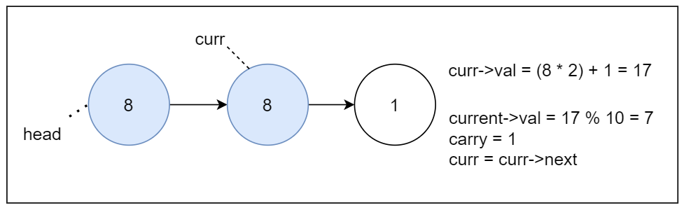

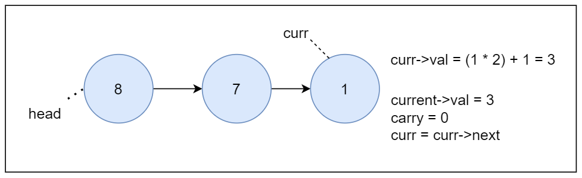

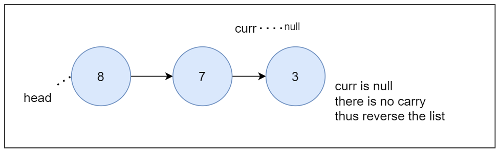

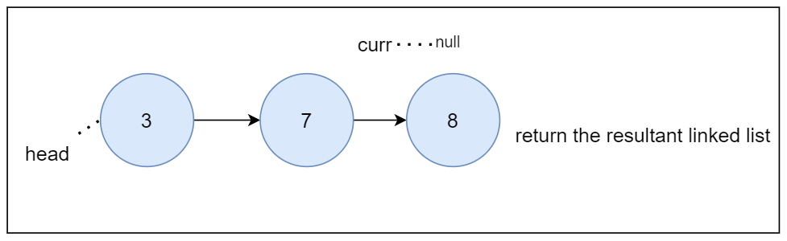

#### Algorithm

1. `doubleIt(head)` function:
  - Call the `reverseList(head)` helper function to reverse the input linked list and store it in `reversedList`.
  - Initialize two pointers, `current` and `previous`, to keep track of the current node and the previous node, respectively. Also, initialize a `carry` variable to `0`.
  - Traverse the reversed linked list:
- For each node in the reversed list:
      - Calculate the new value for the current node by doubling the current value and adding the carry.
      - Update the current node's value with the new value modulo `10`.
      - Update the `carry` variable based on the new value (`1` if the new value is greater than `9`, `0` otherwise).
      - Move the `previous` and `current` pointers to the next nodes.
  - If there's a non-zero carry left after the loop, create a new node with the carry value and attach it to the end of the list.
  - Reverse the list back to its original order: Call the `reverseList(reversedList)` function to reverse the list back to its original order and store the result in `result`.
  - Return the `result` list.

2. `reverseList(node)` function:
  - Initialize three pointers `previous` (initially `NULL`), `current` (initially `node`), and `nextNode` (to temporarily store the next node).
  - Traverse the list and reverse the links:
- While the `current` pointer is not `NULL`:
      - Store the next node in `nextNode`.
      - Reverse the link by setting `current->next` to `previous`.
      - Move the `previous` and `current` pointers to the next nodes.
  - After the loop, `previous` will be the new head of the reversed list, so return `previous`.

#### Implementation

```python
class Solution:
    def doubleIt(self, head: ListNode) -> ListNode:
        # Reverse the linked list
        reversed_list = self.reverse_list(head)
        # Initialize variables to track carry and previous node
        carry = 0
        current, previous = reversed_list, None

        # Traverse the reversed linked list
        while current:
            # Calculate the new value for the current node
            new_value = current.val * 2 + carry
            # Update the current node's value
            current.val = new_value % 10
            # Update carry for the next iteration
            carry = 1 if new_value > 9 else 0
            # Move to the next node
            previous, current = current, current.next

        # If there's a carry after the loop, add an extra node
        if carry:
            previous.next = ListNode(carry)

        # Reverse the list again to get the original order
        result = self.reverse_list(reversed_list)

        return result

    # Method to reverse the linked list
    def reverse_list(self, node: ListNode) -> ListNode:
        previous, current = None, node

        # Traverse the original linked list
        while current:
            # Store the next node
            next_node = current.next
            # Reverse the link
            current.next = previous
            # Move to the next nodes
            previous, current = current, next_node

        # Previous becomes the new head of the reversed list
        return previous
```

#### Complexity Analysis

Let $n$ be the number of nodes in the linked list.

- Time complexity: $O(n)$

    The algorithm involves traversing the linked list once to double the values and handle carry, performing constant-time operations for each node. So, it takes $O(n)$ time.

    Reversing the list also takes $O(n)$ time.

    Thus, the overall time complexity of the algorithm is $O(n)$.

- Space complexity: $O(1)$

    In-place reversal is performed, so it doesn't incur significant extra space usage. Thus, the space complexity remains $O(1)$.

---

### Approach 2: Using Stack

#### Intuition

While the first approach works, it might not be suitable in situations where integer overflow is a concern, such as in languages with fixed-size integer data types. Additionally, the previous approach made three passes through the linked list, which can be inefficient. In this case, we can consider an alternative approach using a stack to manage carry values for generating the new head. This approach ensures that we handle integer overflow concerns efficiently while also reducing the number of passes through the linked list.

The stack-based approach involves traversing the list from head to tail and pushing each node's value onto a stack. This effectively reverses the order of the digits since the stack operates on the Last In, First Out (LIFO) principle. This reversal makes it easier to handle the carry. Instead of modifying the linked list in place, we build a new linked list to store the result. We build this list from tail to head, which eliminates the need for an additional reversal compared to the previous approach.

> Learn more about stacks by reading our [Stack Explore Card](https://leetcode.com/explore/learn/card/queue-stack/230/usage-stack/).

We then start popping values from the stack and perform the necessary doubling and carry-handling operations. If there is any carry left after processing the stack, we create a new node with the carry value and prepend it to the result linked list.

#### Algorithm

- Initialize an empty stack `values` to store the values of the linked list nodes.
- Initialize a variable `val` to hold the carryover value when doubling digits.
- Traverse the linked list and push the values of the nodes onto the stack.
- Initialize the tail of the new linked list as `null`.
- Iterate over the stack of values:
  - Create a new `ListNode` with value `0` and the previous tail as its next node.
  - If the stack is not empty, pop the top value, double it, and add it to the `val`.
  - Set the value of the new node to the units digit of the new value.
  - Update the `val` to hold the carryover value for the next iteration.
- Return the tail of the new linked list.

#### Implementation

```python
class Solution:
    def doubleIt(self, head: Optional[ListNode]) -> Optional[ListNode]:
        # Initialize an empty list to store the values of the linked list
        values = []
        val = 0

        # Traverse the linked list and push its values onto the list
        while head is not None:
            values.append(head.val)
            head = head.next

        new_tail = None

        # Iterate over the list of values and the carryover
        while values or val != 0:
            # Create a new ListNode with value 0 and the previous tail as its next node
            new_tail = ListNode(0, new_tail)

            # Calculate the new value for the current node
            # by doubling the last digit, adding carry, and getting the remainder
            if values:
                val += values.pop() * 2
            new_tail.val = val % 10
            val //= 10

        # Return the tail of the new linked list
        return new_tail
```

#### Complexity Analysis

Let $n$ be the number of nodes in the linked list.

* Time complexity: $O(n)$

  The algorithm traverses the linked list once to push its values onto the stack, which takes $O(n)$ time. Then, it iterates over the stack and performs operations to create the new linked list, which also takes $O(n)$ time, as the stack contains $n$ elements.

  Therefore, the overall time complexity of the algorithm is $O(n)$.

* Space complexity: $O(n)$

  The space complexity mainly depends on the additional space used by the stack to store the values of the linked list, which takes $O(n)$ space.

  Additionally, the space used for the new linked list is also $O(n)$ since we are creating a new node for each element in the original linked list.

  Therefore, the overall space complexity of the algorithm is $O(n)$.

---

### Approach 3: Recursion

#### Intuition

The previous approach used a stack. If a problem can be solved using stack, we can often implement a similar solution using recursion, which utilizes the recursive call stack instead of a stack data structure.

The idea here is to recursively traverse the list until we reach the end, doubling the value of each node and propagating the carry value back up the recursive calls.

Once the recursion unwinds, we check if there is any non-zero carry left. If so, we create a new node with the carry value and add it to the beginning of the result linked list.

#### Algorithm

- Define a helper function `twiceOfVal(head)` that recursively computes twice each node's value and propagates the carry.
 - Base case: If `head` is `null`, return `0`.
 - Compute twice the value of the current node and add the result of the next node.
 - Update the current node's value with the units digit of the result.
 - Return the `carry` (tens digit of the result).

- In the main `doubleIt(head)` function, call the `twiceOfVal(head)` helper function to compute the carry and store it in a variable `carry`.
- If the most significant digit has a `carry` value, insert a new node at the beginning with the `carry` value.
- Return the `head` of the updated linked list.

#### Implementation

```python
class Solution:
    # To compute twice the value of each node's value and propagate carry
    def twice_of_val(self, head: Optional[ListNode]) -> int:
        # Base case: if head is None, return 0
        if not head:
            return 0

        # Double the value of current node and add the result of next nodes
        doubled_value = head.val * 2 + self.twice_of_val(head.next)

        # Update current node's value with the units digit of the result
        head.val = doubled_value % 10

        # Return the carry (tens digit of the result)
        return doubled_value // 10

    def doubleIt(self, head: Optional[ListNode]) -> Optional[ListNode]:
        carry = self.twice_of_val(head)

        # If there's a carry, insert a new node at the beginning with the carry value
        if carry:
            head = ListNode(carry, head)

        # Return the head of the updated linked list
        return head
```

#### Complexity Analysis

Let $n$ be the number of nodes in the linked list.

* Time complexity: $O(n)$

  The `twiceOfVal` function recursively traverses the entire linked list once, performing constant-time operations at each node. Therefore, the time complexity of the `twiceOfVal` function is $O(n)$.

  The `doubleIt` function calls the `twiceOfVal` function once, which has a time complexity of $O(n)$. Additionally, inserting a new node at the beginning of the linked list takes constant time. Hence, the overall time complexity of the `doubleIt` function is $O(n)$.

  Therefore, the overall time complexity of the algorithm is $O(n)$.

* Space complexity: $O(n)$

    The `twiceOfVal` function is tail-recursive, meaning it should typically use $O(1)$ space on the call stack due to the recursive calls in C++ and Java. However, in languages like Python, which don't optimize tail recursion, each recursive call consumes additional space on the call stack. Therefore, the space complexity of `twiceOfVal` is $O(n)$ due to the recursive call stack.

    The `doubleIt` function uses no additional space apart from the space required for the input linked list. Hence, its space complexity is $O(1)$.

    Therefore, the overall space complexity of the algorithm is dominated by the recursive call stack, making it $O(n)$.

---

### Approach 4: Two Pointers

#### Intuition

One of the main challenges in the problem is dealing with the carry when doubling the values of the nodes. The previous approaches handled this by either reversing the list or using a stack to reverse the order of the digits, which introduced linear auxiliary space and/or multiple passes through the linked list. Now, let's consider a more efficient approach that aims to update the list in-place without reversing it.

The insight here is that to handle the carry efficiently, we need to maintain some context about the previous node's value. This would allow us to update the previous node's value if the current node's doubled value resulted in a carry. It's like preserving the state of the carry.

To maintain the necessary context, we can use two pointers: "previous" and "current". The "previous" pointer keeps track of the previous node, while the "current" pointer points to the node being processed.

By using the two pointers, we can iterate through the list and process the nodes. For each node, we can double the value and handle the carry by updating the previous node's value if necessary.

When processing each node in the linked list, there are three distinct cases to consider:

1. If the doubled value is less than `10`:

    In this case, the value of the current node is simply replaced with its doubled value.

2. If the doubled value is greater than or equal to `10`:

    Here, the value of the current node is replaced with the remainder (modulo `10`) of its doubled value, and the previous node's value is updated to reflect the carry.

3. If the first node's value needs to be updated with a carry:

    If the doubled value of the first node is greater than or equal to `10`, a new node is created with a value of `1`, and it becomes the new head of the list.

This structured approach ensures proper handling of each node in the linked list while accounting for carry values when necessary.

The following is an illustration demonstrating the two pointer approach:

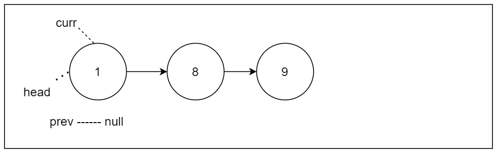

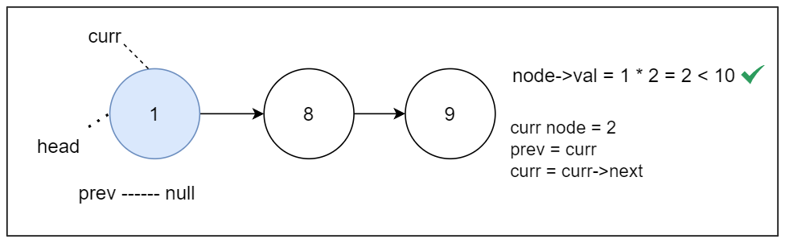

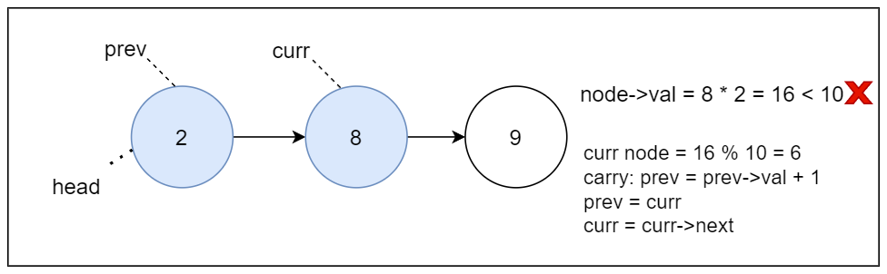

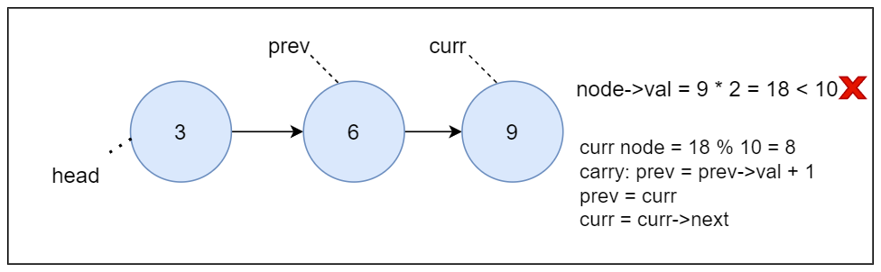

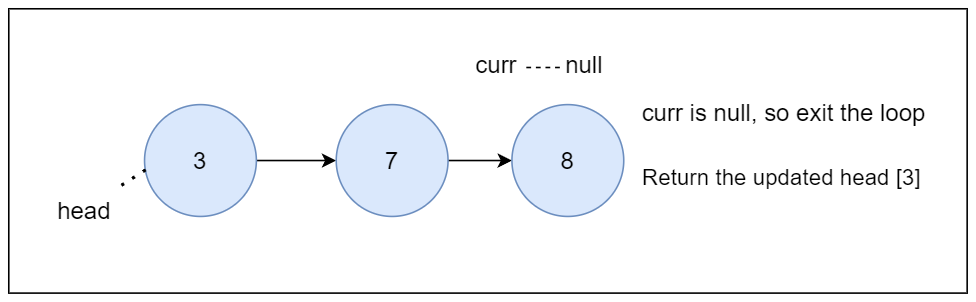

#### Algorithm

- Initialize `current` and `previous` pointers to traverse the linked list.
- For each node:
 - Compute twice the value of the current node.
 - If the doubled value is less than 10, update the current node's value.
 - If the doubled value is 10 or greater:
   - Update the current node's value with the units digit of the doubled value.
   - If the `previous` pointer is not `null` (not the first node), update the previous node's value to add the carry.
 - If it's the first node and the doubled value is 10 or greater, create a new node with the carry value and link it to the current node, updating the `head` pointer.
- Update the `previous` and `current` pointers to the next nodes.
- Return the `head` of the modified linked list.

#### Implementation

```python
class Solution:
    def doubleIt(self, head: ListNode) -> ListNode:
        curr = head
        prev = None

        # Traverse the linked list
        while curr:
            twice_of_val = curr.val * 2

            # If the doubled value is less than 10
            if twice_of_val < 10:
                curr.val = twice_of_val
            # If doubled value is 10 or greater
            elif prev:  # other than first node
                # Update current node's value with units digit of the doubled value
                curr.val = twice_of_val % 10
                # Add the carry to the previous node's value
                prev.val += 1
            else:  # first node
                # Create a new node with carry as value and link it to the current node
                head = ListNode(1, curr)
                # Update current node's value with units digit of the doubled value
                curr.val = twice_of_val % 10

            # Update prev and curr pointers
            prev = curr
            curr = curr.next

        return head
```

#### Complexity Analysis

Let $n$ be the number of nodes in the linked list.

* Time complexity: $O(n)$

  The algorithm traverses the entire linked list once. Within the loop, each operation (including arithmetic operations and pointer manipulations) takes constant time.

  Therefore, the time complexity of the algorithm is $O(n)$.

* Space complexity: $O(1)$

  The algorithm uses only a constant amount of additional space for storing pointers and temporary variables, regardless of the size of the input linked list.

  Therefore, the space complexity is $O(1)$.

---

### Approach 5: Single Pointer

#### Intuition

A key goal of the two-pointer approach was to reduce the memory footprint of the solution. While efficient, this approach still required maintaining two separate pointers (`prev` and `curr`).

We found that updating the previous node's value was only necessary when there was a carry from the current node. This insight will become the foundation for the single-pointer approach.

By focusing on where the previous node's value needed to be updated, we could simplify the logic and eliminate the need for the previous pointer.

We can achieve this using a single pointer to traverse the list. For each node, we will double the value and check if there was a carry from the next node. Since each node's value can range from `0` to `9`, doubling it could result in values from 0 to 18.

If the doubled value exceeds `9`, it indicates a carry to the previous digit place. However, since we are doubling each digit, a carry would occur when the doubled value is greater than or equal to `10`. We check if the value of the next node (i.e., `current.next.val`) is greater than `4`, because if it's greater than `4`, it implies that its doubled value is at least `10`. Therefore, we can handle the carry by adding one to the current node's doubled value, which calculates the correct final value for the current node.

The following is an illustration demonstrating the single pointer approach:

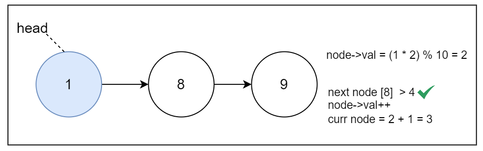

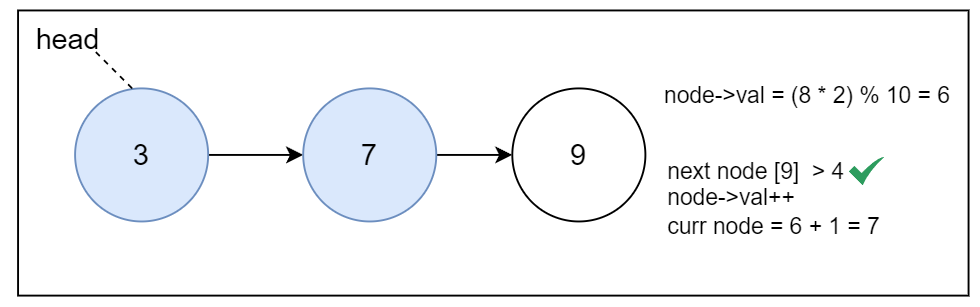

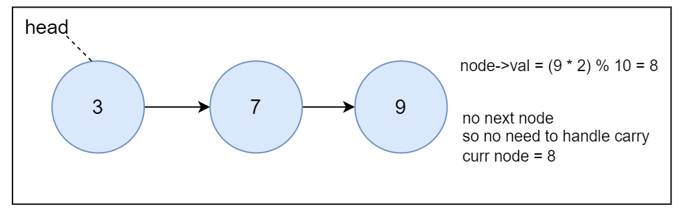

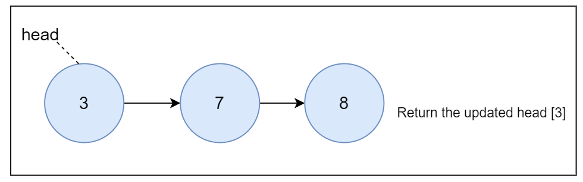

#### Algorithm

- If the value of the `head` node is greater than `4`, insert a new node with the value `0` at the beginning of the list.
- Traverse the linked list using a single `node` pointer:
 - Double the value of the current node and update it with the units digit.
 - If the current node has a next node and the next node's value is greater than `4`, increment the current node's value to handle the carry.
- Return the `head` of the updated linked list.

#### Implementation

```python
class Solution:
    def doubleIt(self, head: ListNode) -> ListNode:
        # If the value of the head node is greater than 4,
        # insert a new node at the beginning
        if head.val > 4:
            head = ListNode(0, head)

        # Traverse the linked list
        node = head
        while node:
            # Double the value of the current node
            # and update it with the units digit
            node.val = (node.val * 2) % 10

            # If the current node has a next node
            # and the next node's value is greater than 4,
            # increment the current node's value to handle carry
            if node.next and node.next.val > 4:
                node.val += 1

            # Move to the next node
            node = node.next

        return head
```

#### Complexity Analysis

Let $n$ be the number of nodes in the linked list.

* Time complexity: $O(n)$

  The algorithm traverses the entire linked list once, visiting each node. Within the loop, each operation (including arithmetic operations and pointer manipulations) takes constant time.

  Therefore, the time complexity of the algorithm is $O(n)$.

* Space complexity: $O(1)$

  The algorithm uses only a constant amount of additional space for storing pointers and temporary variables, regardless of the size of the input linked list.

  Therefore, the space complexity is $O(1)$.

---