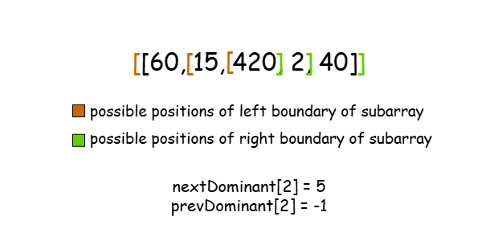

[TOC]

## Solution

---

### Overview

We are given an array of positive integers `nums`, a number `k`, and the ability to perform the following operation at most `k` times:

-   Select any non-empty subarray that has **not been chosen before**.
-   Identify the number in this subarray with the highest *prime score*. The prime score of a number `num` is defined as the number of distinct prime factors of `num`. For example, `60` has a prime score of `3` because $60 = 2 × 2 × 3 × 5$, whereas $24 = 2 × 2 × 2 × 3$ has a prime score of `2`. If the selected subarray contains only `60` and `24`, we choose `60`. If multiple numbers have the same prime score, we select the one that appears first in the subarray.
-   Multiply the current score by the chosen number. The score starts at `1`.

Our task is to determine the greatest possible score we can achieve by performing the operation at most `k` times. Since the result may be large, we return it modulo $10^{9} + 7$.

An important observation is that since the array consists of positive integers, multiplying the current score by any of them can only increase or maintain its value. Therefore, it is always optimal to perform all `k` allowed operations. Notice that the constraint $k \le (n + 1) * n / 2$ ensures that there are always enough unique subarrays to apply the operations on.

Now, consider a variation of the problem where we are not restricted to choosing a previously unselected subarray for each operation. What would be the optimal strategy to maximize our score? Intuitively, we would always select the subarray containing the greatest element, repeating this choice `k` times. This is valid because, in subarrays of length `1`, the largest element would have the highest prime score and would always be chosen.

However, in our original problem, we cannot repeatedly select the same subarray. We could start by choosing the subarray containing the maximum element, but what happens next? While there may still be subarrays that include this maximum element, we cannot be certain that it has the highest prime score in each of them.

---

### Approach 1: Monotonic Stack & Priority Queue

#### Intuition

> For convenience, let the element with the highest prime score in a subarray be the "dominant" element of that subarray.

To address the challenge described above, it is helpful to calculate the number of subarrays each number is dominant in. With this information, we can start with the largest element and apply the operation to all subarrays where it remains dominant. We then repeat this for the second-largest element, and so on, until no further operations can be performed.

First, we need an efficient way to calculate the prime score of a number `n`. To do this, we iterate over all numbers in the range `[2, sqrt(n)]`. If we find a number `p` that divides `n`, we increment the prime score and remove all occurrences of `p` in `n` by repeatedly dividing `n` by `p` until it is no longer possible. Notice that we don't need to check if `p` is prime to increment the prime score because any composite number (e.g., `9`, `15`) will have had its smaller prime factors removed earlier and therefore will not divide `n`. Finally, if $n \ge 2$, `n` must be prime, so we increment the score once more.

Now, notice that a number remains dominant until another element with a greater prime score appears either to its left or right. To efficiently determine this region, we use a monotonic decreasing stack, which helps identify the nearest elements with a higher prime score on both sides.

To better understand monotonic stacks, you can try solving [Next Greater Element I](https://leetcode.com/problems/next-greater-element-i/) first. It’s a great prerequisite for this problem!

A monotonic stack is a data structure that maintains a specific order as elements are inserted. In this case, we need a monotonically decreasing stack based on prime scores, meaning each new element can only be added if it has a lower prime score than the one at the top. If the top element has a greater prime score, we pop it from the stack. When the current element causes another to be popped, it means it is the first element with a higher prime score to the right. Conversely, if we reach an element in the stack with a greater prime score than the current one, that element is the first with a higher prime score to the left.

!?!../Documents/2818/2818_monotonic_decreasing_stack.json:960,540!?!

After finding the indices of the nearest elements with a higher prime score on the left and right, $\text{prevDominant}[i]$ and $\text{nextDominant}[i]$, we can compute the number of subarrays in which the `i-th` element is dominant.

For the left boundary, we have $i - \text{prevDominant}[i]$ choices, and for each of them, we have $\text{nextDominant}[i] - i$ choices for the right boundary. This gives a total of: $(i - \text{prevDominant}[i]) * (\text{nextDominant}[i] - i)$ subarrays, where the `i-th` element is dominant.



Finally, we need an efficient way to determine the next element on which we will apply operations across all subarrays where it is dominant. Since we need to process elements in decreasing order to maximize the score, a priority queue (max-heap) is a useful data structure. It allows us to quickly extract the largest element and then remove it to move on to the next one.

> If you need a refresher on heaps, check out the [Heap Explore Card](https://leetcode.com/problem-list/heap-priority-queue/) to review their functionality and common patterns.

To sum up, the algorithm follows these steps:

1. Calculate the prime score for each number in `nums`.
2. Use a monotonic stack to determine the $\text{prevDominant}[i]$ and $\text{nextDominant}[i]$ indices for each $\text{nums}[i]$.
3. Compute the number of subarrays in which each number is dominant.
4. Use a priority queue to process the numbers in decreasing order and apply operations to all subarrays where they are dominant.

#### Algorithm

-   Initialize:
-   `n` to the size of the `nums` array.
-    an array, called `primeScores` of size `n`.
-   Iterate over `nums` with `index` from `0` to $n - 1$ to calculate the prime scores:
-   Set `num` to $\text{nums}[index]$.
-   For each `factor` in range `[2, sqrt(num)]`:
-   If `factor` divides `num`:
-   Increment $\text{primeScores}[index]$ by `1`.
-   Remove all occurrences of `factor` in `num` by repeatedly dividing by `factor`.
-   If $num \ge 2$, `num` is prime, so increment $\text{primeScores}[index]$ one more time.
-   Initialize:
-   two arrays `nextDominant` and `prevDominant` to store the indices of the nearest elements with a higher prime score on both sides of each number. Set all elements in `nextDominant` to `n` and all values of `prevDominant` to `-1`.
-   an empty stack `decreasingPrimeScoreStack`.
-   Iterate over `nums` with `index` from `0` to $n - 1$ to fill the `nextDominant` and `prevDominant` arrays:
-   While the stack is not empty and the element at index `decreasingPrimeScoreStack.top()` has a lower prime score than $\text{nums}[index]$:
-   Pop the top element of the stack as `topIndex`.
-   Set $\text{nextDominant}[topIndex]$ to the current `index`.
-   If the stack is not empty, set $\text{prevDominant}[index]$ to the index at the top of the stack.
-   Push `index` into the stack.
-   Initialize an array of size `n` called `numOfSubarrays`.
-   Iterate over `nums` with `index` from `0` to $n - 1$ to count the number of subarrays in which each element is dominant:
-   Calculate $\text{numOfSubarrays}[index]$ as $(\text{nextDominant}[index] - index) * (index - \text{prevDominant}[index])$.
-   Initialize:
-   a priority queue, `processingQueue` of pairs `(value, index)` and insert all elements of `nums` into it.
-   `score` to `1`.
-   While `k > 0`, meaning that we are still allowed to perform operations:
-   Pop the front element of the queue as `[num, index]`.
-   Calculate the number of `operations` that we will perform on subarrays in which `num` is dominant, as $min(k, \text{subarrays}[index])$.
-   Multiply `score` by $num ^ operations$ using modular exponentiation.
-   Decrement `k` by `operations`.
-   Return `score`.

#### Implementation

```python
class Solution:
    MOD = 10**9 + 7

    def maximumScore(self, nums, k):
        n = len(nums)
        prime_scores = [0] * n

        # Calculate the prime score for each number in nums
        for index in range(n):
            num = nums[index]

            # Check for prime factors from 2 to sqrt(n)
            for factor in range(2, int(math.sqrt(num)) + 1):
                if num % factor == 0:
                    # Increment prime score for each prime factor
                    prime_scores[index] += 1

                    # Remove all occurrences of the prime factor from num
                    while num % factor == 0:
                        num //= factor

            # If num is still greater than or equal to 2, it's a prime factor
            if num >= 2:
                prime_scores[index] += 1

        # Initialize next and previous dominant index arrays
        next_dominant = [n] * n
        prev_dominant = [-1] * n

        # Stack to store indices for monotonic decreasing prime score
        decreasing_prime_score_stack = []

        # Calculate the next and previous dominant indices for each number
        for index in range(n):
            # While the stack is not empty and the current prime score is greater than the stack's top
            while (
                decreasing_prime_score_stack
                and prime_scores[decreasing_prime_score_stack[-1]]
                < prime_scores[index]
            ):
                top_index = decreasing_prime_score_stack.pop()

                # Set the next dominant element for the popped index
                next_dominant[top_index] = index

            # If the stack is not empty, set the previous dominant element for the current index
            if decreasing_prime_score_stack:
                prev_dominant[index] = decreasing_prime_score_stack[-1]

            # Push the current index onto the stack
            decreasing_prime_score_stack.append(index)

        # Calculate the number of subarrays in which each element is dominant
        num_of_subarrays = [0] * n
        for index in range(n):
            num_of_subarrays[index] = (next_dominant[index] - index) * (
                index - prev_dominant[index]
            )

        # Priority queue to process elements in decreasing order of their value
        processing_queue = []

        # Push each number and its index onto the priority queue
        for index in range(n):
            heapq.heappush(processing_queue, (-nums[index], index))

        score = 1

        # Helper function to compute the power of a number modulo MOD
        def _power(base, exponent):
            res = 1

            # Calculate the exponentiation using binary exponentiation
            while exponent > 0:
                # If the exponent is odd, multiply the result by the base
                if exponent % 2 == 1:
                    res = (res * base) % self.MOD

                # Square the base and halve the exponent
                base = (base * base) % self.MOD
                exponent //= 2

            return res

        # Process elements while there are operations left
        while k > 0:
            # Get the element with the maximum value from the queue
            num, index = heapq.heappop(processing_queue)
            num = -num  # Negate back to positive

            # Calculate the number of operations to apply on the current element
            operations = min(k, num_of_subarrays[index])

            # Update the score by raising the element to the power of operations
            score = (score * _power(num, operations)) % self.MOD

            # Reduce the remaining operations count
            k -= operations

        return score
```

#### Complexity Analysis

Let $n$ be the size of `nums` array, $k$ the number of operations and $m$ the largest element in `nums`.

-   Time complexity: $O(n \times (\sqrt{m} + \log{n}))$

    The algorithm consists of the following steps:

1. First, we calculate the prime scores of each number in `nums`. This is done by iterating over all numbers in the range $[2, \sqrt{\text{num}}]$ and removing all occurrences of each factor in $\text{num}$. In the worst case (when $\text{num}$ is prime), the outer loop runs $\sqrt{\text{num}}$ times, and therefore the time complexity of this step is $O(n \times \sqrt{m})$.
2. Next, we fill the `nextDominant` and `prevDominant` arrays in $O(n)$ time, since each index is inserted and removed from the stack at most once. The calculation of the number of subarrays where each element is dominant takes an additional $O(n)$ time, since it only involves looping over `nums` and performing constant-time (arithmetic) operations in each iteration.
3. Finally, we create a priority queue where each element is inserted and removed at most once. The time complexity of this step is $O(n \log{n})$, since both insertion and removal from a priority queue take $O(\log{n})$ time. To calculate the result, we use binary exponentiation, which runs in $O(\log{\text{exponent}})$ time. Since the exponent represents the number of operations, the total time complexity of the binary exponentiation steps is $O(\log{k})$, which is bounded by $O(n \log{n})$.

    As a result, the overall time complexity of the algorithm is $O(n \times (\sqrt{m} + \log{n}))$.

-   Space complexity: $O(n)$

    All data structures we use, including `primeScores`, `nextDominant`, and `prevDominant` arrays, as well as `decreasingPrimeScoreStack` and `processingQueue`, grow linearly with the size of the input array. Therefore, the algorithm requires $O(n)$ auxiliary space.

---

### Approach 2: Sieve of Eratosthenes & Sorting

#### Intuition

In this approach, we will follow the same logic as the previous one, but we will focus on different strategies for executing the two main steps: calculating the prime scores and determining the processing order of the elements.

To calculate the prime score of each number in `nums`, we will use the "Sieve of Eratosthenes," an ancient and efficient method for finding all primes in a range `[1, n]`. The sieve works by iteratively marking the multiples of each prime number, starting from `2`. For each prime `p`, it marks all multiples of `p` as non-prime (composite). This process continues up to `sqrt(n)`, as any composite number greater than this will have already been marked by smaller primes. The remaining unmarked numbers are primes. Using this information, we can then iterate over each number and count how many smaller primes divide it evenly.

Next, we will again use a monotonic stack to identify the regions where each number is dominant in any subarray.

Finally, in the previous approach, we used a priority queue to quickly access the largest remaining element. However, a priority queue is only necessary when the insertion and removal of elements disrupt the order. In this case, since we process the elements in decreasing order, we can use a sorted array instead, which simplifies the process.

#### Algorithm

-   Define a helper function `getPrimes(limit)`:
-   Initialize:
-   an array of size $limit + 1$, called `isPrime` and set all values to `true`.
-   an empty array, called `primes`.
-   For each `number` in range: `[2, limit]`:
-   If `number` is not prime, continue.
-   Otherwise, push `number` into `primes`.
-   Mark every multiple of `number` in range `[number * number, limit]` as not prime.
-   Return `primes`.
-   In the main `maximumScore(nums, k)` function:
-   Initialize:
-   `n` to the size of the `nums` array.
-    an array, called `primeScores` of size `n`.
-   Store the greatest element of `nums` in `maxElement`.
-   Find all `primes` up to `maxElement` by calling `getPrimes(maxElement)`.
-   Iterate over `nums` with `index` from `0` to $n - 1$ to calculate the prime scores:
-   Set $num = \text{nums}[index]$.
-   For each `prime` in `primes`:
-   If $prime * prime > num$, no more primes divide `num`, so break.
-   If $num \% prime \neq 0$, continue to the next prime.
-   Increment $\text{primeScores}[index]$ by `1`.
-   While `num` is divisible by `prime`, divide `num` by `prime`.
-   If `num > 1`, `num` is prime, so increment $\text{primeScores}[index]$ by `1`.
-   Initialize:
-   two arrays `nextDominant` and `prevDominant` to store the indices of the nearest elements with a higher prime score on both sides of each number. Set all elements in `nextDominant` to `n` and all values of `prevDominant` to `-1`.
-   an empty stack `decreasingPrimeScoreStack`.
-   Iterate over `nums` with `index` from `0` to $n - 1$ to fill the `nextDominant` and `prevDominant` arrays:
-   While the stack is not empty and the element at index `decreasingPrimeScoreStack.top()` has a lower prime score than $\text{nums}[index]$:
-   Pop the top element of the stack as `topIndex`.
-   Set $\text{nextDominant}[topIndex]$ to the current `index`.
-   If the stack is not empty, set $\text{prevDominant}[index]$ to the index at the top of the stack.
-   Push `index` into the stack.
-   Initialize an array of size `n`, called `numOfSubarrays`.
-   Iterate over `nums` with `index` from `0` to $n - 1$ to count the number of subarrays in which each element is dominant:
-   Calculate $\text{numOfSubarrays}[index]$ as $(\text{nextDominant}[index] - index) * (index - \text{prevDominant}[index])$.
-   Initialize:
-   an array `sortedArray` of pairs `(value, index)` and push all elements of `nums` into it.
-   `score` to `1`.
-   `processingIndex` to `0`.
-   Sort `sortedArray` in decreasing order of `value`.
-   While `k > 0`, meaning that we are still allowed to perform operations:
-   Get the element of the `sortedArray` at `processingIndex` as `[num, index]`.
         -   Increment `processingIndex` by `1` to continue to the next element.
-   Calculate the number of `operations` that we will perform on subarrays in which `num` is dominant, as $min(k, \text{subarrays}[index])$.
-   Multiply `score` by $num ^ operations$, using modular exponentiation.
-   Decrement `k` by `operations`.
-   Return `score`.

#### Implementation

```python
class Solution:
    MOD = int(1e9 + 7)

    def maximumScore(self, nums: List[int], k: int) -> int:
        n = len(nums)
        prime_scores = [0] * n

        # Find the maximum element in nums to determine the range for prime generation
        max_element = max(nums)

        # Get all prime numbers up to max_element using the Sieve of Eratosthenes
        primes = self.get_primes(max_element)

        # Calculate the prime score for each number in nums
        for index in range(n):
            num = nums[index]

            # Iterate over the generated primes to count unique prime factors
            for prime in primes:
                if prime * prime > num:
                    break  # Stop early if prime^2 exceeds num
                if num % prime != 0:
                    continue  # Skip if the prime is not a factor

                prime_scores[index] += 1  # Increment prime score for the factor
                while num % prime == 0:
                    num //= prime  # Remove all occurrences of this factor

            # If num is still greater than 1, it is a prime number itself
            if num > 1:
                prime_scores[index] += 1

        # Initialize next and previous dominant index arrays
        next_dominant = [n] * n
        prev_dominant = [-1] * n

        # Stack to store indices for a monotonic decreasing prime score
        decreasing_prime_score_stack = deque()

        # Calculate the next and previous dominant indices for each number
        for index in range(n):
            # While the stack is not empty and the current prime score is
            # greater than the stack's top, update next_dominant
            while (
                decreasing_prime_score_stack
                and prime_scores[decreasing_prime_score_stack[-1]]
                < prime_scores[index]
            ):
                top_index = decreasing_prime_score_stack.pop()

                # Set the next dominant element for the popped index
                next_dominant[top_index] = index

            # If the stack is not empty, set the previous dominant element for
            # the current index
            if decreasing_prime_score_stack:
                prev_dominant[index] = decreasing_prime_score_stack[-1]

            # Push the current index onto the stack
            decreasing_prime_score_stack.append(index)

        # Calculate the number of subarrays in which each element is dominant
        num_of_subarrays = [
            (next_dominant[i] - i) * (i - prev_dominant[i]) for i in range(n)
        ]

        # Sort elements in decreasing order based on their values
        sorted_array = sorted(enumerate(nums), key=lambda x: -x[1])

        score = 1

        # Helper function to compute the power of a number modulo MOD
        def _power(base, exponent):
            res = 1

            # Calculate the exponentiation using binary exponentiation
            while exponent > 0:
                # If the exponent is odd, multiply the result by the base
                if exponent % 2:
                    res = (res * base) % self.MOD

                # Square the base and halve the exponent
                base = (base * base) % self.MOD
                exponent //= 2

            return res

        processing_index = 0

        # Process elements while there are operations left
        while k > 0:
            # Get the element with the maximum value
            index, num = sorted_array[processing_index]
            processing_index += 1

            # Calculate the number of operations to apply on the current
            # element
            operations = min(k, num_of_subarrays[index])

            # Update the score by raising the element to the power of
            # operations
            score = (score * _power(num, operations)) % self.MOD

            # Reduce the remaining operations count
            k -= operations

        return score

    # Function to generate prime numbers up to a given limit using the Sieve of Eratosthenes
    def get_primes(self, limit: int) -> List[int]:
        is_prime = [True] * (limit + 1)
        primes = []

        # Start marking from the first prime number (2)
        for number in range(2, limit + 1):
            if not is_prime[number]:
                continue

            # Store the prime number
            primes.append(number)

            # Mark multiples of the prime number as non-prime
            for multiple in range(number * number, limit + 1, number):
                is_prime[multiple] = False

        return primes
```

#### Complexity Analysis

Let $n$ be the size of `nums` array, $k$ the number of operations and $m$ the largest element in `nums`.

- Time complexity: $O\left(n \times \left(\log{n} + \frac{\sqrt{m}}{\log{m}} + \log{k}\right) + m \log{\log{m}}\right)$

    The algorithm consists of the following steps:

1. We first use the Sieve of Eratosthenes to find all primes in the range $[1, m]$, which takes $O(m \log \log m)$ time to compute the primes up to $m$.

2. For each number in `nums`, we iterate over the list of primes up to $\sqrt{m}$. The number of primes up to $\sqrt{m}$ is approximately $\frac{\sqrt{m}}{\log{m}}$, so the prime factorization of each number takes $O(\frac{\sqrt{m}}{\log{m}})$ time, and for all numbers in `nums`, this takes $O(n \times \frac{\sqrt{m}}{\log{m}})$.

3. Filling the `nextDominant` and `prevDominant` arrays takes $O(n)$ time, as each index is processed at most once, and the number of subarrays is calculated in constant time for each index, which also takes $O(n)$.

4. Sorting the `sortedArray` takes $O(n \log n)$ time.

5. Binary exponentiation is performed to compute the result, which takes $O(\log{k})$ time for each operation. Since the loop runs at most $n$ times, the total time complexity for the exponentiation step is $O(n \log k)$.

    Therefore, the overall time complexity is: $O\left(n \times \left(\log{n} + \frac{\sqrt{m}}{\log{m}} + \log{k}\right) + m \log{\log{m}}\right)$

- Space complexity: $O(m + n)$

    We use an array `isPrime` of size $O(m)$ to mark numbers as prime or not. Additionally, several data structures such as `primes`, `primeScores`, `nextDominant`, `prevDominant`, and `sortedArray` are used, all of which grow linearly with the size of the input array, $O(n)$.

    The space required for sorting depends on the language:
- In Java, the space complexity is $O(\log n)$ due to Quick Sort.
- In C++, it is $O(\log n)$ for the hybrid sort.
- In Python, it is $O(n)$ due to Timsort.

    Therefore, the total space complexity is $O(m + n)$.

---