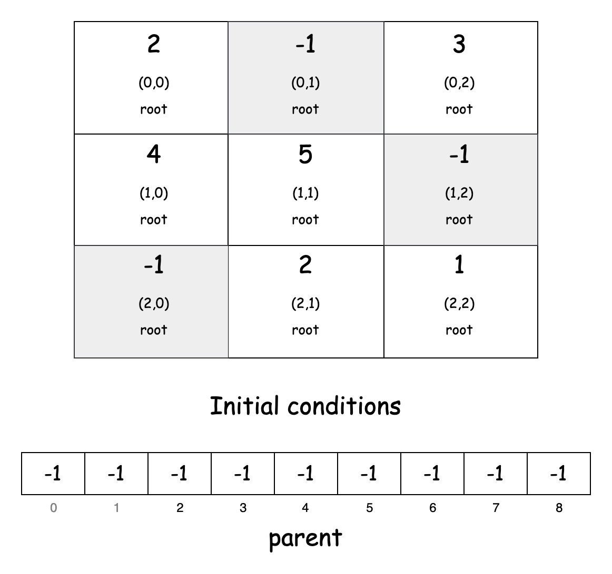
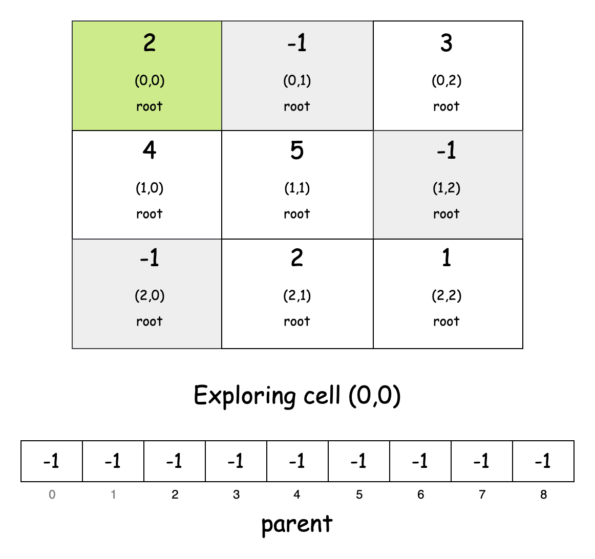
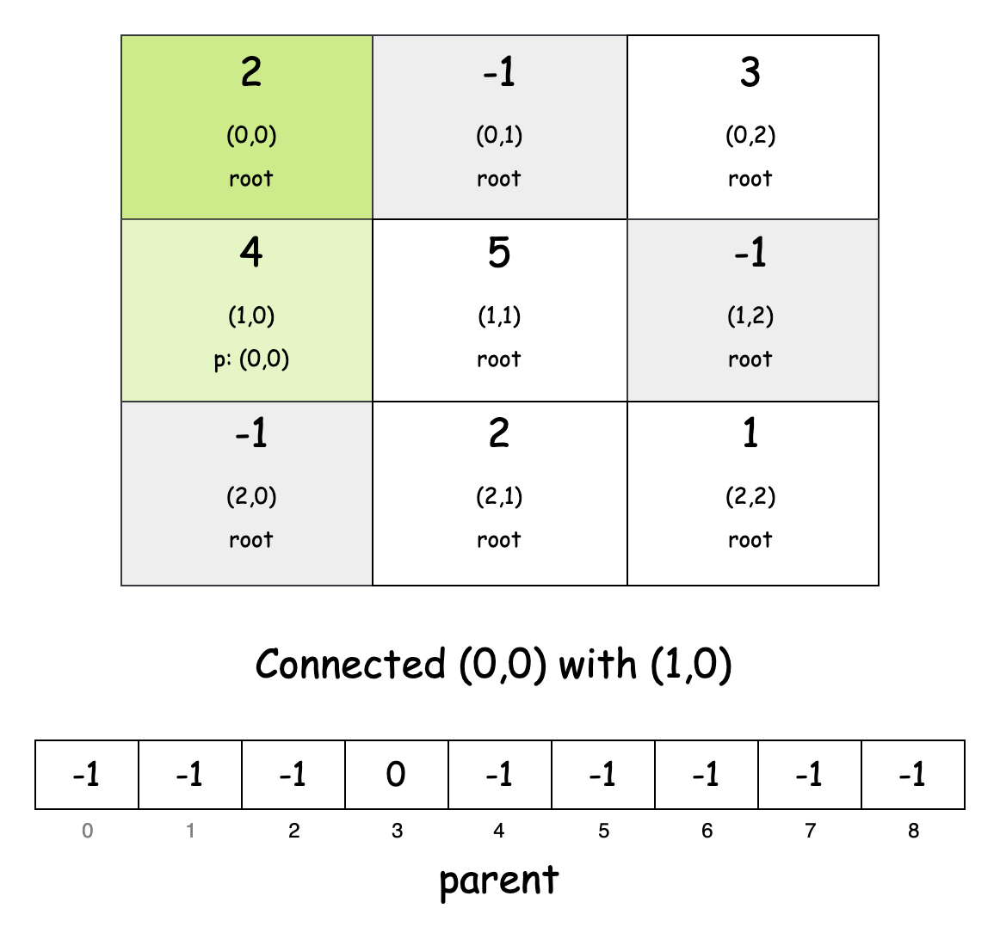
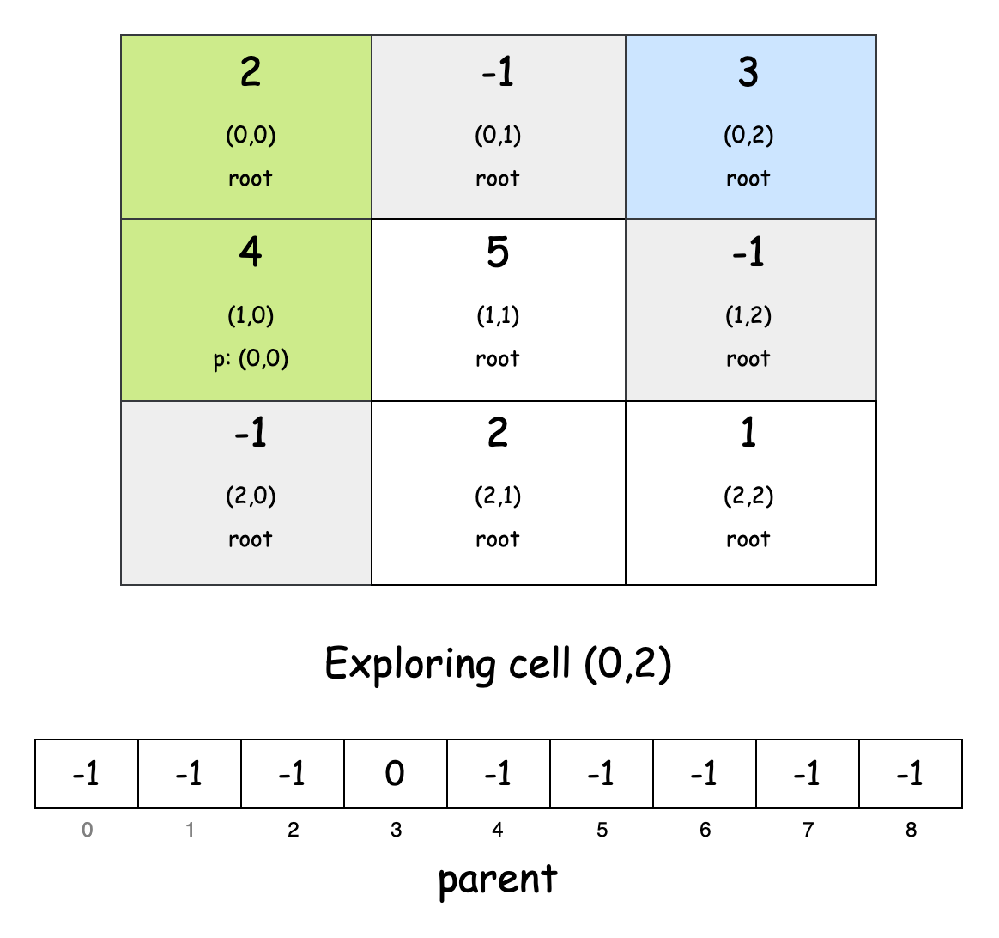
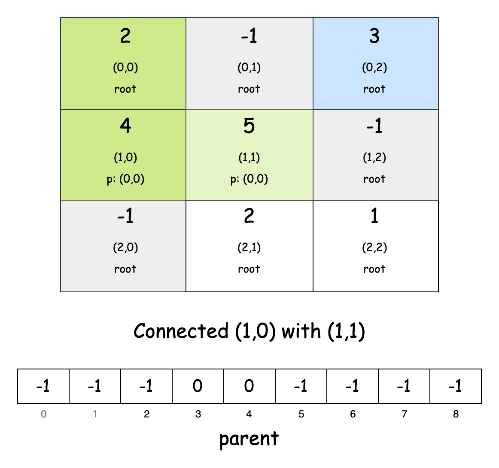
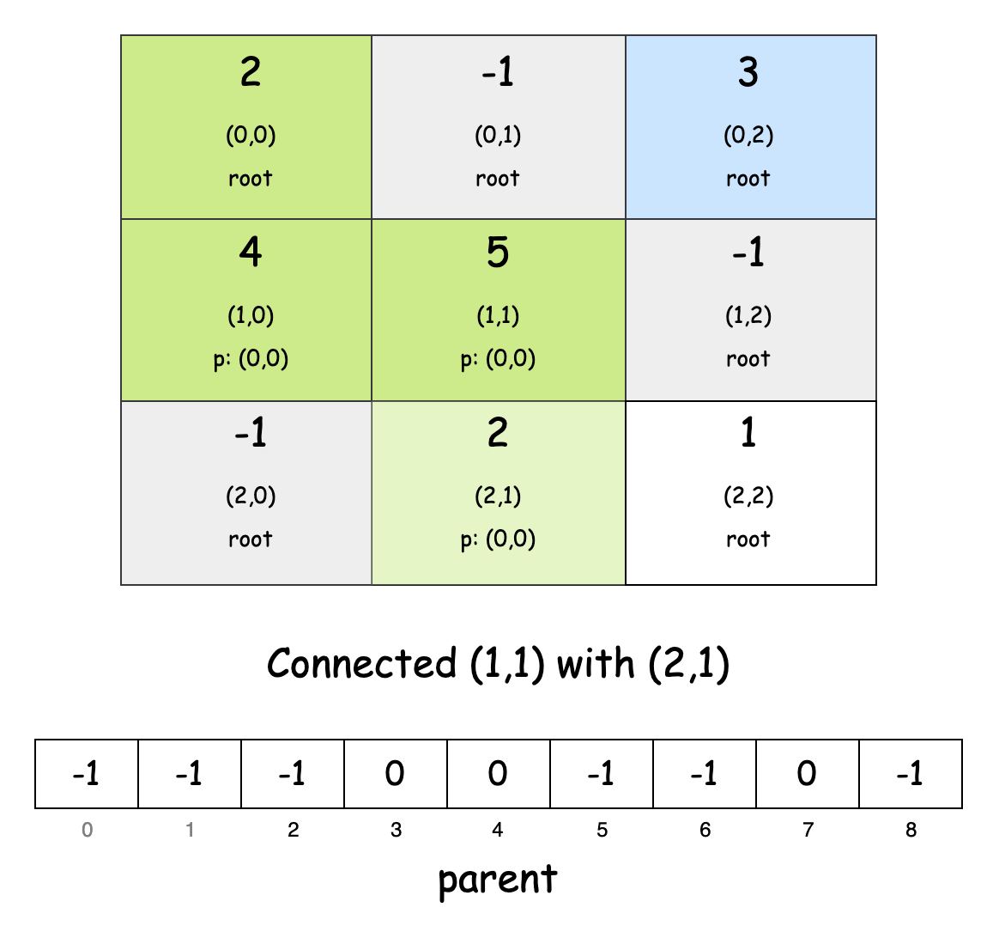
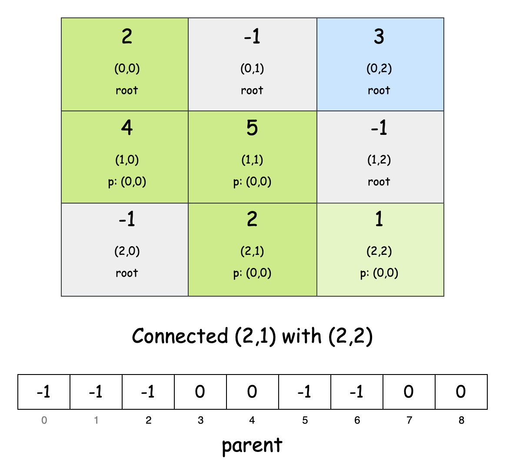
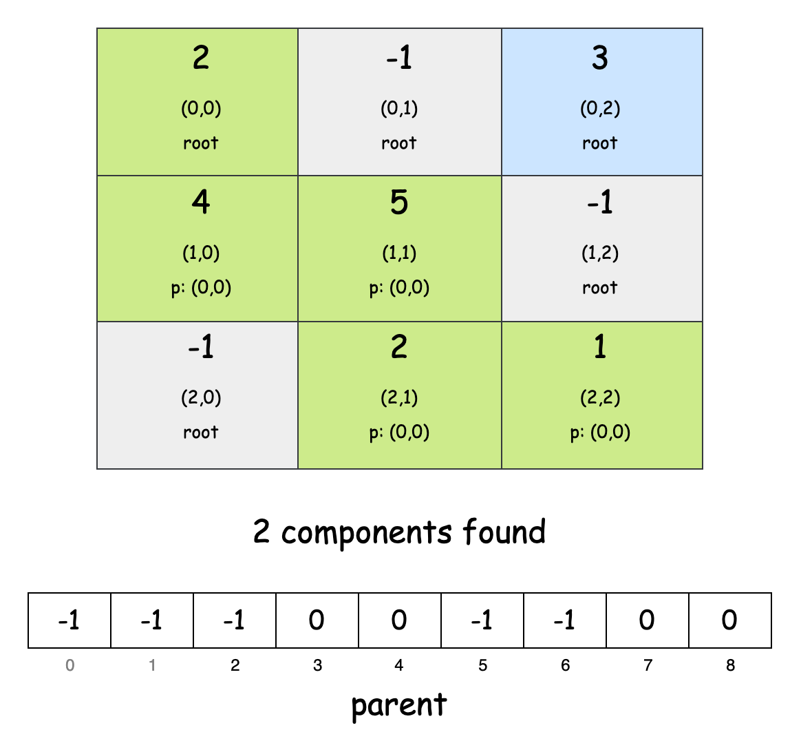

## Solution

---

### Overview

The problem requires calculating the *remoteness* for each cell in a grid. The remoteness of a cell is defined as the sum of all values in the grid that are *not reachable* from that cell. Finally, we need to compute the total remoteness of all cells in the grid.

There are two main observations we can make from the *remoteness* and *not reachable* criteria, as shown below:

1. Reachable vs. Unreachable Cells

   The sum of all cells reachable from a given cell is simply the total sum of all cells in the grid minus the sum of all unreachable cells. Thus, for any cell, its remoteness can be expressed as: $\text{remoteness} = \text{total\\_sum} - \text{reachable\\_sum}$

2. Isolated Islands in the Grid

   The grid can be thought of as containing multiple "islands" of connected cells, separated by blocked cells (`-1`). Within each island, all cells are mutually reachable. As a result, the remoteness for all cells in the same island will be identical because they share the same set of reachable and unreachable cells.

Thus, from these observations, we can conclude that instead of calculating the remoteness for each cell individually, we only need to compute it once per connected component (island).

---

### Approach 1: Depth-First Search (DFS)

#### Intuition

First, we need to find the sum of cells within each connected component. For that, we need to figure out a way to traverse over an entire component and keep track of its size and sum of values simultaneously.

A very popular algorithm to traverse over a grid is the [Depth-First Search (DFS) 🔗](https://leetcode.com/explore/featured/card/graph/619/depth-first-search-in-graph/3882/) algorithm. DFS works by starting at one cell and exploring as far as possible along each branch before backtracking.

Let's define a recursive Depth-First Search function `dfs`. In DFS we need to calculate two key pieces of information for each component:
   - The sum of all cell values in the component.
   - The count of reachable cells in the component.

To find this, we'll use a helper array `arr` where $\text{arr}[0]$ stores the sum of the values of the cells visited during the DFS traversal and $\text{arr}[1]$ stores the number of cells visited, i.e., the size of the connected component.

During each recursive call, we update `arr` by adding the current cell's value and increasing the cell count. To prevent revisiting cells, we mark each explored cell as visited by changing its value to `-1`. The function then recursively calls itself to explore all valid neighboring cells that are neither blocked nor previously visited.

Once DFS completes for a connected component, we can calculate the remoteness for all cells in that component using the formula: $\text{remoteness} = (\text{sum of all grid cells}) - (\text{sum of cells in the current component})$

This gives us the remoteness of each cell in the component. Since all cells in the component share the same set of reachable and unreachable cells, we multiply the remoteness by the number of cells in that component to get the total remoteness contribution of that component.

Once we've explored the entire grid and called DFS on all connected components, the `result` will contain the final sum of remoteness values for all cells in the grid.

#### Algorithm

- Initialize a direction array `dir` containing four pairs of integers to represent the four possible movement directions,  right: `(0,1)`, left: `(0,-1)`, down: `(1,0)`, up: `(-1,0)`.

Main Method `sumRemoteness`:

- Initialize a variable:
  -  `n` to store the length of the grid (assuming it's a square grid).
  - `totalSum` to 0 for accumulating the sum of all non-blocked cells.
- Iterate through each cell in the grid:
  - If the cell value is not `-1` (not blocked), add its value to `totalSum`.
- Initialize a variable `result` to `0` that will store the final sum of all remoteness values.

- For each cell `(row, col)` in the `grid`:
  - Check if its value is greater than `0` (indicating it is a valid, non-blocked cell). If so:
- Create an array `arr` of size 2 to store:
      - $\text{arr}[0]$: Running sum of all cells reachable from the current cell.
      - $\text{arr}[1]$: Count of how many cells are reachable from the current cell.
- Perform DFS starting from this cell to populate `arr`.
- Calculate the unreachable sum as $totalSum - \text{arr}[0]$.
- Multiply the unreachable sum by the count of reachable cells ($\text{arr}[1]$) and add this value to `result`.
- Return the final `result`.

Helper method `dfs(grid, row, col, arr)`:

- Add the current cell's value to the running sum in $\text{arr}[0]$.
- Increment the reachable cells counter in $\text{arr}[1]$.
- Mark the current cell as visited by changing its value to `-1`.
- For each of the four possible directions:
  - Calculate the new coordinates by adding the direction offsets.
  - If the new coordinates are valid (using the `isValid` function), recursively call `dfs` on them.

Helper method `isValid(grid, row, col)`:

- Return `true` if:
  - The row index `row` is between `0` and $n - 1$ (inclusive).
  - The column index `col` is between `0` and $n - 1$ (inclusive).
  - The cell at `(row, col)` has a value greater than 0 (not blocked or visited).

#### Implementation

```python
class Solution:
    def sumRemoteness(self, grid: list[list[int]]) -> int:
        # Direction arrays for moving up, down, left, right
        self.dir = [(0, 1), (0, -1), (1, 0), (-1, 0)]
        n = len(grid)

        # Calculate total sum of all non-blocked cells
        total_sum = sum(val for row in grid for val in row if val != -1)

        # Calculate remoteness for each non-blocked cell
        result = 0
        for row in range(n):
            for col in range(n):
                if grid[row][col] > 0:
                    # arr[0] = sum of reachable cells
                    # arr[1] = count of reachable cells
                    arr = [0, 0]
                    self._dfs(grid, row, col, arr)
                    result += (total_sum - arr[0]) * arr[1]

        return result

    # DFS to find sum and count of all cells reachable from (row, col)
    def _dfs(
        self, grid: list[list[int]], row: int, col: int, arr: list
    ) -> None:
        arr[0] += grid[row][col]  # Add current cell value to sum
        arr[1] += 1  # Increment reachable cells count
        grid[row][col] = -1  # Mark as visited

        # Explore all 4 directions
        for di, dj in self.dir:
            new_row, new_col = row + di, col + dj
            if self._is_valid(grid, new_row, new_col):
                self._dfs(grid, new_row, new_col, arr)

    # Checks if cell (row, col) is within grid bounds and not blocked/visited
    def _is_valid(self, grid: list[list[int]], row: int, col: int) -> bool:
        n = len(grid)
        return 0 <= row < n and 0 <= col < n and grid[row][col] > 0
```

#### Complexity Analysis

Let $n \times n$ be the dimensions of the grid.

- Time complexity: $O(n^2)$

    The algorithm iterates through every cell of the grid at least once. For each valid, non-blocked cell, a Depth-First Search (DFS) is performed. Since each cell is marked as visited during the DFS, no cell is revisited. This ensures that the total time spent in DFS across all cells is proportional to $n^2$.

    Additionally, summing up the values of reachable cells and calculating contributions involve constant-time operations for each cell. Hence, the overall time complexity is $O(n^2)$.

- Space complexity: $O(n^2)$

    The space complexity has two components:
1. The recursive call stack during DFS can go up to $O(n^2)$ in the worst case when all cells are non-blocked and form a snake-like path through the grid.
2. The constant space used by variables like `totalSum`, `result`, and the direction array is negligible.

    Since the DFS modifies the grid in place by marking visited cells as `-1`, we don't need an additional visited array. Therefore, the dominant factor is the recursive call stack, making the overall space complexity $O(n^2)$.

---

### Approach 2: Breadth-First Search (BFS)

#### Intuition

Another popular way to explore a grid is the [Breadth-First Search (BFS) 🔗](https://leetcode.com/explore/featured/card/graph/620/breadth-first-search-in-graph/3883/) algorithm, and it has distinct advantages over DFS. Notably, BFS avoids using recursive stack space, making it more suitable for large grids where deep recursion might lead to stack overflow errors.

We'll use BFS to track both the number of cells and the sum of cell values in each connected component. BFS explores cells layer by layer, meaning it explores all neighboring cells at the present depth level before moving on to cells at the next level. This is achieved through the use of a queue, where the first cell of a component is added to the queue. BFS then explores the grid by dequeuing elements and checking their neighbors. Any unexplored neighbors get added to the queue for later exploration.

As we explore each cell, we keep track of the cell value and the number of cells we have explored so far. Once BFS finishes exploring a component (when the queue is empty), we can calculate the remoteness for all cells in that component. The remoteness is computed as: $\text{remoteness} = (\text{sum of all grid cells}) - (\text{sum of cells in the current component})$

Since all cells in the component share the same remoteness, we use the component's total size to multiply this value.

The BFS is executed for each connected component in the grid. When all cells in the grid have been explored, we will have accumulated the total remoteness for all connected components. The sum of these remoteness values is our final answer.

#### Algorithm

- Initialize a direction array `dir` containing four pairs of integers to represent the four possible movement directions,  right: `(0,1)`, left: `(0,-1)`, down: `(1,0)`, up: `(-1,0)`.

Main method `sumRemoteness`:

- Initialize a variable:
  - `n` to store the length of the grid.
  - `totalSum` to `0` for accumulating the sum of all non-blocked cells.
- Iterate through each cell in the grid:
  - If the cell value is not `-1` (not blocked), add its value to `totalSum`.

- Initialize a variable `result` to `0` that will store the final sum of all remoteness values.

- For each cell `(row, col)` in the `grid`:
  - Check if its value is greater than `0` (indicating it is a valid, non-blocked cell). If so:
   - Call the `bfs` function starting from this cell.
   - Add the returned value (remoteness contribution) to the `result`.
- Return the final `result` as our answer.

Helper method `bfs(grid, row, col, totalSum)`:
- Initialize a variable:
  -  `compSum` with the value of the starting cell.
  - `compSize` to `1` to track the number of cells in this component
- Mark the starting cell as visited by setting it to `-1`.
- Initialize a `queue` with the starting cell's coordinates.
- While the `queue` is not empty:
 - Remove the first cell from the queue.
 - For each of the four possible directions:
   - Calculate the new coordinates by adding the direction offsets.
   - If the new coordinates are valid:
- Add the new cell to the queue.
- Add its value to `compSum`.
- Increment `compSize`.
- Mark the cell as visited.
- Calculate the remoteness for the current component as $(totalSum − compSum) * compSize$.
- Return the calculated remoteness value.

Helper method `isValid(grid, row, col)`:
- Return `true` if:
  - The row index `row` is between `0` and $n - 1$ (inclusive).
  - The column index `col` is between `0` and $n - 1$ (inclusive).
  - The cell at `(row, col)` has a value greater than 0 (not blocked or visited).

#### Implementation

```python
class Solution:
    def sumRemoteness(self, grid: list[list[int]]) -> int:
        # Direction arrays for moving up, down, left, right
        self.dir = [(0, 1), (0, -1), (1, 0), (-1, 0)]
        n = len(grid)

        # Calculate total sum of all non-blocked cells
        total_sum = sum(val for row in grid for val in row if val != -1)

        # Calculate remoteness for each non-blocked cell
        result = 0
        for row in range(n):
            for col in range(n):
                if grid[row][col] > 0:
                    result += self._bfs(grid, row, col, total_sum)

        return result

    # BFS to find sum and count of all cells reachable from (row, col)
    def _bfs(
        self, grid: list[list[int]], row: int, col: int, total_sum: int
    ) -> int:
        comp_sum = grid[row][col]  # Sum of values in current component
        comp_size = 1  # Number of cells in component
        grid[row][col] = -1  # Mark as visited

        queue = deque([(row, col)])
        while queue:
            curr_row, curr_col = queue.popleft()

            # Explore all 4 directions
            for di, dj in self.dir:
                new_row, new_col = curr_row + di, curr_col + dj
                if self._is_valid(grid, new_row, new_col):
                    queue.append((new_row, new_col))
                    comp_sum += grid[new_row][new_col]
                    comp_size += 1
                    grid[new_row][new_col] = -1  # Mark as visited

        # Return remoteness value for this component
        return (total_sum - comp_sum) * comp_size

    # Checks if cell (row, col) is within grid bounds and not blocked/visited
    def _is_valid(self, grid: list[list[int]], row: int, col: int) -> bool:
        n = len(grid)
        return 0 <= row < n and 0 <= col < n and grid[row][col] > 0
```

#### Complexity Analysis

Let $n \times n$ be the dimensions of the `grid`.

- Time Complexity: $O(n^2)$

    The algorithm traverses the grid multiple times. The outer loops in the `sumRemoteness` method iterate through all $n^2$ cells. For each cell, the `bfs` function processes all reachable cells in its connected component. Since each cell is visited and processed exactly once during all BFS traversals, the total number of operations is proportional to $n^2$. Thus, the overall time complexity is $O(n^2)$.

- Space Complexity: $O(n^2)$

    The `bfs` function uses a queue to store cell coordinates during traversal. In the worst case, if the entire grid is a single connected component, the queue can hold up to $n^2$ elements. Therefore, the space complexity is $O(n^2)$.

---

### Approach 3: Disjoint Set Union (Union-Find)

#### Intuition

From the previous approaches, we saw that all cells in the same connected component have the same remoteness value. This observation leads us to consider treating each connected component as a single unit, which we can do using an algorithm known as the Disjoint Set Union (Union-Find) algorithm.

Imagine our grid as a network of cells where each non-blocked cell initially stands alone. As we examine the grid, whenever we find two adjacent non-blocked cells, we can "unite" them into the same component. This is exactly what [Disjoint Set Union (Union-Find) 🔗](https://leetcode.com/explore/featured/card/graph/618/disjoint-set/3881/) does – it maintains sets of connected elements and can efficiently combine these sets.

Each cell has a parent value, which is initially the cell itself. When we unite (or **union** two cells), we set the parent of one cell as the parent of the other. This means that both cells now have the same parent, and hence, part of the same component.

To search for the parent of a cell, we need to trace back to the parent of the component. The parent of a component will have its parent as itself, and all other cells will have their parents as other cells. If we keep tracking these parents (like following a family tree upwards), we will eventually land on the leader which has no parent above it.

As we go through the grid, we union each unblocked cell with its adjacent unblocked cells, ensuring all connected cells belong to the same component. We face a small challenge here: each cell has two coordinates (row, column), but the Union-Find structure uses a one-dimensional parent array. To handle this, we convert the two-dimensional coordinates into a single index representing the cell’s position in a flattened grid.

The following slideshow demonstrates how the Union-Find algorithm would work for a $3 \times 3$ grid:

















After performing the unions, we need to calculate the sum of values for each connected component. A hash map can store the sum of cell values for each component, with the parent cell of the component as the key. We find this sum by looking at each cell, finding its parent, and adding its value to that parent's running total.

The final step is calculating remoteness. For each cell, its remoteness equals the sum of all grid values minus the sum of values in its component, since it can reach every cell in its own component. Adding up all these remoteness values gives us our answer.

> For a more comprehensive understanding of graph algorithms like DFS, BFS and Union Find, check out the [Graph Explore Card 🔗](https://leetcode.com/explore/featured/card/graph/). This resource provides an in-depth look at popular graph algorithms, explaining their key concepts and applications with a variety of problems to solidify understanding of the pattern.

#### Algorithm

- Initialize a direction array `dir` containing four pairs of integers to represent the four possible movement directions,  right: `(0,1)`, left: `(0,-1)`, down: `(1,0)`, up: `(-1,0)`.

Main method `sumRemoteness`:

- Initialize a variable `n` to store the length of the input grid.
- Create a new `UnionFind` object `uf` of size $n * n$.
- For each cell `(row, col)` in the grid:
  - If the current cell value is `-1`, skip to the next cell.
  - For each direction vector in `dir`:
- Calculate the new coordinates `(newRow, newCol)` by adding the direction offsets.
- If these new coordinates are valid:
      - Convert current coordinates`(row, col)` to 1-D index.
      - Convert new coordinates `(newRow, newCol)` to 1-D index.
      - Union these two indices in the `UnionFind` structure.
- Initialize a variable `totalSum` to 0 to store sum of all non-blocked cells.
- Create a hash map `compSum` to map component roots to their sums.
- For each cell `(row, col)` in the grid:
  - If the cell is not blocked:
- Find the root of current cell's component.
- Add current cell's value to this component's sum in `compSum`.
- Add current cell's value to `totalSum`.
- Initialize a variable `result` to 0 to store final remoteness sum.
- For each cell `(row, col)` in the grid:
  - If the cell is not blocked:
- Find the root of current cell's component.
- Get the sum of current component from `compSum`.
- Add (`totalSum` - component sum) to `result`.
- Return the final `result` containing sum of all remoteness values.

`UnionFind` class:

- Create arrays `parent` and `rank` of size $n * n$.
- Initialize all elements in `parent` to `-1` (each cell starts as its own root) and all elements in `rank` to `1` (each cell is its own component).

- The `find` function for a given `index`:
  - If $\text{parent}[index]$ is `-1`, return `index` as it's a root.
  - Otherwise, recursively find the root.
  - Update $\text{parent}[index]$ to point directly to root (path compression).
  - Return the root.

- The `union` function for indices `idx1` and `idx2`:
  - Find `root1` as the root of `idx1`.
  - Find `root2` as the root of `idx2`.
  - If `root1` equals `root2`, return as they're already connected.
  - If $\text{rank}[root1]$ is less than $\text{rank}[root2]$, make `root2` the parent of `root1`.
  - If $\text{rank}[root1]$ is greater than $\text{rank}[root2]$, make `root1` the parent of `root2`.
  - If ranks are equal, make `root1` the parent of `root2` and increment $\text{rank}[root1]$.

Helper method `getIndex(n, row, col)`:

- Return $row*n + col$ to convert 2-D coordinates to 1-D index.

Helper method `isValid(grid, row, col)`:

- Return `true` if:
  - The row index `row` is between `0` and $n - 1$ (inclusive).
  - The column index `col` is between `0` and $n - 1$ (inclusive).
  - The cell at `(row, col)` is not equal to `-1` (not blocked or visited).

#### Implementation

```python
class Solution:
    def sumRemoteness(self, grid: list[list[int]]) -> int:
        # Direction arrays for moving up, down, left, right
        self.dir = [(0, 1), (0, -1), (1, 0), (-1, 0)]
        n = len(grid)

        # Initialize Union-Find data structure with size n*n
        uf = self._UnionFind(n)

        # First pass: Connect all adjacent non-blocked cells into components
        for row in range(n):
            for col in range(n):
                # Skip blocked cells
                if grid[row][col] == -1:
                    continue

                # For each valid cell, check all 4 adjacent cells
                for di, dj in self.dir:
                    new_row, new_col = row + di, col + dj
                    # If adjacent cell is valid, connect it to current cell
                    if self._is_valid(grid, new_row, new_col):
                        # Convert 2D coordinates to 1D index and union them
                        uf.union(
                            self._get_index(n, row, col),
                            self._get_index(n, new_row, new_col),
                        )

        # Second pass: Calculate sum of values in each connected component
        comp_sum = {}  # Maps component root to its sum
        total_sum = 0

        for row in range(n):
            for col in range(n):
                if grid[row][col] == -1:
                    continue

                # Find the root of current cell's component
                parent = uf.find(self._get_index(n, row, col))
                # Add current cell's value to its component sum
                comp_sum[parent] = comp_sum.get(parent, 0) + grid[row][col]
                total_sum += grid[row][col]

        # Third pass: Calculate remoteness sum
        # For each cell, remoteness = (total_sum - sum of its component)
        result = sum(
            total_sum - comp_sum[uf.find(self._get_index(n, row, col))]
            for row in range(n)
            for col in range(n)
            if grid[row][col] != -1
        )

        return result

    class _UnionFind:
        def __init__(self, n: int):
            # Initialize all cells as individual components
            self.parent = [-1] * (n * n)
            self.rank = [1] * (n * n)

        def find(self, index: int) -> int:
            # Find with path compression for better performance
            if self.parent[index] == -1:
                return index
            self.parent[index] = self.find(self.parent[index])
            return self.parent[index]

        def union(self, idx1: int, idx2: int):
            # Union by linking roots directly
            root1 = self.find(idx1)
            root2 = self.find(idx2)

            if root1 == root2:  # Already in same component
                return

            # Make the root with the higher rank the parent of the other root
            if self.rank[root1] < self.rank[root2]:
                self.parent[root1] = root2
            elif self.rank[root1] > self.rank[root2]:
                self.parent[root2] = root1
            else:
                self.parent[root2] = root1
                self.rank[root1] += 1

    def _get_index(self, n: int, row: int, col: int) -> int:
        # Converts 2D coordinates to 1D index
        return row * n + col

    def _is_valid(self, grid: list[list[int]], row: int, col: int) -> bool:
        # Checks if cell (row, col) is within grid bounds and not blocked
        n = len(grid)
        return 0 <= row < n and 0 <= col < n and grid[row][col] != -1
```

#### Complexity Analysis

Let $n \times n$ be the dimensions of the `grid`.

- Time complexity: $O(n^2 \alpha(n^2)) \approx O(n^2)$

    The algorithm makes three passes through the grid:
1. The first pass performs Union operations for each cell and its valid neighbors. For each cell, we do at most $4$ `union` operations, each taking $O(\alpha(n^2))$ time where $\alpha$ is the inverse Ackermann function.
2. The second pass calculates the total and component sums, requiring a single traversal of $n^2$ cells, resulting in $O(n^2)$ time.
3. The third pass computes the remoteness sum for each cell, another $O(n^2)$ operation.

    Since $\alpha(n^2)$ grows extremely slowly and is effectively constant for all practical values of $n$, the time complexity is practically $O(n^2)$.

- Space complexity: $O(n^2)$

    The space usage consists of:
- The UnionFind `parent` array of size $O(n^2)$
- The hash map storing component sums, which can have at most $O(n^2)$ entries in the worst case where each cell is its own component.
- The constant space used by variables like `totalSum`, `result`, and the direction array.

    Therefore, the overall space complexity is $O(n^2)$.

---