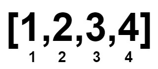
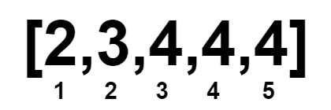

## Description

Given an integer array `num` sorted in non-decreasing order.

You can perform the following operation any number of times:

- Choose **two** indices, `i` and `j`, where $\text{nums}[i] < \text{nums}[j]$.

- Then, remove the elements at indices `i` and `j` from `nums`. The remaining elements retain their original order, and the array is re-indexed.

Return the **minimum** length of `nums` after applying the operation zero or more times.
### Function Contract

- `n`: Input parameter.
- Returns expected result.

### Examples
#### Example 1

**Input:** nums = [1,2,3,4]

**Output:** 0

**Explanation:**

#### Example 2

**Input:** nums = [1,1,2,2,3,3]

**Output:** 0

**Explanation:**

#### Example 3

**Input:** nums = [1000000000,1000000000]

**Output:** 2

**Explanation:**

Since both numbers are equal, they cannot be removed.

#### Example 4

**Input:** nums = [2,3,4,4,4]

**Output:** 1

**Explanation:**

### Constraints

- $1 \le \text{nums.length} \le 10^{5}$

- $1 \le \text{nums}[i] \le 10^{9}$

- `nums` is sorted in **non-decreasing** order.