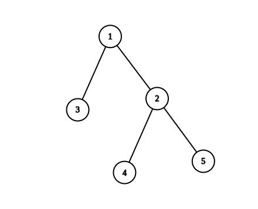
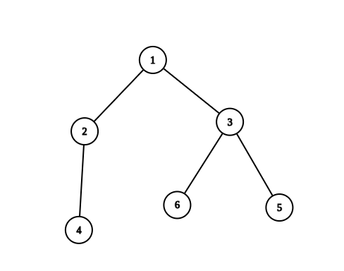

### 1. Description

There is an undirected tree with `n` nodes labeled from `1` to `n`. You are given the integer `n` and a 2D integer array `edges` of length $n - 1$, where $\text{edges}[i] = [u_{i}, v_{i}]$ indicates that there is an edge between nodes $u_{i}$ and $v_{i}$ in the tree.

Return *the **number of valid paths** in the tree*.

A path `(a, b)` is **valid** if there exists **exactly one** prime number among the node labels in the path from `a` to `b`.

### 2. Function Contract

- `n`: Input parameter.
- Returns expected result.

### 3. Note

that:

- The path `(a, b)` is a sequence of **distinct** nodes starting with node `a` and ending with node `b` such that every two adjacent nodes in the sequence share an edge in the tree.

- Path `(a, b)` and path `(b, a)` are considered the **same** and counted only **once**.

### 4. Examples

#### Example 1

- **Input:** $n = 5, edges = [[1,2],[1,3],[2,4],[2,5]]$
- **Output:** `4`
- **Explanation:** The pairs with exactly one prime number on the path between them are:
- (1, 2) since the path from 1 to 2 contains prime number 2.
- (1, 3) since the path from 1 to 3 contains prime number 3.
- (1, 4) since the path from 1 to 4 contains prime number 2.
- (2, 4) since the path from 2 to 4 contains prime number 2.
It can be shown that there are only 4 valid paths.
#### Example 2

- **Input:** $n = 6, edges = [[1,2],[1,3],[2,4],[3,5],[3,6]]$
- **Output:** `6`
- **Explanation:** The pairs with exactly one prime number on the path between them are:
- (1, 2) since the path from 1 to 2 contains prime number 2.
- (1, 3) since the path from 1 to 3 contains prime number 3.
- (1, 4) since the path from 1 to 4 contains prime number 2.
- (1, 6) since the path from 1 to 6 contains prime number 3.
- (2, 4) since the path from 2 to 4 contains prime number 2.
- (3, 6) since the path from 3 to 6 contains prime number 3.
It can be shown that there are only 6 valid paths.

### 5. Constraints

- $1 \le n \le 10^{5}$

- $\text{edges.length} = n - 1$

- $\text{edges}[i].length = 2$

- $1 \le u_{i}, v_{i} \le n$

- The input is generated such that `edges` represent a valid tree.