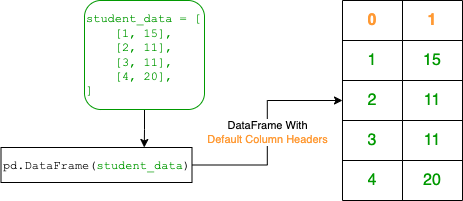
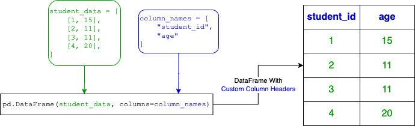

## Solution
---
### Overview

A DataFrame is a powerful and convenient data structure provided by the pandas library. It is a 2D table-like structure, similar to a spreadsheet or SQL table. Each row represents an individual record and each column represents a different attribute.

In this solution, we aim to convert a 2D list into a pandas DataFrame. This is a common application of the pandas library for when we have raw data in list format and want to convert it to a more structured, labeled format for easier analysis.

**Key Concepts**:
 - **2D List**: A list of lists where each inner list represents a row of data.
 - **DataFrame**: A 2-dimensional labeled data structure in pandas.

### Intuition
Let's explore step by step how to create a DataFrame with the tools provided by the pandas library.

1. **Importing pandas**:
   ```python
   import pandas as pd
   ```
   This line imports the pandas library and gives it an alias name `pd`. The pandas library provides fast, flexible, and expressive data structures designed to work with structured (tabular, multidimensional, potentially heterogeneous) data.

2. **Function Definition**:
   ```python
   def createDataframe(student_data: List[List[int]]) -> pd.DataFrame:
   ```
   This line defines a function named `createDataframe` that takes in a 2D list $\text{student}_{data}$ as an argument and returns a DataFrame.

3. **Using `pd.DataFrame()`**:

   $\text{pd.DataFrame}(\text{student}_{data})$ will allow us to transform our 2D list into a DataFrame.

   The diagram below offers a visual representation of the `pd.DataFrame()` function in action:

   

   You can see that the resultant DataFrame has headers labeled as `0` and `1`. This is because all DataFrames are labeled and will create headers by default using integers starting from `0`.

   We can set custom column names using the `columns` parameter. First, we create a list of our column names in the order that they will be displayed on the DataFrame. Then, we will provide the list as a parameter when we call the `pd.DataFrame()` function.

   $\text{column}_{names} = ["\text{student}_{id}", "age"]$

   $\text{pd.DataFrame}(\text{student}_{data}, columns=\text{column}_{names})$

   The subsequent diagram demonstrates the impact of the `columns` parameter:

   

### Implementation

```python
import pandas as pd

def createDataframe(student_data: List[List[int]]) -> pd.DataFrame:
    column_names = ["student_id", "age"]
    result_dataframe = pd.DataFrame(student_data, columns=column_names)
    return result_dataframe
```