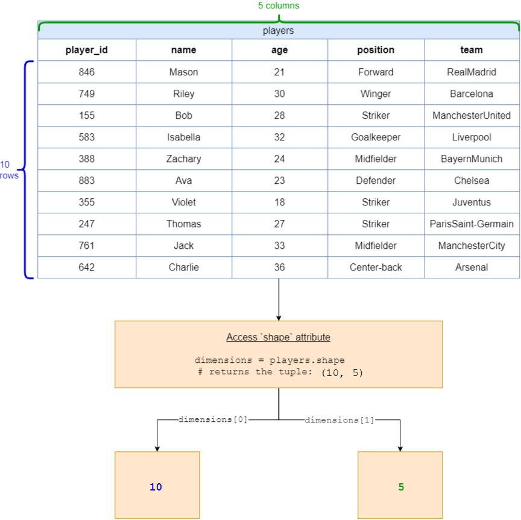

## Solution
---
### Overview

This problem requires us to return the number of rows and columns present in the `players` DataFrame.

**Key Concepts**:
 - **Attribute**: In Python's pandas library, an attribute refers to a property or characteristic of an object that helps describe the object's state or its meta-information. Attributes in pandas are used to access various properties of DataFrame or Series objects, allowing users to retrieve meta-information or underlying data without performing a computation or causing side effects.
 - **`shape` attribute**: Returns the dimensions of the DataFrame or Series in the form of a tuple (rows, columns).

### Intuition

Here's a step-by-step breakdown of the solution:

**1. Importing the Required Library**:
```python
import pandas as pd
```
 - We first need to import the `pandas` library, which is a powerful tool in Python for data manipulation and analysis.

**2. Defining the function:**
```python
def getDataframeSize(players: pd.DataFrame) -> List:
```

 - This line defines a new function named `getDataframeSize` which takes a DataFrame `players` as an input argument and returns a list that contains the number of rows and columns in the DataFrame `players`.

**3. Using the `shape` attribute**:
 - Every DataFrame in pandas has a `shape` attribute. When you call it, it returns a tuple `(number of rows, number of columns)`. In our case, for the given `players` DataFrame, the shape would be `(10, 5)` because there are 10 players and 5 attributes for each player.

**4. The Function**:
```python
return [players.shape[0], players.shape[1]]
```

 - $players.\text{shape}[0]$ gives the number of rows in the DataFrame `players`.
 - $players.\text{shape}[1]$ gives the number of columns in the DataFrame `players`.
 - This line thus returns a list containing these two values: `[players.shape[0], players.shape[1]]`.

**Using the Solution**

**Visualization of `shape` attribute**



When you pass this DataFrame to the function:

<table>
    <tr>
        <th>player_id</th>
        <th>name</th>
        <th>age</th>
        <th>position</th>
        <th>team</th>
    </tr>
    <tr>
        <td>846</td>
        <td>Mason</td>
        <td>21</td>
        <td>Forward</td>
        <td>RealMadrid</td>
    </tr>
    <tr>
        <td>749</td>
        <td>Riley</td>
        <td>30</td>
        <td>Winger</td>
        <td>Barcelona</td>
    </tr>
    <tr>
        <td>155</td>
        <td>Bob</td>
        <td>28</td>
        <td>Striker</td>
        <td>ManchesterUnited</td>
    </tr>
    <tr>
        <td>583</td>
        <td>Isabella</td>
        <td>32</td>
        <td>Goalkeeper</td>
        <td>Liverpool</td>
    </tr>
    <tr>
        <td>388</td>
        <td>Zachary</td>
        <td>24</td>
        <td>Midfielder</td>
        <td>BayernMunich</td>
    </tr>
    <tr>
        <td>883</td>
        <td>Ava</td>
        <td>23</td>
        <td>Defender</td>
        <td>Chelsea</td>
    </tr>
    <tr>
        <td>355</td>
        <td>Violet</td>
        <td>18</td>
        <td>Striker</td>
        <td>Juventus</td>
    </tr>
    <tr>
        <td>247</td>
        <td>Thomas</td>
        <td>27</td>
        <td>Striker</td>
        <td>ParisSaint-Germain</td>
    </tr>
    <tr>
        <td>761</td>
        <td>Jack</td>
        <td>33</td>
        <td>Midfielder</td>
        <td>ManchesterCity</td>
    </tr>
    <tr>
        <td>642</td>
        <td>Charlie</td>
        <td>36</td>
        <td>Center-back</td>
        <td>Arsenal</td>
    </tr>
</table>
<br>

It will return:

```python
[10, 5]
```

### Implementation

```python
import pandas as pd

def getDataframeSize(players: pd.DataFrame) -> List:
    return [players.shape[0], players.shape[1]]
```