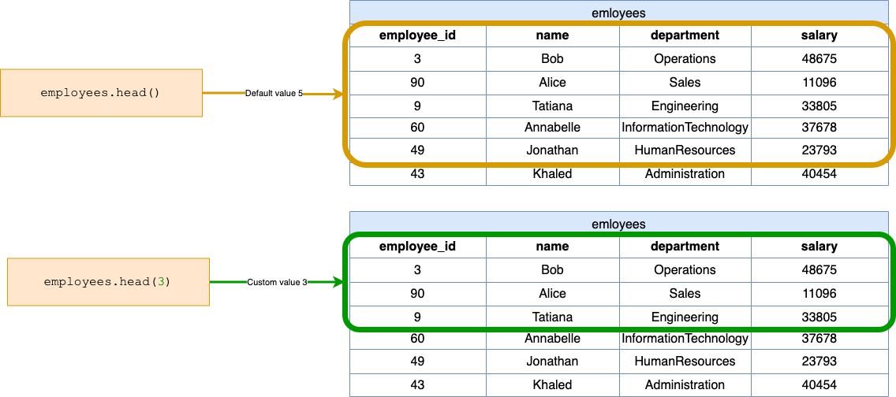

[TOC]

## Solution
---
### Overview
This problem requires us to return the first 3 rows of the `employees` DataFrame.

**Key Concepts:**

1. **DataFrame:** a 2D table-like structure, similar to a spreadsheet or SQL table. Each row represents an individual record and each column represents a different attribute. It is size-mutable and designed to handle a mix of different types of data.
2. **`head` method**: a method provided by the pandas library that is used on a DataFrame to return the first `n` rows. If `n` is omitted, it defaults to returning the first 5 rows. This is useful to get an overview or quick look at the beginning of large datasets.

### Intuition

Let's explore step by step how to return the first 3 rows of a DataFrame.

1. **Importing pandas**:

   ```python
   import pandas as pd
   ```
   This line imports the pandas library and gives it an alias name `pd`. The pandas library provides fast, flexible, and expressive data structures designed to work with structured (tabular, multidimensional, potentially heterogeneous) data.

2. **Utilizing `head`:**

    Let's look at an example to see how we can use `head` to solve our problem.

    Given the `employees` DataFrame as:

    <table>
        <tr>
            <th>employee_id</th>
            <th>name</th>
            <th>department</th>
            <th>salary</th>
        </tr>
        <tr>
            <td>3</td>
            <td>Bob</td>
            <td>Operations</td>
            <td>48675</td>
        </tr>
        <tr>
            <td>90</td>
            <td>Alice</td>
            <td>Sales</td>
            <td>11096</td>
        </tr>
        <tr>
            <td>9</td>
            <td>Tatiana</td>
            <td>Engineering</td>
            <td>33805</td>
        </tr>
        <tr>
            <td>60</td>
            <td>Annabelle</td>
            <td>InformationTechnology</td>
            <td>37678</td>
        </tr>
        <tr>
            <td>49</td>
            <td>Jonathan</td>
            <td>HumanResources</td>
            <td>23793</td>
        </tr>
        <tr>
            <td>43</td>
            <td>Khaled</td>
            <td>Administration</td>
            <td>40454</td>
        </tr>
    </table>
    <br>

    We return the `employees` DataFrame using the the `head` function with an input of 3, to indicate we want to return the first 3 rows:

    ```python
    return employees.head(3)
    ```

    The dataframe returned is then:

    <table>
        <tr>
            <th>employee_id</th>
            <th>name</th>
            <th>department</th>
            <th>salary</th>
        </tr>
        <tr>
            <td>3</td>
            <td>Bob</td>
            <td>Operations</td>
            <td>48675</td>
        </tr>
        <tr>
            <td>90</td>
            <td>Alice</td>
            <td>Sales</td>
            <td>11096</td>
        </tr>
        <tr>
            <td>9</td>
            <td>Tatiana</td>
            <td>Engineering</td>
            <td>33805</td>
        </tr>
    </table>
    <br>

**Visualization of the `head` function applied to the `employees` DataFrame:**



### Implementation

```python
import pandas as pd

def selectFirstRows(employees: pd.DataFrame) -> pd.DataFrame:
    return employees.head(3)
```