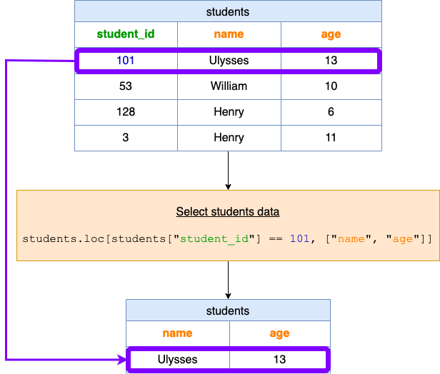

[TOC]

## Solution
---
### Overview

This problem provides us with a pandas DataFrame and requires us to return data about one of the records in the DataFrame.

**Key Concepts**:

1. **DataFrame:** a 2D table-like structure, similar to a spreadsheet or SQL table. Each row represents an individual record and each column represents a different attribute. It is size-mutable designed to handle a mix of different types of data.
2. **`loc` attribute:** one of the primary ways to select data from a DataFrame. It is label-based, which means you have to specify the name of the rows or columns to select data. `loc` is label-based.
3. **boolean mask:** a series of True/False values used to filter or select elements from another data structure, such as a list, array, or DataFrame, based on a certain condition.

### Intuition

The `students` DataFrame has three columns:

1. $\text{student}_{id}$ (type: int) - a unique identifier for the student.
2. `name` (type: object, which is generally a string in pandas) - the student's name.
3. `age` (type: int) - the student's age.

In this problem, we must create a function that accepts a DataFrame as an argument and returns a DataFrame with the required information.

Inside our function, we will use the `loc` function to select the row where $\text{student}_{id}$ is `101` and return the value from the `name` and `age` columns.

To do this, we must provide `loc` with two arguments.

```python
students.loc[students['student_id'] == 101, ['name', 'age']]
```

**Visualization of `loc` function**



When you pass this DataFrame to the function:

<table>
  <tr>
    <th>student_id</th>
    <th>name</th>
    <th>age</th>
  </tr>
  <tr>
    <td>101</td>
    <td>Ulysses</td>
    <td>13</td>
  </tr>
  <tr>
    <td>53</td>
    <td>William</td>
    <td>10</td>
  </tr>
  <tr>
    <td>128</td>
    <td>Henry</td>
    <td>6</td>
  </tr>
  <tr>
    <td>3</td>
    <td>Henry</td>
    <td>11</td>
  </tr>
</table>
<br>

It will return:

<table>
  <tr>
    <th>name</th>
    <th>age</th>
  </tr>
  <tr>
    <td>Ulysses</td>
    <td>13</td>
  </tr>
</table>
<br>

### Implementation

```python
import pandas as pd

def selectData(students: pd.DataFrame) -> pd.DataFrame:
    return students.loc[students["student_id"] == 101, ["name", "age"]]
```