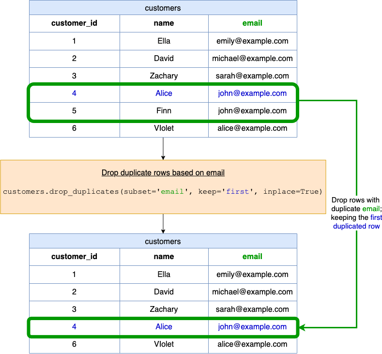

[TOC]

## Solution
---
### Overview

In this problem, we have a DataFrame named `customers` that consists of details like $\text{customer}_{id}$, `name`, and `email`. The goal is to remove duplicate rows based on the `email` column and only keep the first occurrence of any duplicated email.

**Key Concepts**:
1. **DataFrame:** a 2D table-like structure, similar to a spreadsheet or SQL table. Each row represents an individual record and each column represents a different attribute. It is size-mutable and designed to handle a mix of different types of data.
2. **$\text{drop}_{duplicates}$ Function:** The $\text{drop}_{duplicates}$ function is a method of the DataFrame object in the pandas library. Its purpose is to drop duplicate rows, and you can specify the criteria based on which the rows are considered duplicates.

**$\text{drop}_{duplicates}$ Function Argument Definition:**
- `subset`: This is the column label or sequence of labels to consider for identifying duplicate rows. If not provided, it considers all columns in the DataFrame.

- `keep`: This argument determines which duplicate row to retain.
  - `'first'`: (default) Drop duplicates except for the first occurrence.
  - `'last'`: Drop duplicates except for the last occurrence.
  - `False`: Drop all duplicates.

- `inplace`: If set to `True`, the changes are made directly to the object without returning a new object. If set to `False` (default), a new object with duplicates dropped will be returned.

### Intuition

Let’s go step by step through the provided solution:

**1. Importing pandas:**
```python
import pandas as pd
```

This imports the pandas library and gives it an alias `pd`. pandas is a fast, powerful, flexible, and easy-to-use open-source data analysis and data manipulation library built on top of the Python programming language.

**2. Defining the function:**
```python
def dropDuplicateEmails(customers: pd.DataFrame) -> pd.DataFrame:
```

This line defines a new function named `dropDuplicateEmails` which takes a DataFrame `customers` as an input argument and returns a DataFrame.

**3. Dropping duplicate rows based on email:**
```python
customers.drop_duplicates(subset='email', keep='first', inplace=True)
```

This line uses the $\text{drop}_{duplicates}$ method on the `customers` DataFrame.
 - `subset='email'`: This means that we are considering duplicates based on the `email` column only.
 - `keep='first'`: This indicates that we want to keep the first occurrence of any duplicated email and drop the subsequent occurrences.
 - `inplace=True`: This means the changes will be made directly to the passed DataFrame (`customers`) without returning a new one.

**4. Returning the modified DataFrame:**
```python
return customers
```

Finally, we return the modified `customers` DataFrame with the duplicate rows based on email removed.

**Using the Solution**

By using the provided function, you can clean up the data in your `customers` DataFrame and ensure that each customer's email is unique, helping maintain data integrity. If two customers have the same email address, only the first one encountered will be kept in the resulting DataFrame.

**Visualization of `dropDuplicateEmails` function**



When you pass this DataFrame to the function:

<table>
    <tr>
        <th>customer_id</th>
        <th>name</th>
        <th>email</th>
    </tr>
    <tr>
        <td>1</td>
        <td>Ella</td>
        <td>emily@example.com</td>
    </tr>
    <tr>
        <td>2</td>
        <td>David</td>
        <td>michael@example.com</td>
    </tr>
    <tr>
        <td>3</td>
        <td>Zachary</td>
        <td>sarah@example.com</td>
    </tr>
    <tr>
        <td>4</td>
        <td>Alice</td>
        <td>john@example.com</td>
    </tr>
    <tr>
        <td>5</td>
        <td>Finn</td>
        <td>john@example.com</td>
    </tr>
    <tr>
        <td>6</td>
        <td>Violet</td>
        <td>alice@example.com</td>
    </tr>
</table>

<br>

It will return:

<table>
    <tr>
        <th>customer_id</th>
        <th>name</th>
        <th>email</th>
    </tr>
    <tr>
        <td>1</td>
        <td>Ella</td>
        <td>emily@example.com</td>
    </tr>
    <tr>
        <td>2</td>
        <td>David</td>
        <td>michael@example.com</td>
    </tr>
    <tr>
        <td>3</td>
        <td>Zachary</td>
        <td>sarah@example.com</td>
    </tr>
    <tr>
        <td>4</td>
        <td>Alice</td>
        <td>john@example.com</td>
    </tr>
    <tr>
        <td>6</td>
        <td>Violet</td>
        <td>alice@example.com</td>
    </tr>
</table>

### Implementation

```python
import pandas as pd

def dropDuplicateEmails(customers: pd.DataFrame) -> pd.DataFrame:
    customers.drop_duplicates(subset='email', keep='first', inplace=True)
    return customers
```

<br>

**Note:** using `inplace=True` modifies the original DataFrame. To retain the original DataFrame and get a new one with duplicates removed, we should set `inplace=False` and assign the result to a new variable.