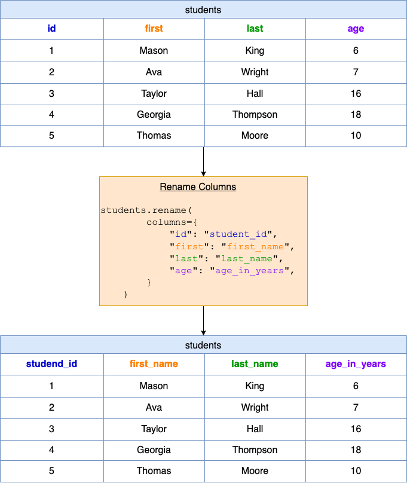

## Solution
---
### Overview

In this problem, we have a DataFrame named `students` that contains student data. However, the column names are not very descriptive. The goal is to rename them to be clearer.

**Key Concepts**:
 - **DataFrame:** a 2D table-like structure, similar to a spreadsheet or SQL table. Each row represents an individual record and each column represents a different attribute. It is size-mutable and designed to handle a mix of different types of data.
 - **`rename` function**: The `rename` function in pandas is a very useful tool when it comes to renaming column names or index names.

**Usage of `rename`**:
```python
DataFrame.rename(mapper=None, index=None, columns=None, axis=None, copy=True, inplace=False, level=None, errors='raise')
```

The `rename` method has many optional arguments that it can take. For our purpose, we are interested in the `columns` argument, which allows you to pass a dictionary where the keys represent the current column names and the values are the new column names.

For example, if we have:

```python
{'id': 'student_id'}
```

This means that we are renaming the column that is currently named "id" to "student_id".

**Argument Definition**:

- `mapper`, `index`, `columns`: The dictionaries you can pass to rename index or columns. In our example, we use `columns`.

- `axis`: Can be either "index" or "columns". Determines whether you're renaming the index or the columns. By default, if you provide the `columns` argument, you're renaming columns.

- `copy`: If set to `True`, a new DataFrame is created. If `False`, the original DataFrame is modified.

- `inplace`: If set to `True`, the renaming will modify the DataFrame in place and nothing will be returned. If `False`, a new DataFrame with renamed columns will be returned without modifying the original DataFrame.

- `level`: For DataFrames with multi-level index, level from which the labels should be renamed.

- `errors`: If 'raise', an error is raised if you try to rename an item that doesn't exist. If set to 'ignore', any failure to rename items will be ignored.

### Intuition

**Visualization of `rename` function**



In the provided solution:

1. We first import the pandas library and give it an alias `pd`.
2. We define a function `renameColumns` that takes in a DataFrame `students` and returns a modified DataFrame.
3. Within the function, we use the `rename` method on `students` to rename the columns. We pass a dictionary to the `columns` argument to specify the new names for each column.
4. The modified DataFrame is then returned.

When you pass this DataFrame to the function:

<table>
  <tr>
    <th>id</th>
    <th>first</th>
    <th>last</th>
    <th>age</th>
  </tr>
  <tr>
    <td>1</td>
    <td>Mason</td>
    <td>King</td>
    <td>6</td>
  </tr>
  <tr>
    <td>2</td>
    <td>Ava</td>
    <td>Wright</td>
    <td>7</td>
  </tr>
  <tr>
    <td>3</td>
    <td>Taylor</td>
    <td>Hall</td>
    <td>16</td>
  </tr>
  <tr>
    <td>4</td>
    <td>Georgia</td>
    <td>Thompson</td>
    <td>18</td>
  </tr>
  <tr>
    <td>5</td>
    <td>Thomas</td>
    <td>Moore</td>
    <td>10</td>
  </tr>
</table>
<br>

It will return:

<table>
  <tr>
    <th>student_id</th>
    <th>first_name</th>
    <th>last_name</th>
    <th>age_in_years</th>
  </tr>
  <tr>
    <td>1</td>
    <td>Mason</td>
    <td>King</td>
    <td>6</td>
  </tr>
  <tr>
    <td>2</td>
    <td>Ava</td>
    <td>Wright</td>
    <td>7</td>
  </tr>
  <tr>
    <td>3</td>
    <td>Taylor</td>
    <td>Hall</td>
    <td>16</td>
  </tr>
  <tr>
    <td>4</td>
    <td>Georgia</td>
    <td>Thompson</td>
    <td>18</td>
  </tr>
  <tr>
    <td>5</td>
    <td>Thomas</td>
    <td>Moore</td>
    <td>10</td>
  </tr>
</table>
<br>

Remember, this function doesn't change the original DataFrame, but instead returns a new DataFrame with renamed columns. If you wish to modify the original DataFrame, you can set the `inplace` argument to `True` when calling the `rename` method.

### Implementation

```python
import pandas as pd

def renameColumns(students: pd.DataFrame) -> pd.DataFrame:
    students = students.rename(
        columns={
            "id": "student_id",
            "first": "first_name",
            "last": "last_name",
            "age": "age_in_years",
        }
    )
    return students

```