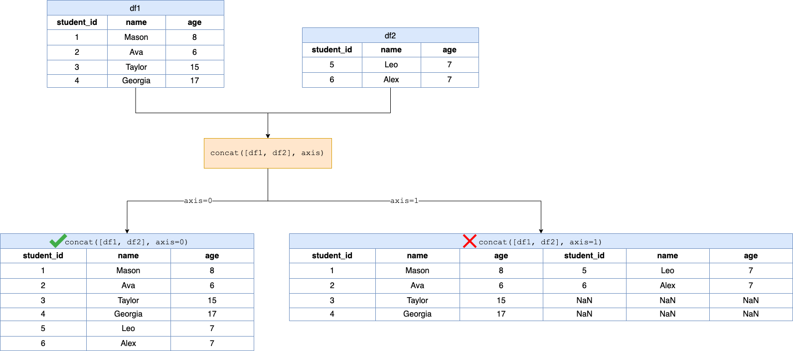

## Solution
---
### Overview
In the task presented, the goal is to concatenate two DataFrames, `df1` and `df2`, vertically. The DataFrames have the same structure with columns $\text{student}_{id}$, `name`, and `age`.

**Key Concepts**:
 - `pd.concat()`: A convenient function within pandas used to concatenate DataFrames either vertically (by rows) or horizontally (by columns).
   - The `objs` parameter is a sequence or mapping of Series or DataFrame objects to be concatenated.
   - The `axis` parameter determines the direction of concatenation:
      - `axis=0` is set as the default value, which means it will concatenate DataFrames vertically (by rows).
      - `axis=1` will concatenate DataFrames horizontally (by columns).

### Intuition

The process of concatenating DataFrames vertically involves stacking one DataFrame on top of the other, ensuring the order of columns is consistent.

Inside the `concatenateTables` function, we utilize the `pd.concat()` function to concatenate the DataFrames. Since we are concatenated `df1` and `df2` we pass the list `[df1, df2]` as the first argument for `objs`; and since we are concatenating vertically, we set `axis=0`.

**Visualization of the `pd.concat()` function applied to the `df1` and `df2` DataFrames:**



### Implementation

```python
import pandas as pd

def concatenateTables(df1: pd.DataFrame, df2: pd.DataFrame) -> pd.DataFrame:
    return pd.concat([df1, df2], axis=0)
```