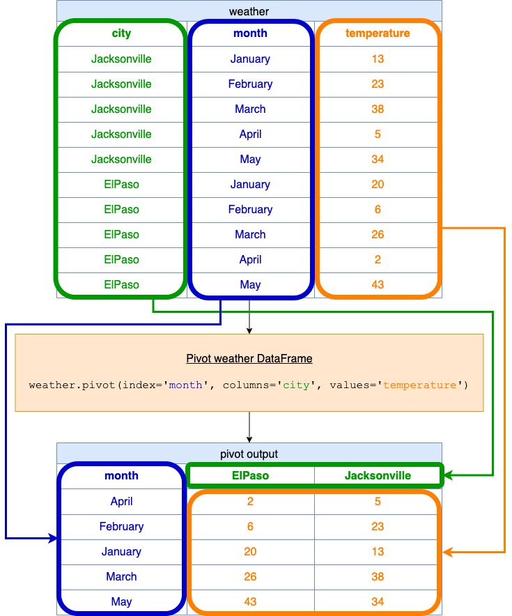

[TOC]

## Solution
---
### Overview

In this solution we focus on how to pivot a DataFrame. Pivoting a table means reshaping it in such a way that you convert a long-format table into a wide-format table. Let's unravel the solution and the usage of the `pivot` function in detail.

**Key Concepts**:
1. **`pivot` Function:** The `pivot` function in pandas is used to reshape data based on column values and get a new DataFrame out of it. `pivot` takes the following arguments which we will utilize:
   - `index`: Determines the rows in the new DataFrame.
   - `columns`: Determines the columns in the new DataFrame.
   - `values`: Specifies the values to be used when the table is reshaped.

### Intuition

Let's break the solution down step by step:

**1. Importing pandas:**
```python
import pandas as pd
```

This imports the pandas library and gives it an alias `pd`. pandas is a fast, powerful, flexible, and easy-to-use open-source data analysis and data manipulation library built on top of the Python programming language.

**2. The `pivot` Function**
```python
ans = weather.pivot(index='month', columns='city', values='temperature')
```

Here's what each argument in the `pivot` function does:
 - `index`: It determines the rows in the new DataFrame. For this example, we use the `month` column from the original DataFrame as the index, which means our pivoted table will have one row for each unique value in the `month` column.
- `columns`: It determines the columns in the new DataFrame. Here, we're using the `city` column, which means our pivoted table will have one column for each unique value in the `city` column.
 - `values`: This argument specifies the values to be used when the table is reshaped. For this example, we use the `temperature` column from the original DataFrame.

**3. Returning the modified DataFrame:**
```python
return ans
```

This line of code returns the pivoted DataFrame.

**Using the Solution**

**Visualization of `pivot` function**



When you pass this DataFrame to the function:

<table>
    <tr>
        <th>city</th>
        <th>month</th>
        <th>temperature</th>
    </tr>
    <tr>
        <td>Jacksonville</td>
        <td>January</td>
        <td>13</td>
    </tr>
    <tr>
        <td>Jacksonville</td>
        <td>February</td>
        <td>23</td>
    </tr>
    <tr>
        <td>Jacksonville</td>
        <td>March</td>
        <td>38</td>
    </tr>
    <tr>
        <td>Jacksonville</td>
        <td>April</td>
        <td>5</td>
    </tr>
    <tr>
        <td>Jacksonville</td>
        <td>May</td>
        <td>34</td>
    </tr>
    <tr>
        <td>ElPaso</td>
        <td>January</td>
        <td>20</td>
    </tr>
    <tr>
        <td>ElPaso</td>
        <td>February</td>
        <td>6</td>
    </tr>
    <tr>
        <td>ElPaso</td>
        <td>March</td>
        <td>26</td>
    </tr>
    <tr>
        <td>ElPaso</td>
        <td>April</td>
        <td>2</td>
    </tr>
    <tr>
        <td>ElPaso</td>
        <td>May</td>
        <td>43</td>
    </tr>
</table>
<br>

It will return:

<table>
    <tr>
        <th>month</th>
        <th>ElPaso</th>
        <th>Jacksonville</th>
    </tr>
    <tr>
        <td>April</td>
        <td>2</td>
        <td>5</td>
    </tr>
    <tr>
        <td>February</td>
        <td>6</td>
        <td>23</td>
    </tr>
    <tr>
        <td>January</td>
        <td>20</td>
        <td>13</td>
    </tr>
    <tr>
        <td>March</td>
        <td>26</td>
        <td>38</td>
    </tr>
    <tr>
        <td>May</td>
        <td>43</td>
        <td>34</td>
    </tr>
</table>
<br>

**Notes:**
 - **Missing Data:** The pivot function does not handle duplicated entries for the same index/column combination. If there are duplicates, you might consider using $\text{pivot}_{table}$ which can aggregate over duplicate entries.
 - **Data Type:** As per the table given, the `city` and `month` columns are of "object" data type which is equivalent to string type in pandas, while `temperature` is of integer type.
 - **Order:** The output may not necessarily be in the same order as in the example (i.e., January to May). If you want it in a specific order, you'd have to sort it after pivoting.

**Complete Sample Solution with Sorting:**
```python
import pandas as pd

def pivotTable(weather: pd.DataFrame) -> pd.DataFrame:
    ans = weather.pivot(index='month', columns='city', values='temperature')
    month_order = ["January", "February", "March", "April", "May", "June", "July", "August", "September", "October", "November", "December"]
    ans = ans.reindex(month_order)
    return ans
```
In this solution, after pivoting, the DataFrame is sorted based on the predefined order of months. The resulting DataFrame would be:

<table>
    <tr>
        <th>month</th>
        <th>ElPaso</th>
        <th>Jacksonville</th>
    </tr>
    <tr>
        <td>January</td>
        <td>20</td>
        <td>13</td>
    </tr>
    <tr>
        <td>February</td>
        <td>6</td>
        <td>23</td>
    </tr>
    <tr>
        <td>March</td>
        <td>26</td>
        <td>38</td>
    </tr>
    <tr>
        <td>April</td>
        <td>2</td>
        <td>5</td>
    </tr>
    <tr>
        <td>May</td>
        <td>43</td>
        <td>34</td>
    </tr>
</table>
<br>

### Implementation

```python
import pandas as pd

def pivotTable(weather: pd.DataFrame) -> pd.DataFrame:
    ans = weather.pivot(index='month', columns='city', values='temperature')
    return ans
```