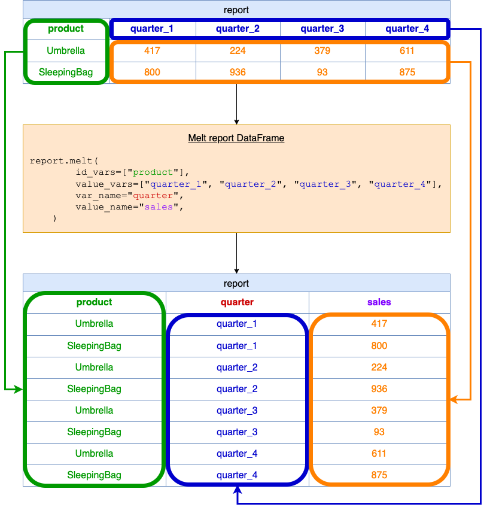

## Solution
---
### Overview

The problem involves reshaping a given DataFrame that captures sales data of products across different quarters. Initially, the data is structured in a wide format, where each product has separate columns for sales of every quarter. The task is to transform this data into a long format, where each row represents sales data for a specific product in a particular quarter, effectively consolidating the multiple quarter columns into two columns: one indicating the quarter and the other detailing the sales for that quarter.

**Key Concepts**:
1. **`melt` Function**: pandas' `melt` function is used to transform or reshape data. It changes the DataFrame from a wide format, where columns represent multiple variables, to a long format, where each row represents a unique variable. In our case, we want to transform the sales data from having separate columns for each quarter to a format where there's a single column for the quarter and a single column for the sales value.

**`melt` Function Argument Definition:**

1. $\text{id}_{vars}$: This specifies the columns that should remain unchanged. For this problem, only the `product` column remains unchanged because we want every row in the output to be associated with a product.

2. $\text{value}_{vars}$: This specifies the columns that we want to "melt" or reshape into rows. In our case, these are the sales data columns for each quarter: $\text{quarter}_{1}$, $\text{quarter}_{2}$, $\text{quarter}_{3}$, and $\text{quarter}_{4}$.

3. $\text{var}_{name}$: This is the name of the new column that will store the header names from the $\text{value}_{vars}$. In our problem, these are the quarter names.

4. $\text{value}_{name}$: This is the name of the new column that will store the values from the $\text{value}_{vars}$. In our problem, this will be the sales figures for each product for each quarter.

### Intuition

Using the given example:

<table>
    <tr>
        <th>product</th>
        <th>quarter_1</th>
        <th>quarter_2</th>
        <th>quarter_3</th>
        <th>quarter_4</th>
    </tr>
    <tr>
        <td>Umbrella</td>
        <td>417</td>
        <td>224</td>
        <td>379</td>
        <td>611</td>
    </tr>
    <tr>
        <td>SleepingBag</td>
        <td>800</td>
        <td>936</td>
        <td>93</td>
        <td>875</td>
    </tr>
</table>
<br>

1. The $\text{id}_{vars}=['product']$ keeps the `product` column intact.
2. The $\text{value}_{vars}=['\text{quarter}_{1}', '\text{quarter}_{2}', '\text{quarter}_{3}', '\text{quarter}_{4}']$ means we're taking the data from these columns and reshaping it into two new columns.
3. $\text{var}_{name}='quarter'$ will create a new column named `quarter`, and each entry in this column will be the column name from where the sales data was taken (e.g., $\text{quarter}_{1}$, $\text{quarter}_{2}$, etc.).
4. $\text{value}_{name}='sales'$ will create a new column named `sales`, which will store the actual sales values.

By applying the melt function, the DataFrame is reshaped to the desired long format.

**Using the Solution**

**Visualization of `melt` function**



When you pass this DataFrame to the function:

<table>
    <tr>
        <th>product</th>
        <th>quarter_1</th>
        <th>quarter_2</th>
        <th>quarter_3</th>
        <th>quarter_4</th>
    </tr>
    <tr>
        <td>Umbrella</td>
        <td>417</td>
        <td>224</td>
        <td>379</td>
        <td>611</td>
    </tr>
    <tr>
        <td>SleepingBag</td>
        <td>800</td>
        <td>936</td>
        <td>93</td>
        <td>875</td>
    </tr>
</table>
<br>

It will return:

<table>
    <tr>
        <th>product</th>
        <th>quarter</th>
        <th>sales</th>
    </tr>
    <tr>
        <td>Umbrella</td>
        <td>quarter_1</td>
        <td>417</td>
    </tr>
    <tr>
        <td>SleepingBag</td>
        <td>quarter_1</td>
        <td>800</td>
    </tr>
    <tr>
        <td>Umbrella</td>
        <td>quarter_2</td>
        <td>224</td>
    </tr>
    <tr>
        <td>SleepingBag</td>
        <td>quarter_2</td>
        <td>936</td>
    </tr>
    <tr>
        <td>Umbrella</td>
        <td>quarter_3</td>
        <td>379</td>
    </tr>
    <tr>
        <td>SleepingBag</td>
        <td>quarter_3</td>
        <td>93</td>
    </tr>
    <tr>
        <td>Umbrella</td>
        <td>quarter_4</td>
        <td>611</td>
    </tr>
    <tr>
        <td>SleepingBag</td>
        <td>quarter_4</td>
        <td>875</td>
    </tr>
</table>
<br>

### Implementation

```python
import pandas as pd

def meltTable(report: pd.DataFrame) -> pd.DataFrame:
    report = report.melt(
        id_vars=["product"],
        value_vars=["quarter_1", "quarter_2", "quarter_3", "quarter_4"],
        var_name="quarter",
        value_name="sales",
    )
    return report
```