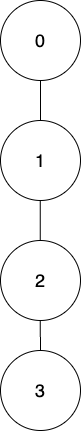
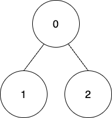

## Description

There exists an undirected tree rooted at node `0` with `n` nodes labeled from `0` to $n - 1$. You are given a 2D **integer** array `edges` of length $n - 1$, where $\text{edges}[i] = [a_{i}, b_{i}]$ indicates that there is an edge between nodes $a_{i}$ and $b_{i}$ in the tree. You are also given a **0-indexed** array `coins` of size `n` where $\text{coins}[i]$ indicates the number of coins in the vertex `i`, and an integer `k`.

Starting from the root, you have to collect all the coins such that the coins at a node can only be collected if the coins of its ancestors have been already collected.

Coins at $\text{node}_{i}$ can be collected in one of the following ways:

- Collect all the coins, but you will get $\text{coins}[i] - k$ points. If $\text{coins}[i] - k$ is negative then you will lose $abs(\text{coins}[i] - k)$ points.

- Collect all the coins, but you will get $floor(\text{coins}[i] / 2)$ points. If this way is used, then for all the $\text{node}_{j}$ present in the subtree of $\text{node}_{i}$, $\text{coins}[j]$ will get reduced to $floor(\text{coins}[j] / 2)$.

Return *the **maximum points** you can get after collecting the coins from **all** the tree nodes.*
### Function Contract

- `n`: Input parameter.
- Returns expected result.

### Examples

#### Example 1

- **Input:** $edges = [[0,1],[1,2],[2,3]], coins = [10,10,3,3], k = 5$
- **Output:** `11`
- **Explanation:**
Collect all the coins from node 0 using the first way. Total points = 10 - 5 = 5.
Collect all the coins from node 1 using the first way. Total points = 5 + (10 - 5) = 10.
Collect all the coins from node 2 using the second way so coins left at node 3 will be floor(3 / 2) = 1. Total points = 10 + floor(3 / 2) = 11.
Collect all the coins from node 3 using the second way. Total points = 11 + floor(1 / 2) = 11.
It can be shown that the maximum points we can get after collecting coins from all the nodes is 11.
#### Example 2

**

**

- **Input:** $edges = [[0,1],[0,2]], coins = [8,4,4], k = 0$
- **Output:** `16`
- **Explanation:**
Coins will be collected from all the nodes using the first way. Therefore, total points = (8 - 0) + (4 - 0) + (4 - 0) = 16.
### Constraints

- $n = \text{coins.length}$

- $2 \le n \le 10^{5}$

- $0 \le \text{coins}[i] \le 10^{4}$

- $\text{edges.length} = n - 1$

- $0 \le \text{edges}[i][0], \text{edges}[i][1] < n$

- $0 \le k \le 10^{4}$