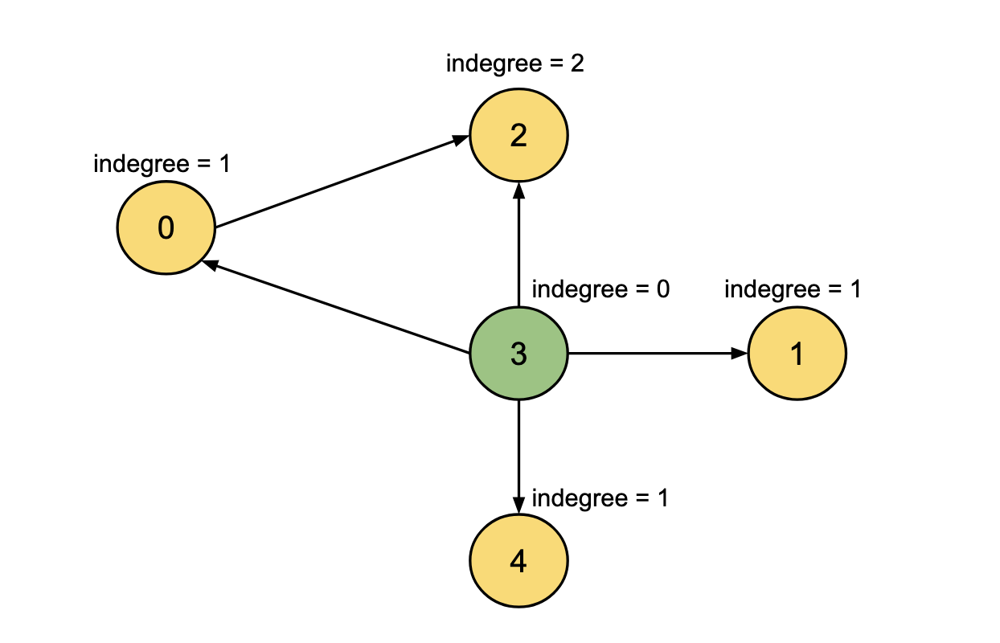

## Solution

---

### Approach: In-degree Count

#### Intuition

We are given `n` teams labeled from `0` to $n - 1$, with some teams being stronger than others. Directed edges represent comparisons between teams: if there is a directed edge from team `u` to team `v`, it indicates that team `u` is stronger than team `v`.

This problem builds upon [Find Champion I](https://leetcode.com/problems/find-champion-i/description/), where a boolean matrix indicates the strength relationships between teams. In that problem, the goal is to identify the champion by finding the team for which all entries in its row (except the diagonal) are `1`, signifying that it is stronger than all other teams.

In this problem, we aim to determine the champion team, defined as a team that is not weaker than any other team. Formally, the champion team has no incoming edges, meaning its indegree is zero. Additionally, there must be exactly one such team with zero indegree. If there are multiple teams with zero indegree, we should return `-1` to indicate the absence of a unique champion.

Thus, the problem boils down to counting the number of edges directed towards each team (indegree). A team with zero indegrees is a potential champion for which we will return the team index. In case of multiple such teams, we will return `-1`.



#### Algorithm

1. Initialize an Indegree Array:

- Create an array indegree of size `n` (the number of teams) and initialize all elements to `0`. This array will store the number of incoming edges for each team.

2. Calculate the Indegree of each team:

- Loop through each edge in the given edges list.
- Each edge is a pair `[u, v]` where team `u` is a stronger team than `v`.
- Increment the indegree of team `v` by 1 for every edge `(u, v)`.

3. Identify Potential Champions:

- Initialize `champ`  to `-1` and `champCount` (number of potential champions) to `0`.
- Loop through all teams from `0` to `n -1`:
- For each team `i`, check if its indegree is `0`
- If the indegree is `0`, increment `champCount` by `1` and set champ to` i`

4. Determine the Final Champion:

- After the loop, check the value of `champCount`:
- If `champCount` is greater than `1`, it means there are multiple teams with indegree `0`, and thus no unique champion. Return `-1`.
- If `champCount` is exactly `1`, return the value of `champ`

#### Implementation

```python
class Solution:
    def findChampion(self, n: int, edges: list[list[int]]) -> int:
        # Initialize the indegree array to track the number of incoming edges for each team
        indegree = [0] * n

        # Store the indegree of each team
        for edge in edges:
            indegree[edge[1]] += 1

        champ = -1
        champ_count = 0

        # Iterate through all teams to find those with an indegree of 0
        for i in range(n):
            # If the team can be a champion, store the team number and increment the count
            if indegree[i] == 0:
                champ_count += 1
                champ = i

        # If more than one team can be a champion, return -1, otherwise return the champion team number
        return champ if champ_count == 1 else -1
```

#### Complexity Analysis

Here, $N$ is the number of teams given, and $M$ is the number of edges.

- Time complexity: $O(N + M)$

  We iterate over each edge to store the indegree of each team, this takes $O(M)$ time. Then we iterate over each team to find the teams with zero indegree to get the champion which will take $O(N)$ time. Hence, the total time complexity is equal to $O(N + M)$

- Space complexity: $O(N)$

  We need a list `indegree` to store the indegree of each of the $N$ teams. Hence, the total space complexity is equal to $O(N)$.
---