[TOC]

## Solution

---

### Overview

We are given a binary string `s`, where each `0` represents a white ball and each `1` represents a black ball. Our goal is to move all the white balls to the left and all the black balls to the right.

In each operation, we can swap two adjacent characters. The task is to find the minimum number of swaps required to achieve the desired arrangement, where all `0`s come before all `1`s.

### Approach 1: Two Pointer

#### Intuition

Our job is to move all the white balls to the front of the string. Each move forward requires one swap. The number of swaps needed for a white ball equals the gap between its current and final positions. Once the white balls are in place, the black balls will naturally move to the back.

To find out where each white ball should go, we use a pointer, `whitePosition`. When we find a white ball, we calculate how many swaps it needs to reach the position marked by `whitePosition`. After calculating, we update `whitePosition` to the next available spot.

We track the total number of swaps with a counter, `totalSwaps`. For each white ball, we add its swaps to the counter. This approach counts all the necessary moves without physically making them.

By the end, `totalSwaps` will hold the minimum number of swaps required to move the white balls to the front.

The algorithm is visualized in the slideshow below:

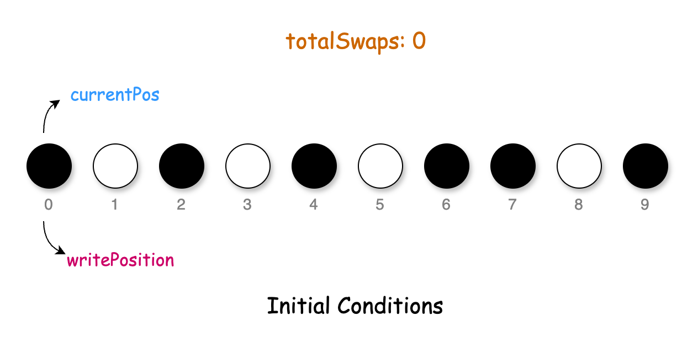

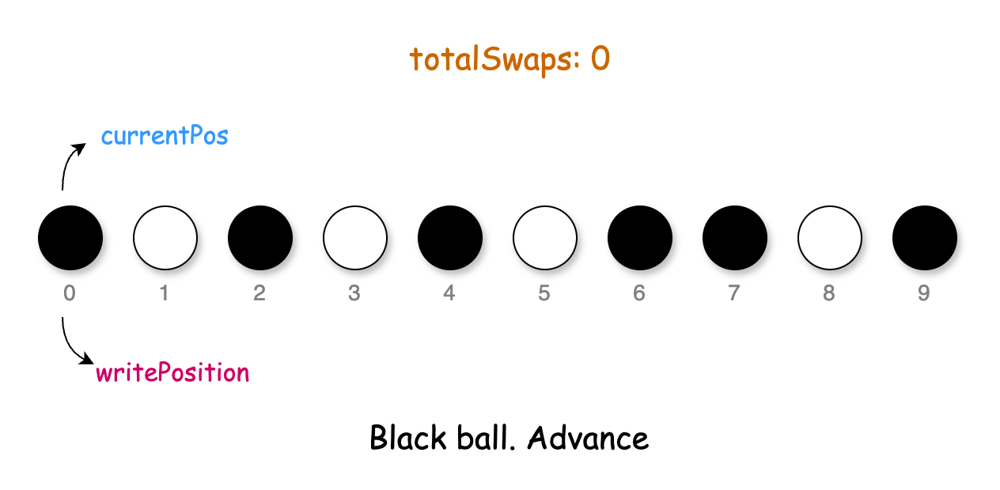

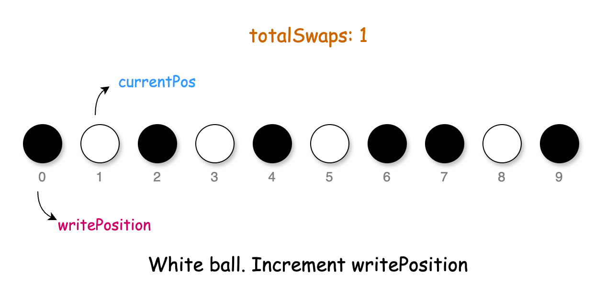

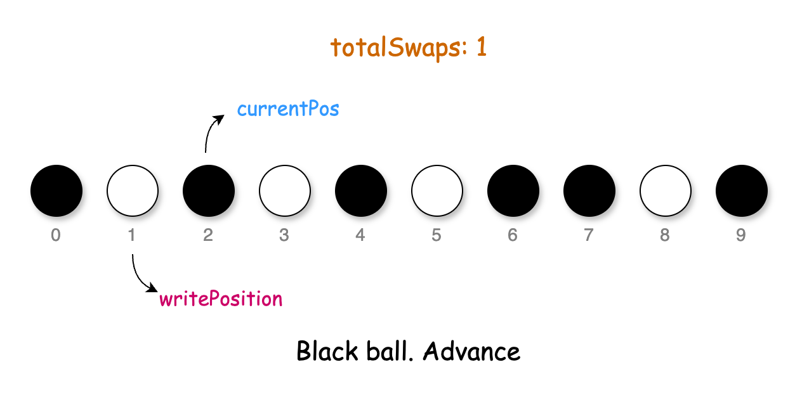

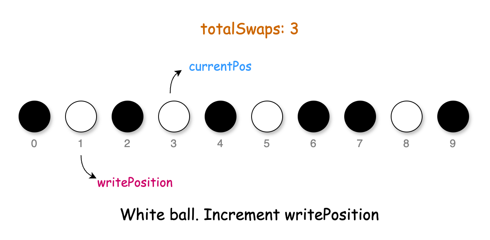

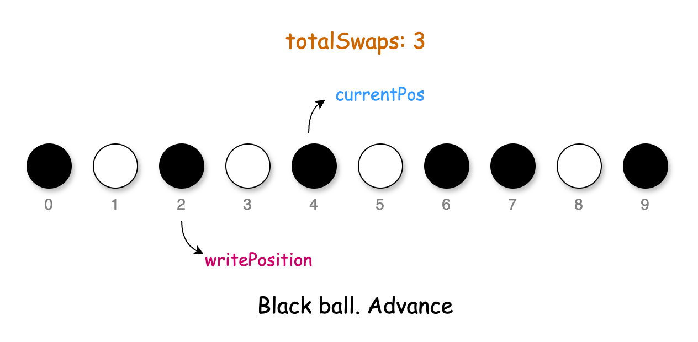

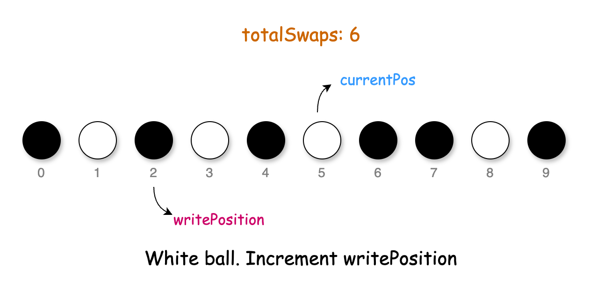

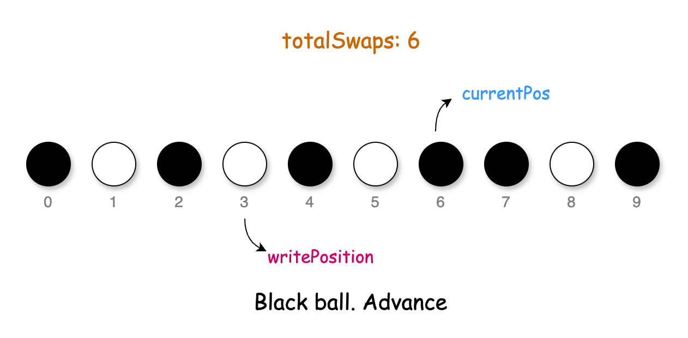

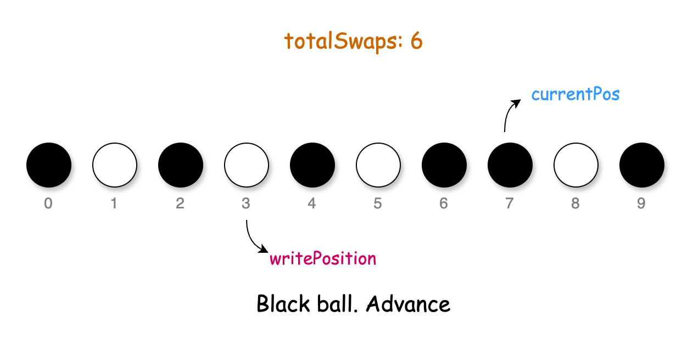

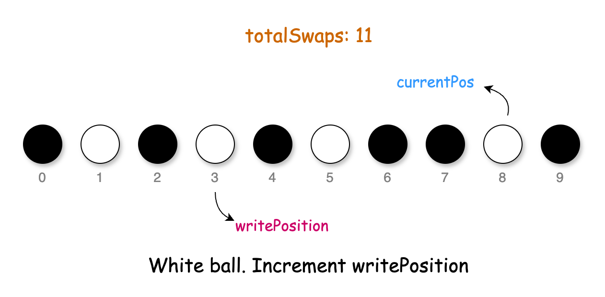

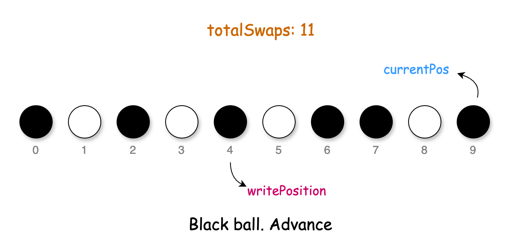

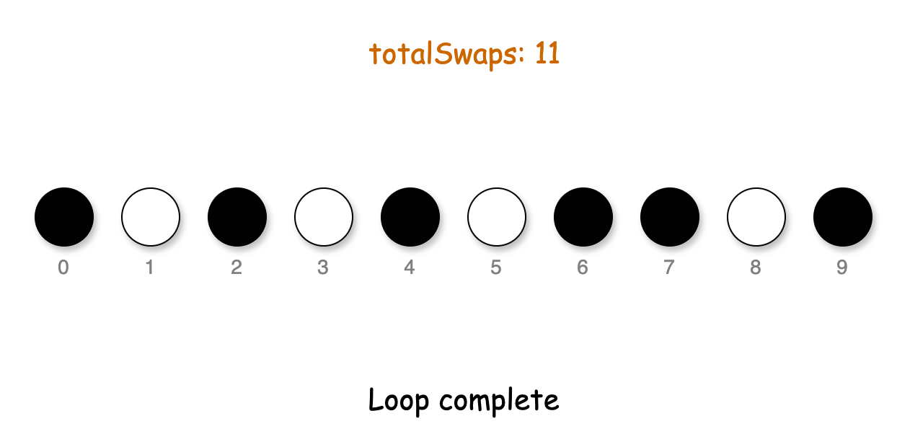

#### Algorithm

- Initialize variables:
  - `whitePosition` to 0. This represents the next available position for a white ball.
  - `totalSwaps` to 0 to keep track of the total number of swaps required.
- Iterate over each character in the string `s`:
  - If the character is `0` (a white ball):
- Calculate the number of swaps needed by subtracting `whitePosition` from the current position. Add it to `totalSwaps`.
- Increment `whitePosition` by 1 to mark the next available position for a white ball.
- After the loop ends, return the value of `totalSwaps`.

#### Implementation

```python
class Solution:
    def minimumSteps(self, s: str) -> int:
        white_position = 0
        total_swaps = 0

        # Iterate through each ball in the string
        for current_pos, char in enumerate(s):
            if char == "0":
                # Calculate the number of swaps needed
                total_swaps += current_pos - white_position

                # Move the next available position for a white ball one step to the right
                white_position += 1

        return total_swaps
```

#### Complexity Analysis

Let $n$ be the length of the input string `s`.

- Time complexity: $O(n)$

    The algorithm makes a single pass through the string `s`. Each operation inside the loop (addition and subtraction) takes constant time. Thus, the time complexity of the algorithm is $O(n)$.

- Space complexity: $O(1)$

    The algorithm does not use any data structures which scale with input space. Thus, the space complexity is constant.

---

### Approach 2: Counter

#### Intuition

When we find a white ball in the array, we need to move it to the front by swapping it past the black balls. Here's what that looks like:

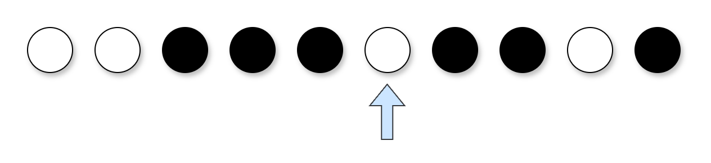

To push a white ball to the front, we need to swap it with each black ball in front of it. Each swap moves the white ball forward by one position. The number of swaps for each white ball is equal to the number of black balls before it.

As we go through the array, we use a variable `blackBallCount` to track how many black balls we've passed. Each time we find a white ball, we add the current value of `blackBallCount` to the total swap count `totalSwaps`. When we're done, `totalSwaps` holds the answer.

#### Algorithm

- Initialize variables:
  - `totalSwaps` to 0 to keep track of the total number of swaps required.
  - `blackBallCount` to 0 to count the number of black balls encountered.
- Loop over each character in the string `s`:
  - If the character is `0`:
- Add the current `blackBallCount` to `totalSwaps`.
  - If it is not `0` (meaning it's a black ball):
- Increment `blackBallCount` by 1.
- Return the value of `totalSwaps`.

#### Implementation

```python
class Solution:
    def minimumSteps(self, s: str) -> int:
        total_swaps = 0
        black_ball_count = 0

        # Iterate through each ball in the string
        for char in s:
            if char == "0":
                total_swaps += black_ball_count
            else:
                black_ball_count += 1

        return total_swaps
```

#### Complexity Analysis

Let $n$ be the length of the input string `s`.

* Time complexity: $O(n)$

    The algorithm also traverses the input string `s` only once, taking linear time. The operations inside the loop take constant time. Thus, the overall time complexity of the algorithm is $O(n)$.

* Space complexity: $O(1)$

    The algorithm only uses two variables, `totalSwaps` and `blackBallCount`. Thus, the space complexity is constant, $O(1)$.

---