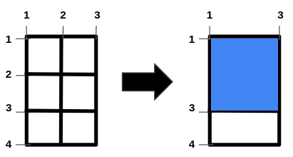
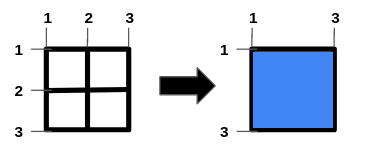
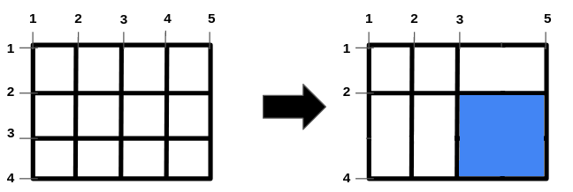

### 1. Description

You are given the two integers, `n` and `m` and two integer arrays, `hBars` and `vBars`. The grid has $n + 2$ horizontal and $m + 2$ vertical bars, creating 1 x 1 unit cells. The bars are indexed starting from `1`.

You can **remove** some of the bars in `hBars` from horizontal bars and some of the bars in `vBars` from vertical bars. Note that other bars are fixed and cannot be removed.

Return an integer denoting the **maximum area** of a *square-shaped* hole in the grid, after removing some bars (possibly none).

### 2. Function Contract

- `n`: Input parameter.
- Returns expected result.

### 3. Examples

#### Example 1

**Input: **n = 2, m = 1, hBars = [2,3], vBars = [2]

**Output: **4

**Explanation:**

The left image shows the initial grid formed by the bars. The horizontal bars are `[1,2,3,4]`, and the vertical bars are `[1,2,3]`.

One way to get the maximum square-shaped hole is by removing horizontal bar 2 and vertical bar 2.

#### Example 2

**Input: **n = 1, m = 1, hBars = [2], vBars = [2]

**Output: **4

**Explanation:**

To get the maximum square-shaped hole, we remove horizontal bar 2 and vertical bar 2.

#### Example 3

**Input: **n = 2, m = 3, hBars = [2,3], vBars = [2,4]

**Output: **4

**Explanation:**

One way to get the maximum square-shaped hole is by removing horizontal bar 3, and vertical bar 4.

### 4. Constraints

- $1 \le n \le 10^{9}$

- $1 \le m \le 10^{9}$

- $1 \le \text{hBars.length} \le 100$

- $2 \le \text{hBars}[i] \le n + 1$

- $1 \le \text{vBars.length} \le 100$

- $2 \le \text{vBars}[i] \le m + 1$

- All values in `hBars` are distinct.

- All values in `vBars` are distinct.