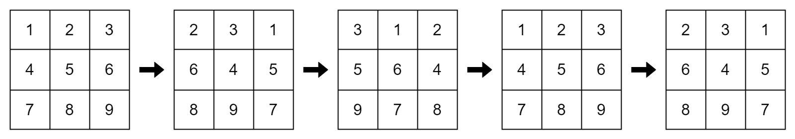
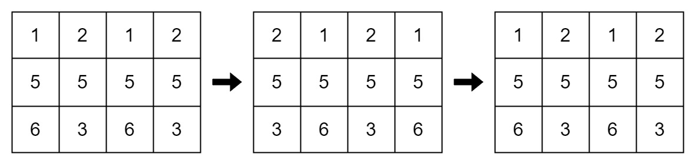

## Description

You are given an `m x n` integer matrix `mat` and an integer `k`. The matrix rows are 0-indexed.

The following proccess happens `k` times:

- **Even-indexed** rows (0, 2, 4, ...) are cyclically shifted to the left.

- **Odd-indexed** rows (1, 3, 5, ...) are cyclically shifted to the right.

Return `true` if the final modified matrix after `k` steps is identical to the original matrix, and `false` otherwise.
### Function Contract

- `n`: Input parameter.
- Returns expected result.

### Examples

#### Example 1

**Input:** mat = [[1,2,3],[4,5,6],[7,8,9]], k = 4

**Output:** false

**Explanation:**

In each step left shift is applied to rows 0 and 2 (even indices), and right shift to row 1 (odd index).

#### Example 2

**Input:** mat = [[1,2,1,2],[5,5,5,5],[6,3,6,3]], k = 2

**Output:** true

**Explanation:**

#### Example 3

**Input:** mat = [[2,2],[2,2]], k = 3

**Output:** true

**Explanation:**

As all the values are equal in the matrix, even after performing cyclic shifts the matrix will remain the same.

### Constraints

- $1 \le \text{mat.length} \le 25$

- $1 \le \text{mat}[i].length \le 25$

- $1 \le \text{mat}[i][j] \le 25$

- $1 \le k \le 50$