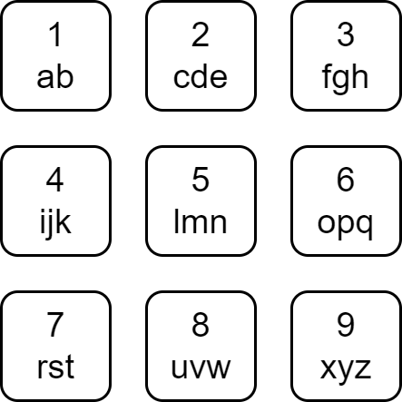

### 1. Description

Each character of the English alphabet has been mapped to a digit as shown below.

A string is **divisible** if the sum of the mapped values of its characters is divisible by its length.

Given a string `s`, return *the number of **divisible substrings** of* `s`.

A **substring** is a contiguous non-empty sequence of characters within a string.

### 2. Function Contract

- Refer to method signature.

### 3. Examples

#### Example 1

<table border="1" cellspacing="3" style="border-collapse: separate; text-align: center;">
	<tbody>
		<tr>
			<th style="padding: 5px; border: 1px solid black;">Substring</th>
			<th style="padding: 5px; border: 1px solid black;">Mapped</th>
			<th style="padding: 5px; border: 1px solid black;">Sum</th>
			<th style="padding: 5px; border: 1px solid black;">Length</th>
			<th style="padding: 5px; border: 1px solid black;">Divisible?</th>
		</tr>
		<tr>
			<td style="padding: 5px; border: 1px solid black;">a</td>
			<td style="padding: 5px; border: 1px solid black;">1</td>
			<td style="padding: 5px; border: 1px solid black;">1</td>
			<td style="padding: 5px; border: 1px solid black;">1</td>
			<td style="padding: 5px; border: 1px solid black;">Yes</td>
		</tr>
		<tr>
			<td style="padding: 5px; border: 1px solid black;">s</td>
			<td style="padding: 5px; border: 1px solid black;">7</td>
			<td style="padding: 5px; border: 1px solid black;">7</td>
			<td style="padding: 5px; border: 1px solid black;">1</td>
			<td style="padding: 5px; border: 1px solid black;">Yes</td>
		</tr>
		<tr>
			<td style="padding: 5px; border: 1px solid black;">d</td>
			<td style="padding: 5px; border: 1px solid black;">2</td>
			<td style="padding: 5px; border: 1px solid black;">2</td>
			<td style="padding: 5px; border: 1px solid black;">1</td>
			<td style="padding: 5px; border: 1px solid black;">Yes</td>
		</tr>
		<tr>
			<td style="padding: 5px; border: 1px solid black;">f</td>
			<td style="padding: 5px; border: 1px solid black;">3</td>
			<td style="padding: 5px; border: 1px solid black;">3</td>
			<td style="padding: 5px; border: 1px solid black;">1</td>
			<td style="padding: 5px; border: 1px solid black;">Yes</td>
		</tr>
		<tr>
			<td style="padding: 5px; border: 1px solid black;">as</td>
			<td style="padding: 5px; border: 1px solid black;">1, 7</td>
			<td style="padding: 5px; border: 1px solid black;">8</td>
			<td style="padding: 5px; border: 1px solid black;">2</td>
			<td style="padding: 5px; border: 1px solid black;">Yes</td>
		</tr>
		<tr>
			<td style="padding: 5px; border: 1px solid black;">sd</td>
			<td style="padding: 5px; border: 1px solid black;">7, 2</td>
			<td style="padding: 5px; border: 1px solid black;">9</td>
			<td style="padding: 5px; border: 1px solid black;">2</td>
			<td style="padding: 5px; border: 1px solid black;">No</td>
		</tr>
		<tr>
			<td style="padding: 5px; border: 1px solid black;">df</td>
			<td style="padding: 5px; border: 1px solid black;">2, 3</td>
			<td style="padding: 5px; border: 1px solid black;">5</td>
			<td style="padding: 5px; border: 1px solid black;">2</td>
			<td style="padding: 5px; border: 1px solid black;">No</td>
		</tr>
		<tr>
			<td style="padding: 5px; border: 1px solid black;">asd</td>
			<td style="padding: 5px; border: 1px solid black;">1, 7, 2</td>
			<td style="padding: 5px; border: 1px solid black;">10</td>
			<td style="padding: 5px; border: 1px solid black;">3</td>
			<td style="padding: 5px; border: 1px solid black;">No</td>
		</tr>
		<tr>
			<td style="padding: 5px; border: 1px solid black;">sdf</td>
			<td style="padding: 5px; border: 1px solid black;">7, 2, 3</td>
			<td style="padding: 5px; border: 1px solid black;">12</td>
			<td style="padding: 5px; border: 1px solid black;">3</td>
			<td style="padding: 5px; border: 1px solid black;">Yes</td>
		</tr>
		<tr>
			<td style="padding: 5px; border: 1px solid black;">asdf</td>
			<td style="padding: 5px; border: 1px solid black;">1, 7, 2, 3</td>
			<td style="padding: 5px; border: 1px solid black;">13</td>
			<td style="padding: 5px; border: 1px solid black;">4</td>
			<td style="padding: 5px; border: 1px solid black;">No</td>
		</tr>
	</tbody>
</table>

- **Input:** $word = "asdf"$
- **Output:** `6`
- **Explanation:** The table above contains the details about every substring of word, and we can see that 6 of them are divisible.

#### Example 2

- **Input:** $word = "bdh"$
- **Output:** `4`
- **Explanation:** The 4 divisible substrings are: "b", "d", "h", "bdh".
It can be shown that there are no other substrings of word that are divisible.

#### Example 3

- **Input:** $word = "abcd"$
- **Output:** `6`
- **Explanation:** The 6 divisible substrings are: "a", "b", "c", "d", "ab", "cd".
It can be shown that there are no other substrings of word that are divisible.

### 4. Constraints

- $1 \le \text{word.length} \le 2000$

- `word` consists only of lowercase English letters.
