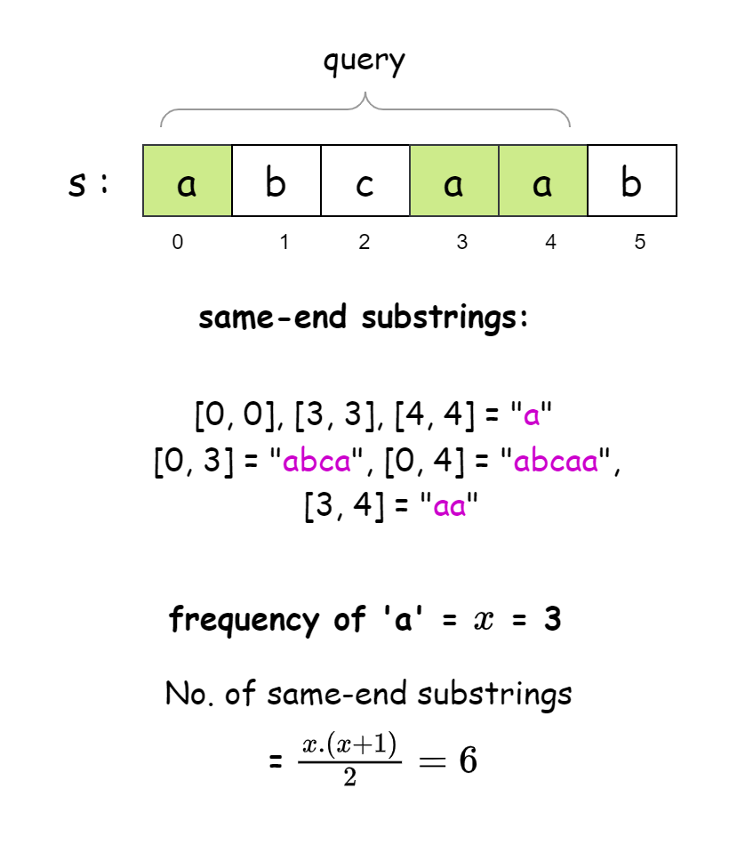

[TOC]

## Solution

---

### Approach 1: Binary Search

#### Intuition

Our goal here is to efficiently count how many strings start and end with the same character within a given range. The key is that two instances of the same character can form a same-end substring.

Let’s say there are `x` occurrences of a character within a range. Any pair of these characters can form a substring, and each character can also form a substring by itself. To calculate the total number of substrings, we use the combination formula:

$$
\begin{aligned}
    ^xC_2 + x &= \frac{x \cdot (x - 1)}{2} + x \\
    &= \frac{x \cdot (x + 1)}{2}
\end{aligned}
$$
This gives us the total number of substrings that start and end with that character. The below illustration could be helpful to visualize this concept:



The challenge is to optimally count how often each of the 26 characters appears within any given range of the string. To do this efficiently, we can track the positions of each character in the string. Once we have these positions, we can easily count how many of them fall within the desired range by using a binary search.

First, we create a map of lists to store the positions of each character in the string. Then for each query, we want to figure out how many times a character appears within the specified range. Since the positions are sorted, we can use binary search to find:
   - The first position of the character that is at or after the starting index of the range.
   - The first position of the character that is beyond the ending index of the range.

By subtracting these two values, we can find how many times the character appears in the range. Once we know this count, we can use the formula to calculate how many valid substrings can be formed.

We repeat this process for all 26 characters and sum up the results to get the total number of substrings for that query.

#### Algorithm

- Initialize a map `charPositionsMap` to store each unique character in the string `s` as the key and a list of indices where the character appears in `s` as the value.
- Iterate over the string `s`, for each character `c` at index `i`:
  - If the character `c` is not already in `charPositionsMap`, initialize an empty list for it.
  - Append the current index `i` to the list corresponding to character `c` in `charPositionsMap`.
- Initialize:
  - a variable `numQueries` to the length of the `queries` array.
  - an array `result` of size `numQueries` to store the result for each query.
- Iterate over the `queries` array, for each query $\text{queries}[i]$:
  - Initialize `leftIndex` and `rightIndex` to the start and end indices of the substring defined by the query.
  - Initialize `countSameEndSubstrings` to 0, which will accumulate the number of same-end substrings for this query.
  - For each character in `charPositionsMap`:
- Retrieve the list of positions where the character appears from `charPositionsMap`.
- Call `findFirstGE` to find the first position in the list that is greater than or equal to `leftIndex` (left bound).
- Call `findFirstGT` to find the first position in the list that is strictly greater than `rightIndex` (right bound).
- Calculate the number of occurrences of the character within the range by subtracting `leftBound` from `rightBound`.
- Update `countSameEndSubstrings` by adding the total number of same-end substrings for this character.
  - Assign the result of this query to $\text{result}[i]$.
- Return the `result` array after all queries have been processed.

#### Implementation

```python
class Solution:
    def sameEndSubstringCount(
        self, s: str, queries: list[list[int]]
    ) -> list[int]:
        # Dictionary to store each character and its positions in the string 's'
        char_positions_map = {}

        # Traverse the string and store the index of each character in the dictionary
        for i, c in enumerate(s):
            if c not in char_positions_map:
                char_positions_map[c] = []
            char_positions_map[c].append(i)

        result = []

        # Process each query
        for left_index, right_index in queries:
            count_same_end_substrings = 0

            # For each unique character in the string, calculate the number of same-end substrings
            for positions in char_positions_map.values():
                # Get the number of occurrences of the character within the range [left_index, right_index]
                left_bound = bisect_left(positions, left_index)
                right_bound = bisect_right(positions, right_index)
                num_occurrences = right_bound - left_bound

                # Calculate the number of same-end substrings for this character
                count_same_end_substrings += (
                    num_occurrences * (num_occurrences + 1) // 2
                )

            # Store the result for this query
            result.append(count_same_end_substrings)

        return result
```

#### Complexity Analysis

Let $n$ be the length of the input string `s` and $q$ be the number of queries.

- Time complexity: $O(n + q \cdot \log n)$

    Iterating through the string `s` and populating `charPositionsMap` takes $O(n)$ time.

    For each query, the algorithm iterates over the characters (maximum $26$ for lowercase letters). For each character, it performs two binary search operations on the list of positions, each taking $O(\log n)$ time. So, for each query, the time taken is $O(26 \cdot \log n) = O(\log n)$.

    Thus, the total time complexity for processing all queries is $O(n + q \cdot \log n)$

- Space complexity: $O(n)$

    The  `charPositionsMap` map takes $O(n)$ space in the worst case. Since the `result` array is part of the output space, we are not considering it as a part of the space complexity analysis.

    Thus, the space complexity of the algorithm is $O(n)$.

---

### Approach 2: Prefix Sum

#### Intuition

We don't actually need to know the exact positions of the characters to count the number of substrings that have the same character repeated within the range. Instead, we just need to know how often that character appears. One of the best ways to efficiently find the frequency of something in a range is by using a prefix sum array.

A prefix sum array is like a running total; it gives you the sum of all elements up to and including that index. So, if we make an array that tracks how often a certain character shows up in a string, the prefix sum for that array will give us the total occurrences of that character up to any point in the string.

To do this, we'll first make frequency arrays for all 26 letters of the alphabet. Each position in these arrays represents a spot in the string. We'll put a 1 if the character appears there or a 0 if it doesn’t.

Once we have those frequency arrays, we’ll turn them into prefix sum arrays. This just means we add up all the values before each position, so now every position tells us how many times that character has appeared up to that point in the string.

With that done, we can go through our queries. For each query, we can easily find how often a character appears between two positions by subtracting the prefix sum at the left boundary from the prefix sum at the right boundary. Using that frequency, we can then calculate how many substrings are possible for that character and do the same for all the characters.

### Algorithm

- Initialize `n` to the length of the string `s`.
- Declare `charFreqPrefixSum` as a 2D array of size `26 x n`, where each row corresponds to a character from 'a' to 'z'.
- Loop through the string `s`:
   - For each character $s[i]$, increment the corresponding entry in the `charFreqPrefixSum` array.
- Convert the `charFreqPrefixSum` array into a prefix sum array. For each character `i` from a-z:
  - Iterate over the string `s`. For each index `j`:
- Set $\text{charFreqPrefixSum}[i][j]$ to the sum of itself and the previous element $\text{charFreqPrefixSum}[i][j-1]$.
- Initialize an array `results` to store the results for each query.
- Loop over the `queries` array, For each query:
  - Retrieve `leftIndex` and `rightIndex` from the query.
  - Initialize a variable `countSameEndSubstrings` to store the count of substrings.
  - Loop through each character index `charIndex`::
- Calculate `leftFreq` as the frequency of `charIndex` at position $leftIndex - 1$. If `leftIndex` is `0`, set `leftFreq` to `0`.
- Set `rightFreq` to the frequency of the character at `rightIndex`.
- Calculate `frequencyInRange` as the difference between `rightFreq` and `leftFreq`.
- Compute the number of same-end substrings as $frequencyInRange * (frequencyInRange + 1) / 2$. Add the result to `countSameEndSubstrings`.
  - Store `countSameEndSubstrings` in the `results` array at the current index.
- Return the `results` array containing the answer for each query.

#### Implementation

```python
class Solution:
    def sameEndSubstringCount(
        self, s: str, queries: List[List[int]]
    ) -> List[int]:
        n = len(s)
        # 2D list to store prefix sum of character frequencies for each character 'a' to 'z'
        char_freq_prefix_sum = [[0] * n for _ in range(26)]

        # Fill the frequency array
        for i, char in enumerate(s):
            char_freq_prefix_sum[ord(char) - ord("a")][i] += 1

        # Convert the frequency array into a prefix sum array
        for freq in char_freq_prefix_sum:
            for j in range(1, n):
                freq[j] += freq[j - 1]

        results = []

        # Process each query
        for left_index, right_index in queries:
            count_same_end_substrings = 0

            # For each character, calculate the frequency of occurrences within the query range
            for freq in char_freq_prefix_sum:
                left_freq = 0 if left_index == 0 else freq[left_index - 1]
                right_freq = freq[right_index]
                frequency_in_range = right_freq - left_freq

                # Calculate the number of same-end substrings for this character
                count_same_end_substrings += (
                    frequency_in_range * (frequency_in_range + 1) // 2
                )

            results.append(count_same_end_substrings)

        return results
```

#### Complexity Analysis

Let $n$ be the length of the input string `s` and $q$ be the number of queries.

* Time complexity: $O(n + q)$

    Populating the frequency array takes $O(n)$ time, as the algorithm loops over the entire string `s`. Converting the frequency array into a prefix sum array involves iterating over all characters (26) and overall indices in `s`. This step takes $O(26 \cdot n)$ time, which simplifies to $O(n)$.

    For each query, the algorithm iterates through each character and computes the frequency within the query range. Since there are $q$ queries, the time complexity for processing all queries is $O(26 \cdot q)$, which simplifies to $O(q)$.

    Thus, the overall time complexity of the algorithm is $O(n + q)$.

* Space complexity: $O(n)$

    The `charFreqPrefixSum` array is a 2D array with $26$ rows and $n$ columns, requiring $O(26 \cdot n)$ space. The `results` array is excluded from the analysis due to it being part of the output space.

    Thus, the space complexity of the algorithm is $O(26 \cdot n) = O(n)$.

---