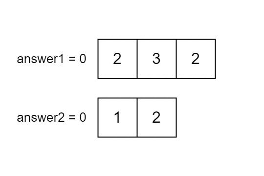

### 1. Description

You are given two integer arrays `nums1` and `nums2` of sizes `n` and `m`, respectively. Calculate the following values:

- `answer1` : the number of indices `i` such that $\text{nums1}[i]$ exists in `nums2`.

- `answer2` : the number of indices `i` such that $\text{nums2}[i]$ exists in `nums1`.

Return `[answer1,answer2]`.

### 2. Function Contract

- `n`: Input parameter.
- Returns expected result.

### 3. Examples

#### Example 1

**Input:** nums1 = [2,3,2], nums2 = [1,2]

**Output:** [2,1]

**Explanation:**

#### Example 2

**Input:** nums1 = [4,3,2,3,1], nums2 = [2,2,5,2,3,6]

**Output:** [3,4]

**Explanation:**

The elements at indices 1, 2, and 3 in `nums1` exist in `nums2` as well. So `answer1` is 3.

The elements at indices 0, 1, 3, and 4 in `nums2` exist in `nums1`. So `answer2` is 4.

#### Example 3

**Input:** nums1 = [3,4,2,3], nums2 = [1,5]

**Output:** [0,0]

**Explanation:**

No numbers are common between `nums1` and `nums2`, so answer is [0,0].

### 4. Constraints

- $n = \text{nums1.length}$

- $m = \text{nums2.length}$

- $1 \le n, m \le 100$

- $1 \le \text{nums1}[i], \text{nums2}[i] \le 100$