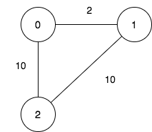
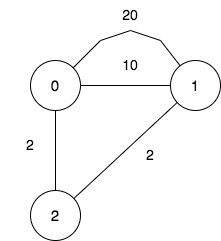

### 1. Description

There is a company with `n` branches across the country, some of which are connected by roads. Initially, all branches are reachable from each other by traveling some roads.

The company has realized that they are spending an excessive amount of time traveling between their branches. As a result, they have decided to close down some of these branches (**possibly none**). However, they want to ensure that the remaining branches have a distance of at most `maxDistance` from each other.

The **distance** between two branches is the **minimum** total traveled length needed to reach one branch from another.

You are given integers `n`, `maxDistance`, and a **0-indexed** 2D array `roads`, where $\text{roads}[i] = [u_{i}, v_{i}, w_{i}]$ represents the **undirected** road between branches $u_{i}$ and $v_{i}$ with length $w_{i}$.

Return *the number of possible sets of closing branches, so that any branch has a distance of at most *`maxDistance`* from any other*.

### 2. Function Contract

- `n`: Input parameter.
- Returns expected result.

### 3. Note

that, after closing a branch, the company will no longer have access to any roads connected to it.

### 4. Note

that, multiple roads are allowed.

### 5. Examples

#### Example 1

- **Input:** $n = 3, maxDistance = 5, roads = [[0,1,2],[1,2,10],[0,2,10]]$
- **Output:** `5`
- **Explanation:** The possible sets of closing branches are:
- The set [2], after closing, active branches are [0,1] and they are reachable to each other within distance 2.
- The set [0,1], after closing, the active branch is [2].
- The set [1,2], after closing, the active branch is [0].
- The set [0,2], after closing, the active branch is [1].
- The set [0,1,2], after closing, there are no active branches.
It can be proven, that there are only 5 possible sets of closing branches.
#### Example 2

- **Input:** $n = 3, maxDistance = 5, roads = [[0,1,20],[0,1,10],[1,2,2],[0,2,2]]$
- **Output:** `7`
- **Explanation:** The possible sets of closing branches are:
- The set [], after closing, active branches are [0,1,2] and they are reachable to each other within distance 4.
- The set [0], after closing, active branches are [1,2] and they are reachable to each other within distance 2.
- The set [1], after closing, active branches are [0,2] and they are reachable to each other within distance 2.
- The set [0,1], after closing, the active branch is [2].
- The set [1,2], after closing, the active branch is [0].
- The set [0,2], after closing, the active branch is [1].
- The set [0,1,2], after closing, there are no active branches.
It can be proven, that there are only 7 possible sets of closing branches.
#### Example 3

- **Input:** $n = 1, maxDistance = 10, roads = []$
- **Output:** `2`
- **Explanation:** The possible sets of closing branches are:
- The set [], after closing, the active branch is [0].
- The set [0], after closing, there are no active branches.
It can be proven, that there are only 2 possible sets of closing branches.

### 6. Constraints

- $1 \le n \le 10$

- $1 \le maxDistance \le 10^{5}$

- $0 \le \text{roads.length} \le 1000$

- $\text{roads}[i].length = 3$

- $0 \le u_{i}, v_{i} \le n - 1$

- $u_{i} \neq v_{i}$

- $1 \le w_{i} \le 1000$

- All branches are reachable from each other by traveling some roads.