[TOC]

## Solution

---

### Approach 1: Hash Map

#### Intuition

We are given a grid containing integers ranging from $1$ to $n^2$ with the following rules:
1. One number is repeated twice.
2. One number from the range is missing in the input.
3. All other numbers occur exactly once.

Our task is to find both the repeated number and the missing number in the grid. The most straightforward way to do this is to count how many times each number appears. The number that appears twice is the repeated number, while the number that does not appear at all is the missing one. But how can we efficiently count occurrences without excessive searching?

A hash map is a perfect tool for this task because it allows us to store and retrieve counts efficiently. Since each number can be associated with its count, we can map each integer to its frequency using a hash map. Fetching and updating values in a hash map happens in constant time on average, which makes it well-suited for this problem.

To implement this, we start by creating a hash map called `freq` to store the frequency of each number in the grid. We then iterate through the grid, updating the count for each number as we encounter it. Once we finish scanning the grid, we have a complete record of how many times each number appears.

Next, we loop through all numbers from $1$ to $n^2$ and check their frequencies in `freq`. If a number has a count of `2`, it is the repeated number. If a number does not exist in the map, it is the missing number. Once we identify both, we return them as our final answer.

The slideshow below demonstrates the algorithm in action:

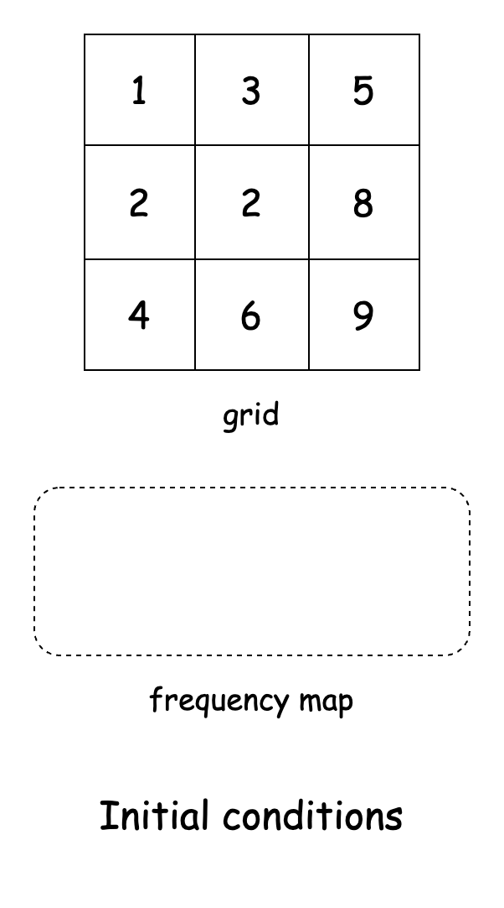

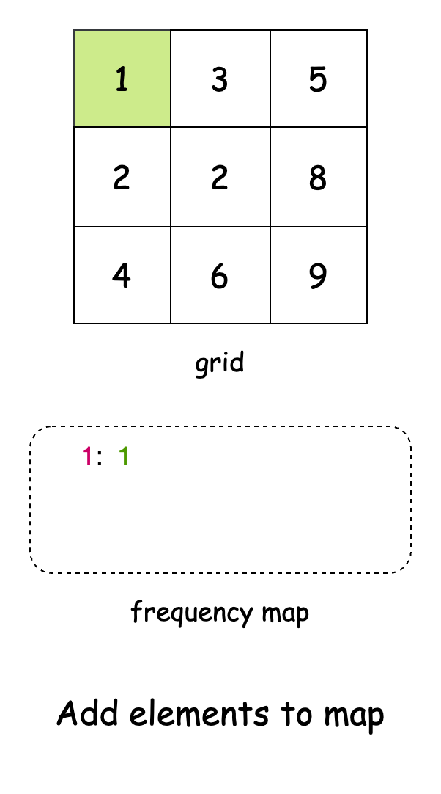

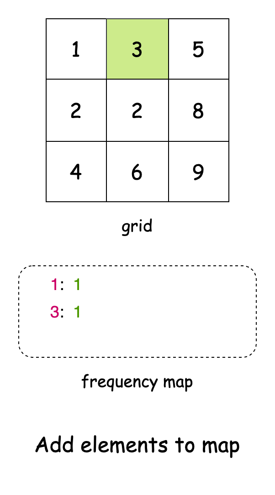

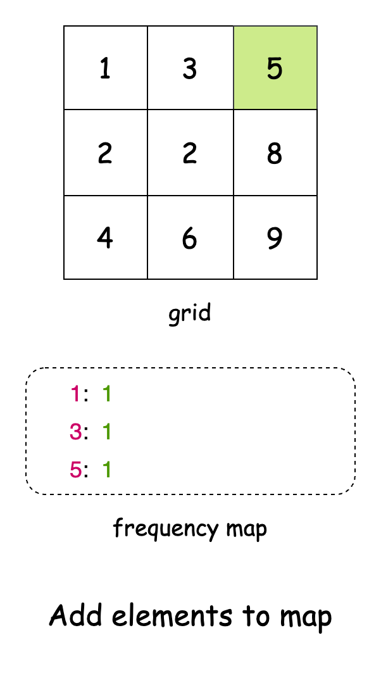

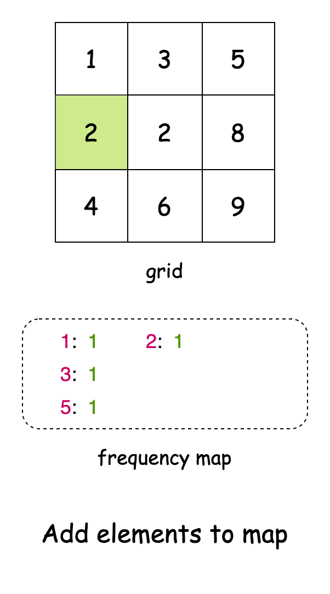

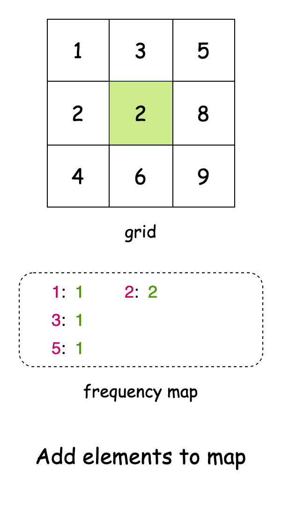

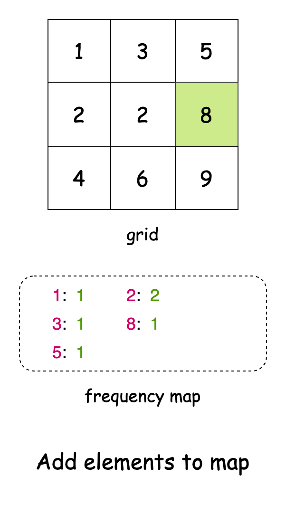

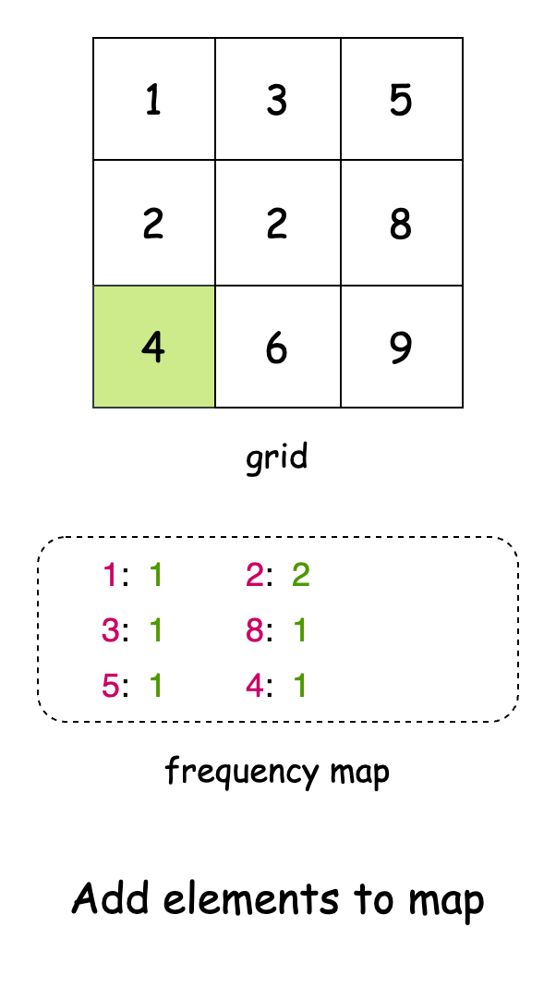

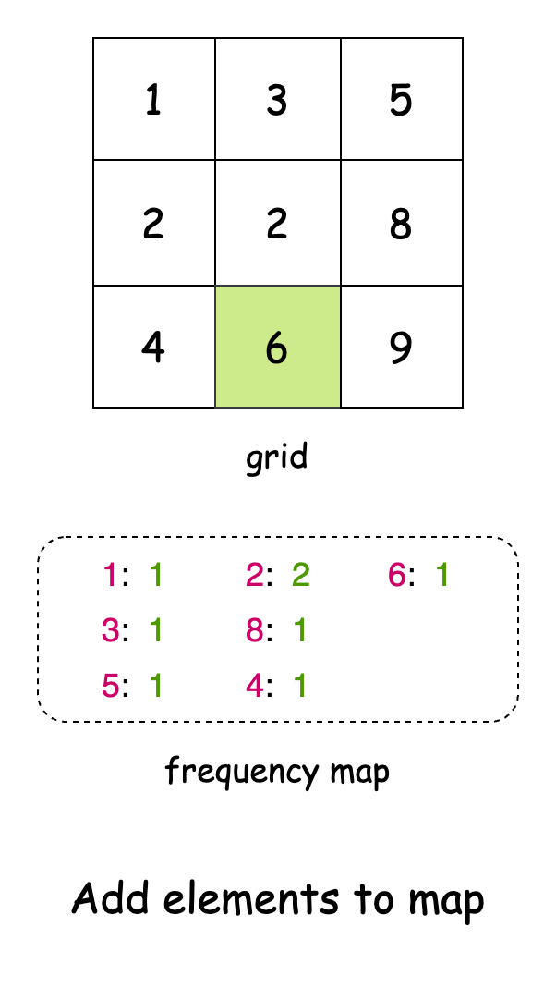

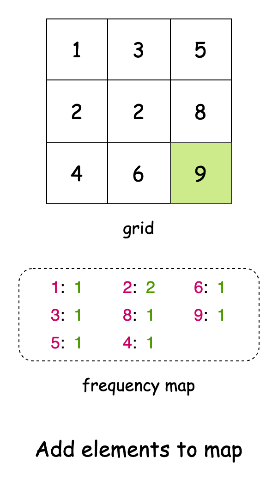

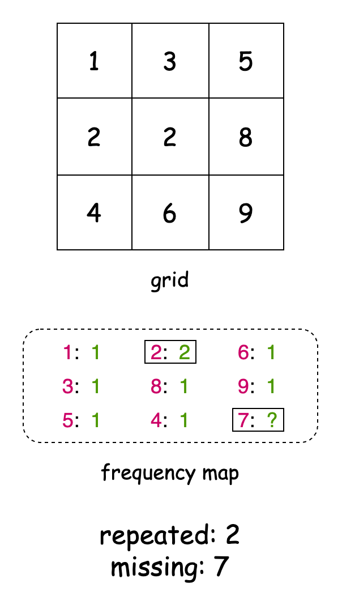

> For a more comprehensive understanding of hash tables, check out the [Hash Table Explore Card](https://leetcode.com/explore/learn/card/hash-table/). This resource provides an in-depth look at hash tables, explaining their key concepts and applications with a variety of problems to solidify understanding of the pattern.

#### Algorithm

- Initialize variables:
  - `n` to store the length of the `grid`.
  - `missing` and `repeat` to `-1`.
- Initialize a frequency map `freq` to track the count of each number in the `grid`.
- For each `row` in the `grid`:
  - For each number in the `row`:
- Add the number to `freq` or increment its count if already present.
- For each `num` from `1` to $n * n$ (inclusive):
  - If `num` is not present in the frequency map:
- Set `missing` to `num`.
  - If `num` appears twice in the frequency map:
- Set `repeat` to `num`.
- Return an array containing the repeated and missing numbers.

#### Implementation

```python
class Solution:
    def findMissingAndRepeatedValues(self, grid: List[List[int]]) -> List[int]:
        n = len(grid)
        freq = {}

        # Store frequency of each number in the grid
        for row in grid:
            for num in row:
                freq[num] = freq.get(num, 0) + 1

        # Check numbers from 1 to n^2 to find missing and repeated values
        for num in range(1, n * n + 1):
            if num not in freq:
                missing = num  # Number not present in grid
            elif freq[num] == 2:
                repeat = num  # Number appears twice

        return [repeat, missing]
```

#### Complexity Analysis

Let $n$ be the side length of the `grid`.

- Time complexity: $O(n^2)$

    The algorithm makes two main passes. First, we iterate through each cell in our $n \times n$ grid to build the frequency map, which takes $O(n^2)$ operations. Then, we iterate through numbers from $1$ to $n^2$ to find our missing and repeated values, which takes $O(n^2)$ operations. Since both passes are sequential and take $O(n^2)$ time, our overall time complexity is $O(n^2)$.

- Space complexity: $O(n^2)$

    The algorithm uses a hash map to store the frequency of each number. The map will store all unique numbers from $1$ to $n^2$ except the missing number, making the space complexity $O(n^2)$.

---

### Approach 2: Math

#### Intuition

At first glance, this problem might seem to require tracking frequencies, but there's a more elegant mathematical approach. In a perfect sequence from $1$ to $n^2$, every number appears exactly once. However, in our given sequence, one number appears twice, and another number is missing. Let’s define the repeated number as $x$ and the missing number as $y$.

Instead of explicitly counting occurrences, we can leverage basic mathematical properties of numbers. The sum of all numbers in a proper sequence from $1$ to $n^2$ can be computed using the formula:

$$
\begin{aligned}
    \text{perfectSum} = \frac{n^2 \cdot (n^2 + 1)}{2}
\end{aligned}
$Similarly, the sum of the squares of these numbers follows this formula:$
\begin{aligned}
    \text{perfectSqrSum} = \frac{n^2 \cdot (n^2 + 1) \cdot (2n^2 + 1)}{6}
\end{aligned}
$$

Now, if we compute the sum of numbers in our given grid ($\text{sum}$) and compare it with $\text{perfectSum}$, we can express their relationship as:

$$
\begin{aligned}
    \text{sum} = \text{perfectSum} + x - y
\end{aligned}
$This tells us that the difference between the actual sum and the perfect sum gives us:$
\begin{aligned}
    \text{sumDiff} = x - y
\end{aligned}
$$

Similarly, if we compute the sum of squares from our grid ($\text{sqrSum}$) and compare it with $\text{perfectSqrSum}$, we get:

$$
\begin{aligned}
    \text{sqrDiff} = x^2 - y^2
\end{aligned}
$Now, we recall a fundamental algebraic identity:$
\begin{aligned}
x^2 - y^2 = (x + y) \cdot (x - y)
\end{aligned}
$$

Since we already know $x - y$ from $\text{sumDiff}$, we can substitute it into the equation:

$$\begin{aligned}
    \text{sqrDiff} = (x + y) \cdot \text{sumDiff}
\end{aligned}$$

Rearranging this equation, we can solve for $x + y$:

$$
\begin{aligned}
x + y = \frac{\text{sqrDiff}}{\text{sumDiff}}
\end{aligned}
$Now, we have two simple equations:$
\begin{aligned}
x - y = \text{sumDiff}
\end{aligned}
$$$$
\begin{aligned}
x + y = \frac{\text{sqrDiff}}{\text{sumDiff}}
\end{aligned}
$$

Solving for $x$ and $y$:

$$\begin{aligned}
x = \frac{\text{sqrDiff}/\text{sumDiff} + \text{sumDiff}}{2}
\end{aligned}$$

$$\begin{aligned}
y = \frac{\text{sqrDiff}/\text{sumDiff} - \text{sumDiff}}{2}
\end{aligned}$$

This mathematical derivation translates directly into our code. We first calculate the actual sums from our grid and then compute the perfect sums using the formulas. The differences between these give us $\text{sumDiff}$ and $\text{squareDifference}$, which we can plug into our final formulas to get the repeating and missing numbers.

> Note: One important implementation detail is the use of long instead of int for our calculations. This is crucial because when we're dealing with squares of numbers, we can easily exceed the integer range.

#### Algorithm

- Initialize variables:
  - `sum` and `sqrSum` to `0` to store the actual sums from the `grid`.
  - `n` to store the length of the `grid`.
- Initialize a variable `total` to $n * n$ to store the total number of elements.
- For each `row` in the `grid`:
  - For each `col` in the `grid`:
- Add the current element to `sum`.
- Add the square of the current element to `sqrSum`.
- Calculate the `sumDiff` by subtracting the expected sum $(total * (total + 1) / 2)$ from the actual `sum`.
- Calculate the `sqrDiff` by subtracting the expected square sum $(total * (total + 1) * (2 * total + 1) / 6)$ from the actual `sqrSum`.
- Calculate `repeat` using the formula $(sqrDiff / sumDiff + sumDiff) / 2$.
- Calculate `missing` using the formula $(sqrDiff / sumDiff - sumDiff) / 2$.
- Return an array containing `repeat` and `missing` numbers.

#### Implementation

```python
class Solution:
    def findMissingAndRepeatedValues(self, grid: List[List[int]]) -> List[int]:
        # Get grid dimensions
        n = len(grid)
        total = n * n

        # Calculate actual sums from grid
        sum_val = sum(num for row in grid for num in row)
        sqr_sum = sum(num * num for row in grid for num in row)

        # Calculate differences from expected sums
        # Expected sum: n(n+1)/2, Expected square sum: n(n+1)(2n+1)/6
        sum_diff = sum_val - total * (total + 1) // 2
        sqr_diff = sqr_sum - total * (total + 1) * (2 * total + 1) // 6

        # Using math: If x is repeated and y is missing
        # sum_diff = x - y
        # sqr_diff = x² - y²
        repeat = (sqr_diff // sum_diff + sum_diff) // 2
        missing = (sqr_diff // sum_diff - sum_diff) // 2

        return [repeat, missing]
```

#### Complexity Analysis

Let $n$ be the side length of the `grid`.

- Time complexity: $O(n^2)$

    The algorithm iterates through each cell in the $n \times n$ grid exactly once using two nested loops. All other operations (calculating sums, differences, and the final values) are constant time operations. Therefore, the total time complexity is $O(n^2)$.

- Space complexity: $O(1)$

    The algorithm only uses a constant amount of extra space to store variables (`sum`, `sqrSum`, `n`, `total`, `sumDiff`, `sqrDiff`) regardless of the input size. Therefore, the space complexity is $O(1)$.

---