## Solution

---

### Overview

The problem involves finding the largest possible perimeter of a polygon that can be formed using a given array of positive integers, where each integer represents the length of a side of the polygon. The conditions for forming a valid polygon are that it must be a closed plane figure with at least 3 sides, and the length of the longest side must be smaller than the sum of the lengths of the other sides.

In real-life scenarios, this problem can be related to optimization challenges in fields such as manufacturing or construction. For example, in manufacturing, where materials are limited, the problem can be interpreted as finding the most efficient way to use available resources to create a closed structure with a maximal perimeter. The problem highlights the importance of understanding geometric constraints and optimizing resource utilization.

---

### Approach: Sorting

#### Intuition

The problem revolves around the construction of polygons from a given array of positive integers. The aim is to determine the largest possible perimeter of a polygon that can be formed using elements from the array and to return -1 if it is not feasible to create a polygon. A polygon, in this context, is defined as a closed plane figure with **at least three sides**, where the length of the longest side is less than the sum of the remaining sides.

To approach this problem intuitively, let's consider the nature of polygons and their side lengths. According to the problem description, a valid polygon consists of sides where the **longest side** is **smaller** than the sum of its other sides.

> Conversely, if you have $k (k \ge 3)$ positive real numbers `a1, a2, a3, ..., ak` where $a1 \le a2 \le a3 \le ... \le ak$ and $a1 + a2 + a3 + ... + ak-1 > ak$, then there always exists a polygon with `k` sides whose lengths are `a1, a2, a3, ..., ak`.

This concept provides a key insight into how we might construct a valid polygon from the given array of positive integers. The requirement that the largest side must be smaller than the sum of the remaining sides suggests the need to establish an order among the side lengths. In other words, the challenge is to find a systematic way to consider side lengths such that the largest one is positioned last, allowing us to check if it is smaller than the sum of the others.

We can begin by sorting the array, which allows us to consider the elements in ascending order, facilitating a systematic examination of possible side lengths. The sorting operation ensures that we iterate through the array in increasing order of side lengths, so we encounter smaller sides first and the longest side last, which is useful because the longest side should be smaller than the sum of the others.

Now, as we traverse the sorted array, we need to maintain a running sum of the previously encountered elements. This sum represents the cumulative length of the sides that we have already considered. As we move through the array, we evaluate each element in relation to the sum of the previously encountered elements.

The pivotal insight of this algorithm is that if the current element is smaller than the sum of the previous elements, we can form a valid polygon because adding the current element to the sum satisfies the condition that the longest side is smaller than the sum of the others.

Therefore, the algorithm keeps track of the maximum possible perimeter by updating the answer whenever a valid combination of sides is found. This ensures that we always have the largest perimeter encountered so far.

To handle cases where a valid combination of sides to form a polygon is not found, the algorithm initializes the variable `ans` to -1. The algorithm ensures that if no valid combination is encountered during the iteration through the sorted array, the value of `ans` remains unchanged. Consequently, upon completion of the loop, the algorithm returns -1, indicating the absence of a feasible polygon with the given array of positive integers.

Based on our current intuition, we can formulate the following solution:

```
long long largestPerimeter(vector<int>& nums) {
    sort(nums.begin(), nums.end());
    long long previousElementsSum = 0;
    long long ans = -1;
    for (int i = 0; i < nums.size(); i++) {
        if (i >= 2 && nums[i] < previousElementsSum) {
            ans = nums[i] + previousElementsSum;
        }
        previousElementsSum += nums[i];
    }
    return ans;
}
```

The additional check ($i \ge 2$) before updating `ans` to $\text{nums}[i]+ previousElementsSum$ ensures that the polygon under consideration has at least three sides. A closer examination reveals that this condition is, in fact, unnecessary.

The absence of a need to include an additional check for $i \ge 2$ in the for loop can be comprehensively understood by considering the initialization of `previous_elements_sum` and the inherent properties of the sorted array.

1. On the first iteration, when $i = 0$, the initial value of `previous_elements_sum` is set to 0, and the subsequent comparison `num < previous_elements_sum` evaluates to false, as `num` is a positive integer. Consequently, the code block within the if statement is bypassed during this iteration.

2. Moving to the second iteration, $i = 1$, the value of `previous_elements_sum` assumes the first element of the sorted array ($\text{nums}[0]$). Given that the array is sorted in ascending order, `previous_elements_sum` is inherently less than or equal to the current element under consideration (`num`), which is $\text{nums}[1]$. As a result, the condition `num < previous_elements_sum` remains false during this iteration as well, and the loop proceeds without executing the code block within the if statement.

The sorting of the array and the careful initialization of `previous_elements_sum` ensure that the condition `num < previous_elements_sum` is systematically false for the initial iterations of the loop (when `i < 2`). Therefore, the absence of an extra check for $i \ge 2$ is justified, as the logic inherently accounts for the starting points of the loop, streamlining the code without sacrificing correctness.

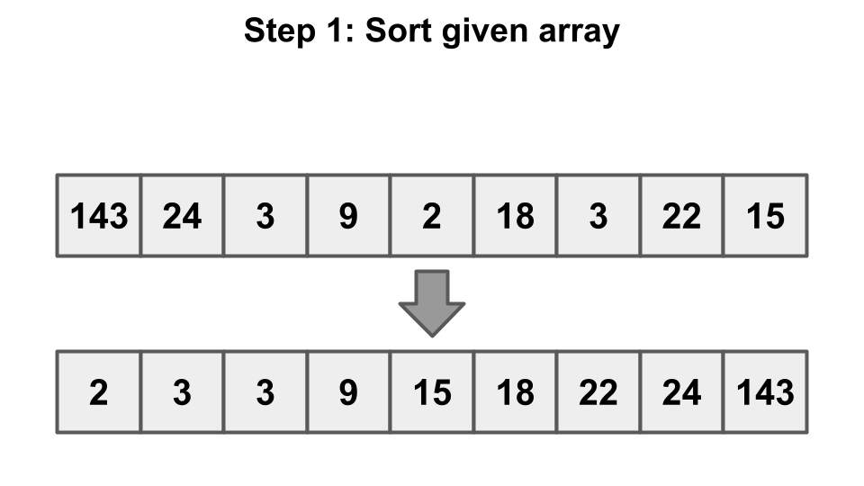

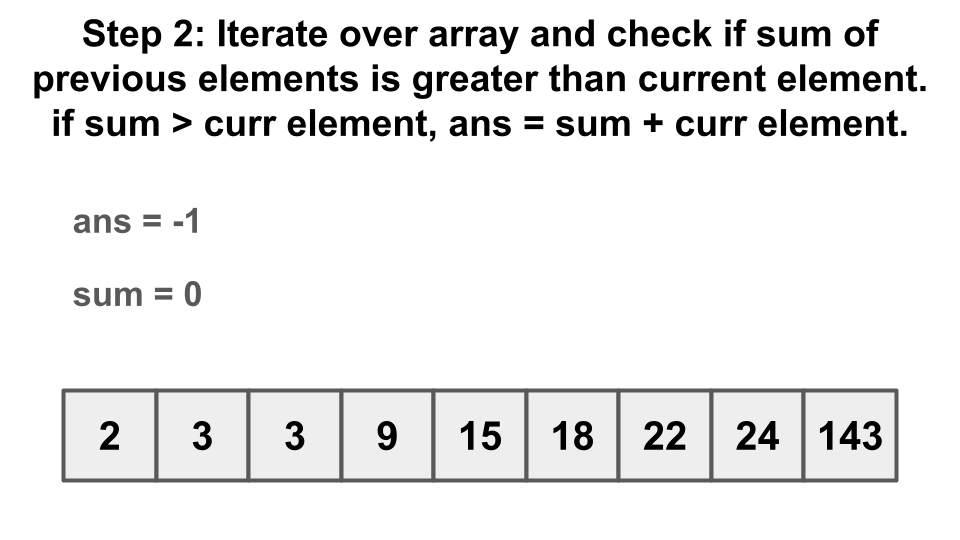

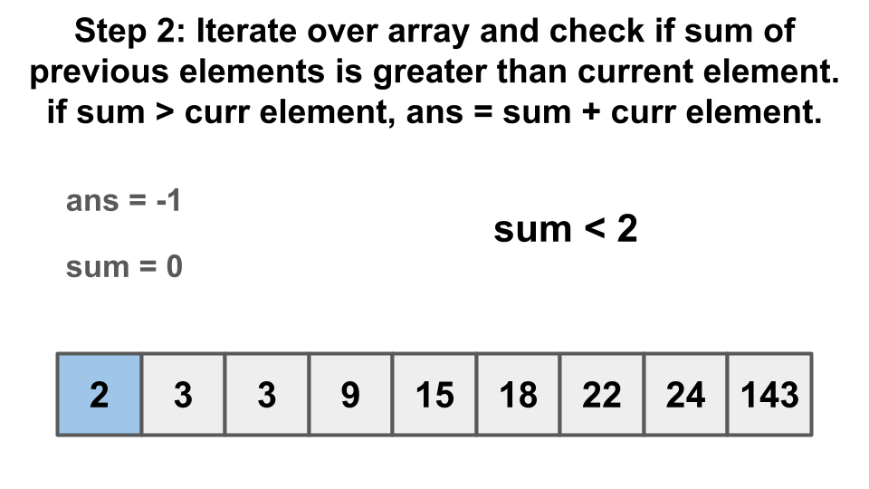

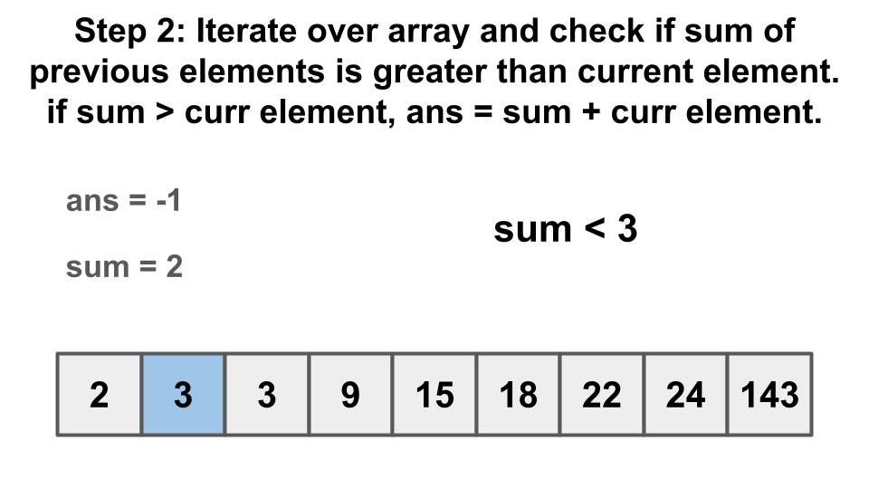

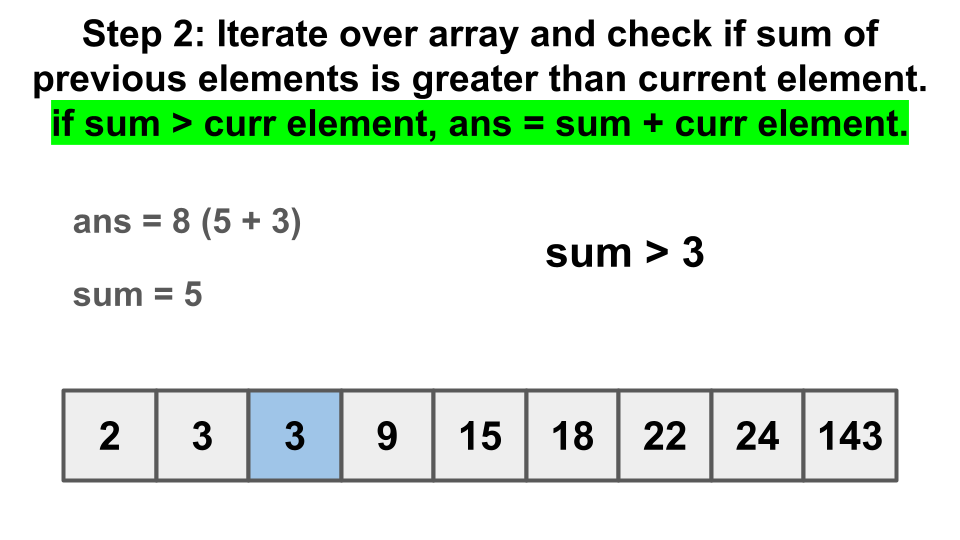

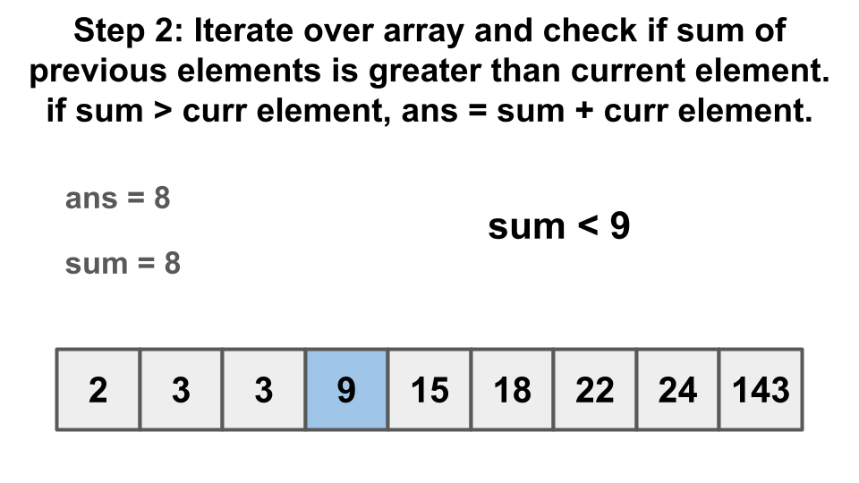

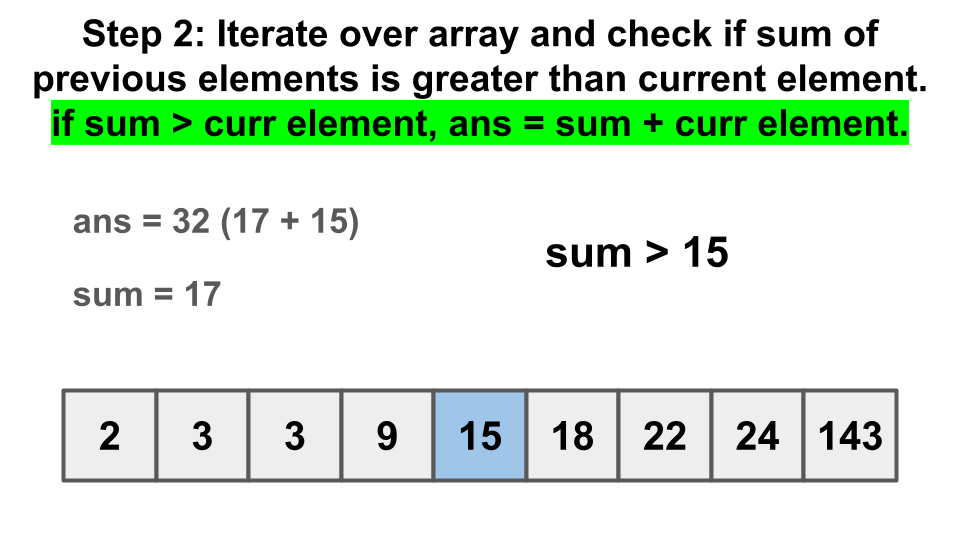

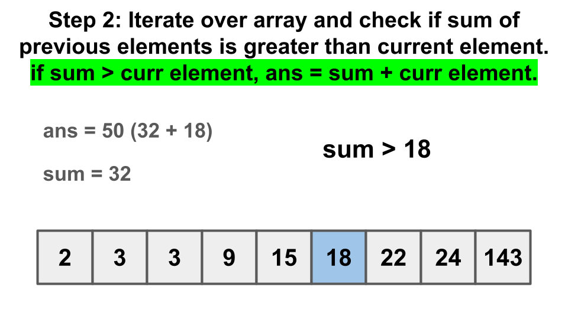

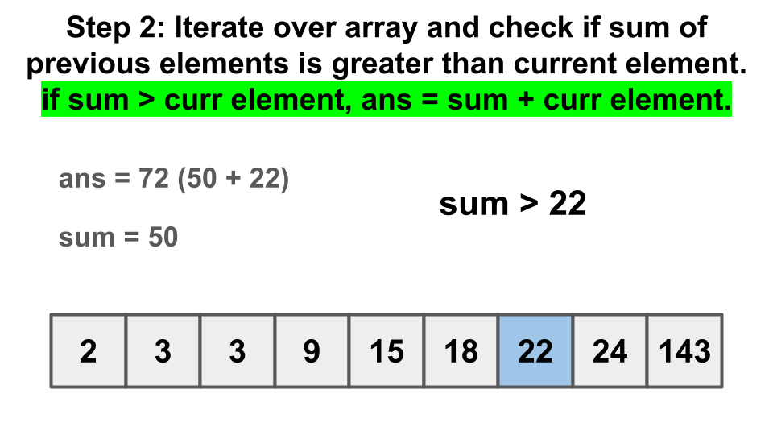

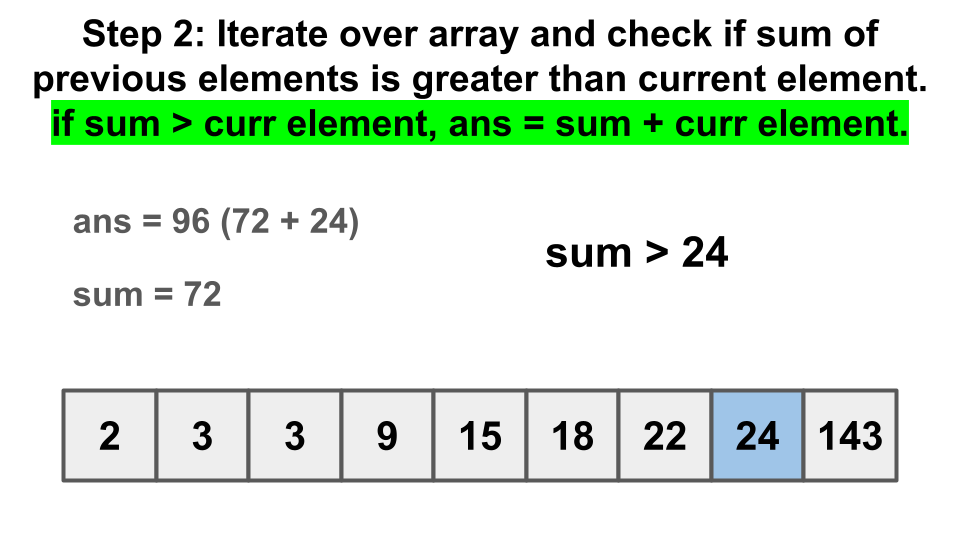

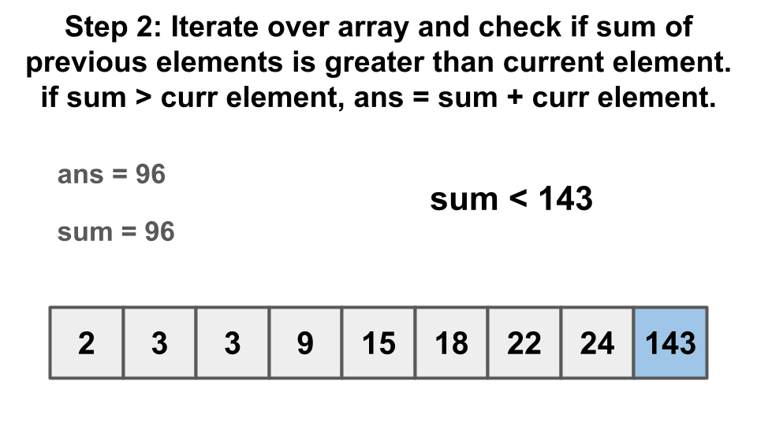

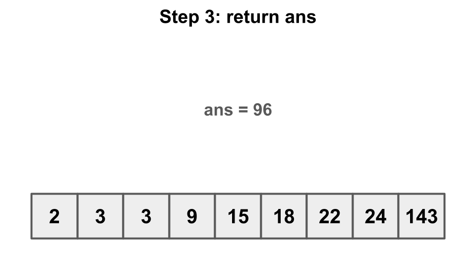

#### Algorithm

1. Sort the input array `nums` in ascending order.
2. Initialize variables `previous_elements_sum` to 0 and `ans` to -1.
3. Iterate through each element `num` in the sorted array `nums`.
4. Check if the current element `num` is less than the sum of previous elements. If true, we have encountered a valid combination of sides.
5. If the current `num` is a valid side, update `ans` to the sum of the current `num` and `previous_elements_sum`.
6. Update `previous_elements_sum` by adding the current element `num`.
7. After iterating through all elements, the method returns the largest possible perimeter stored in `ans`.

#### Implementation

```python
class Solution:
    def largestPerimeter(self, nums: List[int]) -> int:
        nums.sort()
        previous_elements_sum = 0
        ans = -1
        for num in nums:
            if num < previous_elements_sum:
                ans = num + previous_elements_sum
            previous_elements_sum += num
        return ans
```

#### Complexity Analysis

Let $N$ be the length of `nums`.

* Time complexity: $O(N\cdot logN)$. Sorting `nums` incurs a time complexity of $O(N\cdot logN)$. Iterating over `nums` incurs a time complexity of $O(N)$ which can be ignored since $O(N\cdot logN)$ is the dominating term.

* Space complexity: $O(N)$ or $O(\log N)$. Some extra space is used when we sort an array of size $N$ in place. The space complexity of the sorting algorithm depends on the programming language.
- In Python, the `sort` method sorts a list using the Timsort algorithm which is a combination of Merge Sort and Insertion Sort and has a space complexity of $O(N)$.
- In C++, the sort() function is implemented as a hybrid of Quick Sort, Heap Sort, and Insertion Sort, with a worst-case space complexity of $O(\log N)$.
- In Java, Arrays.sort() is implemented using a variant of the Quick Sort algorithm which has a space complexity of $O(\log N)$.

---