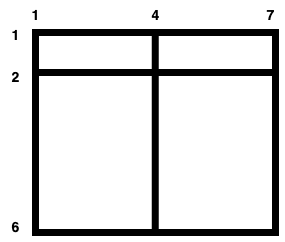

### 1. Description

There is a large $(m - 1) x (n - 1)$ rectangular field with corners at `(1, 1)` and `(m, n)` containing some horizontal and vertical fences given in arrays `hFences` and `vFences` respectively.

Horizontal fences are from the coordinates $(\text{hFences}[i], 1)$ to $(\text{hFences}[i], n)$ and vertical fences are from the coordinates $(1, \text{vFences}[i])$ to $(m, \text{vFences}[i])$.

Return *the **maximum** area of a **square** field that can be formed by **removing** some fences (**possibly none**) or *`-1` *if it is impossible to make a square field*.

Since the answer may be large, return it **modulo** $10^{9} + 7$.

### 2. Function Contract

**Inputs**

- `m`: Input parameter (`int`).
- `n`: Input parameter (`int`).
- `hFences`: Input parameter (`List[int]`).
- `vFences`: Input parameter (`List[int]`).

**Return value**

- Returns `int`.

### 3. Note

The field is surrounded by two horizontal fences from the coordinates `(1, 1)` to `(1, n)` and `(m, 1)` to `(m, n)` and two vertical fences from the coordinates `(1, 1)` to `(m, 1)` and `(1, n)` to `(m, n)`. These fences **cannot** be removed.

### 4. Examples

#### Example 1

- **Input:** $m = 4, n = 3, hFences = [2,3], vFences = [2]$
- **Output:** `4`
- **Explanation:** Removing the horizontal fence at 2 and the vertical fence at 2 will give a square field of area 4.

#### Example 2

- **Input:** $m = 6, n = 7, hFences = [2], vFences = [4]$
- **Output:** `-1`
- **Explanation:** It can be proved that there is no way to create a square field by removing fences.

### 5. Constraints

- $3 \le m, n \le 10^{9}$

- $1 \le \text{hFences.length}, \text{vFences.length} \le 600$

- $1 < \text{hFences}[i] < m$

- $1 < \text{vFences}[i] < n$

- `hFences` and `vFences` are unique.
