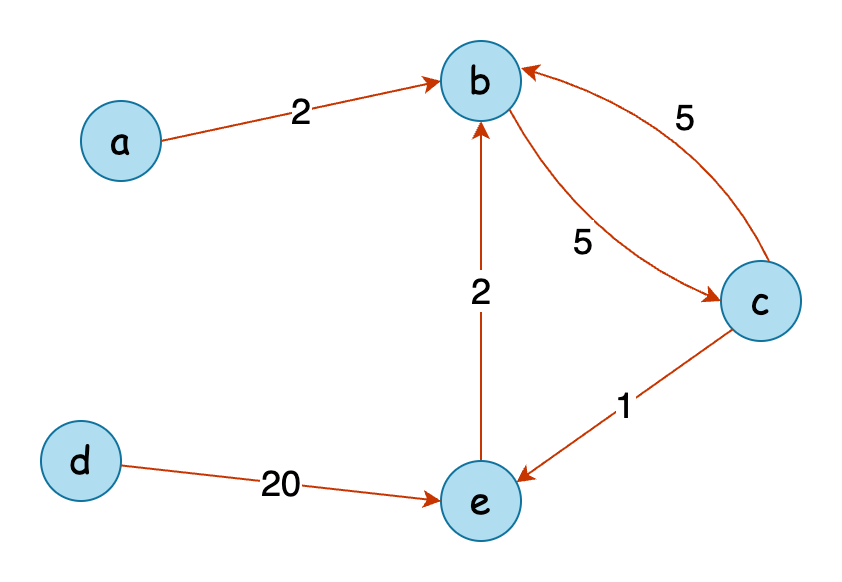

## Solution

---

### Overview

We have two strings, `source` and `target`, both of the same length. Additionally, we have three arrays: `original`, `changed`, and `cost`, each also of the same length.

Our task is to transform the `source` text into the `target` text using a series of character conversions. Each conversion works as follows:

1. Identify a character in `source` that does not match the corresponding character in `target`.
2. Find this mismatched character in the `original` array.
3. Replace it with the corresponding character from the `changed` array.
4. Each conversion has a cost specified in the `cost` array.

The goal is to determine the minimum total cost required to transform `source` into `target`.

---

### Approach 1: Dijkstra's Algorithm

#### Intuition

Our task is to convert each mismatched character at the lowest possible cost. To tackle this, we can model each character as a node in a graph, with transformations represented as directed edges between nodes, each with a specific cost. The problem then becomes finding the minimum cost path from each character in `source` to the corresponding character in `target`.

Consider Example 1 from the problem description visualized as a graph:



To find the minimum cost path between nodes, Dijkstra's Single Source Shortest Path algorithm is useful. It efficiently calculates the shortest path in a directed graph with non-negative edge weights. For more information, refer to this LeetCode [Explore Card](https://leetcode.com/explore/learn/card/graph/622/single-source-shortest-path-algorithm/3862/).

First, create a graph structure using an adjacency list to represent all possible character conversions. For each index `i`:
- The character in $\text{original}[i]$ is the starting point.
- The character in $\text{changed}[i]$ is the destination.
- The value in $\text{cost}[i]$ denotes the conversion cost.

Each conversion is an edge in our graph, mapping potential character transformations and their costs. Instead of running Dijkstra's algorithm for every differing character, precompute the shortest path from every character to every other character. This reduces the need to execute the algorithm multiple times, leveraging the fact that there are only $26$ possible characters.

Finally, calculate the total minimum cost by summing the precomputed costs for each differing character in `source` and `target`.

#### Algorithm

Main method `minimumCost`:

- Create an `adjacencyList` with 26 entries (one for each lowercase letter).
- Iterate through the `original` array: For each index `i`:
  - Add an edge to `adjacencyList` from $\text{original}[i]$ to $\text{changed}[i]$, with the corresponding $\text{cost}[i]$.
- For each of the $26$ characters, call `dijkstra` to find the shortest path from this character to all other characters.
- Store the results in a 2D array `minConversionCosts` of size $26 \times 26$.
- Initialize a variable `totalCost` to `0`.
- Iterate through the length of `source`:
  - If the character at the current position differs from `target`:
- Look up the conversion cost in `minConversionCosts`:
      - If the conversion is impossible (cost is `-1`), return `-1`.
      - Else, add the cost to `totalCost`.
- Return `totalCost` as the answer.

Helper method `dijkstra`:

- Define a method `dijkstra` with parameters: `startChar` and `adjacencyList`.
- Create a priority queue `priorityQueue` with each element as a pair of (cost, character). Sort the queue by cost (lowest first).
- Initialize an array `minCosts` of size $26$ with all values set to `-1` (representing unreachable positions).
- Add `startChar` to `priorityQueue` with a cost of `0`.
- While `priorityQueue` is not empty:
  - Poll a pair (`currentCost`, `currentChar`) from the queue.
  - Loop over all possible conversions from `currentChar` using the `adjacencyList`. For each `conversion` to `targetChar`:
- Find the `newTotalCost` to do the conversion as $currentCost + conversionCost$.
- If the conversion hasn't been reached yet $\text{minCosts}[targetChar] = -1$, or `newTotalCost` is less than the previous cost in $\text{minCosts}[targetChar]$:
      - Set $\text{minCosts}[targetChar]$ as `newTotalCost`.
      - Add the pair `(newTotalCost, targetChar)` to the priority queue.
- Return `minCosts`.

#### Implementation

```python
class Solution:
    def minimumCost(
        self,
        source: str,
        target: str,
        original: List[str],
        changed: List[str],
        cost: List[int],
    ) -> int:
        # Create a graph representation of character conversions
        adjacency_list = [[] for _ in range(26)]

        # Populate the adjacency list with character conversions
        conversion_count = len(original)
        for i in range(conversion_count):
            adjacency_list[ord(original[i]) - ord("a")].append(
                (ord(changed[i]) - ord("a"), cost[i])
            )

        # Calculate shortest paths for all possible character conversions
        min_conversion_costs = [
            self._dijkstra(i, adjacency_list) for i in range(26)
        ]

        # Calculate the total cost of converting source to target
        total_cost = 0
        for s, t in zip(source, target):
            if s != t:
                char_conversion_cost = min_conversion_costs[ord(s) - ord("a")][
                    ord(t) - ord("a")
                ]
                if char_conversion_cost == float("inf"):
                    return -1  # Conversion not possible
                total_cost += char_conversion_cost

        return total_cost

    def _dijkstra(
        self, start_char: int, adjacency_list: List[List[tuple]]
    ) -> List[int]:
        # Priority queue to store characters with their conversion cost, sorted by cost
        priority_queue = [(0, start_char)]

        # List to store the minimum conversion cost to each character
        min_costs = [float("inf")] * 26

        while priority_queue:
            current_cost, current_char = heapq.heappop(priority_queue)

            if min_costs[current_char] != float("inf"):
                continue

            min_costs[current_char] = current_cost

            # Explore all possible conversions from the current character
            for target_char, conversion_cost in adjacency_list[current_char]:
                new_total_cost = current_cost + conversion_cost

                # If we found a cheaper conversion, update its cost
                if min_costs[target_char] == float("inf"):
                    heapq.heappush(
                        priority_queue, (new_total_cost, target_char)
                    )

        # Return the list of minimum conversion costs from the starting character to all others
        return min_costs
```

#### Complexity Analysis

Let $n$ be the length of `source` and $m$ be the length of the `original` array.

- Time complexity: $O(m + n)$

    Creating the adjacency list requires $O(m)$ time as the algorithm loops over the contents of the `original`, `changed`, and `cost` array simultaneously.

    In our algorithm, the number of vertices is $26$ and the number of edges is $m$, which makes the time complexity of Dijkstra's algorithm $O((26 + m) \log 26)$. We call `dijkstra` for each of the $26$ characters. Thus, the total time complexity is $O(26 \cdot (26 + m) \log 26)$, which can be simplified to $O(m)$.

    To calculate the `totalCost`, we iterate over the `source` string, which has a time complexity of $O(n)$.

    The total time complexity is the addition of all these elements, i.e., $O(m) +$\mathcal{O}(n)$= O(m + n)$.

- Space complexity: $O(m)$

    The `adjacencyList` stores all possible conversions, requiring a space complexity of $O(m)$. `minConversionCosts` uses $O(26 \times 26)$ space, which simplifies to $O(1)$.

    The `dijkstra` method uses a priority queue that can store at most $m$ elements in the worst case. The array `minCosts` has a fixed size of $26$. Thus, the total space used by the method is $O(m)$.

    The total space required by the algorithm is $O(m) +$\mathcal{O}(1)$+ O(m)$, which simplifies to $O(m)$.

---

### Approach 2: Floyd-Warshall Algorithm

#### Intuition

In the previous approach, we used Dijkstra's algorithm to find the minimum cost of converting each of the 26 lowercase characters to every other character, effectively applying a single-source shortest path algorithm multiple times. Instead, we can use a multi-source shortest-path algorithm.

[Floyd-Warshall's All Pairs Shortest Path](https://en.wikipedia.org/wiki/Floyd%E2%80%93Warshall_algorithm) algorithm, an effective dynamic programming technique, calculates the minimum cost path between all pairs of vertices in a directed graph. This fits our needs perfectly since we require the minimum traversal cost between every pair of lowercase characters.

The Floyd-Warshall algorithm works by iterating through each vertex as a potential intermediate point for all pairs of vertices. We create a matrix `minCost`, where $\text{minCost}[i][j]$ represents the minimum cost to travel from vertex `i` to `j`. The algorithm involves three nested loops to update $\text{minCost}[i][j]$ by considering whether a shorter path exists through an intermediate vertex `k`. After completing these iterations, `minCost` will hold the minimum costs for all character pairs.

We then iterate through the `source` and `target` strings, comparing characters at each position. For differing characters, we look up the minimum conversion cost in the `minCost` matrix. If any transformation is impossible, we return `-1`; otherwise, we sum the costs to get the total minimum conversion cost.

#### Algorithm

- Initialize:
  - `totalCost` to store the total minimum cost.
  - a 2D array `minCost` to store the minimum transformation cost between any two characters.
- Initialize each entry in `minCost` to the maximum integer value to represent initial conversion costs.
- Using `original`, `changed`, and `cost`, update the `minCost` array with the minimum cost for each given conversion.
- Utilize three loops. The outermost loop runs `k` from `0` to `25`, where `k` is the character being considered as an intermediate node.
  - For each fixed k, the inner loops iterate over all pairs of characters `(i, j)`, where `i` and `j` are the source and destination characters respectively. For each `(i, j)`:
- We check whether the current known minimum cost $\text{minCost}[i][j]$ can be improved by going through the intermediate character `k`. If it can, we update $\text{minCost}[i][j]$.
- Iterate through each character of `source`:
  - If the character matches with `target`, continue with the next iteration.
  - Else, check `minCost` for the conversion cost:
- If the conversion cost is greater than or equal to the max integer value, return `-1`.
- Else, add the cost to `totalCost`.
- Return `totalCost`.

#### Implementation

```python
class Solution:
    def minimumCost(
        self,
        source: str,
        target: str,
        original: List[str],
        changed: List[str],
        cost: List[int],
    ) -> int:
        # Initialize result to store the total minimum cost
        total_cost = 0

        # Initialize a 2D list to store the minimum transformation cost
        # between any two characters
        min_cost = [[float("inf")] * 26 for _ in range(26)]

        # Fill the initial transformation costs from the given original,
        # changed, and cost arrays
        for orig, chg, cst in zip(original, changed, cost):
            start_char = ord(orig) - ord("a")
            end_char = ord(chg) - ord("a")
            min_cost[start_char][end_char] = min(
                min_cost[start_char][end_char], cst
            )

        # Use Floyd-Warshall algorithm to find the shortest path between any
        # two characters
        for k in range(26):
            for i in range(26):
                for j in range(26):
                    min_cost[i][j] = min(
                        min_cost[i][j], min_cost[i][k] + min_cost[k][j]
                    )

        # Calculate the total minimum cost to transform the source string to
        # the target string
        for src, tgt in zip(source, target):
            if src == tgt:
                continue
            source_char = ord(src) - ord("a")
            target_char = ord(tgt) - ord("a")

            # If the transformation is not possible, return -1
            if min_cost[source_char][target_char] == float("inf"):
                return -1
            total_cost += min_cost[source_char][target_char]

        return total_cost
```

#### Complexity Analysis

Let $n$ be the length of `source` and $m$ be the length of the `original` array.

* Time complexity: $O(m + n)$

    Populating `minCosts` with the initial conversion costs takes $O(m)$ time.

    Each of the three nested loops runs $26$ times. Thus, the overall time taken is $O($26^{3}$) = O(1)$.

    To calculate the `totalCost`, the algorithm loops over the `source` string, which takes linear time.

    Thus, the time complexity of the algorithm is $O(m) +$\mathcal{O}(1)$+ O(n)$, which simplifies to $O(m + n)$.

* Space complexity: $O(1)$

    The `minCost` array has a fixed size of $26 \times 26$. We do not use any other data structures dependent on the length of the input space. Thus, the algorithm has a constant space complexity.

---