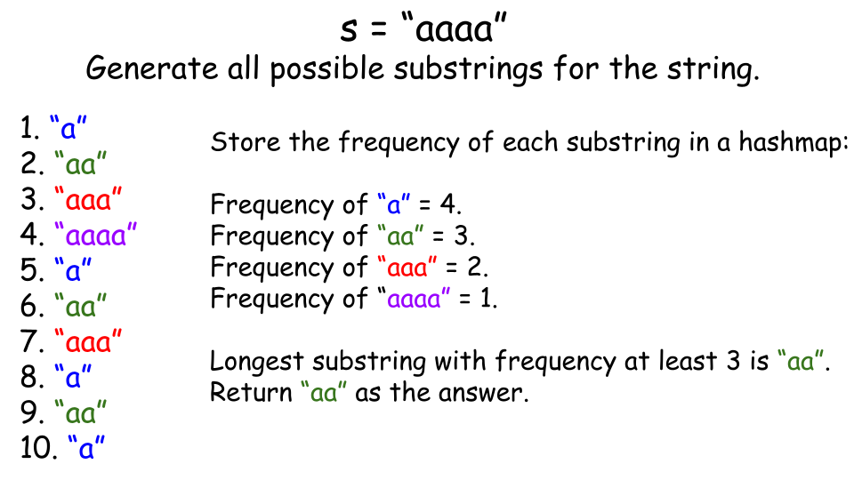

[TOC]

## Solution

---

### Overview

We are given a string `s` consisting of lowercase letters. Our task is to return the length of the longest substring of `s` that has at least 3 of the same letters - we'll call this a special substring. If no such special substring exists, we should return -1.

> A substring is a contiguous, non-empty sequence of characters within a string.

The length of the string `s` can be at most 50. Therefore, we can use brute force techniques to solve this problem. After solving this one, you might want to try the [harder version](https://leetcode.com/problems/find-longest-special-substring-that-occurs-thrice-ii/description/) of the problem.

---

### Approach 1: Brute-Force Approach

#### Intuition

A logical approach would be to generate all substrings of the string `s` and check if each substring is special or not.

To generate all substrings, we can use two loop pointers: `start` and `end`. The `start` pointer indicates the starting index of the substring, and the `end` pointer indicates the ending index. We will loop through all possible values of `start` and `end` where `end` is greater than `start`. For each `start` and `end` grouping, we will extract the substring and store it in a string (say `currString`).

Since appending a character to the end of a list or string takes constant time, we can avoid using another loop to generate the substring. Instead, we will add the character at the `end` index to `currString`. While doing this, we can check if the newly added character maintains the "special" property. If the newly added character is not equal to the previous character, we can stop processing this substring further.

For every valid substring, we will increment its frequency in a map, where the substring is the key and its frequency is the value. After processing all substrings, we can find the longest substring in the map that has a frequency of at least three and return its length as the result.



#### Algorithm

1. Create a map `count` to store the frequency of all substrings.
2. Iterate over the string `s` using two nested loops:
- Outer loop with index `start` from 0 to the length of the string:
- Create a string `currString` to store the substrings.
- Inner loop with index `end` starting from `start` to the length of the string:
- If the current substring is empty or the last character matches the current character, append the character to `currString` and increment its frequency in `count`.
- If the current character does not match the last character, stop processing this substring.
3. Initialize a variable `ans` to store the length of the longest substring with a frequency of at least 3.
4. Iterate over the map `count`:
- For each substring, if its frequency is at least 3 and its length is greater than `ans`, update `ans` with the length of the substring.
5. If no substring with the required frequency is found, return -1. Otherwise, return `ans`.

#### Implementation

```python
class Solution:
    def maximumLength(self, s: str) -> int:
        # Create a dictionary (equivalent of map in Python) to store the count of all substrings
        count = {}
        for start in range(len(s)):
            curr_string = (
                []
            )  # Use a list to store the characters of the current substring
            for end in range(start, len(s)):
                # If the string is empty, or the current character is equal to
                # the previously added character, then append it to the list.
                # Otherwise, break the iteration.
                if not curr_string or curr_string[-1] == s[end]:
                    curr_string.append(s[end])
                    curr_to_string = "".join(
                        curr_string
                    )  # Convert the list to a string
                    if curr_to_string in count:
                        count[curr_to_string] += 1
                    else:
                        count[curr_to_string] = 1
                else:
                    break

        # Create a variable ans to store the longest length of substring with
        # frequency at least 3.
        ans = 0
        for str, freq in count.items():
            if freq >= 3 and len(str) > ans:
                ans = len(str)

        if ans == 0:
            return -1
        return ans
```

#### Complexity Analysis

Let $n$ be the length of the string `s`.

- Time Complexity: $O(n^3)$

    The algorithm generates all substrings of the input string `s` using two nested loops. The outer loop runs `n` times. For each iteration of the outer loop, the inner loop iterates $n - i$ times, where `i` is the index of the outer loop. This means the total number of iterations is the sum of the first `n` natural numbers, which equals $n \cdot (n+1) / 2$. Therefore, the time complexity for generating all substrings is $O(n^2)$.

    For each substring, the algorithm checks and updates the frequency in a map, which takes $O(size)$ time, where `size` denotes the length of the substring added in the map.

    Therefore, the overall time complexity of the algorithm is given by $\mathcal{O}(n^3)$.

- Space complexity: $O(n^2)$

    The algorithm uses a temporary string, `currString`, to store substrings. The size of `currString` varies, but in the worst case, it can hold the entire string, contributing $O(n)$ additional space. Since the string `currString` is initialized `n` times, the total space is given by $O(n^2)$.

    The algorithm uses a map to store all unique substrings and their frequencies. In the worst case, such as when all characters in the string are identical, the total number of substrings can go up to $n \cdot (n+1) / 2$. Additionally, each substring requires space proportional to its length, leading to an overall space requirement of $O(n^2)$ in the worst case.

    Therefore, the total space complexity of the algorithm is $O(n^2)$.

---

### Approach 2: Optimized Hashing

#### Intuition

In the previous approach, we stored substrings in a map with their frequency. Since all special substrings consist of equal characters, we can optimize by storing them as a pair `{char character, int substringLength}`.

This optimization improves the algorithm because adding a string to the map takes `O(substringLength)` time. By storing `{character, substringLength}` as a pair, which behaves like an array of length 2, insertion into the map now takes constant time.

After populating the map with these pairs, we find the maximum `substringLength` value for any pair with a frequency of at least 3 and return it as the result.

> Note: A frequency array can also be used in this scenario. It is a good choice as it provides an efficient way to count and track occurrences, particularly when the range of values is limited.

#### Algorithm

1. Create a map `count` of type `map<pair<char, int>, int>` to store the frequency of substrings, where each key is a pair of a character and the substring length, and the value is its frequency.
2. Use an outer loop with index `start` from `0` to the length of the string (`s.length()`):
   - Initialize `substringLength` to `0` to track the length of the current substring of repeated characters.
   - Store the current character $character = s[start]$.
3. Use an inner loop with index `end` starting from `start` and iterating to the end of the string (`s.length()`):
   - If the character $s[end]$ matches `character`:
     - Increment `substringLength`.
     - Update the frequency of the pair `{character, substringLength}` in the `count` map.
   - If the character $s[end]$ does not match `c`, break the loop.
4. Initialize a variable `ans` to `-1`.
5. Iterate over the entries in the `count` map:
   - For each entry, check if its frequency is at least 3 and its substring length is greater than `ans`. If both conditions are true, update `ans` with the length of the substring.
6. Return `ans`.

#### Implementation

```python
class Solution:
    def maximumLength(self, s: str) -> int:
        # Create a dictionary to store the count of all substrings.
        count = {}
        for start in range(len(s)):
            character = s[start]
            substring_length = 0
            for end in range(start, len(s)):
                # If the string is empty, or the current character is equal to
                # the previously added character, then add it to the map.
                # Otherwise, break the iteration.
                if character == s[end]:
                    substring_length += 1
                    count[(character, substring_length)] = (
                        count.get((character, substring_length), 0) + 1
                    )
                else:
                    break

        # Create a variable ans to store the longest length of substring with
        # frequency atleast 3.
        ans = -1
        for i in count.items():
            length = i[0][1]
            if i[1] >= 3 and length > ans:
                ans = length

        return ans
```

#### Complexity Analysis

Let $n$ be the length of the string `s`.

- Time Complexity: $O(n^2)$

    The algorithm generates all substrings of the input string `s` using two nested loops. The outer loop runs `n` times. For each iteration of the outer loop, the inner loop iterates $n - end$ times, where `end` is the index of the outer loop. This means the total number of iterations is the sum of the first `n` natural numbers, which equals $n \cdot (n+1) / 2$. Therefore, the time complexity for generating all substrings is $O(n^2)$.

    For each substring, the algorithm checks and updates the frequency of the pair in a map, which takes $O(1)$ time.

    Therefore, the overall time complexity of the algorithm is given by $\mathcal{O}(n^2)$.

- Space complexity: $O(n^2)$

    The algorithm uses a map to store all unique substrings and their frequencies. In the worst case, such as when all characters in the string are identical, the total number of substrings can go up to $n \cdot (n+1) / 2$.

    Additionally, each substring requires space proportional to its length, leading to an overall space requirement of $O(n^2)$ in the worst case.

    Therefore, the total space complexity of the algorithm is $O(n^2)$.

---

### Further Thoughts:

This problem has solutions with time complexities of $O(n^3)$ and $O(n^2)$, but there is an even more efficient solution that runs in $O(n)$ time.

The single pass solution will be the focus of the second part of this [problem](https://leetcode.com/problems/find-longest-special-substring-that-occurs-thrice-ii/), which is designed almost the same but with tighter constraints to encourage further optimization. We now recommend attempting to solve the second part using the single pass approach.

---